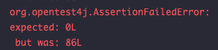
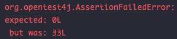
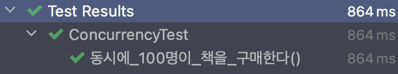

# 동시성 처리
> - 웹 서비스를 개발하다 보면 동시성 문제를 마주친다.
> - 스프링같은 멀티쓰레드 환경에서는 여러 쓰레드가 한 자원을 공유할 수 있어 데이터 정합성 문제가 발생한다.

## Redis를 활용하여 동시성 문제를 처리하기
> - Redis의 분산 락(Distributed Lock)을 활용하자.
>   - 분산된 서버 혹은 데이터베이스 환경에도 동시성을 제어할 수 있는 방법
>- 사실 굳이 Redis로 할 필요는 없다.
>  - MySQL의 네임드 락을 활용해서 충분히 구현 가능
>  - 하지만, 디스크를 사용하는 DB보다 RAM을 사용하는 Redis가 더 빠르게 락을 획득/해제할 수 있다.

## 예제 코드
> - [Book.java](Entity/Book.java)
> - [BookTest.java](Test/BookTest.java)
> - 
> - 100개를 요청해서 재고가 0이 되어야 하지만, 테스트 코드를 실행해보면 14개밖에 줄어들지 않았다.
>   - 갱신 유실
>   - 트랜잭션이 커밋되기 전에 다른 트랜잭션이 변경하려는 값을 읽어버려서 생기는 문제

## Redisson? Lettuce?
> - 자바에서 Redis를 쓸 수 있는 클라이언트로는 Lettuce와 Redisson이 있다.
> - Spring Data Redis를 사용하면 기본적으로 지원하는 클라이언트는 Lettuce이다.
>   - 좀 더 사용하기 편리하다.
> - Lettuce로 분산 락을 구현하려면 `SETNX`라는 명령어로 Redis에 락 획득 요청을 보내야 하는 구조
>   - Redis에 많은 부하를 가하게 됨
>   - SETNX
>     - SET if Not eXit의 줄임말로, 특정 key 값이 존재하지 않을 경우에 set하라는 명령어
>     - value가 없을 때만 값을 세팅하는 락 효과를 얻을 수 있다.
>   - 스핀 락의 경우 자체적인 타임아웃 구현이 존재하지 않는다.
>     - 락을 획득하지 못하면 무한 루프를 돌 수 있다.
> - Redisson을 이용하면 부하와 타임아웃 문제 해결 가능
>   - Lettuce처럼 주기적으로 락 획득 요청을 보낼 필요가 없다.
>   - publish/subscribe 기능 지원
>     - 쓰레드하나가 락을 획득하고 로직을 처리하면 나머지 쓰레드가 락을 획득하기 위해 특정 채널을 subscribe 한다.
>     - 쓰레드가 로직 처리가 완료되고 락을 해제하면, subscribe하고 있는 채널에 publish를 하게 되어서 대기하고 있는 쓰레드 중에 하나가 다시 락을 획득한다.
>   - 락의 타임아웃도 구현해놨다.

## Redisson을 사용하여 분산 락 구현
> - 기본적으로 Spring Data Redis는 클라이언트로 Lettuce를 사용하기 때문에, Redisson을 위한 의존성을 추가해줘야 한다.
>   - `implementation 'org.redisson:redisson-spring-boot-starter:3.18.0'`
> - [RedissonLock.java](Redisson/RedissonLock.java)
> - 
>   - 감소량이 늘어나긴 했지만 여전히 실패한다.

## 왜 실패?
> - 분산락 해제 시점과 트랜잭션 커밋 시점의 불일치
> - purchase 메소드에 `@Transactional` 어노테이션이 붙어있다.
>   - Spring AOP를 통해 purchase 메서드 바깥으로 트랜잭션을 처리하는 프록시가 동작한다.
>   - [@Transactional](..%2F..%2F07-JAVA_SPRING%2F16_Transactional%2FReadme.md)
> - 반면 락 획득과 해제는 purchase 메서드 내부에서 일어난다.
>   - purchase 메서드 안에서 lock을 통해 여러 쓰레드의 접근을 막았지만, 
>   - purchase 메서드 밖에서 여러 쓰레드가 한번에 purchase 메서드로 들어오게 된다. 
>     - 쓰레드 1의 락이 해제되고 트랜잭션 커밋이 되는 사이에 쓰레드 2가 락을 획득하게 된다.
>     - 락 범위를 트랜잭션 범위보다 크게 만들어야 한다.
>     - Facade 패턴을 적용해보자
>       - 구조 패턴의 한 종류로써, 복잡한 서브 클래스들의 공통적인 기능을 정의하는 상위 수준의 인터페이스를 제공하는 패턴 
>       - [BookLockFacade.java](Redisson/BookLockFacade.java)
> - 

## 또 다른 문제..?
> - 동시성은 잘 처리된 것으로 보인다!
> - 하지만, 동시 처리만 된 것이지 요청 순서에 따른 반환 순서는 뒤죽 박죽이다..
> - 요청 순서를 제어하기 위해 kafka를 추가 적용한다.
>   - kafka는 각 토픽을 여러 파티션으로 분할하여 관리하기 때문에, 메시지가 순차적으로 기록된다.
>   - 또한, Consumer Group을 이용하면 여러 컨슈머가 동일한 토픽의 메시지를 병렬로 처리할 수 있다.
>     - 만약 Scale-Out을 통해 여러 서버로 운영되고 있다면, 다양한 서버에 똑같은 요청을 주어 변수 동시성 문제를 해결할 수 있다.

## kafka
> - [message queue](..%2F17_Message%20Queue%2FReadme.md)
> - [KafkaBookProducer.java](Kafka/KafkaBookProducer.java)
> - [KafkaBookConsumer.java](Kafka/KafkaBookConsumer.java)
> - 이렇게 분산 락과 서버 분산 시 카프카를 사용해서 동시성을 처리할 수 있다.