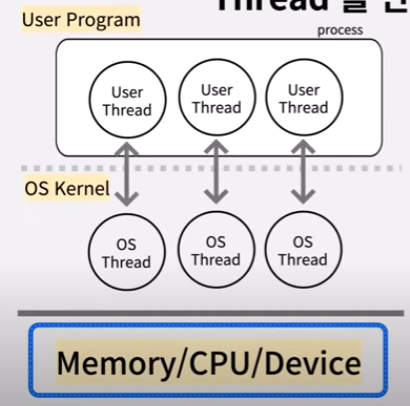
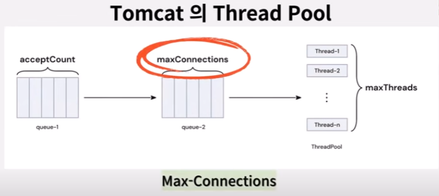
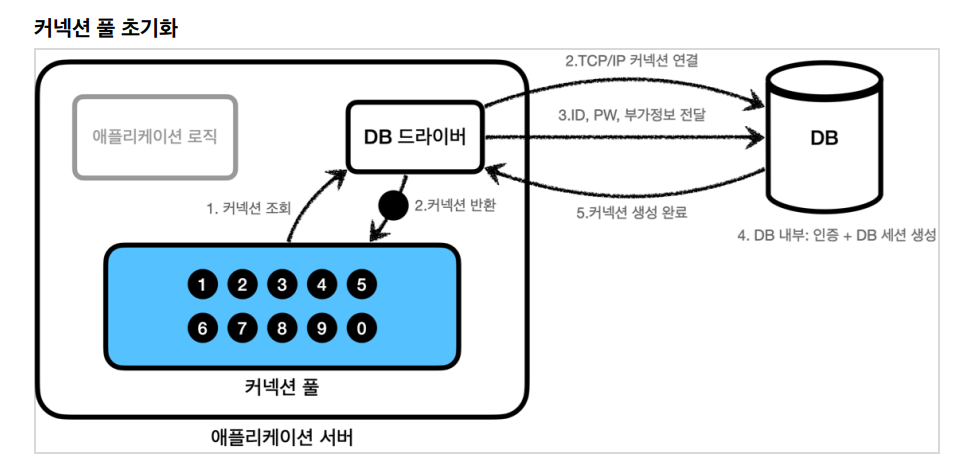

# ThreadPool & DPCP

## Thread
> - 실행중인 프로그램을 `프로세스`, 그 프로세스의 실행단위가 `쓰레드`
> - 프로그램이 돌아가면서 여러가지 작업을 동시에 할 수 있는 것이 쓰레드

### 쓰레드는 많으면 많을수록 좋은 것이 아니다.
> 1. 쓰레드가 생성되면서 비용이 들어간다는 것을 잊으면 안된다.
> 2. 컨텍스트 스위칭이 일어나 메모리 누수가 생기고 그러면서 cpu 오버헤드 비용이 든다.
> - 쓰레드는 생성비용이 상당히 크다.
> - 
> - Java는 One-to-One Threading-Model로 Thread를 생성한다.
> - User Thread 생성시 OS(Kernel) Thread와 연결해야 한다.
> - 새로운 Thread를 생성할 때마다 OS Kernel의 작업이 필요하기 때문에 Thread 생성 비용이 많이 든다.

## Thread Pool
> - 위와 같은 이유로 미리 Thread를 만들어 둔 뒤 재사용할 수 있게 하는 Thread Pool이 나오게 되었다.
> - 사용할 Thread 개수를 제한하기 때문에 무제한 적으로 Thread가 생성되는 것을 방지하는 것도 가능하다.

## Thread Pool을 활용한 WAS, Tomcat
> - SpringBoot의 내장 Servlet 컨테이너 중 하나
> - Java 기반의 WAS
>   - Java의 ThreadPool 클래스와 매우 유사한 자체 ThreadPool 구현체를 가지고 있다.

## ThreadPool 생성
```yaml
server:
  tomcat:
    threads:
      max: 200 # 생성할 수 있는 thread의 총 개수
      min-spare: 10 # 항상 활성화 되어있는(idle) thread의 개수
    max-connections: 8192 # 수립가능한 connection의 총 개수
    accept-count: 100 # 작업 큐의 사이즈
```

### Max-Connections
> - Tomcat이 최대로 동시에 처리할 수 있는 Connection의 개수
> - Web 요청이 들어오면 Tomcat의 Connector가 Connection을 생성하면서 요청된 작업을 ThreadPool의 Thread에 연결한다.

### Accept-Count
> - Max-Connections이상의 요청이 들어왔을 때 사용하는 대기열 Queue 사이즈
> - Max-Connections와 Accept-Count이상의 요청이 들어왔을 때 추가적으로 들어오는 요청은 거절될 수 있다.

## BIO Connector / NIO Connector
### Connector
> 데이터 패킷을 HttpServletRequest 객체로 변환한 후 Servlet 객체에 전달하는 역할

### BIO Connector
> - 접속자 한명당 하나의 쓰레드를 생성하는 구조.
> - 커넥션이 닫힐 때까지 하나의 쓰레드는 특정 커넥션에 할당되어 있다.
> - 리소스에 대한 낭비가 생기는 방식

### NIO Connector
> - 하나의 쓰레드가 동시에 많은 채널을 관리하는 방식
> - data 처리가 가능할 때만 쓰레드를 사용하기 때문에 유휴상태로 낭비되는 쓰레드 또한 줄어든다.

## Tomcat Thread의 수는 얼마나 늘리는게 좋을까?
> - 먼저 정답은 없다. 특정 어플리케이션의 요구 사항 및 특성에 따라 다르다.
> - SpringBoot에서는 최대 요청 쓰레드 수가 200개로 디폴트값이 설정되어 있다.
> - 

---
# DBCP(DataBase Connection Pool)

## DBCP를 사용해야 하는 이유
### DB에 대한 커넥션 개수를 제한하여 DB포화를 방지하고 일관된 성능을 기대할 수 있다.

### DB Connection을 생성하기 위해 많은 시간이 소요된다.
> 1. 애플리케이션 로직은 DB 드라이버를 통해 커넥션을 조회한다.
> 2. DB 드라이버는 DB와 TCP/IP 커넥션을 연결한다. 물론 이 과정에서 3way handshake 같은 연결을 위한 네트워크 동작이 발생한다.
> 3. DB 드라이버는 ID, PW와 기타 부가정보를 DB에 전달한다.
> 4. DB는 ID, PW를 통해 내부 인증을 완료하고, 내부에 DB 세션을 생성한다.
> 5. DB는 커넥션 완료가 되었다는 응답을 보낸다.
> 6. DB 드라이버는 커넥션 객체를 생성해서 클라이언트에 반환한다.

## DB max_connections
> - Client에 최대 몇개까지의 연결을 허용할지 의미
> - max_connections가 80이고, WAS가 4대라면, DB connection을 20개까지 생성할 수 있다.
> - Throughput 고려
>   - 0.5초동안 Connection을 사용하는 트랜잭션을 초당 1000개 처리하고 싶다면 약 500개정도 되는 DBCP connection이 필요하게 된다.

## HikariCP
> - Java 어플리케이션에서 데이터베이스 연결 풀링을 위해 사용되는 고성능 커넥션 풀 라이브러리
> - 대규모 트래픽을 처리하는 데 특화된 경량화된 디자인과 뛰어난 성능을 가지고 있다.
> - SpringBoot 2.0부터 HikariCP를 기본 데이터 소스로 채택하고 있다.
>   - `build.gradle "org.springframework.boot:spring-boot-starter-jdbc"`에 포함되어 있다.
### ConnectionTimeout(default : 30000(30초))
> - 클라이언트가 pool에 connection을 요청하는데 기다리는 최대시간
> - 초과하면 SQLException 발생
### MaximumPoolSize(default : 10)
> - 유휴 및 사용중인 Connection을 포함하여 풀에 보관가능한 최대 커넥션 개수
> - 사용할 수 있는 커넥션이 없다면 ConnectionTimeout만큼 대기하고 SQLException 발생
### MinimumIdle(default : 10)
> - ConnectionPool에서 유지가능한 최소 커넥션 개수 설정
> - 최적의 성능과 응답성을 원하면 이 값은 설정하지 않는게 좋다고 한다.
>   - 사용하지 않는 연결이 계속 유지되어 자원을 낭비할 수 있다.
### MaxLifeTime(default : 1800000 (30분))
> - Connection pool 내의 개별 연결이 유지될 수 있는 최대 시간
>   - Pool에 추가된 후부터 카운트
> - Connection의 MaxLifeTime이 지나면, 연결을 강제로 폐기하고 풀에서 제거한 뒤 새로운 연결로 교체하여 문제 방지
>   - DB WAIT_TIMEOUT(ConnectionTimeout)보다 작은 값 사용
### keepalive-time(default : 60000 (1분))
> - DB가 커넥션을 자체적으로 끊지 않도록 HikariCP가 DB 헬스체크를 호출해주는 최대시간
> - 응답 속도가 중요하다면 30000까지 줄이기


```yaml
spring:
  datasource:
    hikari:
      connectionTimeout : 30000
      maximumPoolSize : 20
      maxLifetime : 295000 # db wait_timeout 보다 짧게 유지
      poolName : HikariCP
      readOnly : false
```