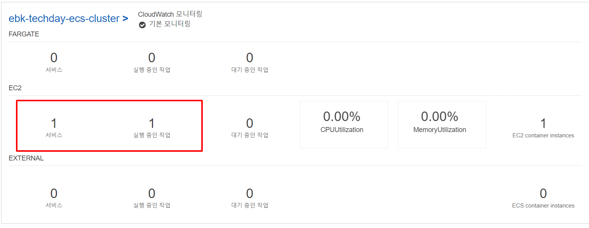

# AWS Service
> - AWS에서 제공하는 서비스
> - AWS Console(AWS에서 제공하는 웹 기반 인터페이스)에서 쉽게 관리할 수 있다.
> - [AWS Console](https://aws.amazon.com/ko/console/)

## AWS ECS(Elastic Container Service)
> - AWS에서 제공하는 완전 관리형 컨테이너 오케스트레이션 서비스
> - 컨테이너(Docker)화된 어플리케이션의 배포, 관리 및 확장을 용이하게 한다.

## AWS ECS의 워크 플로우
> - 
> - 먼저, Container registry에 저장된 도커 이미지를 가져온다.(Docker Hub, AWS ECR)
> - ECS에서 이미지를 실행하여 컨테이너를 실행하는데, 리소스와 Compute Option을 설정한다.
>   - 도커 이미지를 run할 때 명령어로 옵션을 설정하는 것과 같다.
> - ECS는 이렇게 실행한 컨테이너들과 그 집합인 클러스터를 관리하는 역할을 한다.
> - 컨테이너 저장소는 Docker Hub를 사용해도 좋지만, AWS ECR은 AWS IAM 인증을 통해 이미지 push/pull에 대한 권한 관리가 가능하며 S3에 저장된다.
>   - 보안상 좋고, 고가용성이 유지되며, 다른 AWS 서비스들과 편리하게 연결이 가능하다.

## 주요 구성 요소
> - 
> - 클러스터(Cluster) : 컨테이너 인스턴스의 논리적 그룹, 어플리케이션의 리소스 관리
>   - 실행 환경 제공(리눅스, 윈도우)
> - 태스크 정의(Task Definition) : 컨테이너를 실행하기 위한 설정을 정의한 JSON 템플릿
>   - 이미지, CPU, 메모리, 포트 등 지정
> - 태스크(Task) : Task Definition에 의해 배포된 컨테이너 Set
> - 서비스(Service) : 지속적으로 실행되어야 하는 태스크 관리
>   - 클러스터에 Task를 몇 개나 배포할 것인지 결정하고 ELB와 연결하거나 Auto Scaling을 설정하는 등 Task의 LifeCycle을 관리한다.

## 실행 과정
### ECS 클러스터 생성
> 
> - Docker 이미지를 읽어 올릴 Cluster를 생성한다.
> - 어떤 환경 리소스 위에 컨테이너를 올릴지 설정하는 과정

### Task Definition 설정
> - 
> - Fargate, EC2, External(외부 온프레미스) 형태 중 Task를 올릴 유형을 선택할 수 있다.
> - 
>   - 컨테이너 이름, 이미지, 포트포워딩 설정

#### Fargate
> - AWS에서 서버리스 방식으로 작업 실행을 관리
> - 사용자는 인프라를 관리할 필요 없이 컨테이너 리소스(CPU, 메모리)를 정의하여 애플리케이션 실행

#### EC2
> - 사용자가 직접 AWS EC2 인스턴스를 관리하며, 태스크를 실행할 ECS 클러스터를 프로비저닝
> - 사용자 정의 이미지 및 하드웨어 구성 가능
> - 각 태스크들은 ec2 인스턴스 위에 배치

#### External
> - 외부의 서버 (온프레미스, 다른 클라우드)에서 ECS 작업을 실행

### Service
> - Task Definition이 잘 되었다면, 그것을 기반으로 한 서비스 생성
> - 
> - 서비스 생성은 앞서 생성한 Task Definition을 통해 Image를 실행시켜 컨테이너를 생성해주는 단계
> - 
> - 


## AWS EventBridge, AWS ECS를 이용한 특정 시간 서비스 온오프
> - 특정 시간에 알림을 주는 서비스와 같은 경우, AWS에선 사용한 만큼 비용이 발생하기 때문에, 서버를 계속 켜놓았을 때 비용 효율성이 좋지 않다.
>   - AWS EventBridge Scheduler와 AWS ECS를 이용해 특정 시간에 서버를 키고 끄는 아키텍처를 설계해보자

## AWS EventBridge
> - AWS의 이벤트 기반 아키텍처를 구현하는 핵심 서비스
> - 애플리케이션 간 또는 AWS 서비스 간의 이벤트를 생성, 라우팅, 필터링, 전달하는 역할
> - 

### 주요 구성 요소
#### 이벤트
> - JSON 형식의 데이터 객체로, 이벤트를 생성한 소스의 상태 변경 기술
```json
{
  "source": "aws.ec2",
  "detail-type": "EC2 Instance State-change Notification",
  "detail": {
    "instance-id": "i-1234567890abcdef0",
    "state": "stopped"
  }
}
```

#### 이벤트 버스
> - 이벤트가 생성되고 전달되는 버스

#### 규칙(Rule)
> - 이벤트가 발생한 경우, Event Rule과 매칭되는 이벤트와 Target으로 라우팅 된다.
```json
{
  "source": ["aws.ec2"],
  "detail-type": ["EC2 Instance State-change Notification"],
  "detail": {
    "state": ["stopped"]
  }
}
```
```json
{
  "source": ["aws.s3"],
  "detail-type": ["Object Created"],
  "detail": {
    "bucket-name": ["my-bucket"]
  }
}
```

#### 이벤트 Target
> - 이벤트 Rule의 필터링을 통과하여 도착하는 대상
> - 

## ECS 서비스 ON/OFF API
> - ECS 서비스의 UpdateService API를 사용해서 Desired Count 조정
> - Desired Count = 0 : 서비스 OFF (태스크 중지)
> - Desired Count > 0 : 서비스 ON (태스크 실행)

## IAM Role 생성
> - EventBridge Scheduler가 ECS의 API를 사용하기 위해서, IAM 권한이 필요하다.
> - IAM 정책 버전은 2012-10-17 이 제일 최신
```json
{
  "Version": "2012-10-17",
  "Statement": [
    {
      "Effect": "Allow",
      "Action": "ecs:UpdateService",
      "Resource": "arn:aws:ecs:<region>:<account-id>:service/<cluster-name>/<service-name>"
    }
  ]
}

```

## 스케줄러 생성
> - 
> - 
> - 스케줄 패턴은 매일 오전 9시 -> cron(0 9 * * ? *)
>   - 매일 오후 6시 -> cron(0 18 * * ? *)
> - 
> - 
>   - 꺼짐을 해둬야 정확히 지정된 시간에 실행

## Action 설정
> - 
>   - AWS API에서 ECS의 UpdateService 선택
> - 
>   - ECS의 클러스터와 서비스명 기입
>   - desiredCount : 1 -> 서비스 on
> - 생성해뒀던 IAM Role 연결
> - ECS OFF 스케줄러도 똑같이 생성하면 끝

## 비용 절약 X?
> - 위 방식대로 한다면, 특정 시간에 서비스를 사용하고 종료하여 비용이 절약되어야 할 것이다.
> - 하지만, 예상과는 달리 절약되지 않는다.

### ECS Fargate, EC2
> - ECS에서 Fargate와 EC2 형태가 서비스가 꺼졌을 때 비용 구조와 리소스 소비가 다르다.
> - Fargate 비용 발생 기준
>   - 실행 중인 태스크에 대해 CPU와 메모리 리소스 사용량에 따라 과금
>   - 서비스의 DesiredCount를 0으로 설정하여 태스크가 중지되면, 비용이 발생하지 않는다.
> - EC2 비용 발생 기준
>   - 태스크 실행 여부와 관계 없이 `EC2 인스턴스 사용 요금`이 계속 발생
>   - 서비스의 DesiredCount를 0으로 설정해도 EC2 인스턴스는 계속 실행 중이기 때문에 비용 발생
> - Fargate 형태로 실행해야 비용이 절약되는 것을 확인할 수 있다.
