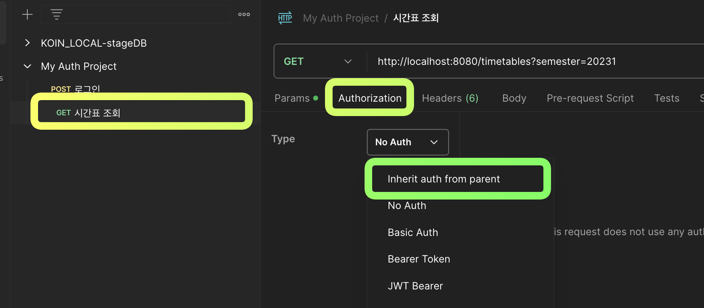

# Postman
> - API 개발, 테스트, 문서화, 모니터링 등을 지원하는 종합적인 API 플랫폼
> - 개발자와 팀이 API를 효율적으로 설계하고 협업할 수 있도록 기능 제공
> - API `문서를 먼저 작성`하고 후에 코드를 짜는 방식

## 주요 기능
> - API 요청 및 응답 테스트
>   - 다양한 HTTP 요청을 생성하고 응답을 확인하여 API의 동작을 검증할 수 있다.
> - 컬렉션 관리
>   - API 요청을 `그룹화`하여 체계적으로 관리하고 공유할 수 있다.
> - 환경 변수 지원
>   - 개발, 테스트, 운영 등 다양한 환경에 맞게 `변수 설정`이 가능하다.(JWT 토큰 설정)
> - 자동화 테스트
>   - 테스트 스크립트를 작성하여 API의 동작을 `자동으로 검증`할 수 있다.
> - 문서화
>   - API 문서를 자동으로 생성하고 공유할 수 있다.

## Postman 사용법
### Query String이 포함된 GET 방식의 호출
> - 
> - URI에 Query String을 포함한 GET방식으로 호출하는 경우에는 `http://localhost:5000/api?A=1&B=1` 이런 식으로 ?뒤에 key와 value를 기술하면 postman에서도 자동으로 추가가 된다.

### JSON이 사용된 POST 방식의 호출
> - 
> - Body에 raw 선택 후 json 데이터 기입
> - multipart/form-data 형태로 전송하고 싶은 경우 raw 대신 form-data를 선택 후, 데이터 기입
>   - Header에 Content-Type을 multipart/form-data로 설정

## Manage Environment
> - API를 개발하다 보면 local, development, production 환경마다 다르게 호출해야 하는 경우가 생긴다.
> - 그 경우 환경 변수를 postman에 저장시킬 수 있다.
> - 
> - 
> - 
> - 각 환경별로 hostname 변수를 관리할 수 있다.
> - IP주소가 아니더라도 다양한 환경 변수를 설정할 수 있다.

## Authorization
> - API에 인증, 인가가 이루어져야 하는데, token값을 헤더에 추가하는 방식

> - 
> - 위와 같이 저장해놓으면 header의 hidden 부분에 저장되어 있다.
> - 
> - 위의 토큰도 Environment에 값을 저장해두면 `{{token}}` 이런 식으로 값을 넣을 수 있기도 하다.
> - 

### 로그인 토큰 담기
> - 로그인을 수행하면 access token에 해당하는 `token` 값을 전역변수에 저장할 것이다.
> - 
> - Tests 탭에서 반환되는 값에 대한 조작을 할 수 있다.
>   - Tests 탭은 요청이 완료된 `직후` 실행되는 스크립트이다.
>   - Postman은 Node.js기반의 런타임을 가지고 있다.
> - 아래와 같이 스크립트를 작성하여 전역변수 login-token에 토큰 값을 담는다.
> - 
```js
var data = JSON.parse(responseBody);
pm.environment.set("login-token", data.token);
```
> - 이렇게 설정해두면 로그인 수행 시 다음과 같은 과정으로 인증 토큰이 전역적으로 저장된다.
> - 로그인 수행 -> Environment의 login-token 값에 토큰 값 저장

### 전역 환경 변수 사용
> - 이제 인증이 필요한 Request 요청을 생성하고 인증값을 여기에 넣어주자.
> - 
> - Authorization 탭에서 Authorization Type을 `Inherit auth from parent`로 설정해둔다.
>   - 하위 Request는 상위(Collection)에서 사용하는 {{login-token}} 인증 방식을 공유받을 수 있다.
> - 
> - 정상적으로 수행되는 것을 확인할 수 있다.
> - 

# Postman Mock Server
> - 실제 서버가 구현되기 전에 API의 예상 동작을 시뮬레이션할 수 있도록 도와준다.
> - 이를 통해, 프론트엔드와 백엔드 개발을 병행하거나, API의 설계 및 테스트를 독립적으로 진행할 수 있다.

## 주요 특징
> - `가상 서버` 생성
>   - 정의된 API 스펙에 따라 가상의 서버를 생성하여 요청에 대한 예상 응답을 반환한다.
> - `병행 개발` 지원
>   - 백엔드 개발이 완료되지 않아도 프론트엔드 개발 진행 가능
> - 테스트 용이성
>   - 다양한 시나리오에 대한 응답을 미리 정의하여 테스트를 효율적으로 수행
> - 협업 강화
>   - 팀원들과 Mock Server를 공유하여 일관된 API 동작을 확인하고 협업할 수 있다.

## 실행 순서
> - 
> - Select An existing collection 탭을 눌러 Collection을 선택 후 Next를 눌러준다.
> - 
> - Mock Server Name을 지정해 주고, Save the mock server URL as an new environment variables 체크 후 Create Mock Server 버튼을 눌러 생성
> - 
> - 생성 후 Environments에 url 환경 변수가 새로 생성되게 된다.(자동)
> - 
> - 이후 Collections 탭으로 돌아가서 request 요청에 Add example 누르기
> - 
> - 
> - 위와 같은 예시로 mock API 생성
> - 저장 후 Try를 눌러서 테스트
> - 
> - 위 사진 처럼 Mock Server에서 요청을 처리하여 응답 값이 오는 것을 확인할 수 있다.
> - Get과 같은 경우는 쉽게 크롬 브라우저에 입력하면 결과값을 받아올 수 있다.
> - Post도 Curl 명령어로 테스트하면 충분히 결과를 받아올 수 있다.

