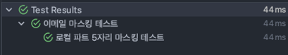

# TDD (실전편)
## JUnit
> - 자바 개발자가 가장 많이 사용하는 테스팅 기반 프레임워크
> - 현재 가장 많이 이용하는 버전은 JUnit 5
>   - JUnit 4에 비해 JUnit 5는 3가지 모듈로 구성된다.
>   - JUnit 5는 테스트 작성자를 위한 API 모듈과 테스트 실행을 위한 API가 분리되어 있다.
>   - 자바 8이상부터 가능
> - 
> - JUnit 5 = JUnit Platform + JUnit Jupiter + JUnit Vintage

### JUnit Platform
> - 테스트를 발견하고 테스트 계획을 생성하는 TestEngine 인터페이스를 정의한다.
> - 즉, 기초적인 역할을 수행하며 `TestEngine API`를 제공한다.
>   - JVM에서 테스트를 실행하기 위한 런처 제공
> - 테스트를 실행하기 위한 `기반 인프라` 제공

### JUnit Jupiter
> - JUnit 5에서 테스트 및 Extension을 작성하기 위한 새로운 프로그래밍 모델과 확장 모델의 조합
>   - TestEngine API 구현체
> - 테스트 코드 작성에 필요한 junit-jupiter-api 모듈과 테스트 실행을 위한 junit-jupiter-engine 모듈로 분리되어 있다.
>   - JUnit Jupiter = junit-jupiter-api + junit-jupiter-engine
> - @Test, @BeforeEach, @AfterEach와 같은 어노테이션과 새로운 확장 모델 제공

### JUnit Vintage
> - JUnit3, Junit4를 실행할 수 있는 TestEngine
>   - 하위호환성을 위해서 존재

## JUnit의 Class & Method 어노테이션
> - Test 역시 자바의 객체로 구성된다.
>   - 클래스로 구현을 하기 때문에 Class + Method 형태로 구성된다.
> - 또한, 테스트 클래스의 패키지 구조는 테스트 대상 클래스와 `동일한 패키지`에 위치
```css
src/main/java/com/example/Calculator.java
src/test/java/com/example/CalculatorTest.java
```
> - 테스트 클래스 선언
>   - 일반적으로 public 또는 package-private 접근 제한자를 사용
> - 필드 선언
>   - 테스트 대상 클래스의 인스턴스를 선언
> - 테스트 라이프사이클 메서드
>   - @BeforeEach, @AfterEach, @BeforeAll, @AfterAll을 통해 테스트 환경을 초기화/정리
> - 테스트 메서드
>   - `@Test`를 사용해 단위 테스트 메서드 작성

### 예시 클래스 코드
```java
public class Calculator {
    public int add(int a, int b) {
        return a + b;
    }

    public int subtract(int a, int b) {
        return a - b;
    }

    public int divide(int a, int b) {
        if (b == 0) {
            throw new ArithmeticException("Cannot divide by zero");
        }
        return a / b;
    }
}
```

### 예시 테스트 코드
```java
import org.junit.jupiter.api.*;

import static org.junit.jupiter.api.Assertions.*;

class CalculatorTest {

    private Calculator calculator;

    // 1. 각 테스트 실행 전에 Calculator 인스턴스 초기화
    @BeforeEach
    void setUp() {
        calculator = new Calculator();
    }

    // 2. 단위 테스트: 덧셈
    @Test
    void testAddition() {
        int result = calculator.add(2, 3);
        assertEquals(5, result, "2 + 3 should equal 5");
    }

    // 3. 단위 테스트: 뺄셈
    @Test
    void testSubtraction() {
        int result = calculator.subtract(5, 3);
        assertEquals(2, result, "5 - 3 should equal 2");
    }

    // 4. 예외 테스트: 0으로 나누기
    @Test
    void testDivisionByZero() {
        ArithmeticException exception = assertThrows(
            ArithmeticException.class,
            () -> calculator.divide(1, 0),
            "Expected divide by zero to throw an ArithmeticException"
        );
        assertEquals("Cannot divide by zero", exception.getMessage());
    }

    // 5. 각 테스트 실행 후 정리 작업 (예: 리소스 해제)
    @AfterEach
    void tearDown() {
        calculator = null;
    }
}
```

### Test Method
> - @Test
>   - 해당 메서드가 테스트 메서드임을 나타낸다.
> - @ParametherizedTest
>   - 해당 메서드가 매개변수가 있는 테스트임을 나타낸다.
#### @ValueSource
```java
@ParameterizedTest
@ValueSource(ints = {2, 4, 6, 8})
void testEvenNumbers(int number) {
    assertTrue(number % 2 == 0, number + " is not even");
}
```
> - 각 정수 배열 {2, 4, 6, 8}에 대한 테스트를 각각 진행한다.

#### @CsvSource
> - @ValueSource로는 하나의 인수만 전달할 수 있고, 해당 인수에 따른 결과 값을 테스트할 수 없다.
```java
@ParameterizedTest
@CsvSource(value = {"1,2", "2,4", "3,6"})
void multiplyBy2Test(int input, int expected) {
    assertThat(multiplyBy2(input)).isEqualTo(expected);
}
```
> - 이렇게 하면 여러 개의 파라미터를 테스트할 수 있다.

#### @NullSource, @EmptySource, @NullAndEmptySource
> - @NullSource는 테스트 메소드에 인수로 null을, @EmptySource는 빈 값을, @NullAndEmptySource는 null과 빈 값을 모두 주입한다.
```java
@ParameterizedTest
@DisplayName("null 값 또는 empty 값으로 User 생성 테스트")
@NullAndEmptySource
void createUserExceptionFromNullOrEmpty(String text) {
    assertThatThrownBy(() -> new User(text))
            .isInstanceOf(IllegalArgumentException.class);
}
```

#### @EnumSource
> - Enum 클래스를 이용해 테스트를 할 경우, value에 Enum 클래스를 넣고, names에 선택할 값의 이름을 전달한다.
```java
@ParameterizedTest
@DisplayName("6, 7월이 31일까지 있는지 테스트")
@EnumSource(value = Month.class, names = {"JUNE", "JULY"})
void isJuneAndJuly31(Month month) {
    assertThat(month.minLength()).isEqualTo(31);
}
```

> - @RepeatedTest
>   - 반복되는 테스트 메소드 진행
>   - @RepeatedTest(3)

### LifeCycle Method
> - 테스트 메서드의 실행 전후로 특정 작업을 수행할 수 있도록 지원하는 메서드
>   - 테스트 환경을 초기화하거나 정리 작업을 처리할 수 있다.

#### @BeforeAll, @AfterAll
> - 모든 테스트 메서드 실행 전/후에 1회 실행된다.
> - 데이터베이스 연결 설정/해제, 공통 리소스 초기화/해제, 테스트 환경 전역 설정/해제
> - 메서드는 `static`이어야 한다.
> - 반환 타입은 `void`여야 하고, 매개변수를 받을 수 없다.
```java
@BeforeAll
static void init() {
    System.out.println("Executed once before all tests.");
}

@AfterAll
static void cleanUp() {
    System.out.println("Executed once after all tests.");
}
```

#### @BeforeEach, @AfterEach
> - 각 테스트메서드 실행 전/후에 호출된다.
> - 테스트 데이터 초기화/리소스 정리
> - 테스트에 필요한 객체 생성/초기화 및 복원
```java
private List<String> list;

@BeforeEach
void setUp() {
    list = new ArrayList<>();
    list.add("Item 1");
}

@AfterEach
void tearDown() {
    list.clear();
}

@Test
void testListSize() {
    assertEquals(1, list.size());
}
```

#### 전체적인 LifeCycle
> - BeforeAll -> BeforeEach -> Test -> AfterEach -> AfterAll

#### 기타 어노테이션
> - @Tag : 테스트 클래스, 메서드에 테스트 구분을 태깅하기 위해 사용
> - @Disabled : 해당 클래스나 테스트를 사용하지 않음
> - @Timeout : 테스트 실행 시간 선언, 초과되면 실패
> - @DisplayName : 테스트 메서드 이름 설정(기본값 -> 메서드 이름)
```java
@DisplayName("이메일 마스킹 테스트")
class EmailMaskingBasicTest {

    @Test
    @DisplayName("로컬 파트 5자리 마스킹 테스트")
    void localpart_5_length_masking() {
        String email = "apple@apple.com";

        String maskingEmail = MaskingUtils.emailMasking(email);

        Assertions.assertEquals("app**@apple.com", maskingEmail);
    }
}
```



## Assertion
> - 테스트에서 예상 결과와 실제 결과를 비교하여 프로그램이 올바르게 동작하는지 확인하는 데 사용
### assertEquals
> - 두 값을 비교하여 일치 여부 판단
```java
@Test
@DisplayName("assertEquals Test")
public void test () { 

	String expected = "2023/01/07";
    String actual = "2023/01/07";
    
    assertEqauls(expected, actual); // Test Succeed!
    
}
```

### assertArrayEquals
> - 두 배열을 비교하여 일치 여부 판단
>   - 두 배열이 null이어도 동일한 것으로 판단
```java
@Test
@DisplayName("assertArrayEquals Test")
public void test02() {
    
    char[] expected = {'J','u','n','i','t'};
    char[] actual = "Junit".toCharArray();

    System.out.println(expected == actual); // 동일성 측면에서는 false

     assertArrayEquals(expected, actual); // 동등성 측면에서는 true
 }
```

### assertNotNull & assertNull
> - 객체의 null 여부 확인
```java
@Test
@DisplayName("assertNotNull & assertNull Test")
public void test03() {

	Object obj01 = null;
    Object obj02 = new String("오늘은 2023/01/07");

	assertNull(obj01);
    assertNotNull(obj02);

}
```

### assertTrue & assertFalse
> - 특정 조건이 true인지 false인지 판단
```java
@Test
@DisplayName("assertTrue & assertFalse Test")
public void test04() {

    assertTrue(5 > 4,"5 is greater than 4");
    assertFalse(5 > 6, " 5 is not greater than 6"); // Message 설정도 가능

}
```

### fail
> - 예외가 발생했는지 확인하거나, 개발 중에 테스트를 실패하게 만들고 싶을 때
```java
@Test
void testCondition() {
    boolean condition = false;

    if (!condition) {
        fail("조건이 충족되지 않았습니다.");
    }
}
```

### assertThat
> - 첫번째 파라미터에 비교대상 값, 두번째 파라미터에 비교 로직이 담긴 Matcher를 받음
```java
@Test
@DisplayName("assertThat Test")
public void test05(){

    // hamcrest 라이브러리 -> JUnit 에 사용되는 Matcher 라이브러리
    // spring-boot-starter-test 기본적으로 포함
    
    assertThat("Sample String", is(not(startsWith("Test"))));
    
    // when
    // then
 }
```

### assertThrows
> - 사용자가 선택한 예외가 발생하는지 판단
```java
@Test
@DisplayName("assertThrows Test")
public void test06(){
 // given
    IllegalArgumentException exception =
         assertThrows(IllegalArgumentException.class, () -> {
             DoSomething.func();
         });
 // when
 // then
}
```

### assertAll
> - 해당하는 모든 assertion 체크
> - 하나라도 실패시 그 밑의 코드는 더이상 진행 x
```java
@Test
@DisplayName("assertAll Test")
void assertAllTest(){
     // given
     String s1 = "Hello";
     String s2 = "Hello";

     assertAll(

                () -> assertNotNull(s1),
                () -> assertEquals(s2,s1),
                () -> assertTrue(s1.length() > 2)
    );
        // when
        // then
}
```

### assertTimeout
> - 지정한 시간 내에 assertion 실행이 완료되는지 확인
```java
@Test
@DisplayName("assertTimeout Test")
void assertTimeoutTest(){

assertTimeout(Duration.ofMillis(1000), () -> {

          new String("good morning");
          Thread.sleep(300);
          
        });
    }
}
```

## AssertJ
> - JUnit Assertions을 좀 더 심오한 테스트 작성을 도와주는 라이브러리
> - `spring-boot-starter-test`에 포함
> - 핵심 메서드는 assertThat이며 메서드 체이닝 형태를 사용
### Object Assertions
> - 두 객체의 동일성이나 객체의 필드를 조사하기 위해 사용
```java
public class Dog {

	private String name;
    private Double weight;
    
}

@Test
public class DogTest() { 

	Dog dog01 = new Dog("진돗개", 3.45);
    Dog dog02 = new Dog("시추" , 1.23);
    
    //동일성을 비교하므로 fail
    assertThat(dog01).isEqualTo(dog02);
    //동등성 비교를 위해서는
    // isEqualToComparingFieldByFieldRecursively()메서드 이용

}
```

### Boolean Assertions
> - 두 객체의 Boolean 값 비교를 위해 사용
> - isTrue(), isFalse()
```java
assertThat("".isEmpty()).isTrue();
```

### Iterable/Array Assertions
> - Iterable/Array에 특정 요소가 존재하는지 확인 등의 다양한 목적으로 사용
```java
List<String> list = Arrays.asList("1","2","3");

assertThat(list).contains("1"); // 포함되었는지 확인

assertThat(list).isNotEmpty(); // 비어있는지 확인

assertThat(list).startsWith("1"); // 해당 요소로 시작하는지 확인

assertThat(list).doesNotContainNull() // null 포함 하지 않는지 확인
```
