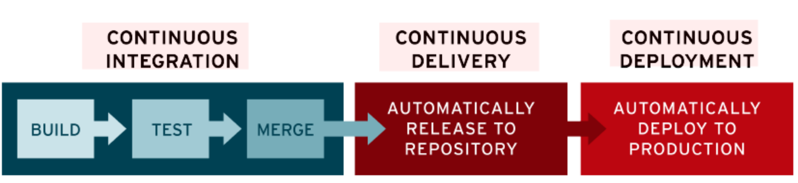
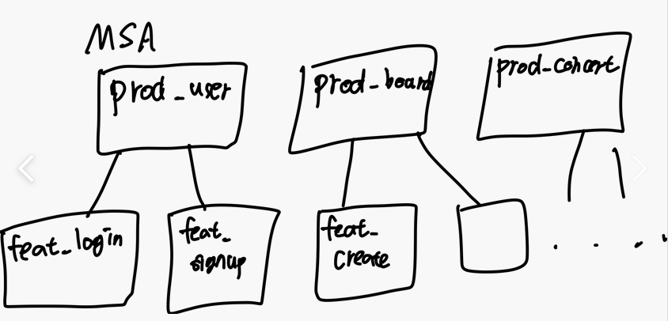
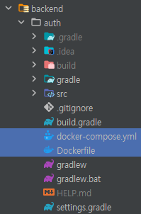
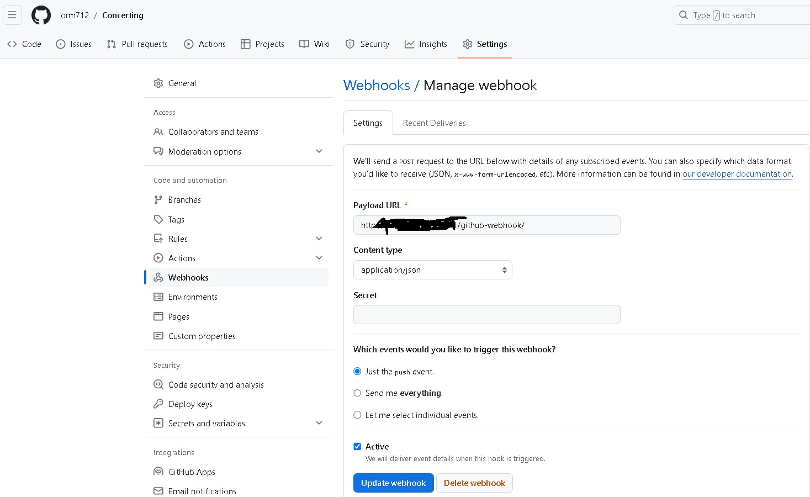

## CI/CD
> - 매번 개발자가 코드를 수정하고 `빌드와 테스트를 하고 배포까지` 한다면 상당히 많은 시간이 소요된다.
> - 하지만, Git에 코드를 올리는 것만으로도 누군가가 빌드와 테스트, 배포까지 해준다면, 쓸데없는 `시간을 단축`시키고 개발에 더 많은 시간을 투자할 수 있을 것이다.

### CI(Continuous Integration)?
> - `빌드/테스트 자동화 과정`
> - 어플리케이션에 대한 새로운 코드 변경 사항이 정기적으로 `빌드 및 테스트`되어 공유 리포지토리에 통합되므로 여러 명의 개발자가 동시에 어플리케이션 개발과 관련된 코드 작업을 할 경우 서로 충돌할 수 있는 문제를 해결할 수 있다.
> - 커밋(푸시)할 때마다 빌드와 일련의 자동 테스트가 이루어져 동작을 확인하고 변경으로 인해 문제가 생기는 부분이 없도록 보장한다.
> - CI/CD 파이프라인을 구현하기 위한 `첫 번째 단계`

### CD(Continuous Delivery/Deployment)
> - `배포 자동화 과정`
> - 코드 변경이 파이프라인의 이전 단계를 모두 성공적으로 통과하면 수동 개입 없이 해당 변경 사항이 프로덕션 서버에 `자동으로 배포`된다.



### CI/CD Tool 종류
> - Jenkins
> - Github Actions
> - etc

### CI/CD 적용 전과 후 비교
#### CI/CD를 적용하기 전
> 1. 개발자들이 개발하여 코드를 수정한다.
> 2. 각자의 feature 브랜치에 코드를 push한다.(어느 한 부분에서 에러가 났지만 개발자들은 눈치채지 못한다.)
> 3. 각자의 git에 올리고 prod 브랜치에 통합(Merge)한다.
> 4. 에러가 발생했지만, 어느 부분에서 에러가 났는지 모르므로 다시 어느 부분에 에러가 있는지 디버깅하고 코드를 수정한다.

#### CI/CD를 적용한 후
> 1. 개발자들이 개발해 feature 브랜치 코드를 push한다.
> 2. git Push를 통해 Trigger(Webhook)되어 CI서버에서 알아서 Build와 Test를 실행하고 결과를 전송한다.
> 3. 개발자들은 결과를 전송받고 에러가 난 부분이 있다면 에러부분을 수정하고 코드를 master 브랜치에 merge 한다.
> 4. master 브랜치에 코드를 merge하고 Build, Test가 정상적으로 수행이 되었다면 Prod 서버에 알아서 Deploy 과정을 수행한다.

---

## Jenkins를 이용해 배포해본적이 있다고 하는데, 깃허브에 올릴 때부터 클라우드 환경에서 서버가 실행될 때까지의 과정을 아는데로 설명해달라.
- MSA 기준으로 설명(Monolithic의 경우도 서버별로 나누는 것 말고 브랜치로 나누는 것은 동일)
> 1. 먼저, MSA의 각 서버별로 production 브랜치를 나누고, 그 production 브랜치에서 feature 브랜치들로 기능 개발 브랜치를 나눈다.(실무에서는 Prod 서버, Dev 서버, Test 서버, Staging 서버 등 다양한 형태로 나눠지나, 간소화하여 prod 서버와 dev 서버로 설명하겠다.)
>    - 
> 2. 또한, 각 서버들은 docker 컨테이너에서 운영되게 하기 위해서 각 브랜치의 root 경로에 `Dockerfile`을 작성한다.
>    - [Dockerfile](Dockerfile)
> 3. 추가로 DB가 필요한 서버들은 `docker-compose.yml`파일을 작성하여 각 백엔드 서버와 db 서버를 연결되게 하고 Docker 컨테이너로 클라우드 환경에 배포한다.
>    - [docker-compose.yml](docker-compose.yml)
> - docker파일과 docker-compose 파일은 root 경로에 디렉토리를 하나 생성에서 그쪽에 모두 담아놓는 경우가 많다.
>   - 이 경우는 그냥 root 디렉토리에 놔둔 것
>   - 
> 4. 이후, feature 브랜치에서 기능 개발을 완료하고 빌드와 테스트가 완료되었다면, production 브랜치에 pull request & merge한다.
> 5. Jenkins에서 production 브랜치의 웹훅을 통해 코드 변경이 감지되고, 빌드와 테스트를 진행한다.
>    - 각 github에서 settings에서 webhook을 들어가 작성하고, Payload URL에는 jenkins 서버의 url과 포트번호/github-webhook/을 기술하면 된다.
>      - 
> 6. 성공했다면, Jenkins의 쉘 스크립트에서 `docker-compose up -d '백엔드 서버'`명령어를 통해 해당 백엔드 서버를 클라우드 환경에 docker 컨테이너로 백그라운드에서 실행되게 한다.
>    - `-d`라는 인자는 서버가 백그라운드에서 돌아가라고 명시해주는것
>    - 이것을 해놔야 서버를 돌리면서 다른 작업도 할 수 있다.

### Jenkins Shell Script
```shell
cd backend/auth

chmod +x gradlew
./gradlew clean build

# Docker hub로 로그인
echo $DOCKER_HUB_PASSWORD | docker login --username $DOCKER_HUB_USERNAME --password-stdin

cp $ENV_FILE ./.env

# 빌드
docker-compose build

#Docker hub에 이미지 push(최신 버전으로 최신화)
#Docker hub를 이용하는 이유는 다른 개발자들도 내가 올린 docker 이미지 이용
#or 만약 서버가 다운됐을때 내가 마지막에 빌드했던 최신의 docker 이미지를 다시 가져오기 때문
docker-compose push auth-service

#Docker hub에서 이미지 가져오기
docker-compose pull auth-service

# 서비스 docker 컨테이너로 실행
docker-compose up -d auth-service

#이전에 이용했던 쓸모없는 이미지들 삭제
docker image prune -f


#물론 docker-compose 안쓰고 docker로 직접할 수도 있다.
#docker build -t auth-server .
#docker stop auth-container || true
#docker rm auth-container || true
#docker run -d --name auth-container -p 8100:8100 -e ENCRYPT_KEY=${ENCRYPT_KEY} auth-server
```