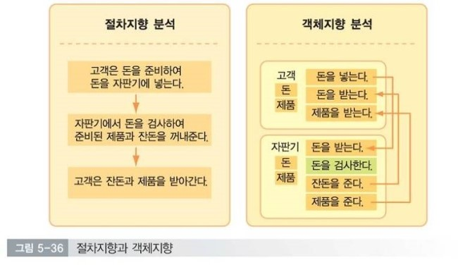
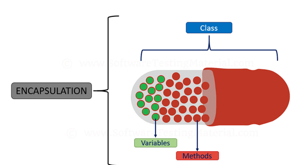
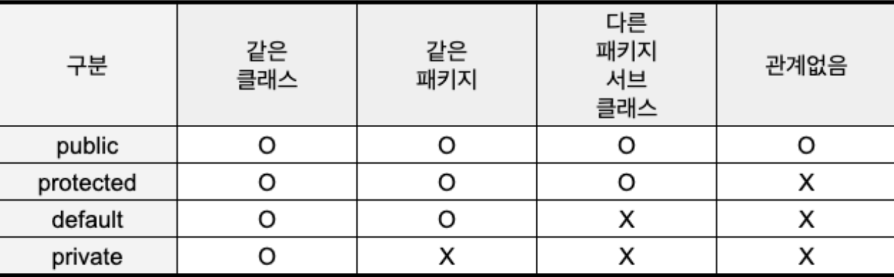
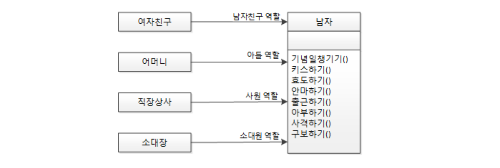
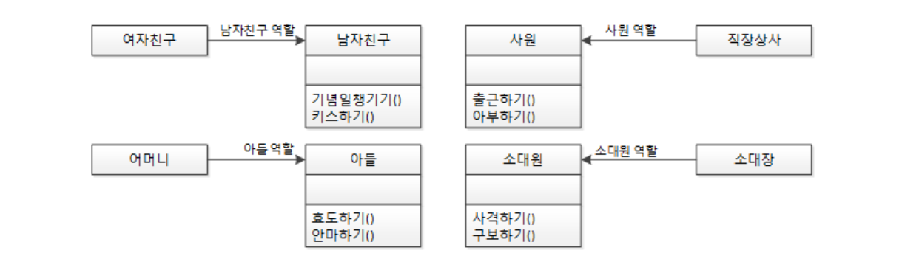
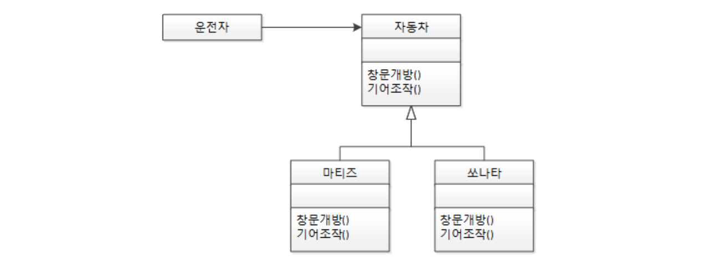
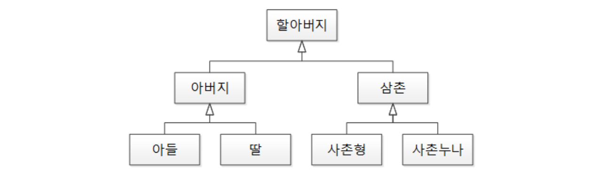
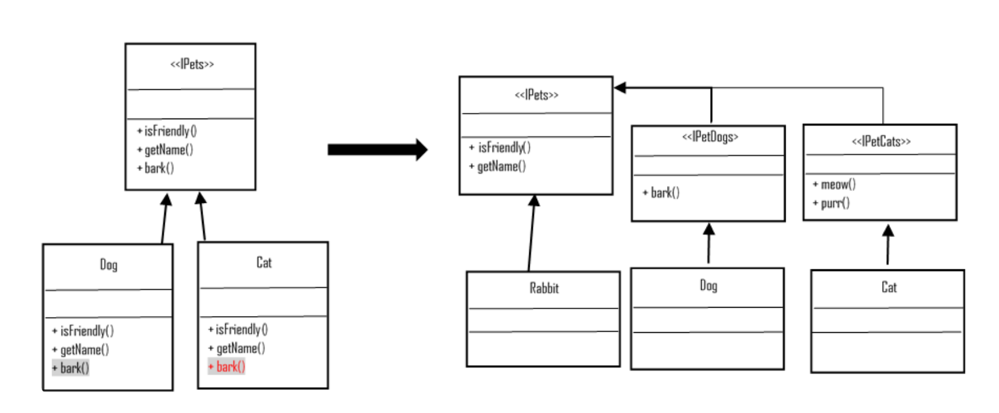

# 객체지향 프로그래밍
## 절차 지향 프로그래밍
> - Top Down 방식
> - 순차적인 처리가 중요하며, 프로그램 전체가 유기적으로 연결되어야 함
> - 컴퓨터의 작업 처리 방식과 유사하기 때문에 실행 속도가 빠름
> - C언어

## 객체 지향 프로그래밍(Object Oriented Programming)
> - `프로그래밍에서 필요한 데이터를 추상화`시켜 상태와 행위를 가진 객체를 만들고,
> - 그 객체들간의 `유기적인 상호작용`을 통해 로직을 구성하는 프로그래밍 방법

> - 인간 중심적 프로그래밍 패러다임
> - 현실 세계의 사물들을 객체라고 보고,
> - 그 객체로부터 개발하고자 하는 어플리케이션에 필요한 특징들을 뽑아와 프로그래밍 한 것




## 객체?
> - 실생활에서 우리가 인식할 수 있는 사물 또는 개념
## 클래스?
> - 객체를 만들어 내기 위한 설계도 혹은 틀
## 인스턴스?
> - 클래스로부터 만들어진 객체(인스턴스)
> - 클래스로부터 구현된 구체적인 실체

```java
/* 클래스 */
public class Animal {
  ...
}
/* 객체와 인스턴스 */
public class Main {
  public static void main(String[] args) {
    Animal cat, dog; // '객체'

    // 인스턴스화
    cat = new Animal(); // cat은 Animal 클래스의 '인스턴스'(객체를 메모리에 할당)
    dog = new Animal(); // dog은 Animal 클래스의 '인스턴스'(객체를 메모리에 할당)
  }
}
```

## OOP 장점
> - `다른 클래스`를 가져와 사용할 수 있고, 상속받을 수 있어 코드의 재사용성 증가
> - 자주 사용되는 로직을 `라이브러리`로 만들어두면 계속해서 사용 가능
> - 클래스 단위로 모듈화 가능하여, 대형 프로젝트에 적합
> - 객체 단위로 코드가 나눠지기 때문에 디버깅이 쉽고 유지보수 용이
> - 절차 지향에서는 코드를 수정할 때 일일이 찾아 수정해야하는 반면, 객체 지향은 해당 클래스만 수정하면 됨

## OOP 단점
> - 처리 속도가 상대적으로 느림
> - 객체가 많으면 용량이 커짐
> - 설계 시 많은 시간과 노력이 필요

## 객체 지향 프로그래밍의 특징(캡상추다)
### 캡슐화

> - 서로 `연관`되어 있는 속성과 기능들을 하나의 캡슐로 만들어 데이터를 외부로부터 보호
> - 접근제어자(public, private, protected, default)

```java
private final UserRepository userRepository;
private final PasswordEncoder passwordEncoder;
public void addUser(final String email, final String pw) { //회원가입
    final String encryptedPassword = passwordEncoder.encryptPassword(pw);
    final User user = User.builder()
            .email(email)
            .pw(encryptedPassword).build();
    userRepository.save(user);
}
```

### 상속
> - 클래스 개념이 도입되면서 상속을 통해 부모클래스의 속성과 기능을 이어받아 사용하는 것
> - 중복되는 기능을 작업하지 않게 해준다.
> - extends
```java
public interface UserRepository extends JpaRepository<User, Long> {
    User findByEmail(String email);
}
```

### 추상화
> - 객체에서 `공통`된 속성과 행위를 추출하는 것
> - 불필요한 정보는 숨기고 중요한 정보만을 표현함으로써 프로그램을 간단하게 만든다.
> - 추상 클래스, 인터페이스
#### 추상 클래스
> - 하나의 추상 클래스만 상속 가능
> - 추상 메소드 외에 `일반 클래스처럼 일반 필드, 메서드, 생성자` 구현 가능
> - 하위 클래스들의 공통점들을 모아 추상화하여 만든 클래스
> - 클래스간의 `연관 관계`를 구축하는 것에 초점
> - extends를 사용해서 자신의 기능들을 하위 클래스로 `확장`시키는 느낌
> - abstract class

#### 인터페이스
> - 다중 상속 가능
> - 내부의 모든 메서드는 default로 public abstract로 하고, 필드는 public static final로 한다.
> - 구현 객체가 같은 동작을 한다는 것에 초점
> - implements를 이용해서 인터페이스에 정의된 메서드를 각 클래스의 목적에 맞게 기능을 `구현`
> - interface

### 다형성
> - 하나의 변수명, 함수명 등이 상황에 따라 다른 의미로 해석될 수 있는 것
> - 오버로딩, 오버라이딩
### 오버로딩
```java
class Calculator {
    // 정수 덧셈 오버로딩
    int add(int a, int b) {
        return a + b;
    }

    // 실수 덧셈 오버로딩
    double add(double a, double b) {
        return a + b;
    }

    // 세 개의 정수 덧셈 오버로딩
    int add(int a, int b, int c) {
        return a + b + c;
    }
}

public class OverloadingExample {
    public static void main(String[] args) {
        Calculator calc = new Calculator();
        System.out.println(calc.add(5, 10)); // 정수 덧셈
        System.out.println(calc.add(5.0, 10.0)); // 실수 덧셈
        System.out.println(calc.add(5, 10, 15)); // 세 개의 정수 덧셈
    }
}
```

### 오버라이딩
```java
class Animal {
    void speak() {
        System.out.println("Animal speaks");
    }
}

class Dog extends Animal {
    // Animal 클래스의 speak 메소드 오버라이딩
    @Override
    void speak() {
        System.out.println("Dog barks");
    }
}

public class OverridingExample {
    public static void main(String[] args) {
        Animal myAnimal = new Animal();
        myAnimal.speak(); // "Animal speaks"

        Dog myDog = new Dog();
        myDog.speak(); // "Dog barks"

        Animal myNewDog = new Dog();
        myNewDog.speak(); // "Dog barks" - 오버라이딩된 메소드 호출
    }
}
```

---

## SOLID 원칙에 대해 설명해 주세요.
> - 객체 지향 프로그래밍에 적용되는 다섯 가지 원칙의 약어
> - 소프트웨어의 유지보수와 확장을 용이하게 하고, 이해하기 쉬운 디자인을 가능하게 하는 데 중점
### SRP
> - 단일 책임 원칙(Single Responsibility Principle)
> - 클래스가 오직 하나의 책임을 가져야 한다.
> - 클래스는 하나의 기능이나 관심사에만 집중해야 한다.
> - 
> - 
> - Spring
>   - 도메인, repository, sevice, controller별로 나눠논 것

### OCP
> - 개방-폐쇄 원칙(Open Closed Principle)
> - 소프트웨어 요소는 확장에는 열려있으나 변경에는 닫혀 있어야 한다.
> - 기존의 코드를 변경하지 않으면서 기능을 추가할 수 있도록 설계가 되어야 한다.
> - 
> - 
> - JDBC 
>   - OCP의 가장 좋은 예
>   - MySQL에서 오라클로 바뀌더라도 Connection을 설정하는 부분만 변경해주면 된다.

### LSP
> - 리스코프 치환 원칙(Liskov Substitution Principle)
> - 자식 클래스는 최소한 자신의 부모 클래스에서 가능한 행위는 수행할 수 있어야 한다.
> 
> - 상속을 잘 활용하고 있다면, 이미 LSP는 잘 구현되어 있다는 것이다.

### ISP
> - 인터페이스 분리 원칙(Interface Segregation Principle)
> - 하나의 일반적인 인터페이스보다 여러 개의 구체적인 인터페이스가 낫다.
> 

### DIP
> - 의존 역전 원칙(Dependency Inversion Principle)
> - 구체적인 모듈이 추상화된 모듈에 의존해야 한다.
> - 자주 변경되는 구체 클래스에 의존하지 말자
> - 변하지 않을 가능성이 높은 것에 의존하자
> - 
> - 
> - service와 serviceImpl

## 다형성이 무엇인지 설명하고, 동적 다형성과 정적 다형성이 무엇인지 설명해 주세요.
### 정적 다형성
> - 컴파일 시에 다형성이 결정되는 것
> - 오버로딩(Overloading)
> - 컴파일러는 메소드를 호출할 때 제공된 매개변수의 타입과 개수를 기반으로 어떤 메소드를 사용할 지 결정

### 동적 다형성
> - 런타임 시에 다형성이 결정되는 것
> - 오버라이딩(Overriding)
> - 런타임 시에 객체의 실제 타입을 기반으로 어떤 메소드를 사용할 지 결정

## 클래스가 있는 언어는 반드시 객체지향 언어라고 할 수 있을까요? 그 반대는 성립하나요?
### 클래스가 있는 언어가 반드시 객체 지향 언어는 아니다.
> - 클래스로 구현을 했지만, 객체 지향의 특성(캡상추다)를 지원하지 않을 수 있다.
> - 예를 들어, C언어가 구조체를 통해, 클래스를 비슷하게 구현하지만, 객체지향 언어는 아니다.

### 객체 지향 언어가 반드시 클래스가 있어야 하는 것도 아니다.
> - 객체지향 프로그래밍의 핵심은 객체 간의 상호작용을 통해 시스템을 모델링하는 것
> - 클래스를 사용하는 것이 일반적이지만, 클래스가 없어도 객체지향 프로그래밍이 가능하다.
> - 클래스 대신 객체의 프로토타입을 복제해서 새로운 객체를 생성한다.
> - JavaScript