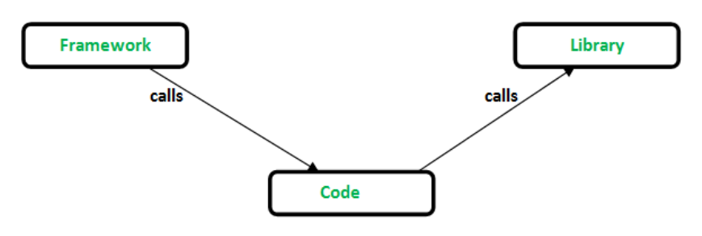
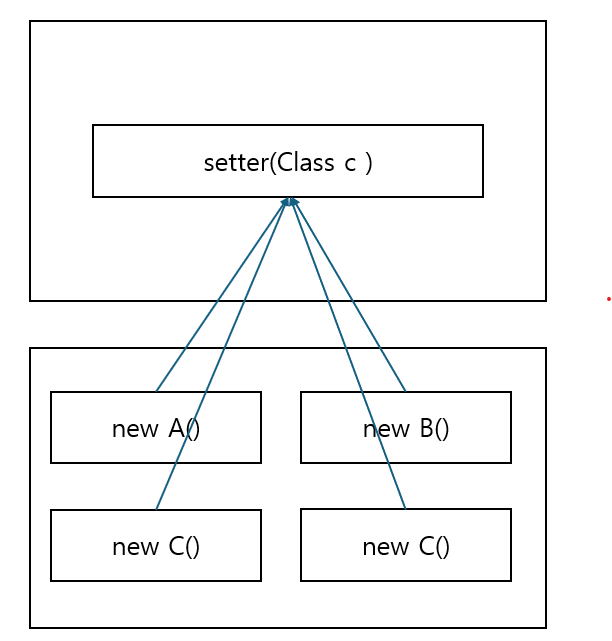

# Framework & Library

- Library

> 재사용 가능한 코드의 집합으로, 특정 기능을 수행하는 함수나 데이터를 모아 놓은 것

- Framwork

> 특정 개발 방법론이나 아키텍처를 따르는 코드의 집합으로, 소프트웨어의 기본 구조를 제공합

## 차이점

|                           | Libaray                                      | Framework                        |
| ------------------------- | -------------------------------------------- | -------------------------------- |
| Control Flow              | 개발자가 흐름을 관리                         | framework가 흐름을 관리          |
| 사용 방식                 | 특정 기능을 하는 함수나 클래스를 가져와 사용 | 전반적인 틀을 framework에서 제공 |
| 교체 용이성               | 다른 library로 교체 쉬움                     | 다른 framework로 교체하기 어려움 |
| 기존 프로젝트 이식 용이성 | 쉬움                                         | 어려움(사실상 불가능)            |

`IoC(Inversion of Control)`

> `제어의 역전` Framework로 부터 제어의 흐름을 받는 설계원칙

`[Framework]`Spring

DI(Dependency Injection)

> 직접 객체를 생성하여 사용하는 것이 아닌 외부에서 필요한 객체를 이식받아서 사용한다 
> setter()가 아닌 생성자로도 사용 가능하다

Spring IoC Container/Spring Container

- 객체의 생성을 책임진다

BeenFactory

> Spring Container의 최상위 Interface이며, Bean 등록, 생성, 조회 등 빈을 관리하는 역할을 한다

ApplicationContext

> BeanFactory를 상속하며, Bean을 관리하고 검색하는 기능을 BeanFactory가 하면 나머지 부분을 관리한다

객체 = Been

---

- https://www.shiksha.com/online-courses/articles/framework-vs-library/
- https://velog.io/@gillog/Spring-DIDependency-Injection
- https://leveloper.tistory.com/33
