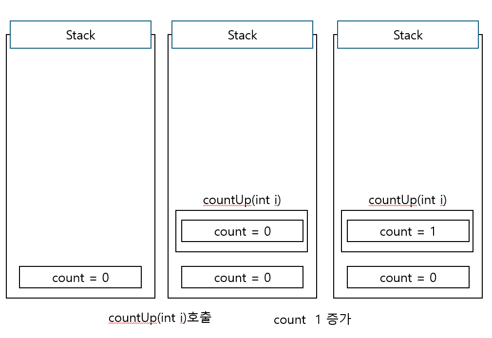

# Call By Value & Call by Reference

|           call-by-value           |          call-by-refernce          |
| :-------------------------------: | :--------------------------------: |
| 함수 호출 시 변수를 복사하여 전달 | 함수 호출 시 변수의 참조 값을 전달 |
| 값 변경시 원본은 변경되지 않는다  |     값 변경시 원본이 변경된다      |

## 자바의 Call by Reference

```java
public class App {

    static class Counter {
        public int count;

        public Counter() {
            count = 0;
        }
    }

    static class CountUp {
        public void countUp(Counter counter) {
            counter.count++;
        }

        public void countUp(int count) {
            count++;
        }
    }

    public static void main(String args[]) {
        Counter c1 = new Counter();
        Counter c2 = new Counter();

        CountUp cu = new CountUp();

        System.out.println("before(c1) : " + c1.count);
        cu.countUp(c1.count);
        System.out.println("after(c1) : " + c1.count);

        System.out.println("before(c2) : " + c2.count);
        cu.countUp(c2);
        System.out.println("after(c1) : " + c2.count);
    }
}
```

> before(c1) : 0<br>
> after(c1) : 0<br>
> before(c2) : 0<br>
> after(c1) : 1

---

### Primitive Type



1. primitive한 값 count 선언
2. countUp(int i)를 호출하면 Stack에 `새로운` count가 생성된다
3. count를 1 증가시켜도 countUp 호출할 때 새롭게 생긴 count만 1증가하여 원본에 영향을 미칠 수 없다.

### Reference Type


1. Counter c2를 선언하면 Stack에 c2 Heap에 count가 생성된다
2. countUp(Counter c)를 호출하면 Stack에 Heap의 count를 가르키는 새로운 c2가 생성된다
3. count를 증가시키면 원본의 c2의 count도 같이 증가하게 된다

---

### Reference Type은 Call By Reference가 가능하지 않나?

> 위 코드에서 출력된 값을 보면 값 변경시 원본도 함께 변경된다는 점에서 `Call By Reference`라고 볼 수도 있지만 `JAVA`는 `Call By Value`로 본다.
> Reference Type에서 파라미터로 값을 주게된다면 원본의 참조 값을 넘긴것이 아니라 `주소값을 복사`하여 넘긴 것이기 때문에 `Call By Value`이다


1. Reference Type a와 b 선언
2. method(a,b) 호출
3. a=b 연산을 수행하면 a와 aCopy는 서로 독립적이기때문에 a가 참조하는 value=1 는 바뀌지 않는다

---

https://deveric.tistory.com/92

https://velog.io/@csm2652/JAVA-JAVA%EC%97%90%EB%8A%94-call-by-reference%EA%B0%80-%EC%97%86%EB%8B%A4

https://velog.io/@wkdwoo/Primitive-type%EC%9B%90%EC%8B%9C%ED%83%80%EC%9E%85-vs.-Reference-type%EC%B0%B8%EC%A1%B0%ED%83%80%EC%9E%85

https://bcp0109.tistory.com/360

https://velog.io/@ksk0605/%EA%B0%9C%EB%B0%9C%EC%9E%90%EC%9D%98-%EA%B5%90%EC%96%91-C%EC%96%B8%EC%96%B4%EC%97%90%EB%8A%94-call-by-reference%EA%B0%80-%EC%97%86%EB%8B%A4%EA%B3%A0
