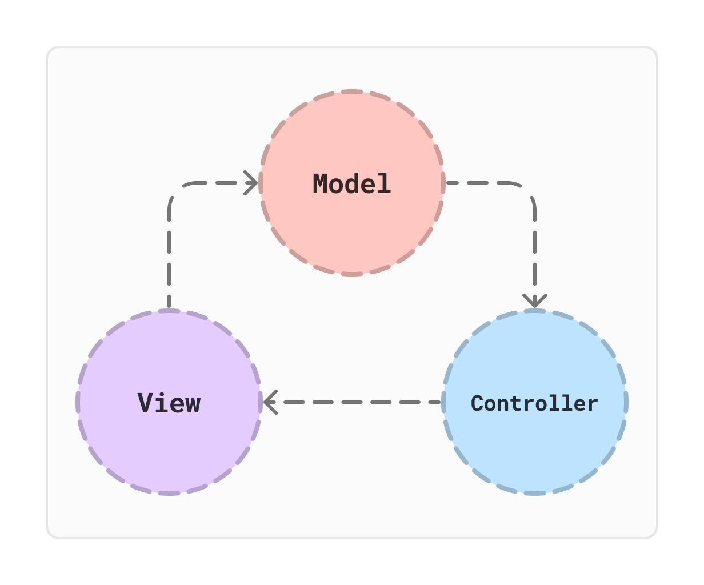
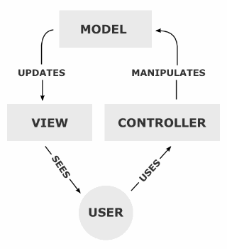
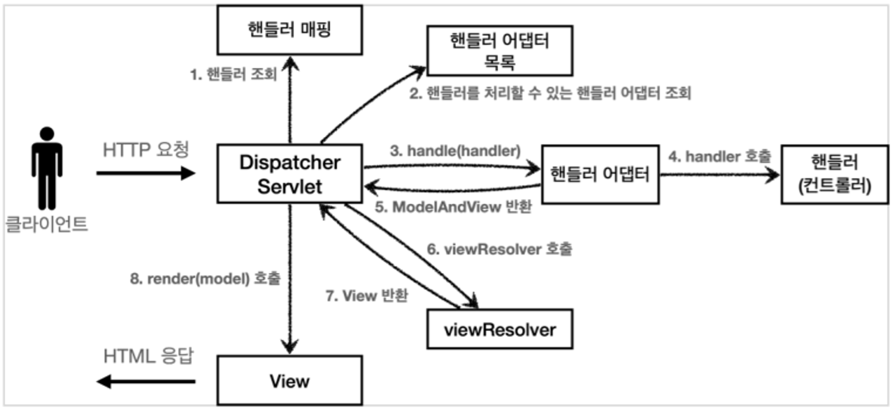
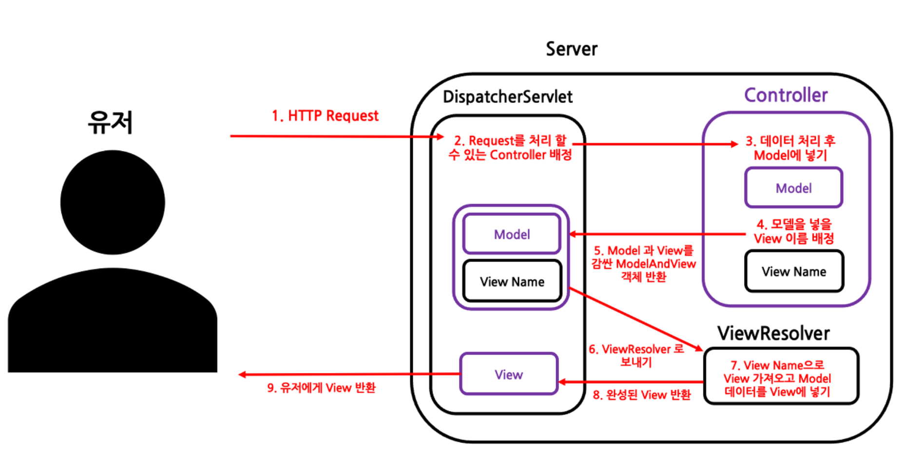
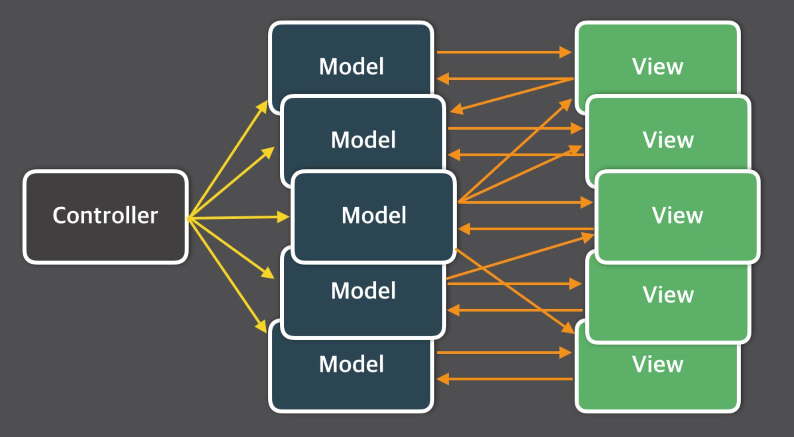
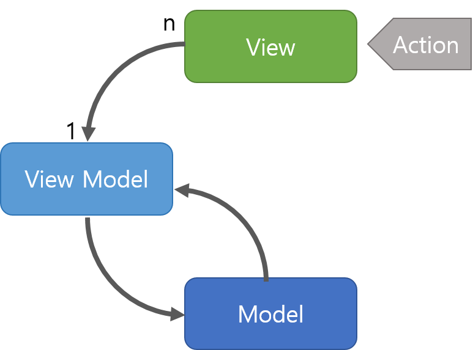
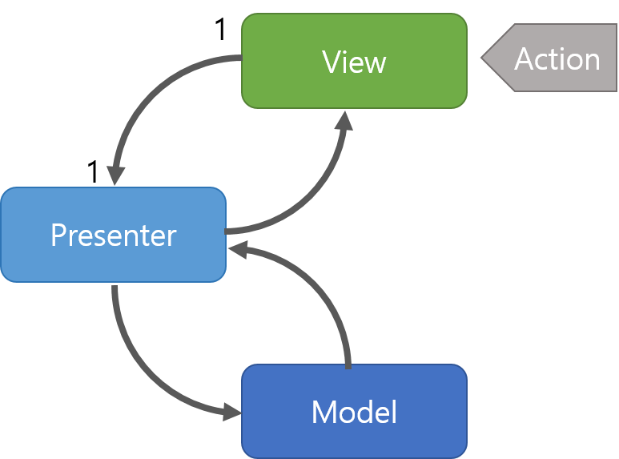

# MVC Pattern

## MVC 패턴이란?
- `Model`, `View`, `Controller`의 약자로 소프트웨어 디자인 패턴이다.
- 개발할 때, 3가지 형태로 역할을 나누어 개발하는 방법론
- 비즈니스 처리 로직과 사용자 인터페이스 요소들을 `분리`시켜 서로 영향없이 개발하기 수월하다는 장점

## Model, View, Controller의 관계

>사용자가 Controller를 사용하게 되면 Controller는 Model을 통해 데이터를 가져오고, </br>
> 받아온 데이터를 통해 View에서 시각적인 부분을 제어하여 사용자에게 데이터를 보여준다.

> 1. 사용자의 Request(요청)을 Controller가 받는다.
> 2. Controller는 Service에서 비즈니스 로직을 처리한 후 결과를 Model에 담는다.
> 3. Model에 저장된 결과를 바탕으로 시각적 요소 출력을 담당하는 View를 제어하여 사용자에게 전달한다.

## Model
- 어플리케이션이 `무엇`을 할 것인지 정의
- 내부 비즈니스 로직을 처리하기 위한 역할
- 데이터를 저장하고, 데이터를 처리하는 역할(처리되는 알고리즘, DB와 상호작용)
- Controller에게 받은 데이터를 조작(가공)하는 역할
- 데이터와 관련된 부분을 담당
>1. 사용자가 편집하길 원하는 모든 데이터를 가지고 있어야 한다.
>2. View나 Controller에 대해서 어떤 정보도 알지 말아야 한다.
>3. 변경이 일어나면, 변경 통지에 대한 처리 방법을 구현해야 한다.

## View
- 사용자에게 `무엇`을 보여줄 것인지 정의
- Controller에게 받은 Model의 데이터를 사용자에게 시각적으로 보여주기 위한 역할
>1. Model이 가지고 있는 정보를 따로 저장해서는 안된다.
>2. Model이나 Controller를 알고 있을 필요가 없다.
>3. 변경이 일어나면 변경통지에 대한 처리방법을 구현해야 한다.

## Controller
- Model과 View 사이에서 데이터 흐름 제어
- 사용자가 접근한 URL에 따라 요청을 파악하고 URL에 적절한 Method를 호출하여 Service에서 비즈니스 로직 처리
- 결과를 Model에 저장하고, View에 전달
- Model과 View의 역할을 분리하는 중요한 요소
>1. Model이나 View에 대해서 `알고 있어야 한다`.
>2. Model이나 View의 변경을 모니터링 해야 한다.

## Spring MVC
- Spring에서 제공하는 MVC 패턴 구현 방식
- Model, View, Controller 세가지 구성요소를 사용해서,
- 사용자의 다양한 HTTP Request를 처리하고,
- 단순한 텍스트 형식의 응답부터 REST 형식의 응답은 물론 View를 표시하는 html을 return하는 응답까지 다양한 응답을 할 수 있도록 만든 프레임워크

### Spring MVC의 구조
- Spring MVC의 주요 구성요소는 Model, View, Controller지만, 유기적으로 동작하도록 하기 위해 다양한 구성요소가 함께한다.
- DispatcherServlet(Front Controller)
- Handler(Controller)
- ModelAndView
- ViewResolver



#### DispatcherServlet
> - 제일 앞단에서 HTTP Request를 처리하는 Controller
> - Spring MVC에서는 HTTP Request가 왔을 때 DispatcherServlet이라 불리는 서블릿이 HTTP Request를 처리한 Controller를 지정한다.
> - DispatcherServlet은 일종의 HTTP Request를 처리할 Controller를 지정하는 Controller로 Super Controller 역할

#### HandlerAdapter
> - DispatcherServlet이 지정한 Controller를 실행하는 역할
> - 다양한 형태의 핸들러(컨트롤러)가 있기 때문에 DispatcherServlet은 어떤 핸들러를 실행해야 하는지 알 수 없다.
> - Controller interface, @Controller, ...

#### Controller(Hanlder)
> - HTTP Request를 처리해 Model을 만들고 View를 지정
> - DispatcherServlet에 의해 배정된 Controller는 HTTP Request를 처리하고, HTTP Request의 메시지를 처리해 필요한 데이터를 뽑아 Model에 저장
> - HTTP Request에 따라서 HTTP가 보여줄 View Name을 지정

#### ModelAndView
- Controller에 의해 반환된 Model과 View가 Wrapping된 객체
- Model : Map<String, Value>형태의 데이터 저장소
- Model은 Map 자료 구조로, HTTP Request 속의 데이터를 파싱해 Key-Value 형태로 만들어 저장한다.

```java
// 개별 조회 창 띄우기
public ModelAndView programEvaluation(Map<?, ?> rqstMap) throws Exception {
    ModelAndView mv = new ModelAndView();
    HashMap param = new HashMap<>();

    String ad_PK = MapUtils.getString(rqstMap, "ad_PK");
    param.put("ad_PK", ad_PK);

    List<Map> evaList = null;
    if (Validate.isNotEmpty(ad_PK)) {
        evaList = PGEV0100Mapper.findEvaList(param);
    }

    mv.addObject("member", MapUtils.getObject(rqstMap, "member"));
    mv.addObject("evaList", evaList);
    mv.setViewName("/admin/ev/BD_UIEVA0101");
    return mv;
}
```

- View, View Name
  - ViewResolver에 그릴 View를 지정
  - ModelAndView 내부에는 View 혹은 View Name이 있는데, View가 지정되더라도 데이터가 세팅된 View가 지정되지 않는다.
  - View 객체를 직접 지정하는게 아니라 View Name을 지정하면, ViewResolver가 View를 찾아서 지정해준다.

#### ViewResolver
- ModelAndView를 처리하여 View를 그리기
- 모델에 저장된 데이터를 사용해 View를 그린다.
- View는 사용자에게 보여줄 완성된 View이며, 그대로 유저에게 반환된다.
- 특정한 url로 들어갔을 때 우리에게 보여지는 View가 이곳에서 만들어지는 View이다.



## 장점
>1. 컴포넌트의 명확한 역할 분리로 인해 서로간의 결합도를 낮출 수 있다.
> - Model은 데이터 및 비즈니스 로직 담당
> - View는 사용자 인터페이스 담당
> - Controller는 사용자 요청을 받아 Model과 View의 흐름 제어
>2. 코드의 재사용성 및 확장성을 높일 수 있다.
>- 개발한 Model과 Controller는 여러 View에서 재사용할 수 있고, View도 다른 Model과 함께 재사용할 수 있다.
>3. 서비스를 유지보수하고 테스트하는데 용이해진다.
>- 변경이 필요한 부분을 보다 쉽게 식별할 수 있다.
>- 수정이나 확장할 경우 해당 부분만 집중에서 개발할 수 있어서 다른 부분에 영향을 덜 준다.

## 한계점
>1. Model과 View의 의존성을 완전히 분리시킬 수 없다.
>- 일반적으로 View는 Controller와 연결되어 화면을 구성하게 된다. Controller는 여러 개의 View를 가질 수 있게 된다.
>- 여기서, Model은 Controller를 통해 View와 연결된다. Controller에 의해 하나의 View에 연결되는 Model도 여러개가 될 수 있다.
>2. Controller의 역할이 과도하게 커진다면 `Massive-View-Controller`현상이 나오게 된다.
>
>- 컨트롤러의 부하가 너무 커지는 현상

## 다른 아키텍쳐 패턴은 없나요? MVC랑 비교해서 어떤 차이가 있나요?
### `MVVM` : Model-View-ViewModel 패턴

- MVC 패턴의 한계를 극복하기 위해 개발된 패턴중 하나
- View Model은 View와 Model 사이의 중개자 역할
- View를 보여주기 위한 데이터 처리 역할(UI 로직에 중점)

### `MVP` : Model-View-Presenter 패턴

- Presenter는 Controller와 비슷하지만, Controller는 View에 직접 연결되지 않고 사용자 인터페이스를 통해 상호작용
- View에서 요청한 정보를 통해 Model을 가공하여 View로 전달해주는 방식
- MVC는 Controller가 사용자의 입력을 처리하고 View를 업데이트하는 단방향 구조
- MVP는 View와 Presenter간의 양방향 통신 구조
- Presenter가 모든 로직 처리