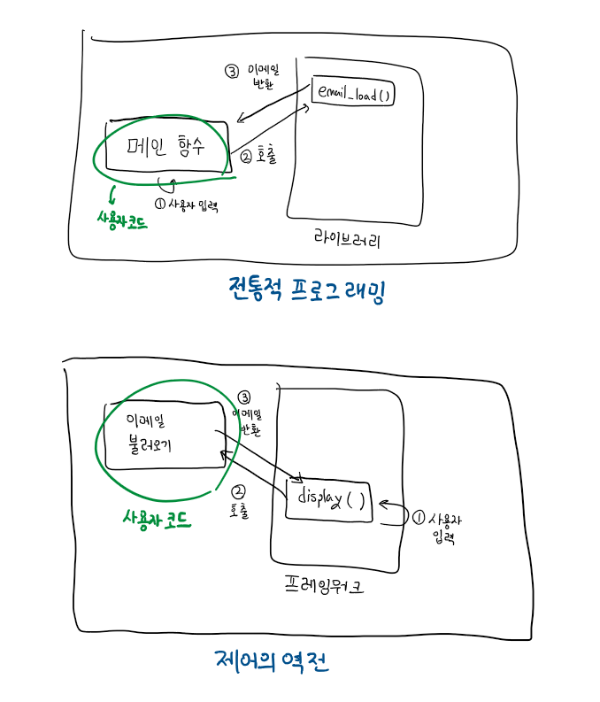
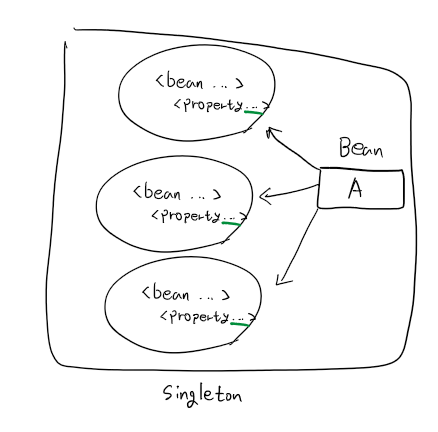
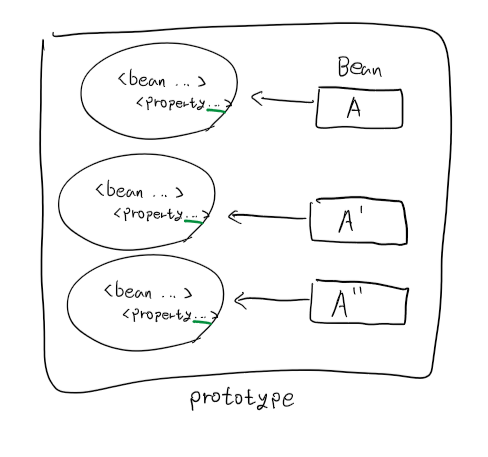

# IoC와 DI에 대해 설명해 주세요.
## IoC (Inversion of Control, 제어의 역전)
**`제어의 역전`** 은 사용자가 작성한 코드가 제네릭 프레임워크로부터 제어의 흐름을 전달받는 **디자인 패턴**을 말합니다.  
절차적 프로그래밍에선 *사용자의 코드가* 일반적인 작업을 위해 *라이브러리를 호출*하지만, 제어의 역전에선 **프레임워크가 사용자의 코드를 호출**하게 됩니다.  
제어의 역전은 `재사용 가능한 코드`와 `특정 문제를 위한 코드`가 애플리케이션에서 **함께 동작**해도, **독립적으로 개발**된다는 의미를 지닙니다.  
> 예시  
> **[기존의 방식]**  
>  애플리케이션의 메인 함수가 사용자에게 표시할 명령어들의 목록을 불러오기 위해 메뉴 라이브러리의 함수를 호출합니다.  
> 이후, 사용자가 선택한 명령어를 해당 함수가 반환하고, 메인 함수가 그 값을 토대로 관련된 명령을 실행합니다.  
> **[제어의 역전을 적용한 방식]**  
> 애플리케이션을 창 시스템, 메뉴, 마우스 제어와 같은 일반적인 동작 및 그래픽 요소를 알고 있는 프레임워크를 사용해 작성합니다.  
> 해당 애플리케이션이 어떤 메뉴를 제공하고, 해당 메뉴는 어떤 코드 서브루틴을 수행하는지는 사용자가 작성한 코드에 따라 달라지게 됩니다.  


### Spring에서
**Spring에선** 이러한 IoC가 본래 의미보다, 애플리케이션 객체에 의해 사용되는 **종속성의 구현체**에 대한 **제어 권한**을 **프레임워크에게 부여**한다는 의미로 사용됩니다. 
### 장점
#### 작업의 실행과 구현의 분리
#### 쉬워지는 구현체 전환(switch)
#### 프로그램 모듈성 향상
#### 테스트의 용이함
컴포넌트들을 격리하거나, 종속성들을 모의 객체로 대체할 수 있어 테스트를 더욱 쉽게 할 수 있습니다.
## DI (Dependency Injection, 의존성 주입)
**`의존성 주입`** 은 어떤 객체나 함수가 필요로 하는 다른 객체나 함수를 내부에서 생성하는 것이 아닌, **외부에서 전달 받는** **프로그래밍 기법**입니다.  
의존성 주입은 객체를 생성하고 사용하는데 있어 **`관심사(concern)`를 분리**하므로써 프로그램이 `느슨한 결합(loosely coupled)`을 갖도록 하는것을 목표로 합니다.  
이러한 관심사 분리를 통해 특정 서비스를 사용하려는 객체나 함수는 해당 서비스가 어떻게 생성되는지 알지 못해도 된다는 것을 보장합니다.  
### Spring에서
**의존성 주입(DI)** 은 객체가 그들의 종속성을 정의하는 **특수한 형태의 IoC**입니다.  
이러한 종속성 정의는 생성자 인수, 팩토리 메서드 인수, 인스턴스 내 속성(property)을 통해서만 정의됩니다. 이후 **`IoC 컨테이너`** (`BeanFactory`, `ApplicationContext` 등)에 의해 빈이 생성될 때 이러한 의존성들이 주입됩니다.  
이 과정은 근본적으로 *클래스를 직접 생성하거나, 서비스 로케이터 패턴과 같은 기법을 사용해 종속성의 인스턴스화 및 위치 지정을 제어*하는 **빈의 반대**라고 할 수 있습니다.  
### 유형
Spring에서 의존성을 주입하는 방식으로는 `생성자 기반 DI`, `설정자 기반 DI`, `필드 기반 DI` 방식이 있습니다.  
이중 `생성자 기반 DI` 방식이 **권장**되는데, **NPE를 방지** 할 수 있고 **final 선언이 가능**하기 때문입니다.  
- 생성자 기반 DI를 사용하는 경우, 필수 의존성들이 세팅되어있지 않은 상황에선 빈을 생성조차 못하기 때문에 **NPE이 발생하지 않지만**, **나머지 두 방식**은 ***null 상태가 가능***하게 됩니다.
- 또한, 생성자 기반 DI 방식을 사용하면 **필드를 final로 선언**할 수 있어 불변 형태의 이점을 활용할 수 있습니다.
#### 생성자 기반 DI (Constructor)
설정하고자 하는 **의존성**들을 **인수로 받는 생성자**를 호출해 의존성을 설정하는 방식입니다.  
IoC 컨테이너는 인수들의 타입, index와 같은 `attribute`를 토대로 의존성을 주입합니다.  
```java
@Component
public class Water {
    private final TeaBag teaBag;

    public Water(TeaBag chamomile) {
        this.teaBag = chamomile;
    }
}
```
#### 설정자 기반 DI (Setter)
no-args 생성자 또는 no-args 정적 팩토리 메서드를 통해 빈을 인스턴스화 한 후 **설정자를 호출**해 의존성을 설정하는 방식입니다.
```java
@Component
public class Milk {
    private Cereal cereal;

    @Autowired
    public void setCereal(Cereal cereal) {
        this.cereal = cereal;
    }
}
```
#### 필드 기반 DI (Field)
`@Autowired` **애너테이션**으로 **필드를 표시**해 의존성을 주입하는 방식입니다.
객체를 생성하는 동안 빈을 주입할 생성자, 설정자가 없는 경우 IoC 컨테이너는 **`Reflection`을 이용**해 주입하게 됩니다.
- Reflection을 사용하기 때문에 **더 많은 비용**이 들고, 종속성을 추가하기 쉽기 때문에 종속성을 늘릴 수록 **단일 책임 원칙을 위배할 가능성**이 커지므로 다른 방식에 비해 **권장되지 않습니다**.
```java
@Component
public class Juice {
    @Autowired
    private Orange orange;
}
```

# 특정 기능을 하는 클래스가 하나인 경우 구체 클래스를 사용해도 되지 않나?
구체 클래스를 직접 사용해도 되지만, 이러한 방식은 **`코드 자체를 변경하지 않으면 동작 방식을 변경할 수 없다`** 는 단점이 존재합니다.  
그리고 이러한 단점은 아래와 같은 단점들을 유도합니다.  
만약 Bean을 사용하게 된다면, 프로그램의 결합도를 낮추고 코드 유연성을 높일 수 있으며 테스트가 더욱 용이해집니다.  
## 결합도 증가
구체 클래스를 직접 사용하게 되면, 해당 클래스와 이를 사용하는 **클래스 간 결합도**가 높아지게 되고, 이는 코드의 변경을 힘들게 만듭니다.
## 유연성 감소
특정 구현에 직접적으로 의존하게 되면, 해당 **구현을 변경 및 확장하는데 어려움**을 겪게됩니다.
## 테스트의 어려움
구체 클래스를 직접 사용하게 되면 이를 **모의 객체로 대체하기 어려워** **테스트가 복잡**해집니다.
# Spring의 Bean 생성 주기
## Bean의 생성 범위(`scope`) [공식 문서](https://docs.spring.io/spring-framework/reference/core/beans/factory-scopes.html)
`빈 정의(bean definition)`를 생성할 때 마다, 빈 정의에 정의된 클래스의 인스턴스를 생성하는 레시피를 함께 생성하게 됩니다.
- `빈 정의(bean definition)`: XML과 같은 configuration에 작성하는 bean의 metadata 입니다.  
인스턴스를 만들어 낼 수 있는 레시피로 이를 활용해 하나에서 많게는 여러 개의 인스턴스를 생성할 수 있습니다.  
빈 정의 안에는 생성된 객체에 연결된 다양한 종속성과 설정 값 뿐만 아니라 객체의 범위 역시 제어할 수 있습니다.  
Spring의 경우 6개의 scope를 지원하며, 이 중 4개는 web-aware `ApplicationContext`를 사용하는 경우에만 사용할 수 있습니다. 또한, 커스텀 scope도 만들 수 있습니다.

| Scope                                                                                                                            | Description                                                                              |
| -------------------------------------------------------------------------------------------------------------------------------- | ---------------------------------------------------------------------------------------- |
| [singleton](https://docs.spring.io/spring-framework/reference/core/beans/factory-scopes.html#beans-factory-scopes-singleton)     | (Default) 빈 정의의 범위를 각 IoC 컨테이너의 단일 객체 인스턴스로 지정합니다.<br>해당 빈에 대한 모든 요청은 캐시된 동일한 객체를 반환합니다. |
| [prototype](https://docs.spring.io/spring-framework/reference/core/beans/factory-scopes.html#beans-factory-scopes-prototype)     | 빈 정의의 범위를 원하는 수 만큼의 객체 인스턴스로 지정합니다.<br>즉 컨테이너에서 요청할 때 마다 다른 인스턴스를 반환합니다.                 |
| [request](https://docs.spring.io/spring-framework/reference/core/beans/factory-scopes.html#beans-factory-scopes-request)         | 빈 정의의 범위를 단일 HTTP 요청 생명 주기로 지정합니다. 즉 각 HTTP 요청은 객체 인스턴스를 갖고 있습니다.                        |
| [session](https://docs.spring.io/spring-framework/reference/core/beans/factory-scopes.html#beans-factory-scopes-session)         | 빈 정의의 범위를 HTTP 세션의 생명 주기로 지정합니다.                                                         |
| [application](https://docs.spring.io/spring-framework/reference/core/beans/factory-scopes.html#beans-factory-scopes-application) | 빈 정의의 범위를 `ServletContext` 의 생명 주기로 지정합니다.                                               |
| [websocket](https://docs.spring.io/spring-framework/reference/web/websocket/stomp/scope.html)                                    | 빈 정의의 범위를 `Websocket`의 생명 주기로 지정합니다.                                                     |

### `singleton`
  
`singleton`으로 등록된 빈은 컨테이너가 **단일 인스턴스**로 생성해 관리하며, 해당 빈에 대한 모든 요청은 **캐시된 동일한 객체를 반환**합니다.  
해당 객체에 대한 **수정**은 객체에 대한 **`다른 모든 참조`에 영향**을 줍니다.  
#### XML
```xml
...
	<bean id="personSingleton" class="org.baeldung.scopes.Person" scope="singleton"/>
```
#### Annotation
```java
...
@Bean
@Scope("singleton")
// 또는 @Scope(value = ConfigurableBeanFactory.SCOPE_SINGLETON)
public Person personSingleton() {
    return new Person();
}
```
### `prototype`
   
`prototype`으로 등록된 빈은 컨테이너에서 해당 빈에 대한 **요청이 들어올 때 마다** **`다른` 인스턴스**를 반환합니다.  
다른 scope들과 달리, Spring은 `prototype` 빈의 **전체 생명 주기를 `관리하지 않습니다`**.  
IoC 컨테이너는 prototype 객체를 *인스턴스화 하고 의존성 주입한 뒤, 클라이언트에게 넘겨주고* `더 이상 관리하지 않습니다`.  
따라서 초기화 생명 주기 콜백(`init()`)은 scope에 관련 없이 모두 잘 동작하지만, **파괴 생명 주기 콜백**(`destroy()`)은 `prototype` 객체에서 **호출되지 않습니다**.  
- 따라서 클라이언트 코드는 `prototype` 객체를 cleanup 하고 객체가 보유한 자원들을 해제하도록 해야 합니다.  
#### XML
```xml
...
	<bean id="personPrototype" class="org.baeldung.scopes.Person" scope="prototype"/>
```
#### Annotation
```java
@Bean
@Scope("prototype")
// 또는 @Scope(value = ConfigurableBeanFactory.SCOPE_PROTOTYPE)
public Person personPrototype() {
    return new Person();
}
```
## Bean의 Lifecycle
빈은 Spring IoC 컨테이너에 의해 관리됩니다.  
IoC 컨테이너에 의해 빈이 인스턴스화 되고, 의존성이 주입되고, *IoC 컨테이너가 종료된 후* **빈은 파괴**됩니다.

> 출처: https://www.geeksforgeeks.org/bean-life-cycle-in-java-spring/
> 
이 과정에서 `인스턴스화 이전`, `파괴 이전` **실행하고 싶은 코드**가 있다면 **생명주기 콜백 함수**인 `init()`, `destroy()` 메서드 내부에 작성할 수 있습니다.  
**생명주기 콜백 함수**를 작성하는 방법은 크게 3가지 방법이 존재합니다.
### XML
XML파일의 `빈 정의` 내부에 사용할 사용자 정의 `init()` 및 `destroy()`를 등록하는 방식입니다.
이후 해당 XML 설정을 불러오는 IoC 컨테이너를 생성하고, 이를 `close()` 하게되면  `init()`/`destroy()` 함수가 호출되게 됩니다.
> [예시]
```xml
<beans>
    <bean id="hw" class="beans.HelloWorld"
            init-method="init" destroy-method="destroy"/>
<!-- init-method/destroy-method에 사용자 정의 init()/destroy() 함수의 이름을 등록합니다 -->
</beans>
```
### Interface
빈이 `InitializingBean`, `DisposableBean`을 상속하게 한 뒤, `afterPropertiesSet()`, `destroy()` 메서드를 재정의하도록 하는 방식입니다.  
이렇게 하면 IoC 컨테이너는 `빈의 생성 전`, `컨테이너가 파괴된 후` 해당 함수들을 호출하게 됩니다.  
내부적으로 Spring 프레임워크는 **`BeanPostProcessor`** 의 구현체를 사용해 적절한 메서드들을 호출할 수 있는 콜백 인터페이스들을 처리합니다.  
이 방식은 *Spring 프레임워크*와 *코드*를 *`불필요하게`* **`결합`시키는 측면**이 있어, Spring에서도 XML을 사용하거나 애너테이션을 사용하는 방식을 권장합니다.  
> [예시]
```java
public class AnotherExampleBean implements InitializingBean {
	@Override
	public void afterPropertiesSet() {
		// do some initialization work
	}
}

public class AnotherExampleBean implements DisposableBean {
	@Override
	public void destroy() {
		// do some destruction work (like releasing pooled connections)
	}
}
```
## Annotation
빈으로 등록될 클래스의 메서드에 `@PostConstruct`, `@PreDestroy` 애너테이션을 달아주면 해당 빈이 인스턴스화되기 전, 컨테이너가 파괴된 후 해당 메서드들이 실행되게 됩니다.  
이를 사용하기 위해선 `CommonAnnotationBeanPostProcessor` 빈을 등록하거나, Configuration XML 파일 내에서 `<context:annotation-config/>` 을 사용해야 합니다.  
> [예시]
```java
import javax.annotation.PostConstruct;
import javax.annotation.PreDestroy;
 
// HelloWorld class
public class HelloWorld {
 
    // 빈이 인스턴스화 되었을 때 자동으로 실행되도록
	// 애너테이션을 달아줍니다.
    @PostConstruct
    public void init() throws Exception
    {
        System.out.println(
            "Bean HelloWorld has been "
            + "instantiated and I'm the "
            + "init() method");
    }
 
    // 스프링 컨테이너(=IoC 컨테이너)가 종료되면
	// 자동으로 실행되도록 애너테이션을 달아줍니다.
    @PreDestroy
    public void destroy() throws Exception
    {
        System.out.println(
            "Container has been closed "
            + "and I'm the destroy() method");
    }
}
```

## 참고문서
- [Inversion of control - Wikipedia](https://en.wikipedia.org/wiki/Inversion_of_control)
- [Dependency injection - Wikipedia](https://en.wikipedia.org/wiki/Dependency_injection)
- [Introduction to the Spring IoC Container and Beans :: Spring Framework](https://docs.spring.io/spring-framework/reference/core/beans/introduction.html)
- [Inversion of Control and Dependency Injection with Spring | Baeldung](https://www.baeldung.com/inversion-control-and-dependency-injection-in-spring)
- [Dependency Injection :: Spring Framework](https://docs.spring.io/spring-framework/reference/core/beans/dependencies/factory-collaborators.html)
- [1. Introduction to Spring Framework](https://docs.spring.io/spring-framework/docs/3.2.x/spring-framework-reference/html/overview.html#background-ioc)
- [Bean life cycle in Java Spring - GeeksforGeeks](https://www.geeksforgeeks.org/bean-life-cycle-in-java-spring/)
- [Bean Scopes :: Spring Framework](https://docs.spring.io/spring-framework/reference/core/beans/factory-scopes.html#beans-factory-scopes-other-injection)
- [Customizing the Nature of a Bean :: Spring Framework](https://docs.spring.io/spring-framework/reference/core/beans/factory-nature.html#beans-factory-lifecycle)
- [Quick Guide to Spring Bean Scopes | Baeldung](https://www.baeldung.com/spring-bean-scopes)