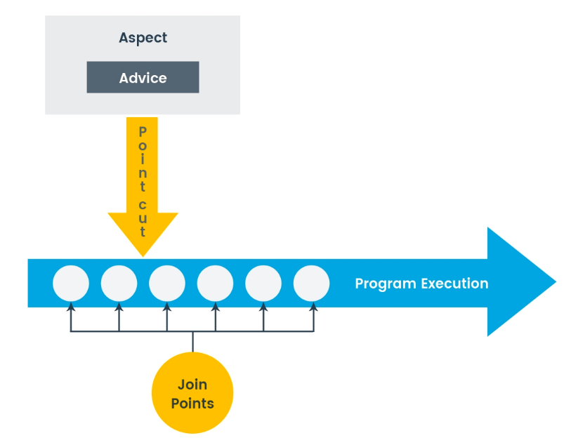

# AOP(Aspect Oriented Programming)

### `AOP`(관점지향 프로그래밍) 이란?

횡단관심사(cross-cutting concern)의 분리를 허용함으로써 `모듈성`을 증가시키는 프로그래밍 패러다임이다


핵심 비지니스 로직이 있고 전체를 관통하는 부가 로직이 있다.
이를 횡단 관심사라 한다(로깅, 보안, 트랜잭션)

### Spring AOP

- Target : 하나 이상의 aspect에 advice를 받는 객체

- Aspect : 여러 클래스의 관심사의 모듈화

- Join point : 프로그램 실행중에 발생하는 이벤트로 AOP`1에서는 advice가 적용되는 지점

  > Spring AOP에서 join point는 항상 메소드 실행을 나타냄

- Advice : 특정 join point에서 apspect에 의해 수행되는 동작

  > 1.  `around` : join point 실행 전후에 실행
  > 2.  `before` : join point 실행 전에 실행
  > 3.  `afeter` : join point 실행 후에 실행

- Pointcut : join point와 일치하는 조건을 정의

  > Advice는 Pointcut 표현식과 연결되어 일치하는 join point에서 실행

- Introduction : 기존의 클래스나 인터페이스에 새로운 메서드나 필들를 추가하여 기능을 확장하는 것

- AOP proxy : Advice를 적욕하기 위해 Target 객체를 감싸는 역할

  > 1.  JDK dynamic proxy : 인터페이스를 구현한 프록시 객체를 생성하여 타겟 객체의 메서드 호출을 가로채고, 어드바이스를 실행
  > 2.  CGLIB proxy : 상속을 통해 프록시 객체를 생성하며, 타겟 객체의 클래스의 서브클래스를 만들어 어드바이스를 적용

- Weaving : Aspect를 Targer에 적용하여 Advised objcet를 생성하는 과정
  Spring AOP에서는 runtime에서 Weaving을 실행함

```java
@Aspect
@Component
public class LoggingAspect {

    @Pointcut("execution(* com.example.service.*.*(..))")
    public void serviceMethods() {}

    @Before("serviceMethods()")
    public void beforeAdvice(JoinPoint joinPoint) {
        // 메서드 실행 이전에 수행할 작업
        System.out.println("메서드 실행 이전에 로깅 작업 수행");
    }
}
```



## @Aspect는 어떻게 동작하나요?

1. 대상 객체 식별

   AOP를 적용할 객체를 식별, Spring의 Bean으로 등록되어 있음

2. 프록시 객체 생성

   Target을 감싸는 프록시 객체를 생성

3. Advice 결정

   @Before같은 Annotation으로 정의되어 있음

4. Advice 실행

5. Target 객체 호출

   필요한 경우 Target 객체 호출

---
