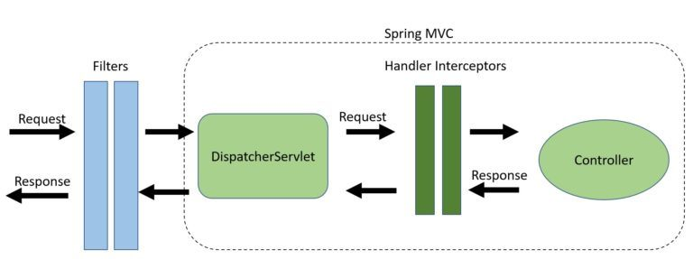

## Spring 에서 Interceptor와 Servlet Filter에 대해 설명해 주세요.
### `Interceptor`
`handlerInterceptor`는 Spring에서 `DispatcherServlet`과 `Controller` 사이에 존재하는 인터페이스로,  Spring MVC 프레임워크의 일부입니다.
`Interceptor` 인터페이스는 기본적으로 3가지의 디폴트 메서드가 존재하며, 디폴트값으로 prehandle은 true를 반환하고 나머지 두 함수는 아무것도 수행하지 않습니다.
#### `boolean preHandle(HttpServletRequest request, HttpServletResponse response, Object handler)`
HandlerMapping이 적절한 핸들러 객체를 선택한 후, HandlerAdapter가 핸들러를 호출하기 이전에 호출되는 인터셉션 포인트입니다.  
즉, 대상 핸들러를 호출하기 이전 실행됩니다.  
`DispatcherServlet`은 핸들러를 마지막에 두고, 여러 개의 인터셉터로 연결된 체인 상에서 핸들러를 처리합니다.
#### `void postHandle(HttpServletRequest request, HttpServletResponse response, Object handler, @Nullable ModelAndView modelAndView)`
대상 핸들러 이후 호출되며, `DispatcherServlet`에 의해 뷰가 렌더링 되기 전 호출됩니다.
핸들러가 성공적으로 실행된 뒤, 호출되는 인터셉션 포인트입니다.  
`HandlerAdapter`가 핸들러를 호출한 뒤, `DispatcherServlet`이 뷰를 렌더링하기 전 호출됩니다.
preHandle과 달리, 실행 체인의 역순으로 실행됩니다.  
#### `void afterCompletion(HttpServletRequest request, HttpServletResponse response, Object handler, @Nullable Exception ex)`
요청이 처리되고, 렌더링이 완료될 때 호출되는 콜백 함수 입니다.  
요청이 완료된, 즉 뷰가 렌더링 되고 난 뒤의 콜백 함수입니다. 핸들러의 모든 실행 후 결과에 대해 호출되기 때문에 내부에서 리소스를 정리한다던가의 행위가 가능합니다.  
그리고 `preHandle` 메서드가 성공적으로 완료되어, `true`를 반환한 경우에만 `afterCompletion`이 호출됩니다.  
`postHandle`과 마찬가지로, 실행 체인의 역순으로 호출됩니다.  
- 따라서 체인의 첫 번째 인터셉터가 마지막으로 호출됩니다.  
#### 등록 방법
##### Config 클래스에 등록하기
`WebMvcConfigurer`를 구현한 클래스에서 아래와 같이 인터셉터를 등록합니다.
```java
@Configuration
public class WebMvcConfig implements WebMvcConfigurer {

    @Override
    public void addInterceptors(InterceptorRegistry registry) {
        registry.addInterceptor(new MyCustomInterceptor());
    }
}
```
##### XML 사용
Spring Bean Config 파일 내부에 아래와 같이 인터셉터를 매핑해 등록합니다.
```xml
<beans>
...
	<interceptors>
		<interceptor>
			<mapping path="/home" />
			<beans:bean class="com.abc.spring.RequestProcessingTimeInterceptor"></beans:bean>
		</interceptor>
	</interceptors>
...
<beans/>
```
### `Servlet Filter`
`Servlet Filter`는 `Jakarta EE`( 구)`java EE` )에 포함된 `Java Servlet`의 일부로, 서버로 들어오는 요청이 어떤 서블릿에도 도달하지 못하도록 막거나 응답이 클라이언트에게 도달하지 못하도록 막을 수 있는 인터페이스 입니다.  
주로 인증, 로깅, 이미지 변환 등의 작업을 거치는 용도로 사용됩니다.  
- 추가로, `Spring Security` 역시 Filter의 일종이기 때문에 Spring MVC 외부에서 사용 가능합니다.  
#### 메서드
##### `init(FilterConfig config)`
Servlet Container가 필터를 인스턴스화 한 후, 한 번만 호출되는 함수입니다.  
만약 `init()` 함수에서 `ServletException`이 발생하거나, Web Container가 정의한 시간 내에 완료되지 않으면 Filter는 서비스되지 않습니다.  
즉, 해당 필터가 매핑된 모든 요청은 실패하게 됩니다.  
##### `doFilter(ServletRequest request, ServletResponse response, FilterChain chain)`
클라이언트와 요청된 자원 사이의 체인을 요청과 응답이 통과할 때마다 컨테이너에서 호출되는 함수입니다.  
이 메서드에 전달된 `FilterChain`은 필터가 요청/응답을 다음 엔티티로 전달할 수 있도록 해줍니다.  
주로 들어온 요청을 검사하고, `request` 또는 `response` 객체에 특정 작업을 수행 후 `chain.doFilter()`를 통해 체인의 다음 엔티티를 호출하거나 요청에 대한 처리를 더 이어가지 않고 차단할 수 있습니다.  
##### `destroy()` 
`Servlet Container`가 서비스 중이지 않음을 필터에 알리기 위해 한 번만 호출됩니다.  
해당 필터의 `doFilter` 메서드를 수행하는 스레드들이 모두 종료되거나 시간 초과 기간이 끝난 후에야 호출됩니다.  
컨테이너가 이 메서드를 호출한 뒤에는, 필터 인스턴스는 다시는 doFilter 메서드를 호출하지 않습니다.  
#### 등록 방법
아래와 같이 `web.xml`에서 `<filter>` 태그와 `<filter-mapping>` 태그를 통해 등록할 수 있습니다.
```xml
<?xml version="1.0" encoding="UTF-8"?>
<web-app xmlns:xsi="http://www.w3.org/2001/XMLSchema-instance"
         xmlns="http://xmlns.jcp.org/xml/ns/javaee"
         xsi:schemaLocation="http://xmlns.jcp.org/xml/ns/javaee 
                             http://xmlns.jcp.org/xml/ns/javaee/web-app_4_0.xsd" 
         id="WebApp_ID" version="4.0">
...
 <filter>
      <filter-name>filter1</filter-name>
      <filter-class>com.app.GFGFilter</filter-class>
  </filter>

  <filter-mapping>
      <filter-name>filter1</filter-name>
      <url-pattern>/GFGServlet</url-pattern>
  </filter-mapping>
   
</web-app>
```
## 설명만 들어보면 인터셉터만 쓰는게 나아보이는데, 아닌가요? 필터는 어떤 상황에 사용 해야 하나요?
### `Filter`와 `Servlet`의 차이점

- 출처: [HandlerInterceptors vs. Filters in Spring MVC | Baeldung](https://www.baeldung.com/spring-mvc-handlerinterceptor-vs-filter#key-differences-and-use-cases)

인터셉터는 필터와 달리 *핸들러 자체의 실행을 금지*하는 옵션을 갖고있는 사용자 정의 전/후처리만을 허용합니다.
- 반면 필터는 체인을 통해 전달되는 요청/응답 객체의 헤더와 같은 속성을 수정할 수 있습니다.
- 필터는 `web.xml`에서 구성되고, `HandlerInterceptor`는 `ApplicationContext`에서 구성됩니다.
### `Filter`를 사용해야하는 상황
`Filter`를 사용해야하는 상황은 다음과 같습니다.
- 인증
- 로깅/검사
- 이미지/데이터 전처리
- 이외에도 Spring MVC 내부에서 분리하고자 하는 기능들
즉, `Filter`는 `Spring MVC` 외부에서 `Request`를 조작할 수 있다는 점이 유용한 케이스에 대해 효과적입니다.
#### 예시
- 사용자의 locale에 따른 번역을 제공하는 경우
- 권한에 따라 액세스를 허용하거나 거부해야하는 경우
### `Interceptor`를 사용해야하는 상황
반면 `Interceptor`를 사용하는게 나은 상황은 다음과 같습니다.
- 횡단 관심사 문제(애플리케이션 로깅) 처리
- 세부적인 권한 검사
- Spring Context/Model 조작
- 이외에도 `Handler`, `ModelAndView` 에 대해 접근해야하는 경우
즉, `Interceptor`는 `Handler(Controller)`, `ModelAndView`에 접근할 수 있다는 점이 유용한 케이스에 대해 효과적입니다.
#### 예시
- 사용자의 권한에 따라 다른 메뉴를 노출해야 하는 경우

# 참고
- [Filter (Jakarta Servlet API documentation)](https://jakarta.ee/specifications/servlet/4.0/apidocs/javax/servlet/filter)
- [HandlerInterceptor (Spring Framework 6.1.6 API)](https://docs.spring.io/spring-framework/docs/current/javadoc-api/org/springframework/web/servlet/HandlerInterceptor.html)
- [java - Spring Boot Adding Http Request Interceptors - Stack Overflow](https://stackoverflow.com/questions/31082981/spring-boot-adding-http-request-interceptors)
- [HandlerInterceptors vs. Filters in Spring MVC | Baeldung](https://www.baeldung.com/spring-mvc-handlerinterceptor-vs-filter#key-differences-and-use-cases)
- [Spring MVC - Servlet Filter vs Handler Interceptor - GeeksforGeeks](https://www.geeksforgeeks.org/spring-mvc-servlet-filter-vs-handler-interceptor/)