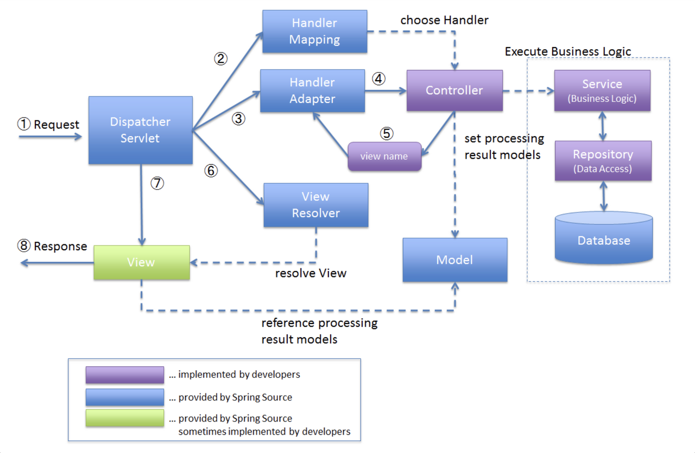

# DispatcherServlet
> HTTP 프로토콜로 들어오는 모든 요청을 `가장 먼저 받아` 적합한 컨트롤러에 위임해주는 프론트 컨트롤러

> - 클라이언트로부터 어떠한 요청이 오면 Tomcat과 같은 `서블릿 컨테이너`가 요청을 받게 된다.
> - 그리고 이 모든 요청을 `프론트 컨트롤러`인 `DispatcherServlet`이 가장 먼저 받게 된다.
> - 이후 DispatcherServlet은 공통적인 작업을 먼저 처리한 후에 해당 요청을 처리해야 하는 `컨트롤러를 찾아서 작업을 위임`한다.

## DispatcherServlet 동작과정

## web.xml파일은 DispatcherServlet으로 인해 나온 것이다..?
> - web.xml 파일은 DispatcherServlet 이전/이후와는 `상관이 없다`.
> - web.xml파일은 `Servlet 컨테이너 초기화` 작업,` DispatcherServlet 초기화` 작업, Spring 컨테이너를 구성하기 위해 필요한 `빈 정보`들이 들어 있는 xml 파일을 `로드`하는 작업(ContextLoaderListener)을 진행
> - DispatcherServlet이 등장하기 전에는 개발자가 모든 요청에 매핑되는 서블릿을 `HttpServlet을 상속`받아서 생성했다.
>   - web.xml파일에 기술해 놓는다.
> - web.xml 파일의 존재여부는 DispatcherServlet 이전/이후와 관련이 없다.
> - 하지만, DispatcherServlet이 모든 요청을 먼저 받아서 직접 적합한 컨트롤러로 위임해주기 때문에 위와 같은 작업이 필요 없어졌다.
>   - 어떤 요청이 어떤 컨트롤러와 매핑되는지 web.xml에 기술할 필요가 없어졌다.
>   - web.xml에 DispatcherServlet 자체만 설정하고, `Java Config`를 사용해서 Spring MVC 설정을 한다.
>   - SpringBoot로 설정 시 Gradle로 `implementation 'org.springframework.boot:spring-boot-starter-web'`만 잘 설정해주면 끝난다.

## DispatcherServlet의 장점
### 중앙 집중화된 요청 처리
> - 모든 HTTP 요청을 `중앙에서 처리`하여, 다양한 컨트롤러로 분배
>   - `요청 처리 흐름을 단순화`하고 일관된 방식으로 관리

### 유연한 설정
> - xml파일 혹은 `Java Config`를 통해 유연하게 설정할 수 있다.

### 인터셉터 지원
> - DispatcherServlet이 요청을 특정 컨트롤러로 전달하기 `전과 후`에 실행된다.
>   - preHandle, postHandle

---
## 여러 요청이 들어온다고 가정할 때, DispatcherServlet은 한번에 여러 요청을 모두 받을 수 있나요?
> - DispatcherServlet은 서블릿 컨테이너 내에서 동작하고, 서블릿 컨테이너(Tomcat)가 `멀티쓰레딩`을 지원하기 때문에 가능하다.
>   - `쓰레드 풀`을 이용하는 방식

## 수많은 @Controller를 DispatcherServlet은 어떻게 구분 할까요?
> - Handler Mapping
>   - `@RequestMapping`을 기반으로 요청을 처리한 컨트롤러 메서드를 찾는다.

### 초기화 과정
> - Spring 어플리케이션이 시작되면,
> 1. 컨텍스트 초기화
>    - @Controller가 붙은 클래스가 빈으로 등록
> 2. 핸들러 매핑 등록
>    - `RequestMappingHandlerMapping` 같은 핸들러 매핑 빈이 초기화된다.
>    - @RequestMapping이 붙은 메서드를 스캔하고 URL 패턴과 해당 메서드 사이의 매핑을 생성한다.
>      - 해당 URL로 요청이 오면 그 메서드가 호출이 될 수 있도록
> 3. 핸들러 어댑터 등록
>    - `RequestMappingHandlerAdapter` 같은 핸들러 어댑터 빈이 초기화된다.
>      - 실제 요청을 처리할 때 핸들러 메서드를 호출하는 역할
>      - @RequestMapping을 처리하는 핸들러 어댑터
>      - 
> 4. 요청 처리
>    - 클라이언트 요청이 들어오면, DispatcherServlet은 URL 패턴을 기반으로 적절한 핸들러 매핑을 찾고, 해당 메서드 실행