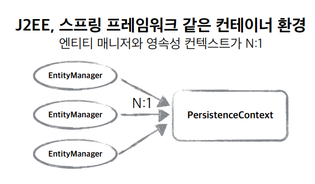
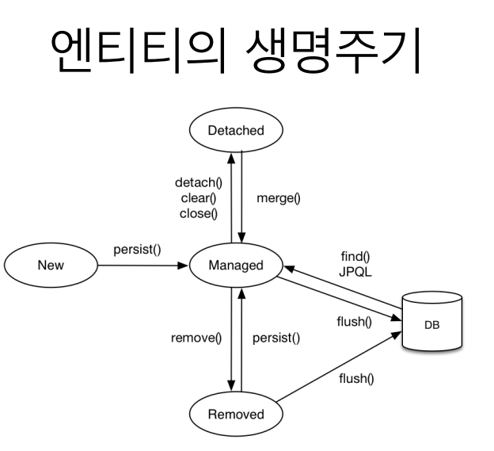
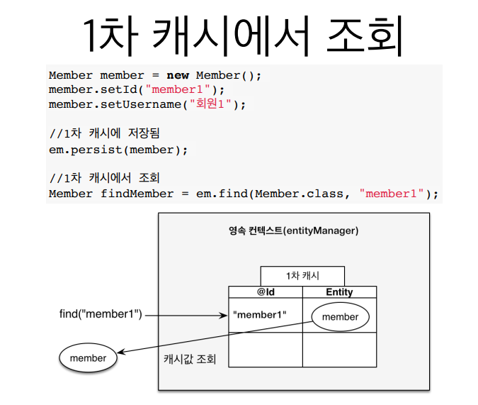
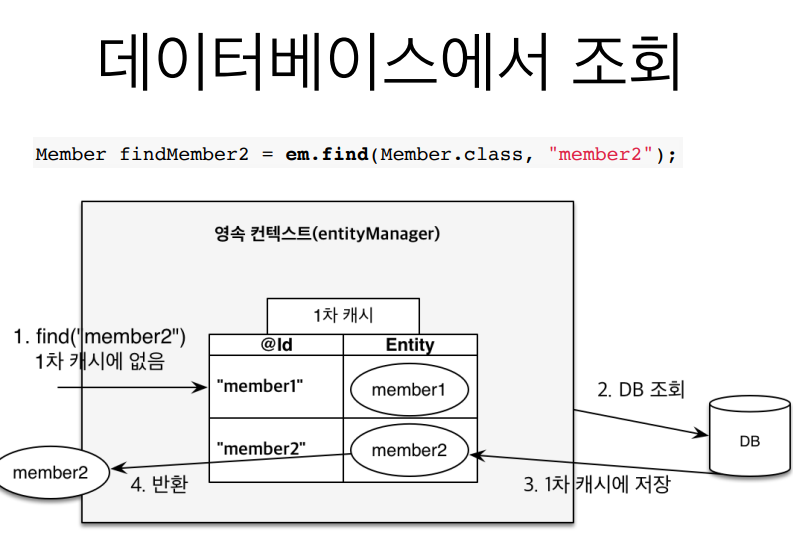
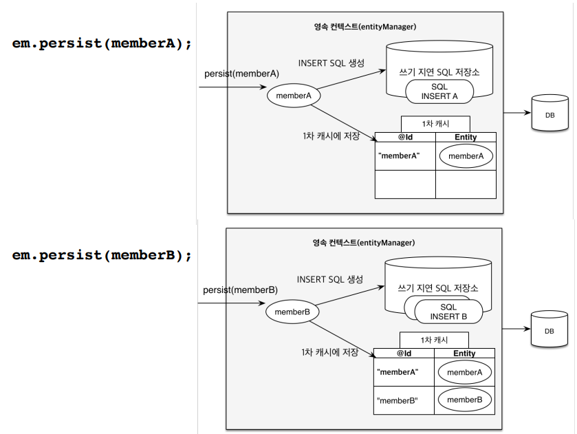
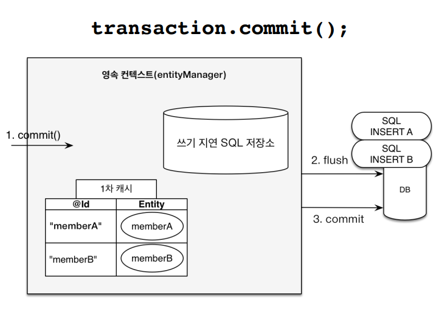
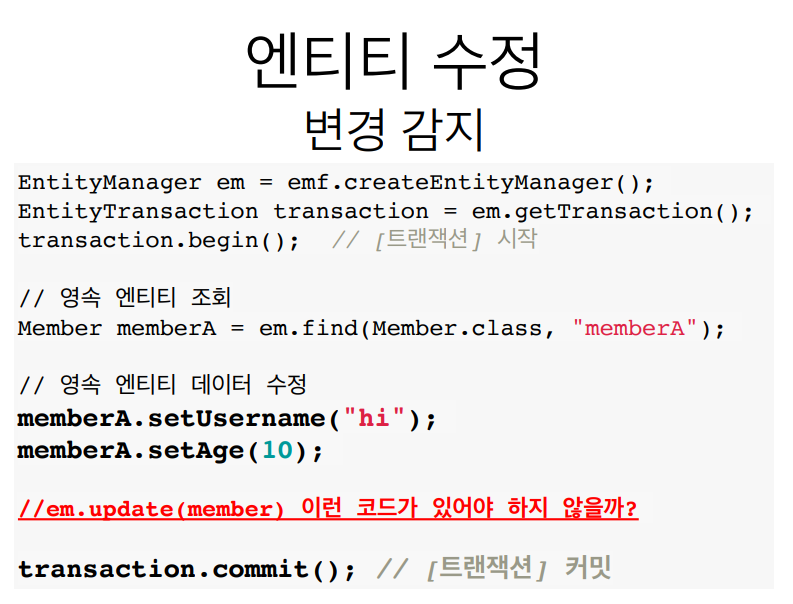
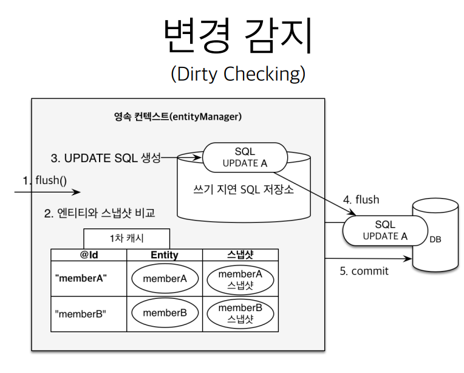
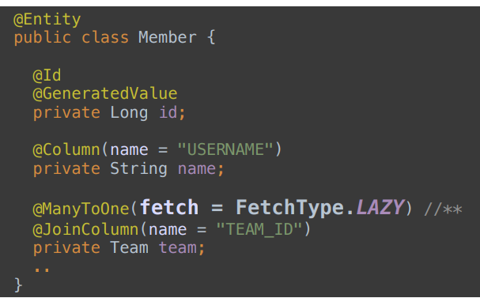

## JPA와 같은 ORM을 사용하는 이유가 무엇인가요?
### Persistence(영속성)
> - 데이터들이 프로그램이 종료되어도 사라지지 않고 어떤 곳에 저장되는 개념
> - 자바에서는 데이터의 영속성을 위한 JDBC를 지원해주는데, 매핑 작업을 개발자가 일일히 수행해야 하는 번거로움이 있다.
>   - Connection, Statement, Resultset

### Persistence Framework
> - 개발자가 직접 JDBC 프로그래밍을 하지 않도록 기능을 제공해주는 것
>   - SQL Mapper, ORM

#### SQL Mapper
> - SQL <-> Object 필드
> - SQL문으로 직접 DB를 조작
> - MyBatis, JDBCTemplate

#### ORM
> - Object-Relational Mapping
> - 객체와 관계형 데이터베이스의 데이터를 자동으로 매핑해주는 것
>   - 자바와 같은 객체지향 언어에서의 객체와 RDBMS의 데이터를 자동으로 매핑해주는 것
> - DB 데이터 <-> Object 필드
> - 객체를 통해 간접적으로 DB 데이터 조작
> - 객체와 DB의 데이터를 자동으로 매핑
>   - SQL 쿼리가 아니라 `메서드로 데이터를 조작`할 수 있다.
>   - 객체간의 관계를 바탕으로 SQL을 자동으로 생성한다.
> - JPA, Hibernate

### SQL Mapper와 ORM
> - ORM은 DB 테이블을 자바 객체로 매핑함으로써 객체간의 관계를 바탕으로 SQL을 `자동으로 생성`해준다.
    >   - RDB의 관계를 자바 객체에 반영하는 것이 목적
> - SQL Mapper는 개발자가 직접 SQL을 작성해야 한다.
    >   - 단순히 필드를 매핑시키는 것이 목적

### MyBatis의 특징
> - 장점
>   - SQL을 직접 작성하기 때문에, 복잡한 쿼리(최적화된 쿼리)를 작성하기에 용이하다.
>   - 엔티티에 종속을 받지 않기 때문에, 다양한 테이블을 조합할 수 있다.
> - 단점
>   - 스키마 변경 시 SQL 쿼리를 직접 수정해야 한다.
>   - 반복된 CRUD 쿼리가 발생해서 반복 작업이 있을 수 있다.
>   - 컴파일 타임이 아닌 런타임에 오류를 확인해야 한다.
>   - 자바라는 객체지향 언어에서 추상화와 상속, 다형성 등을 표현하는 반면 RDB에선 데이터 중심의 테이블 구조를 이루기 때문에, 패러다임이 불일치하다.
>     - 

### JPA의 특징
> - 장점
>   - 1차 캐시, 쓰기 지연, 변경 감지, 지연로딩을 제공하여 성능상 이점을 얻을 수 있다.
>   - 컴파일 타임에 오류를 확인할 수 있다.
>   - 데이터베이스에 종속적이지 않으므로, 특정 쿼리를 사용하지 않아 추상적으로 기술 구현이 가능하다.
>   - 엔티티로 관리가 되므로, 스키마 변경 시 엔티티만 수정하게 되면 스키마가 변경이 된다.
> - 단점
>   - 복잡한 쿼리를 작성하기 어렵다.
>     - JPQL, QueryDSL 등을 사용해서 동적 쿼리를 사용한다.
>     - 기업에서는 MyBatis와 연계해서 같이 사용하는 경우가 많다.
>   - N+1, FetchType, 연관관계, Persistence Context 등 모두 잘 활용하기 위해서 학습 곡선이 높아진다.
>     - 잘 활용하지 않으면 오히려 성능이 떨어지는 경우가 있다.

---

## 영속성은 어떤 기능을 하나요? 이게 진짜 성능 향상에 큰 도움이 되나요?
### 영속성 컨텍스트
> - 엔티티를 영구히 저장하는 환경
> - 엔티티매니저를 통해 영속성 컨텍스트에 접근
>   - EntityManager.persist(entity)
> - 

### 엔티티의 생명주기
> - 비영속(new/transient) : 영속성 컨텍스트와 관계가 없는 상태
> - 영속(managed) : 영속성 컨텍스트에 저장된 상태
> - 준영속(detached) : 영속성 컨텍스트에 저장되었다가 분리된 상태
> - 삭제(removed) : 삭제된 상태
> - 

### 영속성 컨텍스트의 이점
#### 1차 캐시



#### 쓰기 지연
```java
/** 1. 트랜잭션을 커밋할 때까지 INSERT SQL을 모음 */

transaction.begin(); // [트랜잭션] 시작

em.persist(memberA);

em.persist(memberB);

em.persist(memberC);

// -- 여기까지 INSERT SQL을 데이터베이스에 보내지 않는다.

// 커밋하는 순간 데이터베이스에 INSERT SQL을 모아서 보낸다. --

transaction.commit(); // [트랜잭션] 커밋
```



#### 변경 감지


- flush를 통해 변경내용을 데이터베이스에 반영

#### 지연 로딩
- 객체가 실제로 사용될 때 로딩하는 전략


> - memberDAO.find(memberId)에서는 Member 객체에 대한 SELECT 쿼리만 날린다.
> - Team team = member.getTeam()로 Team 객체를 가져온 후에 team.getName()처럼 실제로 team 객체를 건드릴 때!
> - 즉, 값이 실제로 필요한 시점에 JPA가 Team에 대한 SELECT 쿼리를 날린다.
> - Member와 Team 객체 각각 따로 조회하기 때문에 네트워크를 2번 타게 된다.
> - Member를 사용하는 경우에 대부분 Team도 같이 필요하다면 즉시 로딩을 사용한다.

#### 즉시 로딩

> - JOIN SQL로 한 번에 연관된 객체까지 미리 조회하는 전략
> - Join을 통해 항상 연관된 모든 객체를 같이 가져온다.

> - 가급적 지연 로딩만 사용
> - 즉시 로딩을 적용하면 예상치 못한 SQL이 발생
>   - JPQL에서 N+1 문제가 발생할 수 있다.

## N + 1 문제에 대해 설명해 주세요.
> - 연관 관계에서 발생하는 이슈로 연관 관계가 설정된 엔티티를 조회할 때 조회한 갯수보다 쿼리가 더 나오는 것
>   - 멤버 : 팀 = N : 1의 관계에서 멤버를 조회하고 조회한 테이블에서 Team을 꺼내면
>   - 그 순간 데이터베이스에 등록된 Team의 칼럼 수 만큼 쿼리가 나간다.
>   - 팀이 10000개가 있다면 1개를 조회하기 위해서 10000 + 1번의 쿼리가 나가는 것
> - N+1 문제는 1:N 혹은 N:1 관계에서 발생
> - 즉시 로딩의 특징으로 인해 발생
>   - 지연 로딩에서도 발생하기도 한다.
> - JPA가 JPQL을 분석해서 SQL을 생성할 때 글로벌 Fetch 전략을 참고하지 않고 오직 JPQL 자체만을 사용

### 해결 방법
> - Fetch Join, EntityGraph, Batch Size
#### Fetch Join
> - JPQL을 사용하여 DB에서 데이터를 가져올 때 처음부터 연관된 데이터까지 같이 가져오게 하는 방법
> - 별도의 메소드를 만들어줘야 하며 @Query 어노테이션을 사용해서 "join fetch 엔티티.연관관계_엔티티" 구문을 만들어 주면 된다.
```java
public interface TeamRepository extends JpaRepository<Team, Long> {
    @Query("select t from Team t join fetch t.users")
    List<Team> findAllFetchJoin();
}
```
> - join fetch 구문은 SQL문의 inner join 구문으로 변경되어 실행된다.

#### EntityGraph 어노테이션
> - @EntityGraph를 사용해서 fetch join을 하는 것인데 그냥 이런게 있구나~ 정도만 하고 넘어가자
> - 조금만 복잡해져도 헬게이트;

#### Batch Size
> - 일단 Default로 설정해두자
> - 이 경우는 정확히 N+1문제를 안 일어나게 하는 방법은 아니고 N+1문제가 발생하더라도
> - select * from user where team_id = ? 이 아닌 select * from user where team_id in (?, ?, ? ) 방식으로 N+1 문제가 발생하게 하는 방법이다.
> - 이렇게 하면 100번 일어날 N+1문제를 1번만 더 조회하는 방식으로 성능 최적화가 됨
```yaml
spring:
  jpa:
    properties:
      hibernate:
        default_batch_fetch_size: 1000
```