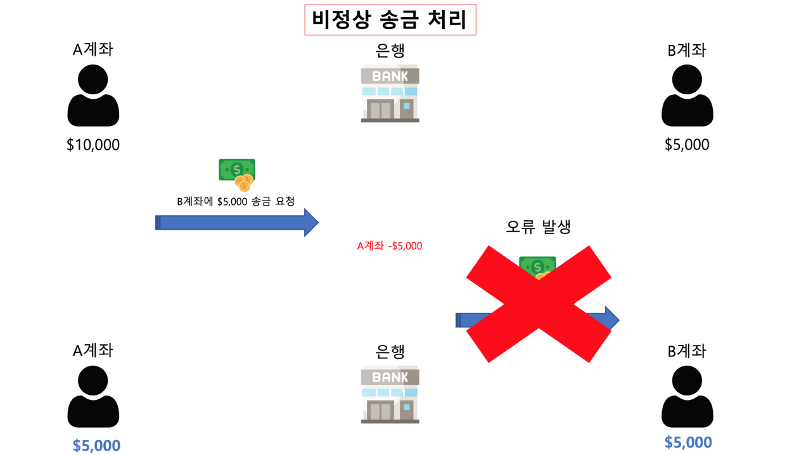
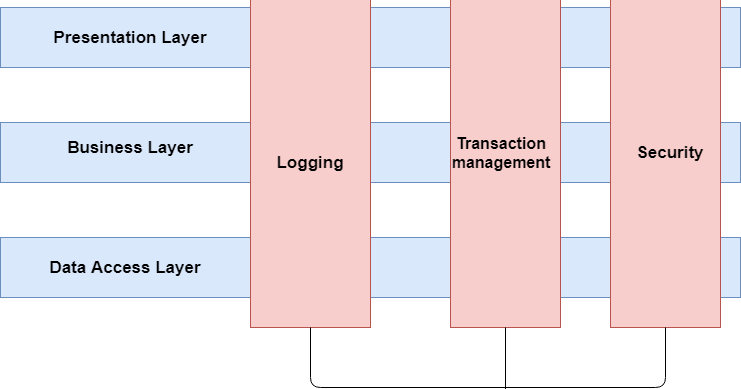

# Transactional 은 어떤 기능을 하나요?
## 트랜잭션이란?
> 데이터베이스 트랜잭션은 데이터베이스 관리 시스템(DBMS)에서 데이터베이스 `상태를 변화`시키는 하나 이상의 작업을 `모아 놓은 것`이다.
> </br>트랜잭션은 데이터베이스의 `무결성`을 보장하기 위해 사용된다
> </br>트랜잭션은 `ACID 특성`을 만족해야 한다.
> </br> DB의 상태를 변환시키는 하나의 `논리적인 작업 단위`를 구성하는 연산들의 집합

### 하나의 트랜잭션은  Commit되거나 Rollback 된다
- Commit
  - 트랜잭션의 모든 작업이 성공적으로 `완료되었음`을 의미
  - 트랜잭션의 모든 변경사항이 데이터베이스에 `반영`
- Rollback
  - 트랜잭션의 작업 중 하나라도 `실패`하면 트랜잭션의 모든 작업을 `취소`
  - 데이터베이스는 트랜잭션 이전의 상태로 `되돌림`

### 트랜잭션의 성질 ACID
- `Atomicity`(원자성)
  - 트랜잭션은 데이터베이스에 `모두 반영되거나 전혀 반영되지 않아야` 한다.


- `Consistency`(일관성)
  - 트랜잭션은 일관성 있는 상태로 변환한다.
  - 트랜잭션 완료 후에도 데이터베이스가 일관된 상태로 유지되어야 한다.
  - 데이터베이스의 `제약이나 규칙을 만족`해야 한다.
    - ex) 모든 고객은 반드시 이름을 가지고 있어야 한다.
  

- `Isolation`(독립성)
  - 트랜잭션은 다른 트랜잭션과 `격리`되어야 한다.
  - 트랜잭션은 다른 트랜잭션의 연산에 `영향을 받지 않아야` 한다.
  
    
- `Durability`(지속성)
  - 트랜잭션이 성공적으로 완료되었을 때, 결과는 `영구적으로 반영`되어야 한다.
  - 시스템 장애가 발생해도 데이터베이스에 반영된 결과는 보존되어야 한다.


## @Transactional
> 스프링에서 `트랜잭션 처리`를 지원하는데, @Transactional 어노테이션을 `클래스` 혹은 `메서드` 위에 추가할 수 있다.
> </br> 이를 `선언적 트랜잭션`이라고도 부른다.
> </br>적용된 범위 내에서 데이터베이스 트랜잭션이 시작되고, 메서드 실행이 완료될 때 `자동으로 커밋되거나 예외가 발생할 경우 롤백`된다.

### @Transactional 특징
> - 코드에서 트랜잭션 관리 코드를 분리하여 `비즈니스 로직에만 집중`할 수 있도록 해준다.

### @Transactional을 안쓴다면...
```java
@Service
public class AccountService {

  private final PlatformTransactionManager transactionManager;

  @Autowired
  public AccountService(PlatformTransactionManager transactionManager) {
    this.transactionManager = transactionManager;
  }

  public void transfer(Account from, Account to, int amount) {
    TransactionStatus status = transactionManager.getTransaction(new DefaultTransactionDefinition());

    try {
      from.debit(amount); // 출금 계좌에서 금액 차감
      to.credit(amount);  // 입금 계좌에 금액 추가

      transactionManager.commit(status); // 트랜잭션 커밋
    } catch (Exception e) {
      transactionManager.rollback(status); // 예외 발생 시 트랜잭션 롤백
      throw e; // 예외를 다시 던져 호출자가 처리할 수 있도록 함
    }
  }
}
```
```java
@Transactional
public class AccountService {
    public void transfer(Account from, Account to, int amount) {
        from.debit(amount);
        to.credit(amount);
    }
}
```
> - `클래스`에 적용되면 클래스 내의 모든 `public` 메서드에 트랜잭션을 적용한다.
>   - 그냥 private 메소드에 직접 @Transactional을 붙여도 트랜잭션이 적용되지 않는다.
> - 트랜잭션은 `Spring AOP`를 통해 구현이 되어있다.
>   - @Transactional이 선언되면 해당 클래스, 메소드에 트랜잭션이 적용된 `프록시 객체` 생성
>   - 프록시 객체는 트랜잭션을 시작하고, Commit or Rollback을 수행
>   - CheckedException or 예외가 없을 때는 Commit
>   - UnCheckedException(RuntimeException)이 발생하면 Rollback

### AOP(Aspect Oriented Programming)
> - [AOP](07-JAVA_SPRING/12_AOP/Readme.md)
> - 흩어진 Aspect를 모듈화하여 `횡단 관심사`를 분리하여 모듈화하는 프로그래밍 기법


### Spring AOP
> - Spring AOP는 기본적으로 `프록시 방식`으로 동작한다.
> - 어떤 객체를 사용하고자 할 때, 객체를 `직접적으로 참조하는 것이 아니라`, 해당 객체를 `대행하는 객체`를 통해 대상 객체에 접근하는 방식
>   - 직접 Aspect 클래스를 호출한다면, Target 클래스 안에 부가 기능을 호출하는 로직이 포함되기 때문에, `반복적`으로 Aspect를 호출해야 한다.
>   - 그래서 Spring은 Target클래스를 상속하는 `프록시 클래스`를 생성하고, proxy 객체에서 부가 기능에 관련한 처리를 한다.
> - 프록시는 오직 target 클래스 public 메서드에 대한 호출만 인터셉트 할 수 있다.
>   - private 메소드는 `프록시를 통해 접근할 수 없다`.

### @Transactional 우선순위
> 클래스 메소드(높음) -> 클래스 -> 인터페이스 메소드 -> 인터페이스

### @Transactional 속성
> - `propagation` : 트랜잭션 전파 방식
>   - 기존의 트랜잭션에 참여할 것인지, 새로운 트랜잭션을 시작할 것인지
>   - `REQUIRED`(default) : 기존 트랜잭션이 존재하면 그 트랜잭션을 사용하고, 없으면 새로운 트랜잭션을 생성
>   - `REQUIRES_NEW` : 무조건 새로운 트랜잭션을 생성, 기존 트랜잭션은 일시 중지
>   - `NESTED` : 기존 트랜잭션 내에서 중첩된 트랜잭션을 생성
>   - `SUPPORTS` : 트랜잭션이 필요하지 않지만, 트랜잭션이 존재하면 참여
>   - `NOT_SUPPORTED` : 트랜잭션을 사용하지 않음
>   - `NEVER` : 트랜잭션이 존재하면 예외 발생
>   - `MANDATORY` : 트랜잭션이 반드시 있어야 함. 없으면 예외 발생

> - `isolation` : 트랜잭션 격리 수준
>   - `DEFAULT` : 데이터베이스 기본 격리 수준 사용
>   - `READ_UNCOMMITTED` : 커밋되지 않은 데이터를 읽을 수 있음
>   - `READ_COMMITTED` : 커밋된 데이터만 읽을 수 있음
>   - `REPEATABLE_READ` : 반복 읽기 가능
>   - `SERIALIZABLE` : 가장 엄격한 격리 수준, 트랜잭션이 완전히 순차적으로 실행. (동시성 매우 저하)
> - [진성이의 블로그](https://velog.io/@wlstjdwkd/DB-%ED%8A%B8%EB%9E%9C%EC%9E%AD%EC%85%98%EC%9D%98-Isolation-Level)

> - `timeout` : 트랜잭션 타임아웃 시간

> - `rollbackFor` : 롤백할 Exception 클래스
>   - `@Transactional(rollbackFor={IOException.class, SQLException.class})`

> - `readOnly` : 읽기 전용 트랜잭션으로 설정
>   - 데이터 변경 작업이 없이 데이터를 읽기만 할 때 성능 최적화

---
## @Transactional(readonly=true) 는 어떤 기능인가요? 이게 도움이 되나요?
## 읽기에 트랜잭션을 걸 필요가 있나요? @Transactional을 안 붙이면 되는거 아닐까요?
> 1. 조회한 데이터를 return 한다고 해도 `의도치 않게 데이터가 변경`되는 일을 `사전에 방지`한다.
> 2. 데이터를 읽기만 하고 변경 작업을 수행하지 않을 것임을 `명시적`으로 나타내준다.
>   - 이건 조회용 메소드라고 정확히 명시함으로써, 가독성 증가
> 3. 캐싱 효율성
>   - ORM은 엔티티가 영속성 컨텍스트에 로드될 때, 해당 엔티티의 `초기 상태(스냅샷)`가 저장된다.
>     - 엔티티가 데이터베이스에 최종적으로 반영되기 전의 상태를 기록한 것
>     - 그래서 트랜잭션이 커밋될 시점에 `dirty checking`으로 엔티티의 `현재 상태와 스냅샷을 비교`하여 변경된 내용을 찾아낸다.
>   - 읽기 전용 트랜잭션에서는 `dirty checking을 수행하지 않아` 이로 인한 오버헤드가 사라진다.
> 4. 이중화 구성
>   - DB는 데이터가 날아가는 것을 방지하기 위해서 `이중화 구성(Master-Slave)`구조를 하는 경우가 있다.
>   - readOnly = true인 경우 master가 아닌 `slave`를 호출하게 되고, 마스터 서버의 부하를 줄일 수 있다.