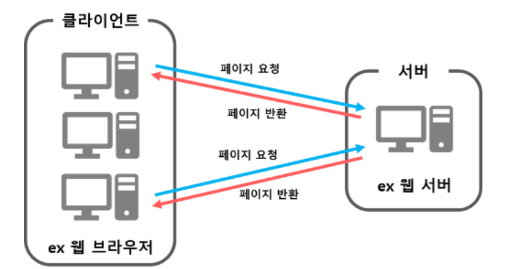
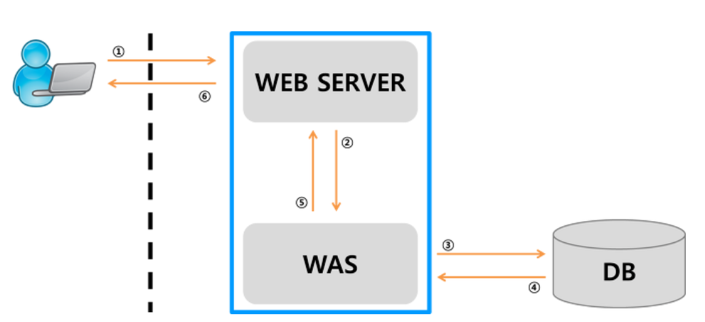
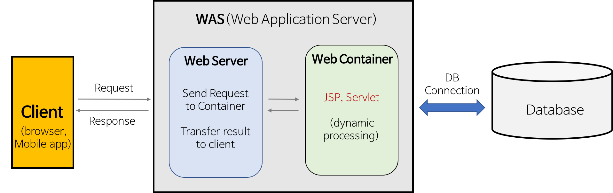
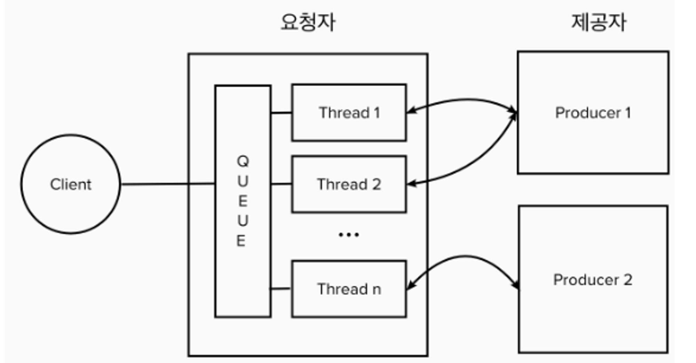
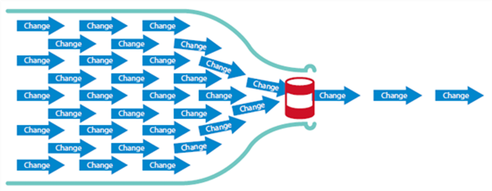
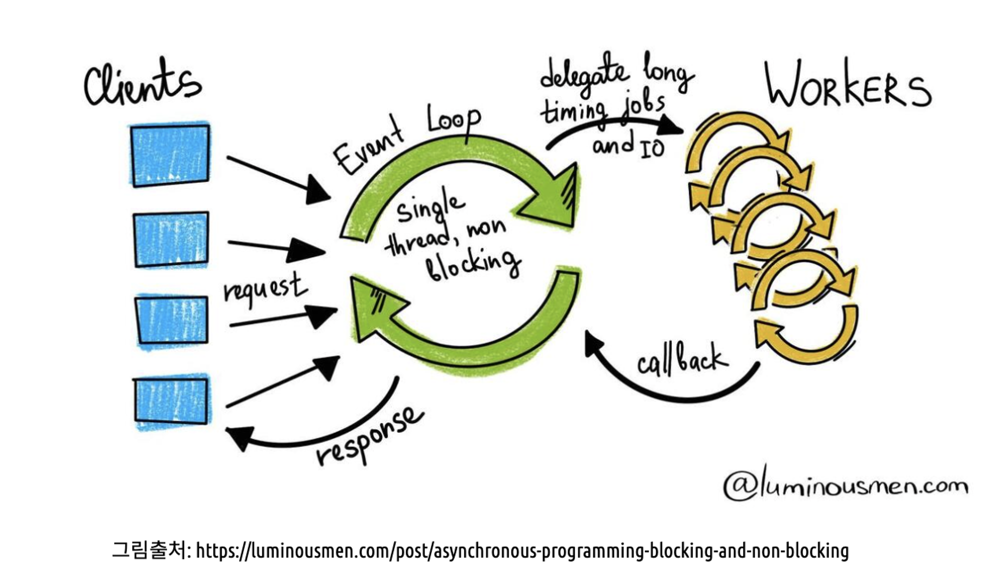

# Tomcat
- Apache Tomcat Server

## 웹 서버
> 컴퓨터에 웹사이트를 제공할 수 있게 서버로 만들어주는 서비스
> - 웹 서버가 운영하는 웹사이트를 방문한 클라이언트가 HTML, CSS, JSP 등의 파일을 볼 수 있도록 디렉토리를 개방
> - `정적`인 웹사이트 제공
>   - 단순 HTML 문서, CSS, javascript, 이미지 등
> - 웹 서버가 동적 컨텐츠를 요청 받으면 WAS에게 해당 요청을 넘겨주고, WAS에서 처리한 결과를 클라이언트에게 전달해주는 역할
> - 아파치, NginX, IIS 등
> 
> 

## WAS
> 웹 어플리케이션 서버
> - 웹 서버와 웹 컨테이너가 합쳐진 형태
> - 자바, JSP 등으로 만든 웹 또는 API 어플리케이션을 실행할 때 사용
> - 데이터베이스 처리 역할
> - 웹과 서버 사이의 어플리케이션
> - `동적`인 웹 사이트 제공
> - Tomcat
> 
> 

## WAS만 써도 되겠네?
> NO.
>  
> WAS는 DB 조회 및 다양한 로직을 처리하는 데 집중해야 한다.  
> 따라서, 단순한 정적 컨텐츠는 웹 서버에게 맡기며 기능을 분리시켜 서버 부하 방지해야함

## 왜 아파치와 톰캣이 자주 묶여서 언급?
> - 동적 사이트를 제공할 때 아파치와 톰캣이 같이 사용
> - Apache의 지원을 받는 공식 프로젝트

## Tomcat
> - 서블릿 API 지원
> - 블로킹, 동기 방식 사용
> - 요청당 하나의 쓰레드로 동작
> - 비동기 처리 기능이 지원되긴 하지만, 서블릿이 응답을 기다리는 동안 pool의 쓰레드들은 여전히 지연시킬 수 있음
> - Thread Pool은 요청자 어플리케이션 구동 시에 미리 쓰레드들을 할당해두고, Request가 오면 Queue에 쌓이고, 남는 Thread가 있다면, 해당 Thread에 할당되어 처리
>   - 한 개의 요청 -> 한 개의 쓰레드
> - 각 쓰레드에서는 Blocking 방식으로 처리되어, 응답이 올 때까지 그 Thread는 다른 요청에 할당될 수 없음
> - 가용한 Thread가 다 찬 경우, Request는 큐에서 계속 대기
>   - 대용량 서비스에는 적합하지 않음
> 
> 

---
## Netty
> - 비동기 이벤트 기반 네트워크 어플리케이션 프레임워크
> - 논블로킹, 비동기 방식 사용
> - WebFlux를 사용할때, WAS로 Netty를 사용
> - 하나의 쓰레드가 동시에 여러 개의 작업 수행
> - 각 요청은 event loop내에 job으로 등록이 되고, job을 workers하고 제공하고, 응답을 기다리지 않고 다른 job을 처리한다.
>   - callback을 통해, workers에게 응답 결과가 오면, 그 결과를 요청자에게 반환
> 
