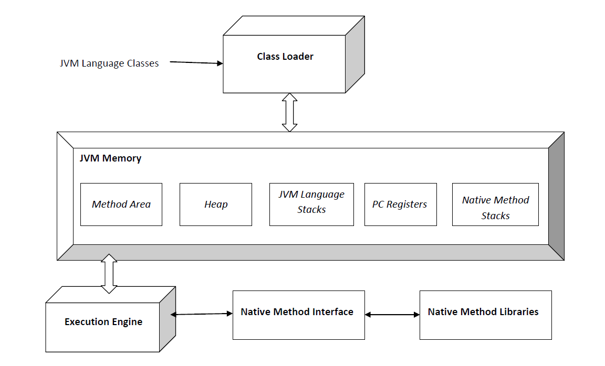

# 1. JVM이 정확히 무엇이고, 어떤 기능을 하는지 설명해 주세요.
## JVM이란?
JVM(Java Virtual Machine, 자바 가상 머신)은 Java Application을 실행하는 런타임 엔진 역할을 하는 컴포넌트로, JRE(Java Runtime Environment)의 일부입니다.
### [Java SE8 사양 문서의 설명](https://docs.oracle.com/javase/specs/jvms/se8/html/jvms-1.html#jvms-1.2)의 설명
>Java Platform의 주춧돌 역할을 하는 컴포넌트로 하드웨어 및 운영체제 독립성, 컴파일된 코드의 작은 크기, 악의적인 프로그램으로부터의 사용자 보호를 담당합니다.  
>JVM은 실제 컴퓨터처럼 추상적인 연산 기계입니다. 따라서 명령어 셋을 가지고 있고, 런타임에 다양한 메모리 영역을 조작합니다.  
>이러한 형태는 가상 머신을 쓰는 프로그래밍 언어를 구현하는데 있어 일반적인 형태로, JVM 이외에도 `P-Code(UCSD Pascal)`, `Squeak(Smalltalk)` 등이 있습니다.  
>JVM의 첫 프로토타입은 썬-마이크로시스템에서 구현되었으며, PDA와 유사한 장비상에 호스팅되는 소프트웨어 안의 JVM 명령어 셋을 에뮬레이트 했습니다.  
>Oracle의 현재 구현은 JVM을 모바일, 데스크톱 및 서버장치상에서 에뮬레이트 하지만, JVM은 특정 구현 기술, 종속 하드웨어, 종속 운영체제를 가정하지 않습니다. 이는 선천적으로 해석(interpret)되지 않지만, JVM의 명령어 셋을 실리콘 CPU의 명령어 셋으로 컴파일링하므로써 구현할 수 있습니다.  
>유효한 클래스 파일로 표현될 수 있는 기능성(functionality)을 갖춘 모든 언어는 JVM에 의해 호스팅 될 수 있습니다.
## JVM의 구조 [#](https://www.geeksforgeeks.org/jvm-works-jvm-architecture/)

JVM의 구조는 위 그림과 같습니다.  
크게 **`클래스 로더`**, **`메모리 영역`**, **`실행 엔진`** 등으로 구성되어 있습니다.
### 클래스 로더(Class Loader)
클래스 로더는 클래스 파일을 로드하는데 사용되는 JVM의 하위 시스템입니다. `로딩(Loading)`, `링킹(Linking)`, `초기화(Initialization)` 세 가지 동작을 담당합니다.  
#### 로딩(Loading)
클래스 로더가 `.class` 파일을 읽고, 대응되는 binary data를 생성해 JVM 메모리내의 `메서드 영역`에 저장합니다.  
불러온 class와 해당 class의 바로 위 부모 클래스의 정규화된 이름, `.class` 파일이 클래스/인터페이스/Enum 중 어느것과 관련 있는지, 접근 제어자, 변수 및 메서드 정보 등 을 저장합니다.  
`.class` 파일을 불러온 뒤, JVM은 Heap 메모리에 해당 파일을 표현하기 위해 `Class(java.lang)` 타입의 객체를 생성합니다.  
- 개발자는 해당 클래스를 통해 *클래스의 이름, 부모 클래스의 이름, 변수 및 메서드 정보 등*을 얻을 수 있습니다.
#### 링킹(Linking)
`검증(Verification)`, `준비(Preparation)`, `해결(Resolution)` 작업을 수행합니다.
- `검증(Verification)`: `ByteCodeVerifier`에 의해 `.class` 파일이 올바른 컴파일러에 의해 적절하게 포맷되고 생성되었는지 확인합니다.  
만약 실패한다면 `java.lang.VerifyError` 라는 런타임 예외가 발생하게 됩니다. 
- `준비(Preparation)`: 클래스 정적 변수(class static variable)에 대한 메모리를 할당하고, 메모리를 기본값으로 초기화합니다.
- `해결(Resolution)`: 객체를 이름으로 참조(`Symbolic References`)하는 것을 직접 주소 값을 참조하도록 대체합니다.  
이 과정에서 이름으로 참조된 객체를 찾기 위해 JVM 메모리 내 `메서드 영역`을 검색합니다.
#### 클래스 로더의 종류
클래스 로더는 3가지 종류가 있고, 각 클래스 로더들은 JVM의 `위임-계층 원칙(Delegation-Hierarchy Principle)`을 따릅니다.  
따라서, (클래스 로딩 요청) -> 시스템 -> 확장 -> 부트스트랩 순으로 클래스 로딩 요청을 위임하게 됩니다.  
부트스트랩 경로에서 클래스가 발견되지 않으면 확장 클래스 로더에게 요청을 전송하고, 확장 클래스 로더도 찾지 못하면 시스템 클래스 로더에게 전송됩니다. 시스템 클래스 로더도 발견하지 못하면 런타임 에러(`java.lang.ClassNotFoundException`) 가 발생합니다.
- `부트스트랩 클래스 로더(Bootstrap class loader)`: `%JAVA_HOME%/jre/lib`에 존재하는 코어 Java API 클래스들을 불러옵니다. C/C++과 같은 네이티브 언어로 구현됩니다.
- `확장 클래스 로더(Extension class loader)`: `부트스트랩 클래스 로더`의 자식으로, `%JAVA_HOME%/jre/lib/ext` 또는 `java.ext.dirs`  속성에 의해 정의된 디렉토리에 존재하는 클래스들을 불러옵니다. Java의 `sun.misc.Launcher$ExtClassLoader` 클래스로 구현됩니다.
- `시스템 클래스 로더(System/Application class loader)`: `확장 클래스 로더`의 자식으로, 애플리케이션 `classpath`(*내부적으로 `java.class.path`에 매핑된 환경 변수 사용*)에 존재하는 클래스들을 불러옵니다. Java의 `sun.misc.Launcher$AppClassLoader`클래스로 구현됩니다.
#### 초기화(Initialization)
부모 클래스에서 자식 클래스로, 클래스 내에서는 위에서 아래로 진행하며 모든 정적 변수(static variable)들을 코드 및 정적 블럭에 정의된 값으로 할당합니다.
### JVM 메모리 영역(JVM Memory, Runtime Data Area)
`메서드 영역(Method Area)`, `힙 영역(Heap Area)`, `스택 영역(Stack Area)`, `PC 레지스터(PC Registers)`, `네이티브 메서드 스택(Native Method Stacks)`으로 구성되어 있습니다.
#### 공유 자원
- `메서드 영역(Method Area)`: *클래스 이름, 직속 부모 클래스 이름, 메서드 및 변수(정적 변수 포함)*와 같은 모든 **`클래스 레벨 정보`**들이 저장됩니다. JVM 당 하나만 존재하며, 공유됩니다.
- `힙 영역(Heap Area)`: 모든 `동적으로 생성된 객체(즉, 인스턴스)의 정보`가 저장되어 있습니다. JVM 당 하나만 존재하며, 공유됩니다.
#### 개별 자원
- `스택 영역(Stack Area)`: JVM이 각 스레드마다 사용할 런타임 스택을 생성하는 공간입니다. 런타임 스택의 모든 블록은 `활성화 레코드(Activation Record)` 또는 `스택 프레임(Stack Frame)`이라고 부르는 **`메서드 호출`**을 저장하는 블록입니다.  
프레임에는 해당 **`메서드에서 사용되는 모든 로컬 변수`**가 저장됩니다. 런타임 스택을 사용하던 스레드가 종료되면 JVM에 의해 스택이 파괴됩니다.
- `PC 레지스터(PC Registers)`: 각 스레드 별로 존재하며, **`스레드의 현재 실행 명령의 주소`**를 저장합니다.
- `네이티브 메서드 스택(Native Method Stacks)`: 각 스레드 별로 존재하며, **`네이티브 메서드 정보`**를 저장합니다.
### 실행 엔진(Execution Engine)
바이트 코드로 변환된 `.class` 파일을 한 줄씩 읽고 메모리 영역에 존재하는 데이터와 정보를 이용해 명령어를 실행합니다.  
`인터프리터(Interpreter)`, `JIT 컴파일러(Just-In-Time Compiler)`, `가비지 컬렉터(Garbage Collector)` 로 구성되어 있습니다.
- `인터프리터(Interpreter)`: 바이트 코드를 한 줄씩 해석하고 실행합니다. 인터프리터이기 때문에 한 메서드가 여러 번 호출될 떄 마다 매번 코드를 다시 해석합니다.
- `JIT 컴파일러(Just-In-Time Compiler)`: 인터프리터의 효율을 높이기 위해, 반복되는 메서드 호출에 대해 런타임에 바이트 코드를 컴파일해 네이티브 코드로 바꾼 뒤 직접 네이티브 코드를 제공합니다.  
따라서 한 메서드를 여러 번 해석하지 않아 효율성이 향상됩니다.  
JVM이 내부적으로 함수가 호출될 때 마다 호출 횟수를 카운트하다가, 임계점 이상 호출되는 경우 JIT 컴파일러를 통한 컴파일이 진행됩니다. [참고](https://www.ibm.com/docs/en/sdk-java-technology/8?topic=reference-jit-compiler)
- `가비지 컬렉터(Garbage Collector)`: 더 이상 참조되지 않는 객체들을 파괴합니다.
### 자바 네이티브 인터페이스(Java Native Interface, JNI)
네이티브 메서드 라이브러라와 상호작용하고, 실행에 필요한 네이티브 라이브러리(C/C++)를 제공하는 인터페이스 입니다.  
JVM이 C/C++ 라이브러리를 호출하거나, 특정 하드웨어에서는 C/C++ 라이브러리에 의해 호출될 수 있도록 해줍니다.
### 네이티브 메서드 라이브러리(Native Method Libraries)
실행 엔진에 필요한 네이티브 라이브러리(C/C++)의 집합입니다.
## JVM의 기능
바이트 코드를 포함하고 있는 .class 형태의 파일를 읽고, 검증한 뒤 실행합니다. 또한 해당 코드가 동작할 수 있는 런타임 환경을 제공합니다.

## 그럼, 자바 말고 다른 언어는 JVM 위에 올릴 수 없나요?
자바 이외에도 `Scala`, `Kotlin`, `Groovy`, `Clojure` 등 다른 언어들을 실행할 수 있습니다.  
JVM에 의해 호스팅 될 수 있는 유효한 class 파일일로 표현할 수 있는 기능(Functionality)를 가진 언어라면 JVM 상에서 실행될 수 있습니다.  
또한 이들은 호환 가능한데, Scala의 라이브러리를 Java 프로그램에서 사용할 수 있는것이 그 예 입니다. [#위키피디아 문서의 설명](https://en.wikipedia.org/wiki/Java_virtual_machine#JVM_languages) [#Scala에서 Java 라이브러리 사용하기](https://pinnsg.com/using-java-libraries-scala/)

## 반대로 JVM 계열 언어를 일반적으로 컴파일해서 사용할 순 없나요?
가능은 합니다. Java의 경우 GNU Project에서 만든 [GCC(GNU Compiler Collection)](https://en.wikipedia.org/wiki/GNU_Compiler_Collection)의 Java 컴파일러를 이용하면 네이티브 기계어로 컴파일해 사용할 수 있습니다.  
하지만 가비지 콜렉터와 같은 런타임 지원을 받을 수 없기 때문에 정확하게 동작하지 않을 수 있습니다. [#](https://www.quora.com/Can-a-Java-program-run-without-JVM)
## VM을 사용함으로써 얻을 수 있는 장점과 단점에 대해 설명해 주세요.
### 장점
#### 하드웨어 및 운영체제 독립성
C/C++과 같은 언어로 작성된 프로그램은 
1. CPU마다 기계어가 다르고, 
2. 운영체제마다 API와 실행파일 형식이 다르기 때문에  

프로그램이 개발된 환경과 다른 환경에서 실행하려하면 실행되지 않습니다.  
반면 Java의 경우 JVM을 이용해 동일한 자바 실행 환경을 제공하므로 WORA(Write Once Run Anywhere), 즉 한 번 프로그램을 작성하기만 하면 어느 환경에서든 실행 할 수 있습니다.
- 다만 JVM 자체는 플랫폼에 종속적이므로 각 플랫폼마다 작성됩니다.
#### 자동 메모리 관리
JVM 내부의 가비지 컬렉터가 계속해서 참조되지 않는 객체를 인식하고 파괴해 메모리 공간을 확보해줍니다.   따라서 개발자는 메모리 할당/할당 해제를 위해 별다른 작업을 수행하지 않아도 되고, 실수로 메모리 누수가 일어나거나 `댕글링 포인터`, `더블 프리`와 같은 메모리 관련 오류를 줄일 수 있습니다.
- `댕글링 포인터(Dangling Pointer)`: 포인터가 참조중인 객체가 포인터의 수정 없이 삭제, 또는 할당 해제되어 포인터가 계속 할당해제된 메모리를 가리키는 메모리 보안 위반 현상입니다.
- [`더블 프리(Double Free)`](https://learn.microsoft.com/en-us/cpp/sanitizers/error-double-free?view=msvc-170): 동일한 heap 메모리 공간에 대해 free(메모리 해제)를 두 번 시도해 발생하는 취약점입니다.  
같은 인수로 free 함수를 두 번 호출할 경우, 메모리 관련 데이터 구조가 손상되어 프로그램이 중단되거나, 이후 두 번의 `malloc()` 명령에 대해 똑같은 포인터를 반환 할 수 있습니다. 이는 프로그램을 버퍼 오버 플로 공격에 취약하게 만듭니다. [참고](https://cwe.mitre.org/data/definitions/415.html)
#### 코드 가독성 및 유지보수성 향상
개발자가 로우-레벨 메모리 세부 사항에 대해 신경 쓸 필요가 없기 때문에 코드 가독성과 유지보수성이 향상됩니다.
### 단점
#### 성능
Java의 *하드웨어 및 운영체제 독립성에 의해*, 바이트 코드를 특정 하드웨어나 시스템에 맞게 최적화시킬 수 없습니다.  
또한 클래스에서 바이트 코드로, 바이트 코드에서 기계 코드로 **두 번 변환하는 과정**을 거쳐야 하기 때문에 C/C++과 같은 언어에 비해 느릴 수 밖에 없습니다.  
또한 계속해서 객체 생성/삭제를 추적하고, 사용하지 않는 메모리를 회수하기 위해 **가비지 컬렉터를 주기적으로 수행**해 **오버헤드가 발생**합니다.  
또한 GC 과정에서 자바 애플리케이션의 스레드가 멈출 수 있어 해당 어플리케이션의 응답 및 대기 시간에 영향을 미칠 수 있습니다.
#### JVM 자체
Java 프로그램이 JVM 자체에 의존하기 때문에, 희박한 확률이지만 JVM 자체가 오작동을 일으켜 에러가 발생할 수도 있습니다.
#### 메모리 관리
JVM에서 메모리 할당 밎 관리를 수행하기 때문에, 수동으로 메모리 할당/할당 해제를 할 수 없습니다.

## JVM과 내부에서 실행되고 있는 프로그램은 부모 프로세스 - 자식 프로세스 관계를 갖고 있다고 봐도 무방한가요?
JVM과 그 위에 실행되는 프로그램은 부모 - 자식 관계를 갖는다고 보기 힘듭니다. JVM에서 관리하는 스레드를 통해 동작한다고 봐야 합니다.  
JVM은 Java Application 코드를 실행하기 위해 *`main()` 메서드를 실행하는 스레드를 포함해* 하나 이상의 스레드를 관리합니다.   
또한 자식 프로세스가 부모로 부터 완전히 독립적인 '부모 - 자식 프로세스' 관계와 달리, Java Application은 JVM과 긴밀하고 JVM으로부터 메모리 할당, GC 등의 지원을 받습니다.
따라서 프로세스 - 스레드 관계에 있다고 봐야합니다.

자바는 링크 과정 없이 컴파일러가 바로 바이트 코드 생성
바이트 코드는 JVM에서만 실행 가능
자바는 필요한 클래스들을 프로그램 실행 중에 동적으로 로딩
동적 로딩은 JVM에 포함된 클래스 로더에 의해 이루어짐
ClassLoader  클래스를 이용하여 개발자가 직접 클래스 로딩가능

# 참고 문서
- [The Java Virtual Machine by Bill Venners](https://www.artima.com/insidejvm/ed2/jvm.html)
- [How JVM Works – JVM Architecture? - GeeksForGeeks](https://www.geeksforgeeks.org/jvm-works-jvm-architecture/)
- [Java virtual machine - Wikipedia](https://en.wikipedia.org/wiki/Java_virtual_machine)
- [The Java® Virtual Machine Specification Java SE 8 Edition](https://docs.oracle.com/javase/specs/jvms/se8/html/)