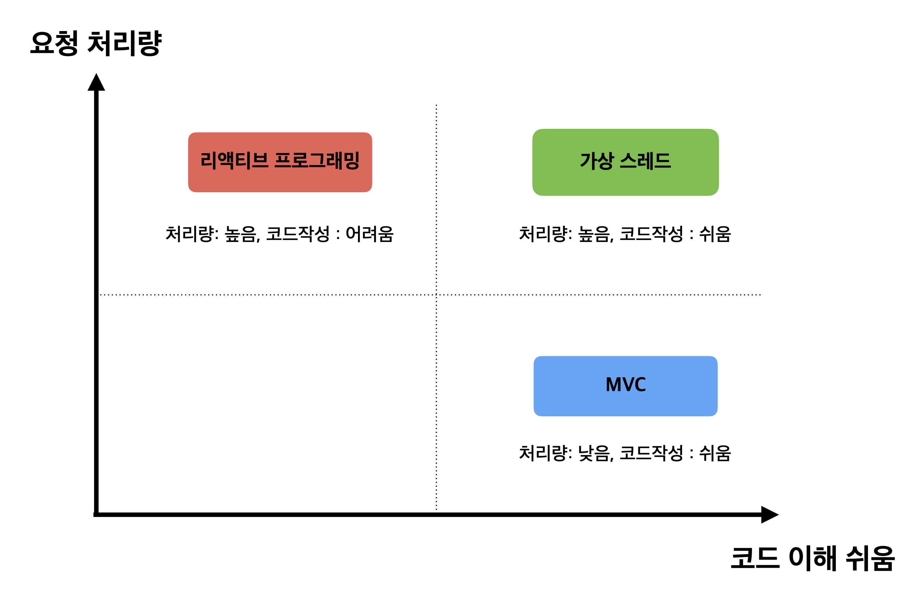

# Virtual Thread

> - 기존 Java의 쓰레드 모델은 Native Thread로, Java의 유저 쓰레드를 만들면 Java Native Interface(JNI)를 통해 커널 영역을 호출하여 OS가 커널 쓰레드를 생성하고 매핑(1:1)하여 작업을 수행하는 형태
> 1. 자바의 쓰레드는 `OS의 쓰레드`를 기반으로 한다.
>    - 자바의 전통적인 쓰레드는 OS 쓰레드를 wrapping한 것으로 이를 `플랫폼 쓰레`드라고 정의한다.
>    - 따라서 Java 어플리케이션에서 쓰레드를 사용하는 코드는 실제적으로 `OS 쓰레드`를 이용하는 방식으로 동작했다.
>    - OS 커널에서 사용할 수 있는 쓰레드는 갯수가 `제한적`이고 생성과 유지 비용이 비싸다.
>    - 이 때문에, 기존의 어플리케이션들은 비싼 자원인 플랫폼 쓰레드를 효율적으로 사용하기 위해서 쓰레드 풀을 만들어서 사용해왔다.
> 2. `처리량`의 한계
>    - SpringBoot와 같은 어플리케이션의 기본적인 사용자 요청 처리 방식은 `Thread Per Request`이다. 하나의 요청당 하나의 쓰레드를 사용한다.
>    - 어플리케이션에서 처리량을 늘리려면 쓰레드를 늘려야하지만, 쓰레드를 무한정 늘릴 수는 없다.(OS 쓰레드를 무한정 늘릴 수 없으니까)
>    - 따라서 어플리케이션의 처리량은 쓰레드 풀에서 감당할 수 있는 범위를 넘어서 늘어날 수 없다.
> 3. Blocking으로 인한 리소스 낭비
>    - Thread per Request 모델에서는 요청을 처리하는 쓰레드에서 IO 작업을 처리할 때 `Blocking`이 일어난다.
>    - 쓰레드는 IO 작업이 마칠 때까지 다른 요청을 처리하지 못하고 기다려야 한다.
>    - 이 때문에, Blocking이 아니라 `Non-Blocking` 방식의 Reactive Programming이 발전하였다.
> 4. Reactive Programming의 단점
>    - 처리량을 높이기 위한 방법으로 비동기 방식의 Reactive 프로그래밍이 발전해왔다.
>    - 한정된 자원인 플랫폼 쓰레드가 Blocking 되면서 대기하는 데 소요된 쓰레드 자원을 Non-Blocking 방식으로 변경하면서 다른 요청을 처리하는 데 사용할 수 있게 되었다.
>      - Webflux
>    - 이런 Reactive 코드는 작성하고 이해하는 비용이 높다.
>      - `Mono`, `Flux`
>    - 또한 기존의 자바 프로그래밍의 패러다임은 쓰레드를 기반으로 하기 때문에 라이브러리를 모두 Reactive 방식에 맞게 작성해야 한다.

> 이러한 구조는 프로세스에 비해 쓰레드의 크기 작아서 생성 비용이 적고, 컨텍스트 스위칭 비용이 적어서 주목받아 왔다.

> 하지만, 요청량이 급격하게 증가하는 서버 환경에서는 `더 많은 쓰레드 수`를 요구하게 되었다.
>   사실상, 쓰레드의 사이즈가 프로세스에 비해 작다고 해도 4GB 메모리면 4000개 쓰레드까지 한계가 있는 상황이었다.
>   이렇게 되면 컨텍스트 스위칭 비용도 기하급수적으로 늘어난다.

> - 더 많은 요청 처리량과 컨텍스트 스위칭 비용을 줄여서 나타난게 경량 쓰레드 모델 `Virtual Thread`
> - Virtual Thread는 유저 레벨에서 관리되기 때문에 커널 쓰레드를 직접 관리하지 않아 커널 수준의 컨텍스트 스위칭 비용이 발생하지 않는다.
> - Virtual Thread는 경량 쓰레드로 설계되어 메모리 사용량과 컨텍스트 스위칭에 필요한 자원이 훨씬 적다.
> - 비동기 프로그래밍으로 이루어져 있어서, 쓰레드가 블로킹 되지 않고 계속 다른 작업을 처리하기 때문에 개별 쓰레드당 처리할 수 있는 작업의 수가 증가한다.

> - 기존 JAVA의 쓰레드 모델과 달리, `플렛폼 쓰레드`와 `가상 쓰레드`로 나뉜다.
> - 플랫폼 쓰레드 위에서 여러 `Virtual Thread`가 번갈아 가며 실행되는 형태
> - 가상 쓰레드는 Blocking이 발생하면 내부적으로 `스케줄링`을 사용하여 플랫폼 쓰레드가 그냥 대기하게 두지 않고 다른 가상 쓰레드가 작업할 수 있게 한다.
> - 따라서 Reactive Programming의 Non-Blocking과 동일하게 플랫폼 쓰레드의 리소스를 낭비하지 않는다.
> - 또한, 가상 쓰레드는 기존 쓰레드 구조를 그대로 사용하기 때문에 Reactive Programming 처럼 `자바 구조를 바꿀 필요도 없다`.

> Virtual Thread의 가장 큰 특징은 컨텍스트 스위칭 비용이 `저렴`하다.

> Thread는 기본적으로 최대 2MB의 스택 메모리 사이즈를 가진다.
>   하지만, Virtual Thread는 JVM에 의해 생성되기 때문에 `시스템 콜`과 같은 커널 영역의 호출이 적고,
>   메모리 크기가 일반 쓰레드의 1%에 불과하다.

## Virtual Thread의 구조

> - Platform Thread의 기본 스케줄러는 `ForkJoinPool`을 사용
> - 스케줄러는 platform thread pool을 관리하고, Virtual Thread의 작업 분배 역할