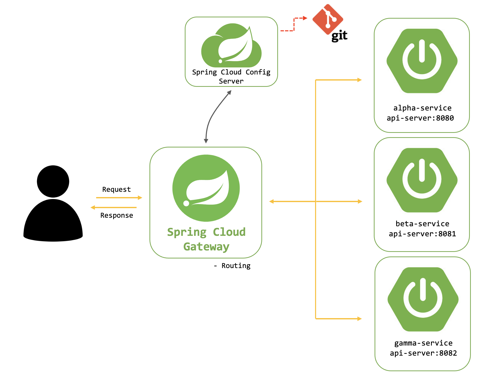

# Spring Cloud Gateway

> [게이트웨이 구현 코드](https://github.com/orm712/VirtualVest/tree/gateway/deploy/infra-services/gateway)

> - MSA에서 API Gateway 역할을 수행하는 중요한 컴포넌트
> - 클라이언트와 백엔드 서비스 간의 트래픽을 관리하고, 인증, 라우팅, 필터링, 로드 밸런싱 등 다양한 기능 제공
> - Netflix Zuul의 대안으로 개발되었으며, Spring 생태계와 통합성이 높음

## API Gateway?
> - 여러 마이크로서비스에 대한 단일 진입점 제공
> - 클라이언트는 API Gateway를 통해 모든 백엔드 서비스에 접근하며, API Gateway는 클라이언트 요청을 적절한 서비스로 라우팅
>   - 클라이언트는 여러 서비스에 대한 복잡성을 신경 쓰지 않고 단일 엔트포인트(게이트웨이)를 통해서 통신만 하면 된다.

## Spring Cloud Gateway의 특징
### 비동기 API
> Spring WebFlux를 기반으로 비동기, 논블로킹 방식으로 동작해 높은 성능과 확장성 제공

### 라우팅 및 필터링
> 사용자 정의 라우팅 규칙과 필터 체인을 통해 요청 처리

### 부하 분산 및 장애 복구
> 요청을 여러 인스턴스로 분해하고(로드 밸런싱), 장애가 발생할 경우 복구를 처리

### 보안
> 인증 및 인가를 위한 다양한 방법을 제공하며, JWT, OAuth2와 같은 보안 프로토콜과 통합 가능

## 라우터
> - 클라이언트 요청을 처리할 경로를 정의
> - application.yml파일에서 지정

> - id : 라우트의 식별자
> - uri : 요청이 전달될 백엔드 서비스의 주소
>   - http://[마이크로서버가 Eureka에 등록한 이름]
> - predicates : 요청을 라우팅할 때 조건(Path 설정 : /api/v1/auth/** 로 클라이언트에서 오는 경로는 여기로 보내겠다)
> - filters : 요청/응답을 수정하는 필터
```yaml
server:
  port: 8100

eureka:
  client:
    service-url:
      defaultZone: http://[ip]:[포트번호]/eureka/

spring:
  application:
    name: apigateway-service
  cloud:
    gateway:
      routes:
        - id: auth-service
          uri : lb://AUTH-SERVICE
          predicates:
            - Path=/api/v1/auth/**
          filters:
            - StripPrefix=0
        - id: payment-service
          uri: lb://PAYMENT-SERVICE
          predicates:
            - Path=/api/v1/payment/**
          filters:
            - StripPrefix=0
    config:
      name: gateway
      profile: deploy
  config:
    import: "optional:configserver:http://[ip]:[포트번호]/"

  main:
    allow-bean-definition-overriding: true

encrypt:
  key: ${ENCRYPT_KEY}
```

## 로드 밸런싱
> - Spring Cloud Gateway는 Spring Cloud LoadBalancer와 통합되어 있다.
> - uri에 `lb://` 접두사를 사용하여 로드 밸런싱을 쉽게 설정할 수 있다.
> - 기본적으로 라운드 로빈 알고리즘 사용
>   - 각 요청을 순서대로 인스턴스들에 분배하는 방식
### 각 인스턴스의 CPU 사용량을 모니터링하고, 이를 바탕으로 로드밸런싱 하기
> - 각 인스턴스의 CPU 사용량을 확인할 수 있는 도구를 이용해야 한다.
>   - 프로메테우스(메트릭 서버), Spring Boot Actuator

### Spring Boot Actuator를 이용해서 모니터링하기
> 1. Spring Gateway와 각 마이크로 서버에 Spring Boot Actuator 의존성 추가
```xml
<dependency>
    <groupId>org.springframework.boot</groupId>
    <artifactId>spring-boot-starter-actuator</artifactId>
</dependency>
```

> 2. 각 마이크로서버에 Actuator 설정
> - application.yaml파일에 하면 된다.
```yaml
management:
  # spring boot actuator를 사용할 경우
  endpoints:
    web:
      exposure:
        include: "metrics"
  # 프로메테우스 설정
  metrics:
    export:
      prometheus:
        enabled: true
```

> 3. Actuator 엔드포인트 확인
> - Actuator가 정상적으로 동작하는지 `/actuator` 엔드포인트에 접근
```shell
curl http://localhost:[마이크로 서버 포트번호]/actuator/metrics/system.cpu.usage
```
> - 다음과 같은 응답 반환
```json
{
  "name": "system.cpu.usage",
  "measurements": [
    {
      "statistic": "VALUE",
      "value": 0.42
    }
  ],
  "availableTags": []
}
```
> 42%의 CPU 사용량 의미

> 4. 커스텀 로드 밸런서 구현
> - 먼저 각 서비스 인스턴스의 CPU 사용량을 조회하는 서비스 구현
> - RestTemplate을 사용하여 Actuator 메트릭 엔드포인트에 접근하고, CPU 사용량 반환
```java
@Service
public class CpuUsageService {

    private final RestTemplate restTemplate = new RestTemplate();

    public double getCpuUsage(ServiceInstance instance) {
        String url = instance.getUri().toString() + "/actuator/metrics/system.cpu.usage";
        try {
            ResponseEntity<Map<String, Object>> response = restTemplate.getForEntity(url, Map.class);
            Map<String, Object> body = response.getBody();
            List<Map<String, Object>> measurements = (List<Map<String, Object>>) body.get("measurements");
            return (double) measurements.get(0).get("value");
        } catch (Exception e) {
            // 예외 발생 시 기본값 (100% 사용 중)을 반환하여 해당 인스턴스를 우선적으로 사용하지 않도록 설정
            return 1.0;
        }
    }
}
```

> - CPU 기반 로드 밸런싱 구현
> - `ServiceInstanceListSupplier` 상속하여 CPU 사용량에 따른 커스텀 로드 밸런서 만들기
```java
@Bean
ServiceInstanceListSupplier serviceInstanceListSupplier(ConfigurableApplicationContext context, CpuUsageService cpuUsageService) {
    return new CpuBasedServiceInstanceListSupplier(context, cpuUsageService);
}

public class CpuBasedServiceInstanceListSupplier extends DelegatingServiceInstanceListSupplier {

    private final CpuUsageService cpuUsageService;

    public CpuBasedServiceInstanceListSupplier(ServiceInstanceListSupplier delegate, CpuUsageService cpuUsageService) {
        super(delegate);
        this.cpuUsageService = cpuUsageService;
    }

    @Override
    public Flux<List<ServiceInstance>> get() {
        return super.get().map(instances -> instances.stream()
                .sorted(Comparator.comparing(cpuUsageService::getCpuUsage)) // CPU 사용량에 따라 정렬
                .collect(Collectors.toList()));
    }
}
```

> 5. 캐싱 및 성능 최적화
> - 구현은 완료되었지만, 실시간으로 CPU 사용량을 매번 조회하면 성능에 영향을 미칠 것이다.
>   - 캐싱을 적용해서 일정 시간 동안 동일한 데이터를 사용할 수 있도록 하자
>   - @Cacheable 적용
>   - 디폴트가 5분
>   - 캐싱 정책은 @Cacheable의 cacheManager를 통해서 조정 가능
```java
@Service
public class CpuUsageService {

    private final RestTemplate restTemplate = new RestTemplate();

    @Cacheable("cpuUsage")
    public double getCpuUsage(ServiceInstance instance) {
        String url = instance.getUri().toString() + "/actuator/metrics/system.cpu.usage";
        try {
            ResponseEntity<Map<String, Object>> response = restTemplate.getForEntity(url, Map.class);
            Map<String, Object> body = response.getBody();
            List<Map<String, Object>> measurements = (List<Map<String, Object>>) body.get("measurements");
            return (double) measurements.get(0).get("value");
        } catch (Exception e) {
            return 1.0;
        }
    }
}
```

## Spring Cloud Eureka
> - Netflix에서 개발한 서비스 디스커버리 서버
> - 마이크로서비스들이 자신을 등록하고 다른 서비스들을 찾을 수 있도록 돕는 역할(전화등록부)
> - 클라우드 환경에서는 서버의 스케일 업과 스케일 다운이 자주 발생하여 꺼졌다 켜졌다 하면 IP주소가 `동적`으로 변한다.
> - IP주소가 유동적으로 바뀌기 때문에 이에 대한 위치를 파악하고 있는 Eureka 서버 필요
> - [MSA](..%2F..%2F05-ETC%2F18_MSA%2FReadme.md) 참고