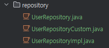

## 정적 쿼리(Static Query)
> - 미리 정의된 SQL 문장이나 JPQL 쿼리
>   - JPQL만으로는 동적 쿼리가 어렵기 때문에, QueryDSL이나 Criteria API를 적용해야 한다.
> - 쿼리의 구조가 고정
>   - 실행될 때마다 동일한 SQL문
> - 파라미터가 고정되어 있어 SQL Injection 공격에 비교적 안전

```sql
SELECT * FROM users WHERE user_id = 1;
```

## 동적 쿼리(Dynamic Query)
> - 실행 시점에 조건에 따라 쿼리문이 동적으로 생성되거나 변형되는 방식
> - 쿼리의 조건, 필드 등이 유동적으로 변경될 수 있다.

### MyBatis에서의 동적 쿼리
> - 주로 XML Mapper 파일을 사용하여 동적 쿼리 작성
> - `if`, `choose`, `when`, `otherwise`, `where`, `set` 등의 태그를 통해 SQL문 동적 구성

```xml
<select id="findUsers" parameterType="map" resultType="User">
  SELECT * FROM users
  <where>
    <if test="name != null">
      AND name = #{name}
    </if>
    <if test="age != null">
      AND age &gt; #{age}
    </if>
  </where>
</select>
```

```xml
<update id="updateUser" parameterType="User">
    UPDATE users
    <set>
        <if test="name != null">
            name = #{name},
        </if>
        <if test="age != null">
            age = #{age},
        </if>
        <!-- 추가적인 필드들에 대한 동적 SET 구문 -->
    </set>
    WHERE user_id = #{userId}
</update>
```
> - `choose` : 여러 조건 중에서 하나의 조건만 만족하게 하고 싶을 때
> - `when` : 각각의 조건을 정의하며, 조건이 참일 경우 해당 SQL 실행
> - `otherwise` : 모든 `when`조건이 거짓일 때 실행되는 기본 구문
> - 자바의 if, else if, else
```xml
<select id="findUserByType" parameterType="string" resultType="User">
  SELECT * FROM users
  <where>
    <choose>
        <!--admin이면 이거 실행 -->
      <when test="userType == 'admin'">
        AND role = 'ADMIN'
      </when>
      <when test="userType == 'user'">
        AND role = 'USER'
      </when>
      <otherwise>
        AND role = 'GUEST'
      </otherwise>
    </choose>
  </where>
</select>
```

## JPA에서의 동적 쿼리
> - 기본적으로 정적 쿼리 방식인 JPQL을 사용하지만, 동적 쿼리를 작성하기 위해 Criteria API나 QueryDSL을 사용한다.
> - 사람들은 기본적으로 QueryDSL을 선호한다.
>   - 가독성, 편의성, 유연성
>   - Criteria API는 조건이 많아지면 복잡도가 급격히 증가하며 확장히 어렵다.

### QueryDSL 적용하기
> - 프로젝트에 적용하기 위해 준비 작업이 필요하다.
> - [demo](demo)

#### 1. QueryDSL 라이브러리 추가
```groovy
dependencies {
	// queryDSL
	implementation 'com.querydsl:querydsl-jpa:5.0.0:jakarta'
	annotationProcessor "com.querydsl:querydsl-apt:5.0.0:jakarta"
	annotationProcessor "jakarta.annotation:jakarta.annotation-api"
	annotationProcessor "jakarta.persistence:jakarta.persistence-api"

}


sourceSets {
	main.java.srcDir 'src/main/generated' // Q 클래스 경로 설정
}
```

#### 2. JPAConfig 추가
> - JPAQueryFactory 빈 등록
>   - JPAQueryFactory는 쿼리를 생성하고 실행하는 핵심 객체지만, `EntityManager`라는 또 다른 의존성을 필요로 한다.
>   - 이 의존성을 관리하는 객체가 Spring Context가 되게 하기 위해
```java
@Configuration
@EnableJpaAuditing
public class JPAConfig {
    @PersistenceContext
    private EntityManager entityManager;

    @Bean
    public JPAQueryFactory jpaQueryFactory() {
        return new JPAQueryFactory(entityManager);
    }
}
```

### 3. Repository 구조

> - UserRepository : 기본 JpaRepository
>   - Spring Data JPA에서 제공하는 Repository
> - UserRepositoryCustom : 기본 JPA Repository에서 처리하기 어려운 복잡한 쿼리나 동적 쿼리를 처리하는 곳
>   - QueryDSL의 인터페이스 부분
> - UserRepositoryImpl : UserRepositoryCustom에서 정의한 메서드를 실제로 구현하는 클래스
>   - 동적 쿼리 작성

### BooleanBuilder
> - QueryDSL에서 동적 쿼리를 만들기 위한 도구
> - `여러 개의 조건`을 유연하게 추가, 삭제 가능
> - 각 조건을 결합하여 하나의 쿼리로 만들기 가능
> - `AND`, `OR` 연산자로 연결할 때 매우 유용
```java
BooleanBuilder builder = new BooleanBuilder();

// 조건 추가
if (name != null) {
    builder.and(user.name.eq(name));
}
if (age != null) {
    builder.and(user.age.gt(age));
}

return queryFactory.selectFrom(user)
                   .where(builder)  // BooleanBuilder가 전달됨
                   .fetch();
```

### BooleanExpression
> - QueryDSL에서 `단일 논리 조건`을 나타내는 표현식
```java
// 단일 조건 생성
BooleanExpression nameExpression = user.name.eq(name);
BooleanExpression ageExpression = user.age.gt(age);

return queryFactory.selectFrom(user)
                   .where(nameExpression.and(ageExpression))  // BooleanExpression 사용
                   .fetch();
```
> - 동적 쿼리를 좀 더 유연하게 만들기 위해선 BooleanBuilder가 더 적합

### Q클래스
> - QueryDSL에서 생성되는 메타데이터 클래스
>   - 해당 엔티티를 기반으로 쿼리를 생성하고 처리
> - 타입 안전한 동적 쿼리 작성을 가능하게 함
>   - SQL 쿼리를 안전하고 간결하게 작성할 수 있고, 오류를 줄이고 유지보수성을 늘릴 수 있음
> - Q클래스를 사용하면 쿼리를 작성할 때 컴파일 시점에 필드 타입과 이름을 체크할 수 있다.
>   - JPQL에서는 컴파일이 아닌 런타임에 오류를 잡아야한다.
> - Q클래스는 IDE에서 자동 완성 기능 제공
>   - 필드 이름 정확 선택 가능