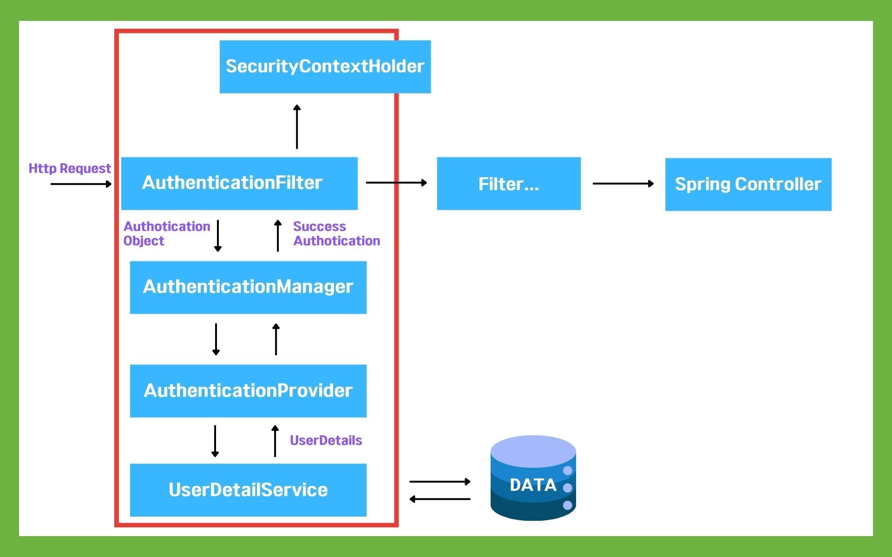

# Spring Security
> - Spring 기반 어플리케이션에서 인증 및 인가를 관리하기 위한 프레임워크
> - 개발 시 먼저 작업하는 부분이 로그인, 로그아웃, 세션 관리 등등이다.
>   - 개발자들이 보안 관련 기능을 `효율적이고 신속하게` 구현할 수 있도록 도와준다.

## Spring Security를 사용하는 이유?
### 표준화된 보안 관리
> - 인증과 인가에 대해 표준화된 방법을 제공하여, 개발자가 보안을 쉽게 구현
> - 개발자가 보안을 직접 구현할 때 발생할 수 있는 오류나 보안 취약점 줄이기 가능

### 다양한 인증 방식 지원
> - HTTP 기본 인증, OAuth2, JWT 등 다양한 인증 방법 쉽게 통합 가능
> - 기본의 보안 규칙 외에도 커스터마이징 쉽게 가능

### 권한 관리
> - 세밀한 권한 관리 제공
> - 사용자마다 다른 권한 부여 가능
> - 특정 URL, 메서드에 대해 접근 권한 세부적으로 설정 가능

### 필터 기반 아키텍처
> - 필터 체인을 통해 보안 기능 구현
>   - 요청의 흐름에 따라 인증 및 인가 필터링, 보안 관련 로직 쉽게 확장

### 지속적인 업데이트
> - 오랜시간 지속적인 업데이트와 보안 패치 진행

## Spring Security 아키텍처

> - 붉은색 부분이 Spring 프레임워크에서 Spring Security가 적용되는 부분
> 1. 사용자 요청이 서버로 들어온다. 
> 2. 필터 체인이 요청을 가로채고, 여러 개의 필터를 거치게 한다.
> 3. 로그인 부분에선 UsernamePasswordAuthenticationFilter에서 사용자가 제출한 아이디와 비밀번호를 추출한다.
>    - 추출된 정보는 UsernamePasswordAuthenticationToken 객체로 감싸진다. 아직 `인증되지 않은 상태`
>    - 이 밖에도, BasicAuthenticationFilter, CsrfFilter, SecurityContextPersistenceFilter 등 다양한 필터가 존재한다.
> 4. 추출한 인증 정보는 AuthenticationManager에 전달한다.
> 5. AuthenticationManager는 등록된 AuthenticationProvider를 조회하여 인증 요구
> 6. AuthenticationProvider는 UserDetailsService를 사용해 데이터베이스나 다른 저장소에서 실제 데이터를 조회하여 UserDetails 결과를 돌려준다.
>   - 그럼 AuthenticationProvider는 사용자가 입력한 비밀번호를 UserDetails 객체에 저장된 비밀번호와 비교하여 인증 처리
>   - 성공하면 새로운 Authentication 객체 생성
>     - Authentication 객체는 UserDetails 객체를 내부에 포함하고 있다.
> 7. Authentication 객체는 SecurityContextHolder에 저장되어 저장된 유저정보를 Spring Controller가 사용할 수 있게 된다.

## 왜 AuthenticationManager랑 AuthenticationFilter 분리?
> - 확장성과 유연성을 높이기 위해
>   - Spring Security는 다양한 인증 방법을 지원할 수 있도록 설계되었다.

### AuthenticationManager
> - 인증 요청을 여러 AuthenticationProvider 중 하나에 전달하는 `조정자` 역할
> - AuthenticationProvider 목록을 가지고 있으며, 인증 요청이 들어오면 적절한 AuthenticationProvider에게 요청을 전달한다.
> - 인증 로직 자체를 구현하지 않고, 실제 인증 로직을 AuthenticationProvider에 위임한다.

### AuthenticationProvider
> - 실제 인증 로직을 구현하는 인터페이스, 주어진 인증 요청을 처리하고 결과 반환
> - 인증 방법에 따라 다양한 구현체 제공, OAuth2, JWT, ...
> - 하나의 AuthenticationManager는 여러 개의 AuthenticationProvider를 가질 수 있으며, 각 AuthenticationProvider는 다른 인증 방식을 처리한다.

## UserDetails
> - 사용자 정보를 담는 객체
> - Spring Security는 인증을 처리할 때 사용자의 세부 정보를 이 객체를 통해 관리한다.
> - 사용자의 아이디, 비밀번호, 권한 등의 정보 포함
```java
public interface UserDetails {
    String getUsername();                       // 사용자 이름(아이디) 반환
    String getPassword();                       // 사용자 비밀번호 반환
    Collection<? extends GrantedAuthority> getAuthorities(); // 권한 목록 반환
    boolean isAccountNonExpired();              // 계정이 만료되지 않았는지 여부
    boolean isAccountNonLocked();               // 계정이 잠기지 않았는지 여부
    boolean isCredentialsNonExpired();          // 자격 증명(비밀번호)이 만료되지 않았는지 여부
    boolean isEnabled();                        // 계정이 활성화되어 있는지 여부
}
```
> - Authentication 객체는 인증 상태를 나타낸다.
>   - 실제로 인증되었는지 확인

## SecurityContextHolder
> - 인증 정보를 관리하는 컨텍스트
> - Spring Security에서 현재 인증된 사용자 정보를 저장하고 접근하는 데 사용하는 컨텍스트
> - 인증이 완료된 후에도 어플리케이션의 여러 곳에서 참조될 수 있다.
>   - ThreadLocal 저장소이기 때문