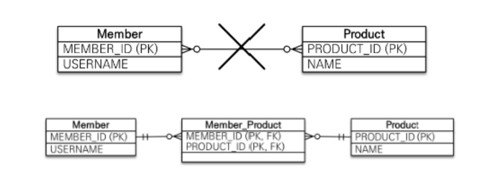
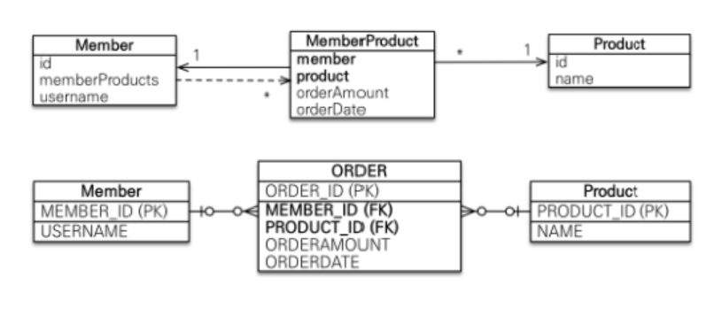

# JPA 연관관계
> - 데이터베이스에서는 테이블 간의 관계를 외래 키로 설정하지만, JPA에서는 객체 간의 참조로 설정
> - 크게 1:1, 1:N, N:N으로 나누어진다.

## 단방향, 양방향
> - 데이터베이스 테이블은 양방향 연관관계만 존재하는 것이 아니라 단방향도 존재한다.
>   - 예를 들어, 부모만 자식을 참조할 수 있고, 자식은 부모를 참조할 필요가 없는 경우
>   - 단방향, 양방향을 구분할 필요가 있다.

## 세부 어노테이션들
### @Entity
> - 해당 클래스가 JPA 엔티티임을 나타냄.
> - 이 클래스는 데이터베이스 테이블에 매핑된다.

### @Id
> - 이 필드를 기본 키로 설정하겠다.(Primary Key)

### @GeneratedValue
> - 기본 키 자동 생성 전략을 정의한다.
> - @Id와 함께 사용
> - strategy
>   - 기본 키를 어떻게 생성할지에 대한 전략 지정
>   - GenerationType.IDENTITY
>     - 데이터베이스의 AUTO_INCREMENT에 의존하여 기본 키 자동 생성
>       - 지원하지 않는다면 사용 불가능
>   - GenerationType.SEQUENCE
>     - 데이터베이스의 시퀀스 객체를 사용하여 기본 키 생성
>     - Oracle, PostgreSQL
>   - GenerationType.TABLE
>     - 별도의 테이블을 사용하여 기본 키 값 관리
>     - 시퀀스나 AUTO_INCREMENT를 지원하지 않는다면 사용
>   - GenerationType.AUTO
>     - JPA 구현체가 데이터베이스에 맞는 전략을 자동으로 선택
>     - default값
>     - 설정된 DBMS에 따라 적합한 전략 선택

### @Column
> - 엔티티 클래스의 필드를 데이터베이스 테이블의 컬럼에 매핑할 때 사용되는 어노테이션
> - 필드의 세부적인 매핑 정보 지정
> - 필수는 아닌데, 컬럼의 속성을 세밀하게 제어하고 싶을 때 활용
> - name
>   - 필드와 매핑될 데이터베이스 컬럼의 이름을 지정
>   - 필드랑 데이터베이스 이름을 다르게 지정 가능
> - nullable
>   - 해당 컬럼이 NULL 값을 가질 수 있는지 여부 지정
>   - default값은 true
>   - false로 설정하면 NOT NULL
> - unique
>   - 해당 컬럼이 유일한 값을 가져야 하는지
>   - 기본값 false
>   - 유니크키 설정하는 것
> - length
>   - 문자열 컬럼의 최대 길이 지정
>   - 기본값 255
> - columnDefinition
>   - 컬럼의 데이터베이스 타입 직접 지정
>   - ex) @Column(columnDefinition = "TEXT")
> - insertable, updatable
>   - 해당 컬럼이 INSERT나 UPDATE시 쿼리에 포함될 지 설정
>   - 기본값 true
>   - false로 설정하면 해당 컬럼은 insert나 update 쿼리가 무시된다.

## @OneToOne, @OneToMany, @ManyToMany
> - 테이블이 몇대몇 관계를 맺고 있다는 것
> - mappedBy
>   - @OneToOne(mappedBy = "profile")
>   - 연관관계의 주인을 설정
>   - mappedBy를 통해 연관관계의 주인이 아니라는 것을 나타낸다.
>     - 외래키를 관리하지 않으며, `단순히 관계를 참조`하는 것을 의미
>   - 외래키를 가지고 있는 테이블이 연관관계의 주인(@JoinColumn을 가진 엔티티)
> - cascade
>   - 부모 엔티티와 자식 엔티티 간의 연관관계에서 부모 엔티티가 수행하는 작업(저장, 삭제 등)이 자식 엔티티에도 적용될 수 있도록 설정
>   - 즉, 부모 엔티티를 저장하거나 삭제할 때, 연관된 자식 엔티티에도 동일한 작업이 자동으로 수행
>   - CascadeType.PERSIST : 부모 엔티티를 영속화할 때, 연관된 자식 엔티티도 함께 영속화
>   - CascadeType.REMOVE : 부모 엔티티를 삭제할 때, 자식 엔티티도 함께 삭제
>   - CascadeType.MERGE : 부모 엔티티를 병합할 때, 연관된 자식 엔티티도 함께 병합
>   - CascadeType.DETACH : 부모 엔티티를 영속성 컨텍스트에서 분리할 때, 연관된 자식 엔티티도 함께 분리
>   - CascadeType.ALL : 위의 모든 작업이 모두 자식 엔티티에도 적용
> - fetch
>   - 연관된 엔티티를 언제 로딩할지 결정
>     - default 값은 즉시 로딩(EAGER)
>     - FetchType.EAGER : 연관된 엔티티 즉시 로딩
>     - FetchType.LAZY : 연관된 엔티티 지연 로딩
>       - 연관 데이터들이 실제로 사용할 때 조회 쿼리 발생
> - optional
>   - 연관된 엔티티가 null이 될 수 있는지 여부 결정
>   - default는 true이며, false로 설정하면 외래키가 반드시 존재해야 한다.
>   - optional = true : 연관된 데이터가 null이 될 수 있다. -> 데이터베이스에서 외래 키가 없을 수도 있다.
>   - optional = false : 외래키가 NOT NULL 제약 조건을 가진다.
> - orphanRemoval
>   - 고아 객체 제거를 설정하는 옵션
>   - 부모 엔티티와 연관된 자식 엔티티가 더 이상 부모와 연관되지 않으면, 자식 엔티티 자동 삭제
>   - 부모 엔티티에서 자식 엔티티를 제거하면, 자식은 데이터베이스에서도 삭제
>   - orphanRemoval = true : 부모와 연관이 끊어진 자식 엔티티는 데이터베이스에서도 삭제
>   - orphanRemoval = false : 연관 끊어져도 자식 엔티티는 삭제되지 않는다.

## @JoinColumn
> - @JoinColumn(name = "profile_id")
> - 특정 테이블에 profile_id라는 외래 키 컬럼을 추가하고, 그 테이블을 참조할 수 있도록 한다.
> - 이 어노테이션을 통해 외래 키가 설정되고, 두 테이블 간의 관계가 맺어지는 것

## 1 : 1 관계
> - 두 엔티티가 1:1로 연관될 때 사용
> - @OneToOne을 통해서 구현

### 단방향 1:1 관계
```java
@Entity
public class User {

    @Id @GeneratedValue(strategy = GenerationType.IDENTITY)
    private Long id;

    @OneToOne
    @JoinColumn(name = "profile_id")
    private Profile profile;
}

@Entity
public class Profile {

    @Id @GeneratedValue(strategy = GenerationType.IDENTITY)
    private Long id;

    private String bio;
}

```

### 양방향 1:1 관계
```java
@Entity
public class User {
    
    @Id @GeneratedValue(strategy = GenerationType.IDENTITY)
    private Long id;

    @OneToOne
    @JoinColumn(name = "profile_id")
    private Profile profile;
}

@Entity
public class Profile {

    @Id @GeneratedValue(strategy = GenerationType.IDENTITY)
    private Long id;

    private String bio;

    @OneToOne(mappedBy = "profile")
    private User user;
}

```

## 1:N 관계
### 단방향 1:N 관계
> - JPA에서 단방향 1:N관계는 잘 사용되지 않는다.
>   - 단방향 1:N은 외래 키가 자식 테이블에 저장되기 때문에, 단방향은 부모가 자식 테이블에 대한 관리권을 갖게 되어 쿼리가 복잡해질 수 있다.
```java
@Entity
public class Parent {
    
    @Id @GeneratedValue(strategy = GenerationType.IDENTITY)
    private Long id;

    @OneToMany
    @JoinColumn(name = "parent_id") // 자식 테이블에 생성될 외래 키
    private List<Child> children = new ArrayList<>();
}

@Entity
public class Child {

    @Id @GeneratedValue(strategy = GenerationType.IDENTITY)
    private Long id;

    private String name;
}

```

### 양방향 1:N 관계
```java
@Entity
public class Parent {

    @Id @GeneratedValue(strategy = GenerationType.IDENTITY)
    private Long id;

    @OneToMany(mappedBy = "parent")
    private List<Child> children = new ArrayList<>();
}

@Entity
public class Child {

    @Id @GeneratedValue(strategy = GenerationType.IDENTITY)
    private Long id;

    private String name;

    @ManyToOne
    @JoinColumn(name = "parent_id")
    private Parent parent;
}

```

## N:N 관계
> - @ManyToMany가 존재하지만, 많이 사용하지 않는다.
> - 다대다의 경우 그대로 사용하지 못하고 반드시 정규화를 통해 중간 테이블을 만들어 줘야 한다.
> - 
>   - 반드시 중간 테이블을 두어 일대다+다대일 형태로 변형해줘야 한다.
> - @ManyToMany를 통해 연관관계를 매핑할 경우 하이버네이트가 중간 테이블을 알아서 만들어서 처리해준다.

### 왜 @ManyToMany를 사용하지 않는가?
> - 중간테이블을 만들고 PK, FK 쌍을 알아서 매핑해주는 것까지는 문제가 없는데, 실무 레벨에서는 이러한 테이블 매핑에 필요한 필수적인 정보 외에도 중간 테이블이 가져야 하는 여러 가지 컬럼들이 있을 수 있다.
>   - EX) 멤버-오더-상품 -> 오더가 발생한 시간 컬럼
> - 하이버네이트에 의해 생성된 중간 테이블은 관계 설정에 필수적으로 필요한 정보들만 담겨있을 뿐 비즈니스 로직상 필요한 정보들은 포함되지 않는다.
> - 따라서 다대다 관계를 사용하고 싶은 경우, 중간 테이블에 대한 클래스를 직접 만들어서 @ManyToOne, @OneToMany의 조합을 만들어 사용한다.
```java
@Entity
public class Member {

    @Id @GeneratedValue
    @Column(name = "MEMBER_ID")
    private Long id;

    @Column(name = "USERNAME")
    private String username;

    @OneToMany(mappedBy = "member")
    private List<MemberProduct> memberProducts = new ArrayList<>();
}

@Entity
public class Product {

    @Id @GeneratedValue
    private Long id;

    private String name;

    @OneToMany(mappedBy = "product")
    private List<MemberProduct> memberProducts = new ArrayList<>();
}

@Entity
public class MemberProduct {

    @Id @GeneratedValue
    private Long id;

    @ManyToOne
    @JoinColumn(name = "MEMBER_ID")
    private Member member;

    @ManyToOne
    @JoinColumn(name = "PRODUCT_ID")
    private Product product;
}
```


## 연관관계에서의 영속성 컨텍스트
> - 영속성 컨텍스트는 JPA가 엔티티를 관리하는 공간
> - 부모 엔티티가 persist() 호출을 통해 영속성 컨텍스트에 포함되면, 자식 엔티티도 `CascadeType.PERSIST`로 인해 영속성 컨텍스트에 포함된다.