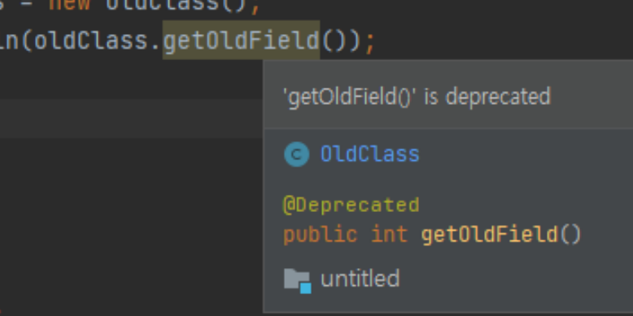
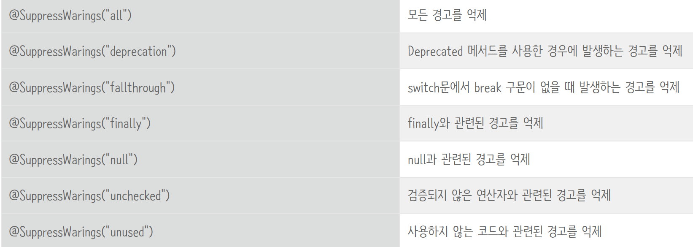
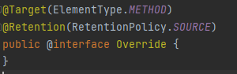
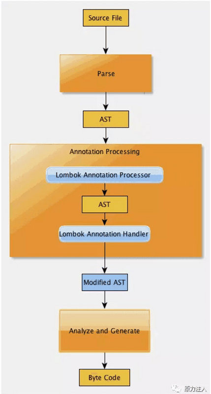
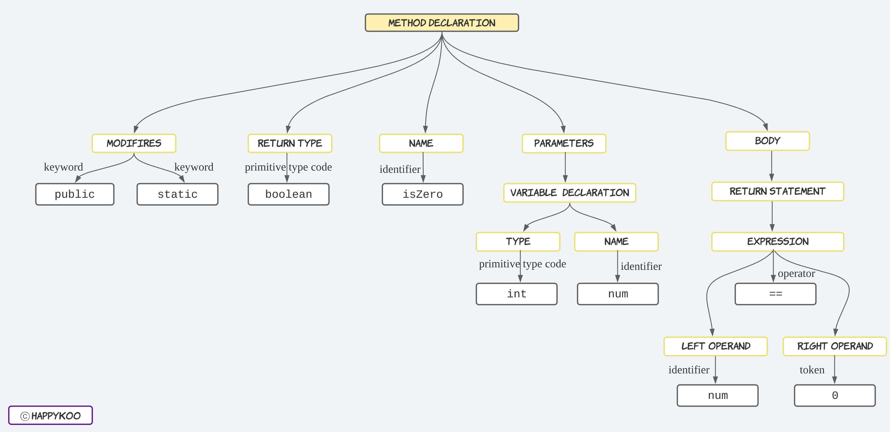

# 어노테이션(Annotation)
> - `코드에 메타데이터를 추가`하는 방법
> - 클래스, 메서드, 변수, 매개변수, 패키지 등에 붙일 수 있다.
> - 컴파일러 지시나 런타임 시 특정 기능을 활성화하는 데 사용된다.
> - 자바에서 제공하는 기본 어노테이션 외에도 커스텀 어노테이션을 정의할 수 있다.
> - Java 5부터 등장한 기능
> - ### `소스 코드가 컴파일되거나 실행될 때 컴파일러 및 다른 프로그램에게 필요한 정보를 전달해주는 요소`

## 자바에서 제공하는 기본 어노테이션(표준 어노테이션)
### @Override
> - 메서드가 부모 클래스의 메서드를 오버라이딩할 때 사용
> - 컴파일러가 메서드 오버라이딩이 제대로 되었는지 확인하게 해주며, 실수로 다른 메서드를 작성하는 문제를 방지한다.
```java
@Override
public String toString() {
    return "Example";
}

```

> @Override를 사용하지 않을 경우 아래 경우에서는 그냥 새로운 메서드를 정의하는 것으로 간주하여, 에러 발생X
```java
class SuperClass {
	void eat() {...}
}

class SubClass extends UpperClass {
	void eta(int a) {...}
    // 프로그래머의 오타로 eat을 eta로 입력
}
```

### @Deprecated
> - 더 이상 사용되지 않는 클래스, 메서드, 필드에 붙이는 어노테이션
> - 이 어노테이션이 붙은 요소를 사용하면 컴파일 시 경고 발생
> - 새로운 버전의 JDK가 등장하여 더 이상 사용하지 않는 필드나 메서드가 있을 경우에 사용
>   - 하위 버전의 호환성 문제로 삭제하기 곤란하여 `남겨두어야만 할 때` 사용
```java
@Deprecated
public void oldMethod() {
    // 더 이상 사용되지 않음
}
```


### @SuppressWarnings
> - `컴파일 경고`를 무시할 때 사용
> - 특정 경고만 무시할 수도 있고, 모든 경고를 무시할 수도 있다.
```java
@SuppressWarnings("unchecked")
public void method() {
    List rawList = new ArrayList(); // unchecked 경고 발생
}
```
> - 속성으로 all, deprecation, fallthrough, finally, null, unchecked, unused가 있다.
> - @SuppressWarnings({"deprecation","unchecked","null"}) 와 같이 여러 개 한번에 지정 가능
> - 

### @FunctionalInterface
> - 인터페이스가 단일 추상 메서드를 갖는 함수형 인터페이스인지 확인하는 어노테이션
>   - 함수형 인터페이스 : 추상 메서드가 오직 하나인 인터페이스
>     - default method 또는 static method는 여러 개 있어도 상관없음
> - 함수형 프로그래밍, 특히 람다 표현식에서 주로 사용
```java
@FunctionalInterface
public interface MyFunctionalInterface {
    void execute();
}
```

## 메타 어노테이션
> - 어노테이션을 정의할 때 사용할 수 있는 어노테이션
> - 
> - @interface로 정의

### @Retention
> - 어노테이션이 어느 시점까지 유지될지를 지정
> - RetentionPolicy.SOURCE: 소스 코드에만 존재하고 컴파일 시 사라짐.
> - RetentionPolicy.CLASS: 컴파일된 클래스 파일에 남지만, JVM에서는 무시됨.
> - RetentionPolicy.RUNTIME: 런타임 시점에도 JVM에서 어노테이션 정보를 사용할 수 있음.

```java
@Retention(RetentionPolicy.RUNTIME)
public @interface MyAnnotation {
}
```

### @Target
> - 어노테이션을 적용할 수 있는 위치를 지정
> - ElementType.TYPE: 클래스, 인터페이스, 열거형에 적용.
> - ElementType.METHOD: 메서드에 적용.
> - ElementType.FIELD: 필드에 적용.
> - ElementType.PARAMETER: 메서드 매개변수에 적용.
> - ElementType.RECORD_COMPONENT: Java 16 이후 도입된 record의 컴포넌트에 적용.
```java
@Target(ElementType.METHOD)
public @interface MyMethodAnnotation {
}
```

### @Inherited
> - 어노테이션이 서브 클래스에 상속될 수 있음을 나타냄.
> - 부모 클래스에 붙은 어노테이션을 자식 클래스에서도 사용할 수 있다.
```java
@Inherited
@Retention(RetentionPolicy.RUNTIME)
@Target(ElementType.TYPE)
public @interface InheritedAnnotation {
}

@InheritedAnnotation
public class ParentClass {
}

public class ChildClass extends ParentClass {
    // InheritedAnnotation이 상속됨
}

```

### Documented
> - 어노테이션이 Javadoc에 포함되도록 설정
> - 기본적으로 어노테이션은 Javadoc에 포함되지 않지만, 이 메타 어노테이션을 사용하면 어노테이션 설명이 문서에 포함

```java
@Documented
public @interface DocumentedAnnotation {
}
```

## 외부 라이브러리 어노테이션
### Lombok
> - 자바 개발에서 코드의 보일러플레이트(반복되는 코드)를 줄이기 위해 나온 외부 어노테이션
> - @Getter, @Setter, @ToString, @EqualsAndHashCode, @NoArgsConstructor, @AllArgsConstructor, @RequiredArgsConstructor
> - @Data -> 위에 것들 종합
>   - @Setter가 들어가 있기 때문에 Entity에서는 사용하지 않고 DTO에서 사용

### Lombok은 어떻게 동작하는 걸까?
> - Lombok은 `컴파일 타임`에 동작하며, 자바 컴파일러의 어노테이션 프로세싱 기능을 사용한다.
> - 자바 컴파일러는 소스 코드를 컴파일할 때 Annotation Processor를 실행하여 런타임에 영향을 미치지 않고, `컴파일된 바이트코드`에만 변화를 준다.
> - 

> - AST(Abstract Syntax Tree, 추상 구문 트리)
>   - 소스 코드의 구문 구조를 `트리 형태`로 표현한 자료 구조
>   - 자바뿐만 아니라 대부분의 프로그래밍 언어로 작성된 소스는 컴파일러에 의해 컴파일 과정에서 AST를 구성하게 된다.
> - 
>   - 컴파일러는 먼저 소스 코드를 읽고 그 코드를 기반으로 AST를 생성한다.
>     - 이 AST안에서 소스 코드가 문법적으로 올바른지를 검사.(중괄호가 맞는지, 변수 선언이 맞는지)
>     - AST를 기반으로 컴파일러는 변수, 메서드 호출을 분석하고 올바르게 사용되었는지 확인
>       - 타입 검사, 스코프 검사, 중복 선언
>   - 모두 확인했으면 AST를 기반으로 바이트 코드를 생성
>     - 이 바이트 코드는 JVM에서 실행될 수 있는 형태

> - 어노테이션 프로세싱 과정
>  - 컴파일러가 Lombok 어노테이션을 찾으면, Lombok 어노테이션 프로세서가 실행되어, 소스 코드를 AST로 변환한 후, Lombok 어노테이션이 적용된 클래스나 필드에 대응하는 메서드와 생성자를 자동으로 추가한다.
>  - Lombok은 컴파일러가 만든 AST에서 Lombok 어노테이션이 적용된 클래스와 필드를 찾아 필요한 메서드나 생성자를 추가한다.
>  - 예를 들어, @Getter가 붙어 있으면, 해당 필드에 대해 getX()와 같은 메서드를 생성한다.
>  - Lombok이 AST를 수정한 후, 자바 컴파일러는 이 AST를 기반으로 바이트코드를 생성한다.
>  - 이때, 개발자가 직접 작성하지 않은 getter/setter 메서드나 생성자가 포함된 클래스가 바이트코드에 반영된다.

## 어노테이션의 처리 과정
> - 어노테이션이 정의되고 코드에 적용된 후, 컴파일러와 런타임 환경에서 이 어노테이션이 어떻게 처리되는지에 따라 여러 방식으로 동작
### 컴파일 타임에서의 어노테이션 처리
> - 컴파일러는 소스 코드를 컴파일할 때 어노테이션을 인식하고 처리한다.
>   - 어노테이션 프로세서가 처리
>   - AST를 구성하는 동안 특정 어노테이션 사용 분석
> - 컴파일 시점에 어노테이션을 분석하고 추가적인 코드를 생성하거나 검증할 수 있다.
>   - 예를 들어 Lombok은 컴파일 시점에 getter, setter 메서드를 생성하는 어노테이션 프로세서로서 동작한다.

### 런타임에서의 어노테이션 처리
> - @Retention(RetentionPolicy.RUNTIME)으로 설정된 경우
> - 어노테이션 프로세서가 아닌 `리플렉션`을 사용하여 클래스, 메서드, 필드 등에 적용된 어노테이션 정보를 읽어오고 처리할 수 있다.
>   - 스프링 프레임워크의 @Autowired, @Transactional, JPA의 @Entity, @Id, @OneToMany, JUnit의 @Test 등이 런타임 어노테이션이다.
> - 실행 중에(런타임 중에) 리플렉션을 통해 어노테이션 정보를 읽어와서 처리한다.
>   - 리플렉션 : 자바에서 런타임에 클래스, 메서드, 필드 등의 메타데이터를 `동적`으로 조회하고 조작할 수 있는 기능

## 어노테이션의 장점
### 코드 간결화
> - 어노테이션을 사용하면 반복적으로 작성해야 하는 코드(보일러플레이트)를 줄일 수 있다.
>   - Lombok의 @Getter, @Setter

### 가독성 향상
> - 어노테이션은 코드의 의미를 명시적으로 나타내는 메타데이터 역할을 한다.
> - 어노테이션을 사용하면 메서드나 클래스의 동작을 개발자와 시스템이 더 쉽게 파악할 수 있다.
>   - JUnit테스트에서 @Test를 사용하면 해당 메서드가 테스트를 실행한다는 사실을 명확하게 나타낼 수 있다.

### 재사용성 증가
> - 어노테이션은 특정 기능을 여러 클래스나 메서드에 적용할 수 있어 코드의 재사용성을 높인다.
> - 공통 기능을 추출하여 어노테이션으로 정의해두면, 여러 클래스에서 쉽게 적용할 수 있다.
>   - @Transactional

## 커스텀 어노테이션
### 커스텀 어노테이션 정의
> - @interface 키워드를 사용해서 정의
> - 어노테이션 자체는 인터페이스처럼 동작
> - 메타 어노테이션(@Retention, @Target) 적용
    https://github.com/GMarketRequest/HotDealCrawling/blob/master/src/main/java/com/example/hotdealcrawling/annotation/ExcelColumn.java

```java
@Retention(RetentionPolicy.RUNTIME)
@Target(ElementType.FIELD)
public @interface ExcelColumn {
    String headerName();  // 엑셀 헤더 이름을 지정하는 속성
    int order() default 0;  // 엑셀에 출력될 순서, 기본값 0
}
```

### 어노테이션 활용
> 위와 같은 경우 DTO 클래스의 필드에 적용하여 액셀 생성 시 해당 필드를 열로 매핑할 수 있다.

```java
public class SellerInfo {

    @ExcelColumn(headerName = "상호명", order = 1)
    private String sellerName;

    @ExcelColumn(headerName = "사업자 등록번호", order = 2)
    private String businessId;

    @ExcelColumn(headerName = "연락처", order = 3)
    private String contactInfo;

    @ExcelColumn(headerName = "대표자", order = 4)
    private String representative;

    @ExcelColumn(headerName = "사업장 소재지", order = 5)
    private String location;

    @ExcelColumn(headerName = "E-mail", order = 6)
    private String email;

    @ExcelColumn(headerName = "통신판매업자번호", order = 7)
    private String businessNumber;

    // Getters and Setters...
}

```

## 어노테이션 처리
> - 어노테이션은 직접 실행되는 코드는 아니므로, 어노테이션이 붙은 대상을 처리하기 위해서는 리플렉션 혹은 AOP를 사용하여 해당 어노테이션을 읽고 처리할 수 있다.

```java
// RecordComponent를 사용하여 필드에서 어노테이션을 추출
RecordComponent[] recordComponents = SellerInfo.class.getRecordComponents();
List<RecordComponent> excelComponents = Arrays.stream(recordComponents)
        //스트림을 순회하면서 각 RecordComponent가 @ExcelColumn이 붙어있는지 검사
  .filter(component -> component.isAnnotationPresent(ExcelColumn.class))
  .sorted(Comparator.comparingInt(
      component -> component.getAnnotation(ExcelColumn.class).order()))
  .toList();
```

```java
for (int i = 0; i < excelComponents.size(); i++) {
    RecordComponent component = excelComponents.get(i);
    ExcelColumn excelColumn = component.getAnnotation(ExcelColumn.class);
    Cell cell = header.createCell(i);
    cell.setCellValue(excelColumn.headerName());
}
```
