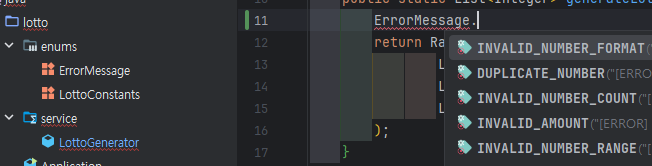
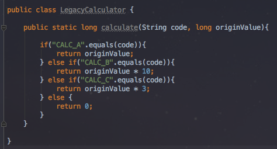
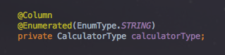
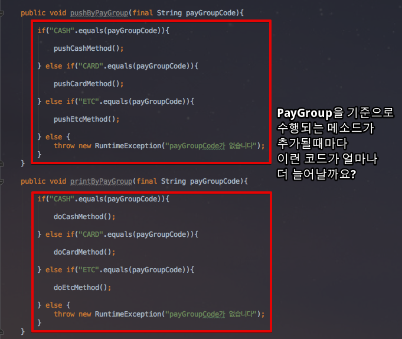
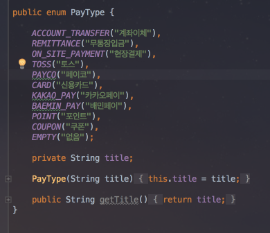

# Enum
> - 특정 집합의 `상수`들을 나타내는 특수한 데이터 타입
>   - 상수 : 수식에서 변하지 않는 값
> - `객체 지향적`인 방식으로 상수를 관리할 수 있다.
> - 상태나 설정을 나타날 때 유용하게 사용
> - `서로 연관된 상수들의 집합`
>   - Days Enum 안에 MONDAY, TUESDAY, ...와 같이 관련된 값들로 이루어져 있는 집합

## 기본 구조
> - 불변성 원칙
>   - 싱글턴 패턴
>     - 각 상수는 JVM 내에서 하나의 인스턴스만 존재한다.
>   - final 필드
>     - 각 상수는 암묵적으로 `final`과 `static`으로 선언된다.
>   - Thread-safe
>     - 위와 같은 이유로 `static` 클래스 로더의 초기화 과정에서 상수 값이 할당되며, 싱글톤 특성으로 인해 하나만 생성되고, final로 인해 값을 수정할 수 없게 된다.
>       - Thread-safe 하다.
> - 일반 클래스처럼 필드, 메서드, 생성자 등을 가질 수 있는 객체


```java
public enum Season {
    SPRING, SUMMER, FALL, WINTER
}
```
> - 위와 같이 네 개의 상수 값을 가질 수 있다.
> - 위의 값들 외에는 허용되지 않으므로 상수 값에 잘못된 값을 할당할 위험이 줄어든다.
> - 상속 불가(클래스)
>   - enum 타입은 다른 클래스를 상속할 수 없지만, 인터페이스는 구현할 수 있다.
```java
public interface Describable {
    String getDescription();
}

public enum Season implements Describable {
    SPRING("Warm and breezy"), 
    SUMMER("Hot and sunny"), 
    FALL("Cool and crisp"), 
    WINTER("Cold and snowy");

    private final String description;

    Season(String description) {
        this.description = description;
    }

    @Override
    public String getDescription() {
        return description;
    }
}
```
> - 내부 필드와 메서드를 가질 수 있다.
>   - 복잡한 상수 값을 정의하거나 관련 동작을 추가할 수 있다.
```java
public enum Season {
    SPRING("Warm"), SUMMER("Hot"), FALL("Cool"), WINTER("Cold");

    private final String description;

    // 생성자
    Season(String description) {
        this.description = description;
    }

    public String getDescription() {
        return description;
    }
}

```

## 주요 메서드
### values() : enum의 모든 값을 배열로 반환한다.
```java
for (Season s : Season.values()) {
    System.out.println(s);
}
```
### ordinal() : 해당 enum 상수의 순서를 반환한다. (0부터 시작)
```java
System.out.println(Season.SPRING.ordinal()); // 0
```
### name() : 상수의 이름을 반환한다.
```java
System.out.println(Season.SUMMER.name()); // "SUMMER"
```
### valueOf(String name) : 주어진 이름에 해당하는 enum 상수를 반환한다.
```java
Season season = Season.valueOf("WINTER");
```

## enum의 장점
> - 가독성 : 코드에서 의미 있는 상수 집합을 쉽게 표현할 수 있다.
> - 안전성 : 잘못된 상수 값 사용을 방지할 수 있다.
> - 유지 보수성 : 상수와 그와 관련된 기능을 한 곳에서 관리할 수 있다.

## static final VS enum
### static final
> - 간단한 값 저장에 적합
>   - 코드가 단순해져 복잡한 구조가 필요 없는 상수 관리에 유리하다.
> - 성능 효율성
>   - 메모리에 값 하나만 로드되어 프로그램이 실행될 때 성능이 빠르다.
>   - enum보다 메모리 사용량이 적다.
> - 클래스 의존성 감소
>   - 다른 클래스에 의존하지 않기 때문에 상수를 특정 클래스에서 관리할 때 유리하다.
### enum
> - 타입 안정성
>   - 각 상수 값이 고유한 인스턴스를 가지므로, 잘못된 값이 사용되는 오류를 컴파일 타임에 방지할 수 있다.
> - 관련 있는 상수들을 하나의 enum으로 묶어서 관리할 수 있다.
>   - 후술할 "Y", "1", true 같은 경우 하나로 묶어줄 수 있다.
> - 클래스처럼 기능 확장
>   - 클래스처럼 추가 필드, 생성자, 메서드를 정의할 수 있어, 단순한 상수 이상의 기능을 구현할 수 있다.

## 특징
> - 문자열과 비교해, IDE의 적극 지원을 받을 수 있다.
>   - 자동완성, 오타검증, 텍스트 리팩토링 등
>     - Days. 까지만 입력해도 Days안에 있는 상수들을 IDE가 제안한다.
>     - 
> - 허용 가능한 값들을 제한할 수 있다.
> - 리팩토링시 변경 범위가 최소화된다.
>   - 내용의 추가가 필요하더라도, Enum 코드외에 수정할 필요가 없다.

> - 위는 모든 언어의 Enum의 공통된 장점
> - 하지만 Java의 Enum은 더 많은 장점을 가지고 있다.
> - [우아한 기술 블로그](https://techblog.woowahan.com/2527/)

### 데이터들 간의 연관관계 표현

> - 위와 같은 경우, 기능상의 문제는 없지만, 별도의 문제가 있다.
> - "Y", "1", true가 모두 `같은 의미`
>   - 불필요한 코드량이 많다.

> - 이러한 부분을 Enum으로 추출할 수 있다.
> - 
> - lombok의 @Getter를 사용하면 Enum의 get메소드까지 제거가 되어 더욱 깔끔한 코드도 가능하다.
> - 
> - TableStatus라는 Enum타입을 전달받기만 한다면, 그에 맞는 table1, table2값을 바로 얻을 수 있다.

### 상태나 행위를 한 곳에서 관리
> - 서로 다른 계산식을 적용해야할 때가 있다.
>   - 예를 들어 DB에 저장된 code값이 "CALC_A"인 경우엔 값 그대로, "CALC_B"인 경우 * 10한 값을 전달해야 하는 경우
>   - 가장 쉬운 방법은 아래와 같다.
>   - 
> - 이렇게 메소드로 분리하고 실제로 사용해보면, 코드는 코드대로 조회하고 계산은 별도의 클래스&메소드를 통해 진행해야 한다.
> - 
> - 이러한 상황은 LegacyCalculator의 메소드와 code는 서로 관계가 있음을 코드로 표현할 수 없다.
> - Code에 따라 지정된 메소드에서만 계산되길 원하는데, 현재로는 강제할 수 있는 수단이 없다.
>   - 계산 메소드를 누락하거나 계산 로직이 변경되는 경우 실수할 확률이 높다.

> - 
> - 그래서 Enum을 통해 각각의 Code가 본인만의 계산식을 갖도록 수정할 수 있다.
> - Entity 클래스에 선언할 때는 String이 아닌 enum으로 선언하면 된다.
> - 
>   - 이와 같이 JPA를 사용하는 경우, `@Enumerated(EnumType.STRING)`을 선언하면 Enum 필드가 테이블에 저장시 숫자형이 아닌, Enum의 name이 저장된다.
> - 
>   - 위와 같이 실제로 사용하는 곳에도 Code(enum 상수)에게 계산을 요청하면 된다.

### 데이터 그룹관리
> - 결제라는 데이터는 `결제 종류`와 `결제 수단`이라는 2가지 형태로 표현된다.
> - 신용카드 결제는 신용카드라는 결제 수단이며, 카드라는 결제 종류에 표현된다.
> - 
> - 이에, 결제된 건이 어떤 결제수단으로 진행됐으며, 해당 결제 방식이 어느 결제 종류에 속하는지 확인해야 한다.
> - 가장 쉬운 방법은 역시 문자열과 메소드, if문으로 구현하는 것이다.
> - 
> - 둘의 관계를 파악하기 어렵다.
>   - 결제 종류가 결제 수단을 포함하고 있는 관계인데, 메소드만으로 표현이 불가능하다.
> - 입력값과 결과값이 예측 불가능하다.
>   - 그냥 단순한 문자열만 받기 때문에, 제대로된 문자열인지 검증코드도 필요하게 된다.
> - 그룹별 기능을 추가하기 어렵다.
>   - 결제 종류에 따라 추가 기능이 필요한 경우에는 또다시 if문으로 메소드를 실행해야 한다..
>   - 

> - 
> - 각 Enum 상수들은 본인들이 갖고 있는 문자열들을 확인하여 문자열 인자값이 어느 Enum 상수에 포함되어 있는지 확인할 수 있다.
> - 
> - 관리 주체를 PayGroup에게 직접 물어보면 된다.
> - 하지만, 결제 수단이 `문자열`인게 아직 남아 있다.
>   - 잘못 전달된다면, 전혀 관리되지 않는다.
> - 
> - 
> - PayGroup Enum 상수안에 PayType Enum 추가
> - 

### 관리 주체를 DB에서 객체로
> - 정산 시스템에선 카테고리 관련 데이터를 DB에서 관리하고 있다.
> - 
> - 코드명만 봐서는 뭘 나타내는지 알 수 없다.
>   - 모든 메소드들이 `01`, `1` 등의 매직넘버를 if조건의 기준으로 되어있다면,
>   - `01`이라는 코드가 뭔지 알기 위해서 서버코드에서 실행되는 코드를 보고 Grp_cd를 찾아내고, DB에서 조회해야 한다.
> - 항상 코드 테이블 조회 쿼리가 실행되어야 한다.
>   - UI를 그리기 위해 DB를 접근해야만 한다.
> - 카테고리와 같은 경우 `잘 추가되지도 않은` 영역인데 굳이 테이블로 관리하는 것은 단점이 더 많다.

> - 이러한 데이터를 Enum으로 전환하고, 팩토리와 인터페이스 타입을 선언하여 일관된 방식으로 관리되고 사용할 수 있도록 진행
> - Enum을 바로 `JSON`으로 리턴하게 되면 상수 name만 출력이 된다.
> - 필요한 건 DB컬럼값으로 사용될 Enum의 name과 View Layer에서 출력될 title 2개의 값
> - 
>   - 클래스의 생성자로 일관된 타입을 받기 위해 인터페이스 생성
> - 
>   - 값을 담을 VO는 인터페이스를 생성자 인자로 받아 인스턴스를 생성하도록 한다.
> - 
>   - Enum은 미리 선언한 인터페이스를 구현하면 된다.
> - 
>   - 필요한 곳에서 Enum을 Value 클래스로 변환한 후, 전달하기만 하면 된다.
