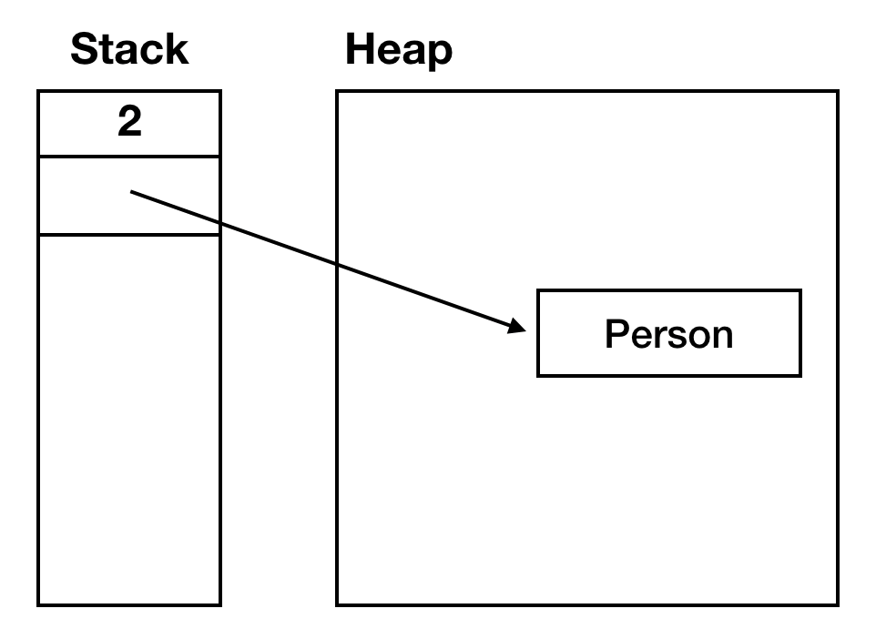

# fianl
> - 변수, 메서드, 또는 클래스에 사용될 수 있는 키워드
> - 불변성을 확보할 수 있다.
>   - 처음 정의된 상태가 변하지 않는 것을 보장한다.
> - 어떤 곳에 사용되냐에 따라 다른 의미를 가진다.

## 변수에 final 키워드를 이용할 경우
### 기본형 변수
> 변수에 한 번 할당된 값은 변경될 수 없다.
```java
final int x = 10;
x = 20; // 오류 발생
```

### 참조형 변수
> - 변수 자체가 참조하는 객체는 변경할 수 없다.
>   - 변수에 다른 객체를 할당할 수 없다.
> - 참조된 객체의 내용은 변경될 수 있다.
>   - 내부 상태는 변경할 수 있다.
```java
final List<String> list = new ArrayList<>();
list = new LinkedList<>(); // 오류 발생

list.add("Hello"); // 정상 작동
list.add("World"); // 정상 작동
```

```java
 final int value = 2;
 final Person person = new Person("사바라다", 29);


 value = 2; // 컴파일 에러
 person.setAge(10); //정상 작동
 person.setName("사바라"); //정상 작동

 person = new Person("염광호", 29); // 컴파일 에러
```

### 왜 기본형 변수와 참조형 변수가 반영되는 게 다를까? 

> - final 키워드는 `stack 메모리`를 기점으로 불변성을 보장한다.
> - 기본형 변수는 stack 메모리에 저장되기 때문에, 변경되지 않는다.
> - 참조형 변수는 stack에 메모리 주소, heap에 실제 객체를 저장한다.
>   - 메모리 주소가 변하지 않게 제한한다.
>     - 참조가 변경되지 않는다.
>   - heap 메모리에 저장되어 있는 실제 객체는 변경되는 것에 `자유롭다`.


## 메서드에 final 키워드를 이용할 경우
> - 서브클래스에서 `오버라이드`할 수 없다.
>   - 특정 메서드의 동작을 변경하지 못하도록 보장할 때 사용한다.
```java
class Parent {
    public final void display() {
        System.out.println("This is a final method.");
    }
}

class Child extends Parent {
    public void display() { // 오류 발생
        System.out.println("Trying to override final method.");
    }
}
```

## 클래스에 final 키워드를 이용할 경우
> - 다른 클래스가 `상속`할 수 없다.
```java
public final class ImmutableClass {
    // 클래스 내용
}

class SubClass extends ImmutableClass { // 오류 발생
    // 서브클래스 내용
}

```

---

## 그렇다면 컴파일 과정에서, final 키워드는 다르게 취급되나요?
> - fianl 키워드가 사용된 변수나 메서드, 클래스는 몇 가지 최적화를 수행할 수 있게 한다.
### 기본형 변수와 Constant Pool
> - `final`키워드로 선언된 기본형 변수는 `Constant Pool`에 저장될 수 있다.
> - 컴파일 타임에 상수로 취급되어 코드 내에서 직접 값이 사용된다.
```java
final int x = 10;
int y = x + 5; // 컴파일 타임에 'int y = 15;'로 변환될 수 있다.
```

### 참조형 변수, 메서드, 클래스
> - 각각 컴파일러가 참조 변경, 오버라이드, 상속을 허용하지 않는 것을 미리 알 수 있다.
>   - 컴파일 타임에 미리 오류 반환