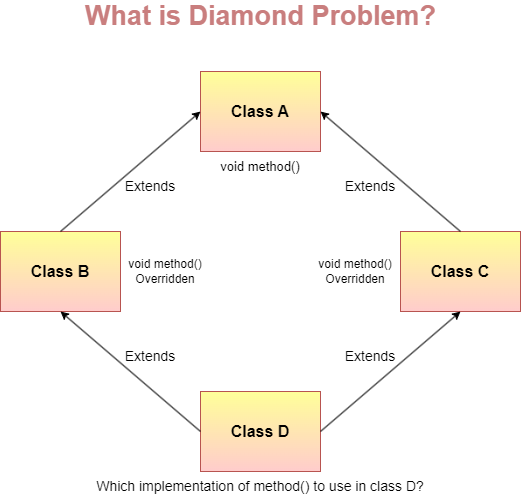

## 인터페이스와 추상 클래스의 차이에 대해 설명해 주세요.
### 인터페이스
`인터페이스`란, 클래스와 유사하지만, 동작의 집합을 나타내는데 주로 사용되는 참조 타입입니다.  
`전역 정적 상수`(인터페이스에 선언된 변수는 기본적으로 `public static final`임), `메서드 선언(추상 메서드)`, `디폴트 메서드`, `정적 메서드` 및 `중첩 인터페이스`만 포함할 수 있습니다.  
**인스턴스화 될 수 없으며**, `클래스`에 의해 `구현(implements)`되거나 `인터페이스`에 의해 `상속(extends)`될 수 있습니다.  
`Java 8` 이후로는 `static`, `default` 메서드를 지원하며, `Java 9` 이후로는 `private` 메서드를 지원합니다.  
- 추가로, 클래스의 static 메서드와 달리, 인터페이스의 static 메서드는 **상속되지 않습니다.**  
#### `default` 메서드 중복
```java
public interface A {
	default String printline() { ... }
}
public interface B {
	default String printline() { ... }
}
public class C implements A, B {
	...
}
```
한 클래스가 여러 인터페이스를 구현할 때, 동일한 이름의 `default` 메서드가 존재할 수 있습니다.  
이 때, 다중 인터페이스 상속으로 인한 충돌(`다이아몬드 문제`)이 발생해 코드가 컴파일 되지 않습니다.  
이를 해결하려면, 해당 디폴트 메서드를 재정의해, 어떤 인터페이스의 디폴트 메서드를 호출할 지 명시적으로 알려주어야 합니다.  
```java
public class C implements A, B {
	@Override
	public String printline() {
		// A 인터페이스의 메서드를 호출
		A.super.printline();
		// A, B 인터페이스의 메서드 모두 호출할 수도 있습니다.
		B.super.printline();
	}
}
```
#### `private` 메서드
`Java 9`부터 인터페이스에 `private` 메서드를 추가할 수 있게 되었습니다.  
이는 `정적`/`비정적` 메서드로 구현할 수 있으며, `public static 메서드`에서 `private static 메서드`를 호출하는 등의 용도로 사용할 수 있습니다.  
```java
public interface Foo {

    static void buzz() {
        System.out.print("Hello");
        staticBaz();
    }

    private static void staticBaz() {
        System.out.println(" static world!");
    }
}
```
이를 통해 코드 중복을 줄이고, 로직을 캡슐화해 인터페이스를 구현하는 클래스로 부터 세부 사항을 숨길 수 있습니다.  
### 추상 클래스
`추상 클래스`란, `abstract` 키워드와 함께 선언된 **클래스**를 말합니다.  
`추상 메서드`를 포함할 수 있으며, *인스턴스화 될 수 없지만* `상속`이 **가능**합니다.  
일반 클래스와 같이 필드, 메서드에 대해 `접근 제한자`에 대한 **제한이 없습니다**.  
#### 추상 메서드?
 `abstract` 키워드와 함께, 구현부 없이 선언된 메서드를 말합니다.  
```java
	abstract void draw();
```
만약 클래스가 `추상 메서드`를 포함하는 경우, 반드시 `추상 클래스`로 선언되어야 합니다.  
- 인터페이스 내부에서 `default` 또는 `static`으로 선언되지 않은 메서드는 암묵적으로 `추상 메서드`이기 때문에, `abstract` 키워드를 굳이 명시하지 않습니다.  
#### 상속
`추상 클래스`가 상속된 경우, 자식 클래스는 부모의 모든 `추상 메서드`에 대한 **구현**을 제공해야 합니다.  
- 그러지 않는다면, 자식 클래스 역시 `추상 클래스`로 선언되어야 합니다.  
#### 생성자?
`추상 클래스`는 인스턴스화 될 수 없지만, 생성자는 가질 수 있습니다.  
일반 클래스 처럼, `추상 클래스`에 생성자를 선언하지 않으면 컴파일러가 기본 생성자를 만들어주거나 또는 직접 기본 생성자를 정의할 수 있습니다.  
이렇게 만들어진 생성자는 자식 클래스의 생성자에서 `super()`를 통해 호출할 수 있습니다.  
이를 활용하면 자식 클래스에서 수정할 수 없도록 하고 싶은 값에 대해 초기화를 할 수 있습니다.  
```java
public abstract class Car {
    private int distance;

	// private 생성자 (접근 불가)
	private Car(int distance) {
        this.distance = distance;
    }

	// Car의 기본 생성자
	// 모든 자식 클래스의 생성자들이 호출되기 전, 이 생성자를 호출하기 때문에
	// Car의 distance 값은 0으로 초기화 될것임이 보장됨.
	public Car() {
        this(0);
        System.out.println("Car default constructor");
    }

}
```
### 차이점
`인터페이스`와 `추상 클래스` 모두 인스턴스화 될 수 없고, 구현을 포함하거나 포함하지 않는(`추상 메서드`) 메서드들을 보유할 수 있다는 점에서 유사한 점이 많습니다.  
다만, `추상 클래스`에서는 `static` 또는 `final`이 아닌 필드 값을 선언할 수 있습니다.  
또한, `public`/`protected`/`private`로 선언된 `구체 메서드`를 선언할 수 있습니다.  
- `구체 메서드(concrete method)`: 완전한 구현을 포함하며, 자식 클래스에서 재정의 가능한 메서드. 즉, `추상 메서드`가 아닌 메서드  

반면, 인터페이스에서는 모든 필드가 `public static final`이어야 하며, 모든 메서드는 `public` 이어야 합니다.  
또한, `클래스`는 추상 클래스든 일반 클래스든 **하나만 상속**할 수 있지만,   `인터페이스`를 구현하는데는 **제한이 없습니다**.
### 어떤걸 써야 할까?
#### 추상 클래스를 써야할 때
- 관련된 여러 클래스 간 코드를 공유 해야할 때  
- 추상 클래스를 상속할 클래스에 공통 메서드/필드가 많거나, `public` 이외의 접근 제한자가 필요한 경우  
- `static` 또는 `final`이 어난 필드를 선언해야 할 때, 해당 필드를 접근/수정할 수 있는 메서드를 정의할 수 있음  
#### 인터페이스를 써야할 때
- 관련 없는 클래스에서 인터페이스를 구현할 것으로 예상 될 때  
	- ex) `Cloneable`, `Comparable`과 같은 인터페이스들은 관련이 없는 클래스들에서 구현되고 있음.  
- 특정 자료형의 동작을 명세하고 싶지만, 구현에 대해서는 신경쓰지 않는 경우  
- 타입의 다중 상속을 활용하고 싶은 경우  
### 예시
#### 추상 클래스
대표적인 추상 클래스의 활용 예시는 `Collection Framework` 내부에 존재하는 `Abstract 컬렉션`(`AbstractMap`, `AbstractList`, `AbstractSet` 등)이 있습니다.  
해당 클래스들의 하위 클래스들은 `Abstract 컬렉션`이 정의하는 메서드들(`get`, `put`, `isEmpty` 등)을 공유합니다.  
#### 인터페이스
대표적인 인터페이스의 활용 예시는 `Cloneable`, `Serializable`, `Map<K, V>` 등이 있습니다.  
예시로 이들을 구현하는 `HashMap`을 보면, 이 클래스의 인스턴스가 `clone()`을 통해 복제할 수 있으며, 직렬화 할 수 있고, `Map`에 기대되는 기능들을 가지고 있음을 예상할 수 있습니다.  
- 또한, `Map<K, V>`의 경우, `merge`, `forEach`와 같은 디폴트 메서드를 갖고 있어, 해당 인터페이스를 구현한 오래된 클래스들을 자동적으로 개선했습니다.  
## 왜 클래스는 단일 상속만 가능한데, 인터페이스는 2개 이상 구현이 가능할까요?
상속관계에서 발생할 수 있는 **`다이아몬드 문제(또는 마름모 문제)`** 때문에 단일 상속만 가능합니다.  

> 출처: [How does Java provide support for multiple inheritance indirectly? | by Bhawana Gaur | Medium](https://bhawana-gaur.medium.com/how-does-java-provide-support-for-multiple-inheritance-indirectly-4588241126fb)

만약 두 개 이상의 클래스를 상속할 수 있게 했다면, 위 그림처럼 자식 클래스는 동일한 시그니처를 갖는 메서드 2개를 물려받게 됩니다.  
이후 자식 클래스에서 해당 메서드를 호출한다면, 둘 중 어느 메서드를 호출하겠다는 것인지 알 수 없는 상황이 발생합니다.  
이러한 문제를 피하고자, `Java`에서는 하나의 클래스만 상속할 수 있도록 제한을 두었습니다. [#](https://docs.oracle.com/javase/tutorial/java/IandI/multipleinheritance.html)  
인터페이스에는 구현 없이, 메서드에 대한 명세만 존재하기 때문에 인터페이스 간 메서드 명세가 중복되어도 이러한 문제가 발생하지 않아 다중 구현이 가능합니다.  
- 다만, 디폴트 메서드가 등장한 이후, 앞서 설명한 것 처럼 다중 상속 문제가 발생할 수 있게 되었습니다.  

# 참고
- [Interfaces (The Java™ Tutorials > Learning the Java Language > Interfaces and Inheritance) (oracle.com)](https://docs.oracle.com/javase/tutorial/java/IandI/createinterface.html)
- [Abstract Methods and Classes (The Java™ Tutorials > Learning the Java Language > Interfaces and Inheritance) (oracle.com)](https://docs.oracle.com/javase/tutorial/java/IandI/abstract.html)
- [Constructors in Java Abstract Classes | Baeldung](https://www.baeldung.com/java-abstract-classes-constructors)
- [Java Extend Multiple Classes - Javatpoint](https://www.javatpoint.com/java-extend-multiple-classes)
- [Multiple Inheritance of State, Implementation, and Type (The Java™ Tutorials > Learning the Java Language > Interfaces and Inheritance) (oracle.com)](https://docs.oracle.com/javase/tutorial/java/IandI/multipleinheritance.html)
- [Private Methods in Java Interfaces | Baeldung](https://www.baeldung.com/java-interface-private-methods)
- [Difference between Abstract Class and Interface in Java - GeeksforGeeks](https://www.geeksforgeeks.org/difference-between-abstract-class-and-interface-in-java/)
- [Static and Default Methods in Interfaces in Java | Baeldung](https://www.baeldung.com/java-static-default-methods)