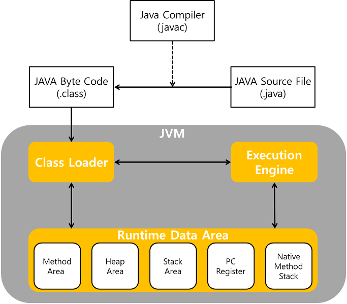

# static
## static 키워드
> - 인스턴스 없이도 클래스 자체에 접근 가능한 변수를 선언하거나 메서드를 정의할 때 사용
> - `static`을 사용하면 해당 멤버가 클래스의 `모든 인스턴스에서 공유`되고, 별도의 인스턴스 생성없이도 클래스명으로 바로 호출 가능

## static class
> - 중첩 클래스(inner class)안에서만 `static` 사용 가능
> - 외부 클래스의 인스턴스와 독립적이며, 외부 클래스의 정적 멤버에만 접근 가능
> - 주로 외부 클래스의 인스턴스와 상관 없는 헬퍼 클래스, 유틸리티 클래스로 사용
> - 멀티쓰레드의 싱글톤 환경에서 static class를 이용해서 동시성 문제 해결

> - 지연 초기화
>   - Something 클래스가 처음 로드될 때, LazyHolder 클래스는 로드되지 않는다.
>     - 이 시점에서는 싱글톤 인스턴스가 생성되지 않는다.
>   - getInstance() 메서드가 처음 호출되면, LazyHolder 클래스가 로드되면서, 정적 필드인 INSTANCE가 초기화
>     - 이때 Something 클래스의 유일한 인스턴스 생성
>   - 필요할 때까지 인스턴스를 생성하지 않음
>     - 메모리 낭비 방지, 정적 필드를 한번만 초기화하도록 보장하기 때문에 Thread Safe 보장
> - synchronized는 성능에 영향
> - non static class로 내부 클래스를 만들게 되면 외부참조 생성
>   - 외부 클래스가 필요없어지더라도 참조가 되어있기 때문에 gc에서 수거X
```java
public class Something {
    private Something() {
    }

    public static Something getInstance() {
        return LazyHolder.INSTANCE;
    }
 
    private static class LazyHolder {
        public static final Something INSTANCE = new Something();
    }
}
```

## static method
> - 클래스 레벨에서 작동하며, 클래스의 인스턴스가 없어도 호출 가능
> - 정적 메서드는 클래스의 모든 인스턴스가 공유하고, 클래스명으로 바로 호출 가능

```java
class MathUtil {
    //static method
    static int add(int a, int b) {
        return a + b;
    }

    //non static method
    int multiply(int a, int b) {
        return a * b;
    }
}
```

```java
//바로 접근 가능
int sum = MathUtil.add(5, 10);  // static method

//클래스의 인스턴스를 통해 호출해야함
MathUtil util = new MathUtil();
int product = util.multiply(5, 10);  // instance method
```

## static field
> - 클래스 레벨에서 선언된 변수로, 클래스의 모든 인스턴스가 공유하는 값
> - 해당 클래스의 인스턴스가 없어도 클래스명으로 접근 가능

```java
class Counter {
    static int globalCount = 0;  // 모든 인스턴스가 공유하는 값
    int instanceCount = 0;  // 각 인스턴스마다 독립적인 값

    void increment() {
        globalCount++;
        instanceCount++;
    }
}
```

```java
//접근 가능 static field
Counter.globalCount++;

Counter counter1 = new Counter();
counter1.increment();

```

---
## static 을 사용하면 어떤 이점을 얻을 수 있나요? 어떤 제약이 걸릴까요?
## 이점
### 클래스 레벨에서 공유
> - `static` 키워드를 사용하면 해당 변수나 메서드가 클래스의 모든 인스턴스에서 공유
> - 클래스에 속하는 모든 객체가 동일한 값을 참조하거나 동일한 메서드 사용 가능
> - 상태가 모든 객체 간에 일관성 유지할 때 유용

### 인스턴스 없이 접근 가능
> - 클래스의 인스턴스를 생성하지 않고도 클래스명으로 직접 접근
> - 유틸리티 함수나 전역적으로 필요한 데이터 효율적으로 관리
```java
Math.sqrt(4);  // Math 클래스의 static 메서드 호출
```

### 메모리 효율성
> - `static` 필드는 클래스에 의해 하나만 생성되고, 여러 인스턴스가 공유.
> - 즉 객체마다 별도의 공간을 할당하지 않으므로 메모리 사용이 절약

### 스레드 안정성(초기화 시점)
> - static 멤버는 클래스가 처음 로드될 때 초기화
> - 클래스 로더 작업 자체가 Thread Safe한 작업
>   - 클래스 로딩과 동시에 초기화되는 static 멤버는 스레드 간의 충돌없이 안전하게 사용 가능

## 제약
### 인스턴스 멤버(non static)에 접근 불가
> - static 메서드나 클래스는 인스턴스 멤버에 접근할 수 없다.
> - static 멤버는 클래스 레벨에서 작동하기 때문에, 인스턴스에 종속된 멤버에 접근하려면 반드시 객체를 통해 접근해야 함
> - 인스턴스 멤버는 각각의 객체에 속해 있다.
>   - 그 객체가 데이터에 할당되어 인스턴스가 생성된 후에야 인스턴스 맴버도 heap/stack영역에 할당되기 때문에, 객체가 없으면 인스턴스 멤버가 메모리에 존재하지 않으므로 접근 불가
>   - 반면 static 멤버는 method area에 클래스 로더 시점에 할당되어 있다.

### Override 불가
> - static 메서드는 오버라이드할 수 없다.
> - 서브클래스가 static 메서드를 재정의해도, 정적 바인딩에 의해 컴파일 시점에 메서드 호출 결정
> - 다형성 제한
```java
class Parent {
    static void sayHello() {
        System.out.println("Hello from Parent");
    }
}

class Child extends Parent {
    static void sayHello() {
        System.out.println("Hello from Child");
    }
}

Parent p = new Child();
p.sayHello();  // "Hello from Parent" 출력, static 메서드는 오버라이드되지 않음
```

### 초기화 시점 통제
> - static 필드는 클래스 로딩 시점에 초기화되므로, 초기화 시점을 통제하기 어렵다.
> - 적절한 시점에 초기화되지 않을 수 있다.

### 메모리 누수 위험
> - 클래스 로드가 해제되지 않는 한 메모리에서 해제되지 않는다.
> - 참조를 유지하고 있을 경우 문제 발생 가능성 보유

### 상태 유지 어려움
> - static 멤버는 전역 상태를 유지하므로, 여러 쓰레드에서 접근할 때 변경될 수 있어 복잡한 동시성 문제 발생


## 컴파일 과정에서 static 이 어떻게 처리되는지 설명해 주세요.

### 1. Java 컴파일러 단계에서의 처리
> - Java 코드를 작성한 후, `javac` 컴파일러를 통해 소스 코드를 바이트 코드로 변환한다.
> - 컴파일러는 `static` 멤버에 대해 인스턴스가 필요 없다는 사실을 인지하고, 해당 멤버에 대한 참조를 클래스 자체로 처리
```java
class MyClass {
    static int staticVar = 10;

    static void staticMethod() {
        System.out.println("Static Method");
    }
}
```

```text
getstatic MyClass.staticVar : I
invokestatic MyClass.staticMethod()V
```

### 2. 클래스 로딩 단계에서의 처리
> - static 멤버는 `클래스 로더`에 의해 관리
> - `static` 멤버는 클래스가 처음 로드될 때 메모리에 바로 할당
>   - 로딩 : 클래스 파일(.class)이 JVM에 의해 로드되고, static 멤버의 메타데이터는 `Method Area`에 관리
>   - 링킹 : static 변수는 기본값으로 초기화
>     - `static int num = 10` <- 이런 식이어도 그냥 0으로 초기화
>   - 초기화 : static 초기화 블록이 실행. static 변수에 할당된 값이 초기화
>     - 이 단계에서 10으로 초기화

### 3. 런타임에서의 처리
> - JVM의 실행 엔진에서 static 메서드 중 하나인 `main` 메소드를 찾아서 실행
>   - main 메소드가 static 키워드가 붙어야 하는 이유기도 함
> - static 변수의 경우 클래스명으로 접근 가능
> - static 메소드 역시 클래스명으로 직접 호출


---
## 코딩테스트에서 왜 한 클래스 내에 있는 변수나 메서드들을 static으로 선언했나요? 특별한 이유가 있는건가요?
> - main 메서드가 static이기 때문에, 그 안에서 다른 메서드나 변수를 사용하려면 그들도 static이어야 한다.
>   - static멤버는 static 메서드 내에서만 호출 가능
> - 객체 생성 없이 메서드나 변수를 사용하기 위해
>   - 코딩테스트는 단순한 문제를 해결하고 종료하는 시스템을 작성하기 때문에, 매번 객체를 생성할 필요가 없다.
>     - static 변수나 메서드를 선언하여 객체 생성 없이 바로 사용할 수 있도록 할 수 있다.
>   - 객체를 여러 번 생성하는 비용을 피하기 위해