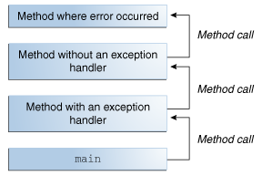
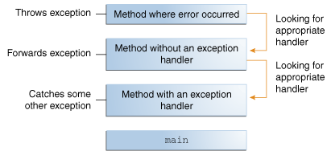

## Java의 Exception에 대해 설명해 주세요.
**`Exception`** 이란, Java 프로그램 실행 도중 발생하는 **`이벤트`** 로, **정상적인 명령 흐름을 방해**합니다.
### 예외 처리 흐름
어떠한 `메서드` 내에서 오류가 발생하면, 메서드는 `예외 객체(Exception Object)`를 생성해 런타임 시스템에게 넘깁니다.  
이때, 이처럼 `예외 객체`를 생성해 `런타임 시스템`에 전달하는 것을 `예외를 던진다(Throwing an Exception)`라고 합니다.  
- `예외 객체(Exception Object)` : 발생한 오류의 유형, 발생 당시 프로그램의 상태와 같은 `오류에 대한 정보`를 포함하는 객체입니다.

메서드가 예외를 던지게 되면, 런타임 시스템은 이를 처리해줄 수 있는 무언가를 찾으려 합니다. 여기서 말하는 '무언가'는, *오류가 발생한 메서드에 도달하기 위해* 호출된 메서드들이 정렬된 리스트를 이루고 있는데 이를 `호출 스택(Call Stack)`이라고 합니다.  


런타임 시스템은 `호출 스택`에서 `현재 발생한 예외를 처리할 수 있는 코드 블록`이 포함되어있는 메서드를 찾습니다. 이러한 `코드 블록`을 `예외 처리기(Exception Handler)`라고 합니다.  
이러한 탐색은 오류가 발생한 메서드부터 ***메서드가 호출된 역순***으로 `호출 스택`을 훑으며 진행됩니다.  
이때 **`적절한 처리기`** 를 찾게되면 런타임 시스템은 **예외를 처리기에 전달**하게 되고, `예외 처리기`는 `예외 객체의 유형`이 `처리기가 처리할 수 있는 유형`과 일치하는 경우 **`적절한 처리기`** 로 간주됩니다.  
만약 런타임 시스템이 `적절한 예외 처리기`를 찾지 못한채, 호출 스택의 모든 메서드들을 탐색했다면 `런타임 시스템(과 프로그램)`이 종료되게 됩니다.  

### Exception의 종류
Exception은 크게 `Checked Exception`, `Unchecked Exception`, `Error` 세가지로 구분됩니다.  
`Error`, `Runtime Exception` 및 이들의 하위 클래스들을 제외한 모든 `Exception`은 `Checked Exception` 입니다.  
#### Checked Exception
`Checked Exception`이란, 잘 작성된 Java 애플리케이션이라면 예상할 수 있어야 하고 복구해야 하는 예외를 말합니다.  
예를 들어, 사용자에게 파일 이름을 입력 받고 이를 `java.io.FileReader`를 통해서 여는 애플리케이션이 있다고 가정합시다. 이때, 사용자가 존재하는 파일의 이름을 입력할 수도 있지만, 존재하지 않는 파일의 이름을 입력할 수도 있습니다. 이럴 경우 `java.io.FileNotFoundException`이 발생하게 됩니다.  
이때 잘 작성된 애플리케이션이라면, 위 처럼 충분히 예상 가능한 **예외 케이스에 대해 포착**하고, 사용자의 실수를 알린 뒤 파일 이름을 다시 입력해달라는 메시지를 표시할 것입니다.  
`Checked Exception`의 경우 `try-catch` 절을 이용해 **`예외를 처리`** 하거나, `throws` 절을 이용해 **`예외를 던져야`** 합니다. 그렇지 않을 경우 **`코드가 컴파일되지 않습니다`**.  
#### Unchecked Exception
##### Runtime Exception
`Runtime Exception`이란, 애플리케이션 내부에 존재하지만 일반적으로 예상하거나 복구할 수 없는 예외를 말합니다.  
일반적으로 논리 오류나 부적절한 API 사용과 같은 프로그래밍 버그를 말합니다.  
`Runtime Exception`의 경우 `Checked Exception`과 달리, `catch` 또는 `throws`절에 의해 처리되거나 던져져지지 않아도 코드가 정상적으로 컴파일 됩니다.  
##### Error
`Error`란, `애플리케이션 외부에서 발생`하는 예외를 말하며, 애플리케이션이 일반적으로 예상하거나 복구할 수 없습니다.  
예를 들어, 사용자가 입력한 파일을 정상적으로 열었지만, `하드웨어` 또는 `OS`가 **오작동**해 파일을 읽을 수 없는 경우 `java.io.IOError`가 발생하게 됩니다.  
이때 애플리케이션은 이를 포착하고 사용자에게 이를 알릴 수도 있지만, `stack trace`를 출력하고 프로그램을 종료하는 것 역시 합리적일 수 있습니다.  
`Error` 역시 `Checked Exception`과 달리, `catch` 또는 `throws`절에 의해 처리되거나 던져져지지 않아도 코드가 정상적으로 컴파일 됩니다.  
### Exception 방식의 장점
#### 오류 처리 코드와 메인 로직 코드의 분리
기존의 프로그래밍 방식에서는 메인 로직 코드와 오류 감지 및 처리 코드가 혼재해있어 코드의 가독성과 유지보수성이 떨어집니다.  
반면 `Exception` 방식을 채용할 경우, 오류 처리와 관련된 세부 사항을 메인 로직 코드와 분리할 수 있습니다.  
##### 예시
기존의 방식이라면, 아래 코드처럼 메인 로직 중간중간에 오류를 감지하고 처리하는 코드가 존재하게 됩니다.  
```java
errorCodeType readFile {
    initialize errorCode = 0;
    
    open the file;
    if (theFileIsOpen) {
        determine the length of the file;
        if (gotTheFileLength) {
            allocate that much memory;
            if (gotEnoughMemory) {
                read the file into memory;
                if (readFailed) {
                    errorCode = -1;
                }
            } else {
                errorCode = -2;
            }
        } else {
            errorCode = -3;
        }
        close the file;
        if (theFileDidntClose && errorCode == 0) {
            errorCode = -4;
        } else {
            errorCode = errorCode and -4;
        }
    } else {
        errorCode = -5;
    }
    return errorCode;
}
```

반면 `Exception` 방식을 채용할 경우, 아래처럼 **오류 감지 및 처리 코드가 정리**되어 **가독성이 높고 유지보수성이 높은 코드**를 작성할 수 있게 됩니다.
```java
readFile {
    try {
        open the file;
        determine its size;
        allocate that much memory;
        read the file into memory;
        close the file;
    } catch (fileOpenFailed) {
       doSomething;
    } catch (sizeDeterminationFailed) {
        doSomething;
    } catch (memoryAllocationFailed) {
        doSomething;
    } catch (readFailed) {
        doSomething;
    } catch (fileCloseFailed) {
        doSomething;
    }
}
```

#### 오류를 호출 스택으로 전파할 수 있음
오류를 호출 스택에 있는 다른 메서드로 전파할 수 있어, **오류에 대해 관심이 있는 메서드만** 오류 감지에 대해 신경쓰도록 코드를 작성할 수 있습니다.  
따라서, 오류 처리에 관심이 없는 메서드는 그저 호출 스택 위로 예외를 던지기만하면 됩니다.  

##### 예시
예시로, `method1` -> `method2` -> `method3` -> `readFile` 순서대로 함수를 호출한다고 가정하겠습니다. 의사 코드로 이를 표현하면 다음과 같습니다.

```java
method1 {
    call method2;
}

method2 {
    call method3;
}

method3 {
    call readFile;
}
```

또한, 오류 처리에 대해서는 오직 `method1`만 관심이 있다고 가정하겠습니다.  
기존의 `오류 알림 기법`이었다면 다음 의사코드처럼 `return` 문을 통해 발생한 오류를 전파했을 것입니다.  

```java
method1 {
    errorCodeType error;
    error = call method2;
    if (error)
        doErrorProcessing;
    else
        proceed;
}

errorCodeType method2 {
    errorCodeType error;
    error = call method3;
    if (error)
		// 에러가 발생한 경우, 호출 스택 상위의 메서드(method1)로 error 반환
        return error;
    else
        proceed;
}

errorCodeType method3 {
    errorCodeType error;
    error = call readFile;
    if (error) 
		// 에러가 발생한 경우, 호출 스택 상위의 메서드(method2)로 error 반환
        return error;
    else
        proceed;
}
```

하지만 `Exception` 방식의 경우 method2, 3에서 발생한 예외를 단순히 던져주기만 하면 됩니다.

```java
method1 {
    try {
        call method2;
    } catch (exception e) {
        doErrorProcessing;
    }
}

method2 throws exception {
    call method3;
}

method3 throws exception {
    call readFile;
}
```

#### 오류 타입의 그룹화 및 구분
Java 프로그램에서 던져지는 모든 예외는 객체이기 때문에, 클래스 계층 구조상 예외를 그룹화하거나 분류할 수 있게 됩니다.  
- 다만, 대부분의 상황에서는 `예외 처리기`가 가능한 구체적인 예외를 처리하는 것이 좋습니다.
	- 최선의 복구 전략을 결정하는데 있어 어떤 유형의 예외가 발생했는지 파악하는 것이 중요하기 때문입니다.

##### 예시
예시로 Java의 I/O 작업 관련 예외의 부모인 `IOException`과 그 하위 클래스인 `FileNotFoundException`을 들어보겠습니다.  
만약 파일을 찾을 수 없다는 예외만 처리하고 싶다면 `catch`문에서 `FileNotFoundException`만 명시하면 됩니다. (`FileNotFoundException`은 하위 클래스가 없습니다.)  

```java
catch (FileNotFoundException e) {
    ...
}
```

반면, I/O 작업과 관련된 예외 전체를 묶어 처리하고 싶다면 `catch`문에서 `IOException`을 명시하면 됩니다.

```java
catch (IOException e) {
    ...
}
```

## 예외처리를 하는 세 방법에 대해 설명해 주세요.
흔히 Java에서 예외를 처리하는 방법은 `try-catch`문을 이용한 **`예외복구`**,  `throws`절을 이용한 **`예외회피`**, `throw`문을 이용한 **`예외전환`** 세가지 방법이 있다고 알려져 있습니다.

### try-catch
```java
try {

} catch (ExceptionType name) {

} catch (ExceptionType2 name) {

}
```
`try-catch`, 추가로 `finally` 문을 사용해 현재 메서드 내에서 예외를 처리하는 방법입니다.

#### try
먼저 예외가 발생할 수 있는 코드를 `try` 블록으로 묶고, `try` 블록 내부에서 발생 가능한 예외를 처리하는 `예외 처리기`가 존재하는 `catch` 블록을 연결하는 형태로 구현합니다.  
이때, 예외가 발생할 수 있는 각 코드를 각각의 `try-catch` 문으로 묶을 수도 있고, 모든 코드를 하나의 `try-catch` 블록으로 묶어 처리할 수도 있습니다.  

#### catch
각 `catch` 블록은 **인자로 받는** `예외 타입`을 처리하는 `예외 처리기`로, 이때 `예외 타입`은 `Throwable`클래스의 하위 클래스여야 합니다.  
런타임 시스템은 `예외 처리기`가 `호출 스택`에서 던져진 `예외 타입`과 일치하는 첫 번째 핸들러일 때, `예외 처리기`를 호출합니다.  
이때 `예외 처리기` 내부에서는 단순히 오류 메시지를 출력하거나 프로그램을 중지하는 것 외에도 다양한 작업을 수행할 수 있습니다.  
오류를 복구하거나, 사용자에게 결정을 내리도록 메시지를 표시하거나, *상위 수준*의 `예외 처리기`로 오류를 전파할 수도 있습니다.  

##### Union catch 절
추가로, Java 7 이상에서는 `|` 키워드를 통해 하나의 `catch` 블록이 **둘 이상**의 예외 타입을 처리할 수 있습니다.  

```java
catch ( IOException | SQLException ex) {
    logger.log(ex);
    throw ex;
}
```

참고로 `catch` 블록이 둘 이상의 예외 타입을 처리하는 경우, 해당 `catch`절의 매개변수는 암시적으로 `final`로 여겨집니다. 즉, `catch` 블록 내에서 해당 매개변수에 어떠한 값도 할당할 수 없습니다.  

#### finally

```java
...
finally {
    if (out != null) { 
        System.out.println("Closing PrintWriter");
        out.close(); 
    } else { 
        System.out.println("PrintWriter not open");
    } 
    if (f != null) {
	    System.out.println("Closing FileWriter");
	    f.close();
	}	
} 
```

`finally`블록은 `try` 블록을 탈출할 때, 항상 실행되는 블록입니다.  
따라서 예상치 못한 예외가 발생해도, 항상 실행됩니다. 이러한 특징 때문에 프로그래머가 실수로 `return`, `continue`,`break` 블록을 통해 `클린업 코드`가 무시되는 것을 방지할 때도 유용합니다.  
- `클린업 코드`: 사용한 자원 등을 정리하는 코드

#### try-with-resources

```java
try (FileReader fr = new FileReader(path);
	 BufferedReader br = new BufferedReader(fr)) {
	return br.readLine();
}
```

`try-with-resources` 문이란, 하나 이상의 자원을 선언하는 `try` 문을 말합니다.  
이때 자원은, *프로그램이 완료된 후* `닫아야(close)`하는 객체를 말합니다.  
`try-with-resources` 문에는 `java.lang.AutoCloseable`을 구현하는 모든 객체(`java.io.Closeable`을 구현하는 객체 포함)를 자원으로 사용할 수 있습니다.  
- 참고로 `Closeable` 인터페이스는 `AutoCloseable` 인터페이스를 상속합니다.  
- 추가로, `AutoCloseable`의 `close()`는 `Exception` 타입의 예외를 던지지만, `Closeable` 인터페이스는 `IOException` 타입의 예외를 던집니다.  

선언된 자원들은 `try`문이 정상적으로 완료 되었는지 또는 예외가 발생했는지에 관계 없이 항상 닫히게 됩니다.  
`try-with-resources`문은 `finally` 블록을 통해서 여러 자원을 닫을 때 예외가 발생할 경우, 아직 닫지 못한 자원이 메모리 누수를 발생시킬 수 있는 것과 달리, 항상 자원을 닫음을 보장하기 때문에 `try-with-resources`문을 사용하는 것이 권장됩니다.  
추가로, `try` 블록과 `try-with-resources` 문 **`모두`에서 예외가 발생**할 경우, `try` 블록에서 **발생한 예외만 던지고**, *`try-with-resources` 문에서 발생한 예외는 억제*됩니다.  
- 이렇게 `억제된 예외`는 `try` 블록에서 발생한 예외의 `Throwable.getSuppressed()` 메서드를 통해 찾을 수 있습니다.  

또한 자원의 `close` 메서드는 **생성 순서의 `반대 순서`** 로 호출됩니다.  
그리고 `try-with-resources`문 역시 `catch` 블록과 `finally` 블록을 연결할 수 있는데, 이들은 모두 `try`문에서 선언된 자원이 닫힌 후 실행되게 됩니다.  

### throws

```java
public void writeList() throws IOException, IndexOutOfBoundsException { ... }
```

위처럼 코드 내에서 발생할 수 있는 예외를 해당 코드에서 직접 처리하도록 하는게 적절할 수도 있지만, 호출 스택의 상위 메서드가 예외를 처리하도록 하는 것이 더 좋을 수도 있습니다.  
이때 `throws`절을 사용해 예외를 회피할 수 있습니다.  
`throws`절에는 해당 메서드 내에서 발생할 수 있는 예외를 하나 이상 기입할 수 있습니다. 이때, 둘 이상의 예외는 `쉼표`를 통해 구분해 기입합니다.  
참고로 `Unchecked Exception`의 경우 `Checked Exception`과 달리 `throws`절에 꼭 포함시키지 않아도 됩니다.  

### throw

```java
try {
	...
} catch (IOException e) {
    throw new SampleException("Other IOException", e);
}
```

어느 곳에서 하나의 예외가 발생한 경우, 애플리케이션에서 종종 다른 예외를 던저 이에 응답하는 경우가 있습니다.  
즉 하나의 예외가 다른 예외를 유발하는 것인데, 이를 `연쇄 예외(Chained Exception)`라고 합니다.
이는 주로 `Throwable`의 생성자인 `Throwable(String, Throwable)`, `Throwable(Throwable)`를 활용해 이뤄집니다.  
또한 `Throwable`의 `getCause()` 메서드를 통해 현재 예외를 발생시킨 예외를 얻거나, `initCause(Throwable)` 메서드를 통해 현재 예외의 원인을 설정할 수도 있습니다.  
## CheckedException, UncheckedException 의 차이에 대해 설명해 주세요.
## 예외처리가 성능에 큰 영향을 미치나요? 만약 그렇다면, 어떻게 하면 부하를 줄일 수 있을까요?

| Benchmark                                                | Mode | Cnt | Score   | Error   | Units |
| -------------------------------------------------------- | ---- | --- | ------- | ------- | ----- |
| ExceptionBenchmark.createExceptionWithoutThrowingIt      | avgt | 10  | 16.605  | ± 0.988 | ms/op |
| ExceptionBenchmark.doNotThrowException                   | avgt | 10  | 0.047   | ± 0.006 | ms/op |
| ExceptionBenchmark.throwAndCatchException                | avgt | 10  | 16.449  | ± 0.304 | ms/op |
| ExceptionBenchmark.throwExceptionWithoutAddingStackTrace | avgt | 10  | 1.185   | ± 4.991 | ms/op |
| ExceptionBenchmark.throwExceptionAndUnwindStackTrace     | avgt | 10  | 326.560 | ± 0.015 | ms/op |

[Performance Effects of Exceptions in Java | Baeldung](https://www.baeldung.com/java-exceptions-performance)의 벤치마크 결과를 보면, 예외를 발생시키고 이를 `try-catch` 블록으로 처리하는 메서드는 예외가 발생하지 않는 메서드에 비해 수백 배 느리게 실행됩니다. 심지어 단지 예외를 생성하기만 하는 메서드 역시 수 백배 느립니다.  
하지만 예외를 발생시키고, 이를 `try-catch` 블록으로 처리하는 메서드에서 `Stack Trace`에 해당 예외를 추가하지 않도록 했더니 시간을 수 백배 단축할 수 있었습니다.  
게다가 발생한 예외의 `getStackTrace()` 메서드를 호출해 `StackTrace`를 `Unwinding`, 즉 현재 메서드 부터 `호출 스택`의 메인 메서드 까지 되감아 올라갈 경우 실행 시간이 **스무 배** 증가했습니다.  
이를 종합해 보면, `Stack Trace`에 예외를 추가하는데 상당한 성능 저하가 발생함을 알 수 있습니다.
특히, `Stack Trace`를 `Unwinding`하는 경우 성능 저하는 더욱 심해집니다.  
따라서 예외 처리에 따른 성능 저하를 방지하기 위해서는, 최대한 적재적소에만 예외 처리문을 사용하는 것이 좋습니다. 즉, **예외 처리문을 가능한 적게 사용**하는 것이 좋습니다.  

# 참고
- [What Is an Exception? (The Java™ Tutorials > Essential Java Classes > Exceptions) (oracle.com)](https://docs.oracle.com/javase/tutorial/essential/exceptions/definition.html)
- [The try Block (The Java™ Tutorials > Essential Java Classes > Exceptions) (oracle.com)](https://docs.oracle.com/javase/tutorial/essential/exceptions/try.html)
- [The catch Blocks (The Java™ Tutorials > Essential Java Classes > Exceptions) (oracle.com)](https://docs.oracle.com/javase/tutorial/essential/exceptions/catch.html)
- [The finally Block (The Java™ Tutorials > Essential Java Classes > Exceptions) (oracle.com)](https://docs.oracle.com/javase/tutorial/essential/exceptions/finally.html)
- [The Catch or Specify Requirement (The Java™ Tutorials > Essential Java Classes > Exceptions) (oracle.com)](https://docs.oracle.com/javase/tutorial/essential/exceptions/catchOrDeclare.html)
- [Chained Exceptions (The Java™ Tutorials > Essential Java Classes > Exceptions) (oracle.com)](https://docs.oracle.com/javase/tutorial/essential/exceptions/chained.html)
- [Advantages of Exceptions (The Java™ Tutorials > Essential Java Classes > Exceptions) (oracle.com)](https://docs.oracle.com/javase/tutorial/essential/exceptions/advantages.html)
- [Exception (Java Platform SE 8 ) (oracle.com)](https://docs.oracle.com/javase%2F8%2Fdocs%2Fapi%2F%2F/java/lang/Exception.html)
- [Throwable (Java Platform SE 8 ) (oracle.com)](https://docs.oracle.com/javase%2F8%2Fdocs%2Fapi%2F%2F/java/lang/Throwable.html)