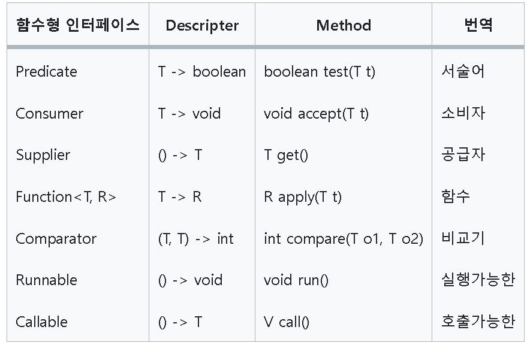
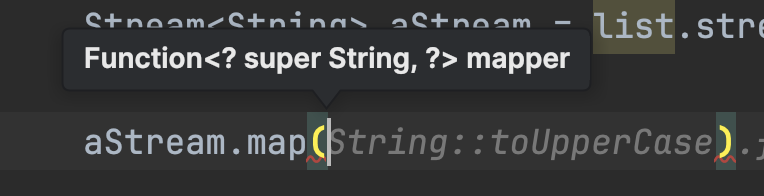
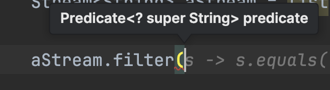
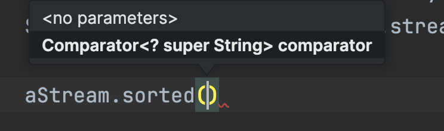
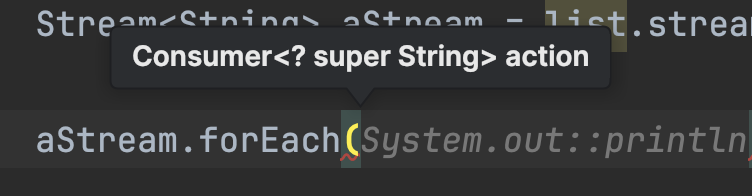

## Java Stream
> - Java 8부터 추가된 기술로 람다를 활용해 배열과 컬렉션을 함수형으로 간단하게 처리할 수 있는 기술
> - 기존의 for문과 Iterator를 사용하면 코드가 길어져서 가독성과 재사용성이 떨어지며 데이터 타입마다 다른 방식으로 다뤄야하는 불편함
> - 데이터 소스를 추상화하고, 데이터를 다루는데 자주 사용되는 메소드 정의
>   - 데이터 소스에 상관없이 모두 같은 방식으로 다룰 수 있으므로 코드의 재사용성 증가

## Stream의 특징
> - 데이터 소스를 변경하지 않고, 읽기만 한다.
> - 데이터 소스를 한 번만 탐색한다. 한 번 사용하면 닫혀서 재사용 불가능
> - 최종 연산 전까지 중간 연산을 하지 않는다.
>- 병렬 처리가 가능하다.
>  - parallelStream()
>  - 멀티쓰레드를 사용한다.
> - 기본형 스트림을 제공한다.
>   - `Stream<Integer>` 대신 `IntStream`을 사용하면 Boxing, Unboxing이 발생하지 않아 성능이 향상된다.
>   - `.sum()`, `.average()` 등의 메소드를 사용할 수 있다.

## Stream 사용 절차
### 1. 스트림 만들기 
- 배열 스트림 : Arrays.stream()
```java
String[] arr = new String[]{"a", "b", "c"};
Stream<String> stream = Arrays.stream(arr);
```
- 컬렉션 스트림 : Collection.stream()
```java
List<String> list = Arrays.asList("a","b","c");
Stream<String> stream = list.stream();
```

- Stream.builder()
```java
Stream<String> builderStream = Stream.<String>builder()
    .add("a").add("b").add("c")
    .build();
```

- Stream.generate().iterate()
```java
Stream<String> generatedStream = Stream.generate(()->"a").limit(3);
// 생성할 때 스트림의 크기가 정해져있지 않기(무한하기)때문에 최대 크기를 제한해줘야 한다.

Stream<Integer> iteratedStream = Stream.iterate(0, n->n+2).limit(5); //0,2,4,6,8
```

- 기본 타입형 스트림
```java
IntStream intStream = IntStream.range(1, 5); // [1, 2, 3, 4]
```

- 병렬 스트림
```java
Stream<String> parallelStream = list.parallelStream();
```

### 2. 중간 연산 (가공)
- Filtering
  - 스트림 내 요소들을 하나씩 평가해서 걸러내는 작업
  - if문 역할
```java
List<String> list = Arrays.asList("a","b","c");
Stream<String> stream = list.stream()
	.filter(list -> list.contains("a"));
    // 'a'가 들어간 요소만 선택  [a]
```

- Mapping
  - 스트림 내 요소들을 하나씩 다른 요소로 변환하는 작업
```java
Stream<String> stream = list.stream()
	.map(String::toUpperCase);
	//[A,B,C]
        
        .map(Integer::parseInt);
        // 문자열 -> 정수로 변환
```

- Sorting
  - 스트림 내 요소들을 정렬하는 작업
```java
Stream<String> stream = list.stream()
	.sorted() // [a,b,c] 오름차순 정렬
        
        .sorted(Comparator.reverseOrder()) // [c,b,a] (내림차순)
    
List<String> list = Arrays.asList("a","bb","ccc");
Stream<String> stream = list.stream()
	.sorted(Comparator.comparingInt(String::length)) // [ccc,bb,a] //문자열 길이 기준 정렬
```

### 3. 최종 연산(결과)
- Calculating
  - 기본형 타입을 사용하는 경우 스트림 내 요소들로 최소, 최대, 합, 평균 등을 구하는 연산을 수행할 수 있다.
```java
IntStream stream = list.stream()
    .count()   //스트림 요소 개수 반환
    .sum()     //스트림 요소의 합 반환
    .min()     //스트림의 최소값 반환
    .max()     //스트림의 최대값 반환
    .average() //스트림의 평균값 반환
```

- Reducing
  - 스트림 내 요소들을 하나로 줄이는 작업
```java
IntStream stream = IntStream.range(1,5);
    .reduce(10, (total, num) -> total+num);
    //reduce(초기값, (누적 변수,요소)->수행문)
    // 10 + 1+2+3+4+5 = 25
```

- Collecting
  - 스트림의 요소를 원하는 자료형으로 변환
```java
//예시 리스트
List<Person> members = Arrays.asList(new Person("lee",26),
                                     new Person("kim", 23),
                                     new Person("park", 23));
                    
// toList() - 리스트로 반환
members.stream()
    .map(Person::getLastName)
    .collect(Collectors.toList());
    // [lee, kim, park]
    
// joining() - 작업 결과를 하나의 스트링으로 이어 붙이기
members.stream()
    .map(Person::getLastName)
    .collect(Collectors.joining(delimiter = "+" , prefix = "<", suffix = ">");
    // <lee+kim+park>
    
//groupingBy() - 그룹지어서 Map으로 반환
members.stream()
    .collect(Collectors.groupingBy(Person::getAge));
    //age가 key고 List<Person>이 value인 Map 반환
    // {26 = [Person{lastName="lee",age=26}],
    // 23 = [Person{lastName="kim",age=23}, Person{lastName="park",age=23}]}
    
//collectingAndThen() - collecting 이후 추가 작업 수행
members.stream()
    .collect(Collectors.collectingAndThen(Collectors.toSet(),
                                          Collections::unmodifiableSet));
    //Set으로 collect한 후 수정불가한 set으로 변환하는 작업 실행
```

- Matching
  - 스트림 내 요소들이 특정 조건을 만족하는지 확인
  - allMatch(), anyMatch(), noneMatch()
```java
List<String> members = Arrays.asList("Lee", "Park", "Hwang");
boolean matchResult = members.stream()
                        .anyMatch(members->members.contains("w")); //w를 포함하는 요소가 있는지, True

boolean matchResult = members.stream()
                        .allMatch(members->members.length() >= 4); //모든 요소의 길이가 4 이상인지, False

boolean matchResult = members.stream()
                        .noneMatch(members->members.endsWith("t")); //t로 끝나는 요소가 하나도 없는지, True
```

- Iterating
  - 스트림 내 요소들을 하나씩 탐색하는 작업
  - forEach()
```java
members.stream()
    .map(Person::getName)
    .forEach(System.out::println);
    //결과를 출력
```

- Finding
  - 스트림 내 요소들 중 특정 조건을 만족하는 요소를 찾는 작업
  - findFirst(), findAny()
```java
Person person = members.stream()
                    .findAny()   //먼저 찾은 요소 하나 반환, 병렬 스트림의 경우 첫번째 요소가 보장되지 않음
                    .findFirst() //첫번째 요소 반환
```
---

## Stream과 for ~ loop의 성능 차이를 비교해 주세요
> - Stream API에는 forEach()가 있어서 for문이랑 Stream API의 성능이 많이 비교된다.
> - 결론부터 말하면 for문이 훨씬 빠르다.

### 1. for문은 단순 인덱스 기반이다.
> - for문은 단순 인덱스 기반으로 도는 반복문으로 직접적으로 메모리 접근을 해서 빠르다.
> - Stream API는 추가적인 추상화 레이어를 통해 추가 오버헤드가 발생한다.
>   - JVM이 이것저것 처리해줘야 하는 것들이 많이 실행 시 느릴 수 밖에 없다.

### 2. for문은 컴파일러가 최적화를 시킨다.
> - stream은 java8부터 지원한 것이고 for문은 그보다 훨씬 오래전부터 계속 사용해왔다.
> - 그만큼 컴파일러는 오래 사용된 for문에 대한 처리가 되어있어, for문을 사용할 때, 미리 최적화를 시킬 수 있지만,
> - Stream은 아직 그만큼의 정보가 없어 최적화를 수행할 수 없다.

> 그래도 가독성이 좋고 stream이 제공해주는 함수들이 너무 간단해서 쓰면 좋은 경우들이 많다.

## Stream은 병렬처리 할 수 있나요?
> 너무 나도 간단하다.
> parallelStream()을 사용하면 된다.
> 혹은 나중에 stream.parallel()을 사용해도 된다.

```java
public long parallelSum(long n) {
    return Stream.iterate(1L, i -> i + 1)
            .limit(n)
            .parallel() // 스트림을 병렬 스트림으로 변환한다.
            .reduce(0L, Long::sum);
}
```

## Stream에서 사용할 수 있는 함수형 인터페이스에 대해 설명해 주세요.
### 함수형 인터페이스
> - 1개의 추상 메소드를 갖는 인터페이스
> - 여러 개의 디폴트 메서드가 있더라도 추상 메서드가 오직 하나면 함수형 인터페이스다.
> - 자바의 람다 표현식은 함수형 인터페이스로만 사용 가능하다.
>   - Stream에서 사용되는 람다식들은 모두 함수형 인터페이스를 구현한 구현체 객체다.
> - 

#### map


#### filter


#### sorted


#### forEach


## 가끔 외부 변수를 사용할 때, final 키워드를 붙여서 사용하는데 왜 그럴까요? 꼭 그래야 할까요?
> Java에서 외부 변수를 람다 표현식이나 익명 클래스 내부에서 사용할 때 `final`키워드를 붙이는 것은 해당 변수가 `effectively final`이어야 하기 때문이다.

### effectively final
> - 한 번 할당된 이후에 값이 변경되지 않는 변수

### why?
> - 불변성 보장
>   - 람다 표현식이나 익명 클래스가 실행되는 시점은 그것을 포함하고 있는 메소드와 다를 수 있다.
>   - 외부에서 정의된 변수를 참조할 때, 그 변수의 값이 변경되면 예상치 못한 결과가 나올 수 있다.
>   - 따라서 외부 변수를 람다 표현식이나 익명 클래스에서 사용할 때, 불변성을 보장하기 위해 `final` 키워드를 붙여야 한다.
> - 스레드 안전성
>   - 멀티쓰레드 환경에서 변수의 값이 여러 쓰레드에 의해 변경될 수 있는 경우 데이터 무결성 문제 발생
>   - final로 하면 문제 예방