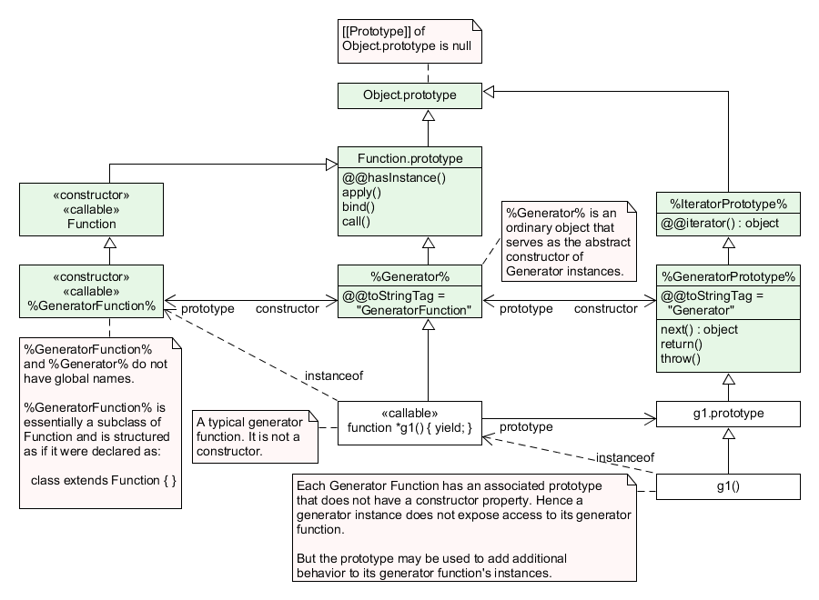

## 제너레이터란?
`제너레이터`란, **`반복 루프`의 동작을 `제어`** 하는데 사용 가능한 `루틴` 을 말합니다.  
- `루틴`: 프로그램 실행 동안 `반복적으로 호출 및 사용`하도록 의도된 `코드 시퀀스`입니다. [#](https://www.geeksforgeeks.org/difference-between-routine-and-process/)

모든 `제너레이터`는 `반복자(Iterator)`이며, `값의 시퀀스`를 생성한다는 점에서 *`배열을 반환하는 함수`와 유사하지만* 한 번에 값을 모두 반환하지 않고 `한 번에 하나의 값`을 `생성`한다는 점이 다릅니다.  
`제너레이터`는 1975년 `CLU`라는 언어에서 처음 등장했으며, 이후 `Python`, `C#`, `Ruby`, `PHP` 등 다양한 언어에서 구현되어 사용되고 있습니다.  

## Javascript의 제너레이터
Javascript에서 `제너레이터`는 [`ES6`에서 도입](https://262.ecma-international.org/6.0/#sec-generator-function-definitions)되었습니다.  
`제너레이터`는 `제너레이터 함수`에 의해 생성되는 객체로 *실행이 연속적이지 않은 함수*의 **실행 결과 값**을 반복(`Iterator`) 형태로 반환하는 객체입니다.  
`제너레이터 객체`는 [`iterable`, `iterator` 프로토콜](https://developer.mozilla.org/en-US/docs/Web/JavaScript/Reference/Iteration_protocols#the_iterator_protocol)을 만족하는 객체로, [`Iterator`](https://developer.mozilla.org/en-US/docs/Web/JavaScript/Reference/Global_Objects/Iterator) 클래스의 `서브 클래스`입니다.  
따라서 `Iterator`의 `next()` 메서드를 상속받기 때문에, 이를 통해 `동작 흐름`을 `진행` 및 `중단`시키며 `값을 생산`해내는 용도로 주로 사용됩니다.  

```js
// ReferenceError: Generator is not defined
const abc = new Generator();
// function* 키워드의 익명함수를 통한 제너레이터 생성
const abcd = (function* a(){})();
console.log(abc.constructor);
// GeneratorFunction {prototype: Generator, Symbol(Symbol.toStringTag): 'GeneratorFunction'}
```

`제너레이터`는 오직 `제너레이터 함수`에 의해서만 생성되며, `Generator()`와 같은 특정한 생성자가 존재하지 않습니다.  
또한 `제너레이터`와 `제너레이터 함수`는 global한 이름이 없는, 즉 `전역 객체(global object)`가 아니기 때문에 `Generator`나 `GeneratorFunction`과 같은 키워드로 접근할 수 없습니다.  

```js
function* gen() {yield 10;}
gen.prototype === gen().__proto__; // true
```

`제너레이터 함수`가 호출되면, 그 함수의 `prototype`은 *함수 호출의 결과로 생성된 객체*, 즉 `제너레이터`의 `prototype`이 됩니다.  
따라서 `Generator.prototype`으로 언급되는 것들은 실제로 `제너레이터 함수의 프로토타입의 프로토타입` 입니다. 즉, `GeneratorFunction.prototype.prototype` 인 것입니다.  

### 제너레이터 함수(`GeneratorFunction`)
`제너레이터 함수`란, 함수 호출 결과값으로 `제너레이터`를 반환하는 일련의 함수들을 말합니다.  
`제너레이터 함수`는 `function*` 또는 `Generator`의 프로토타입(`[Generator].prototype`)에서 접근할 수 있는 `GeneratorFunction()`에 의해서만 생성될 수 있습니다.  

```js
function* abc() {
    yield 10;
}
console.log(abc.__proto__)
// === 출력 ===
// GeneratorFunction {prototype: Generator, Symbol(Symbol.toStringTag): 'GeneratorFunction'}
	// constructor: ƒ GeneratorFunction()
	// prototype: Generator {Symbol(Symbol.toStringTag): 'Generator', next: ƒ, return: ƒ, throw: ƒ}
	// Symbol(Symbol.toStringTag): "GeneratorFunction"
// !!!주의할 점!!!
// 제너레이터 함수의 프로토타입을 확인하겠다고 [GeneratorFunction].prototype을 확인하게 되면
// 이는 GeneratorFunction.prototype.prototype,
// 즉 진짜 GeneratorFunction.prototype이 갖고 있는 prototype이라는 프로퍼티를 확인하게 
// 되는 것이므로 __proto__로 확인해야 한다!
```

`제너레이터 함수`들은 모두 `GenerationFunction` 객체이며, `GeneratorFunction`은 `prototype`에 생성자인 `constructor`와 제너레이터들이 물려받을 프로토타입인 `prototype` 프로퍼티를 갖고 있습니다.  
참고로 `화살표 함수`의 경우, *`yield` 키워드를 포함할 수 없기 때문에* `제너레이터 함수`를 만드는데 **사용할 수 없습니다**. (다만 내부에 `제너레이터 함수`를 포함하는 경우, 해당 `제너레이터 함수` 내부에서는 `yield` 키워드를 사용할 수 있습니다.) [#](https://www.codeproject.com/Articles/5279077/Understanding-JavaScript-Generators)  

### 제너레이터 프로토타입

```js
function* abc() {
    yield 10;
}
console.log(abc.prototype) // Generator {}
```

 `GeneratorFunction.prototype`에는 **모든 `제너레이터 함수`들이 공유**하는 `prototype` 프로퍼티가 존재합니다.  
 이 `프로퍼티`는 *제너레이터 함수를 통해 생성된* `제너레이터의 프로토타입`, 즉 `Generator.prototype` 입니다.  
 다르게 말하자면, `제너레이터 함수`를 통해 생성된 제너레이터는 함수의 `prototype` 프로퍼티를 `직접 상속`합니다.  
 기본적으로 `제너레이터`의 프로토타입에는 부모인 `Iterator` 객체로부터 물려받은 3가지 메서드가 존재합니다.  
#### 프로토타입 구조도

> 출처: [ECMAScript® 2016 Language Specification (ecma-international.org)](https://262.ecma-international.org/7.0/#sec-generatorfunction-objects)


> 출처: [GeneratorFunction.prototype.prototype - JavaScript | MDN (mozilla.org)](https://developer.mozilla.org/en-US/docs/Web/JavaScript/Reference/Global_Objects/GeneratorFunction/prototype)


#### `next(value)` [문서](https://developer.mozilla.org/en-US/docs/Web/JavaScript/Reference/Global_Objects/Generator/next)

```js
function* gen() {
  yield 1;
  yield 2;
  yield 3;
}
const g = gen();
g.next(); // { value: 1, done: false }
g.next(); // { value: 2, done: false }
g.next(); // { value: 3, done: false }
g.next(); // { value: undefined, done: true }
```

`next()`는 호출 시, `제너레이터 함수` 내용에서 함수 끝에 다다르거나, 다음 `yield`을 만날 때까지 계속 진행하도록 하는 함수입니다.  
또한, `next()` 메서드는 항상 `done` 과 `value` 두가지 프로퍼티를 갖는 객체를 반환합니다.  
`done`은 만약 `return 문` 또는 `함수의 끝`에 다다랐다면 `true`이며, 만약 함수가 더 값을 생성할 수 있는 경우 `false`입니다.  
`value`는 `제너레이터 함수` 내용을 진행해 마주한 `yield` 키워드 또는 `return` 키워드에 달려있는 표현식의 결과 값입니다.  

```js
function* gen() {
  while (true) {
    const value = yield;
    console.log(value);
  }
}

const g = gen();
g.next(1); // { value: undefined, done: false }을 반환합니다.
// 첫 번째 next() 호출에 전달된 인자는 무시되고 undefined로 전달됩니다.
g.next(2); // Returns { value: undefined, done: false }
// console에 2가 출력됩니다.
```

만약 `next()` 메서드에 인자값을 전달했다면, 해당 값은 `next()`가 원래 반환했어야 할 `yield` 표현식의 값을 대신합니다. 예를 들어, `variable = yield [표현식]`이라는 코드가 있다면, `next()`에 전달된 값은 `variable`에 `yield [표현식]` 대신 할당되는 것입니다.  

#### `return()` [문서](https://developer.mozilla.org/en-US/docs/Web/JavaScript/Reference/Global_Objects/Generator/return)

```js
function* gen() {
  yield 1;
  yield 2;
  yield 3;
}

const g = gen();

g.next(); // { value: 1, done: false }
g.return("foo"); // { value: "foo", done: true }. 
// return 문을 호출했기 때문에 이후의 흐름은 진행되지 않으며, 제너레이터 내용은 종료됩니다.
g.next(); // { value: undefined, done: true }
```

`return()`은 호출시 `제너레이터 내용`의 현재 `중단된(suspended) 위치`에 `return`문을 삽입한 것처럼 동작하여, `제너레이터`를 종료하고 `try..finally` 블록이 있다면 해당 블록의 작업을 수행하도록 합니다.  
`next()`와 마찬가지로, `done`과 `value` 두 프로퍼티를 갖는 객체를 반환합니다.  
`done`의 경우 "*`제너레이터`가 `try..finally` 블록 내부에서 일시 중단되었으며, `finally` 블록에 `yield` 표현식이 존재하는 경우*" 에만 `true`이며, 이외의 경우에는 `false` 값을 갖습니다.  
`value`는 웬만한 경우 `return()`에서 주어진 인자값이지만, "`try...finally` 블록에 `yield` 표현식이 존재하는 경우, `finally` 블록에 `yield` 또는 `return`되는 값" 을 반환할 수도 있습니다.  
`return()` 역시 인자값을 전달 받을 수 있는데, 아무 값도 주어지지 않았다면 `undefined`를, 그렇지 않다면 `인자 값을 반환`하게 됩니다.(*반환할 수 있는 경우*)

```js
function* gen() {
  yield 1;
  try {
    yield 2;
    yield 3;
  } finally {
    yield "cleanup";
  }
}
const g1 = gen();
g1.next(); // { value: 1, done: false }

// try...finally 블록에 진입하기 전, return 문을 호출해 제너레이터 실행이 중단됩니다.
g1.return("early return"); // { value: 'early return', done: true }

const g2 = gen();
g2.next(); // { value: 1, done: false }
g2.next(); // { value: 2, done: false }

// 이 위치에서 제너레이터 진행은 `yield 2`와 `yield 3` 사이
// 즉, try...finally 블록 내부에서 중단되어 있습니다.
// 따라서 return 문을 호출해도, finally 블록에 yield 표현식이 존재해
// 해당 표현식의 값을 반환하게 됩니다.
g2.return("이른 return"); // { value: 'cleanup', done: false }

// 이전에 return 문에 전달한 인자는 보존되어, 이후 호출한 next() 문에서 반환됩니다.
// 그리고 제너레이터는 완료 상태(completed state)에 진입합니다.
g2.next(); // { value: 'early return', done: true }

// 완료 상태에 진입했어도, 여전히 return() 호출은 가능하며, 인자 역시 정상적으로 전달되어 동작합니다.
g2.return("not so early return"); // { value: 'not so early return', done: true }

```

위 코드는 `try...finally` 블록이 존재하는 `제너레이터`에서,  `return`문을 `try..finally` 블록 진입 전/진입 후 호출한 케이스와 그에 따른 동작을 설명하고 있습니다.  

#### `throw(exception)` [문서](https://developer.mozilla.org/en-US/docs/Web/JavaScript/Reference/Global_Objects/Generator/throw)
`throw()`은 호출시 `제너레이터`의 현재 `중단된 위치`에 `throw 문`을 삽입해 `제너레이터`에게 오류가 발생했음을 알려 `오류 처리` 및 (*필요하다면*)`정리(cleanup)` 작업을 수행하도록 합니다.  
인자로 던질 예외인 `exception`을 필수로 전달해야하며, `exception`은 원활한 디버깅을 위해 [`Error`](https://developer.mozilla.org/en-US/docs/Web/JavaScript/Reference/Global_Objects/Error)의 인스턴스로 만드는 것이 좋습니다.  
만약 던져진 `exception`이 `try...catch`문에 의해 잡히고, 재개될 경우  *`next()`, `return()`과 마찬가지로*, `done`과 `value` 두 프로퍼티를 갖는 객체를 반환합니다.  
반대로, `exception` 이 잡히지 않는다면 이는 `제너레이터` 외부로 던져집니다.  

```js
function* gen() {
  while (true) {
    try {
      yield 10;
    } catch (e) {
      console.log("Error caught!");
    }
  }
}

const g = gen();
g.next();
// { value: 42, done: false }
g.throw(new Error("Something went wrong"));
// "Error caught!"
// { value: 42, done: false }
```

위 코드는 `next()`문을 통해, 먼저 `try-catch` 구문 내에서 중단되게 한 뒤 `에러`를 `throw`해 `catch`문에서 처리되도록 동작합니다.  

### 제너레이터의 동작 방식 [참고 글](https://ko.javascript.info/generators)
`제너레이터 함수`는 내부에 특수한 연산자인 `yield`를 포함할 수 있습니다. 이를 통해 제너레이터는 동작을 중지 및 재개할 수 있습니다.  
`제너레이터`가 갖고있는 `next()` 메서드를 호출하면, 가장 가까운 `yield [값]` 문을 만날 때 까지 `제너레이터 함수`에 기술된 동작이 계속 진행됩니다.  
이후 `yield [값]` 문을 만나면 실행을 중단하고 `[값]`을 외부에 반환합니다.(`[값]`을  생략할 수도 있는데, 이때는 `undefined`가 반환됩니다.)  

```js
function* abc() {
	yield 10; // 1
	return 5; // 2
}
const gen = abc();
gen.next(); // 1번을 실행. {value: 10, done: false} 을 반환
gen.next(); // 2번를 실행. {value: 5, done: true} 를 반환
gen.next(); // {value: undefined, done: true} 를 반환
```

`제너레이터`의 실행은 `제너레이터 함수`의 끝에 다다를 때 까지 계속되며, 함수의 마지막 `yield`또는 `return`문 이후에는 `{value: undefined, done: true}` 객체만 반환하게 됩니다.  

#### 제너레이터의 `Iterable` 특성
`제너레이터`는 `Iterator`의 서브 클래스이므로 상기한대로 `Iterable` 프로토콜을 만족하며, `for..of` 문을 사용할 수 있습니다.  

```js
function* abc() {
	yield 1;
	yield 2;
	return 3;
}
const gen = abc();
for(let a of gen) {
	console.log(a); // 1, 2 출력됨
}
```

다만, 주의할 점이 있는데 `for..of`문을 사용할 때 반환된 값이 `done:true`인 경우 `값(value)`이 무시된다는 것입니다.  
따라서 *마지막 값까지 출력되길 원한다면* `return` 보다 `yield`를 사용해 값을 반환해야 합니다.  
또한, `끊임없이 값을 생성`하는 `제너레이터`를 `for..of`문에서 사용할 경우 무한 반복으로 스크립트가 멈추므로, `for문` 내부에 `break` 또는 함수 내부에 `return`문을 포함해야 합니다.  

```js
function* abc() {
	yield 1;
	yield 2;
	return 3;
}
const arr = [0, ...abc()];
console.log(arr); // (3) [0, 1, 2]
```

또한 `제너레이터`는 위처럼 `전개 구문(Spread Syntax)`을 사용할 수 있습니다.  

#### `yield` 위임하기(제너레이터 컴포지션)
`제너레이터`에서 `yield*` 연산자를 사용하면, 다른 `제너레이터` 또는 `이터러블 객체(즉, 이터레이터)`에게 `yield`를 위임할 수 있습니다.  

```js
const gen = (function* () {
	yield* [1, 2, 3, 4, 5]; // 참고: 자바스크립트에서 배열은 Iterable 객체이다.
})(); // IIFE(즉시실행함수표현) 으로 제너레이터를 바로 할당한다.
for(const v of gen) {
	console.log(v); // 1, 2, 3, 4, 5가 각각 차례대로 출력된다.
}
const gen2 = (function* () {
	yield* (function* () {yield* [1, 2, 3, 4, 5]})(); // 배열에 yield를 위임한 제너레이터(IFFE 표현을 통해 생성한)에 다시 yield를 위임한다.
})();
for(const v of gen2) {
	console.log(v); // 1, 2, 3, 4, 5가 각각 차례대로 출력된다.
}
```

따라서 위 예시처럼, `배열`과 같은 `이터러블 객체`에 `yield`를 위임할 수도 있고, 다른 `제너레이터`에게 `yield`를 위임할 수도 있습니다.  
위임할 경우 `이터레이터`가 `닫힐 때까지(즉, done: true 가 될 때 까지` 함수를 진행하며, 해당 `이터레이터`가 반환한 값을 반환하게 됩니다.  
`yield*` 키워드를 사용하게 되면, 먼저 해당 `이터레이터`를 `[Iterator]()`를 통해 얻어오고, 이후 `next()`  메서드를 반복적으로 호출합니다.(이때, `제너레이터`의 `next()`에 인수가 있다면 이를 `이터레이터`의 `next()`에 전달합니다.) 이후 `이터레이터`의 `next()`가 반환한 객체와 동일한 객체를 반환합니다.  
- 이때, 첫 번째 `next()` 호출의 인자는 무조건 무시됩니다. 즉, `undefined`로 전달됩니다.  

```js
const iterable = {
  [Symbol.iterator]() {
    let count = 0;
    return {
	// Iterable은 Iterator의 next, return, throw 동작을 아래와 같이 재정의한 객체입니다.
      next(v) {
        console.log("next called with", v);
        count++;
        return { value: count, done: false };
      },
      return(v) {
        console.log("return called with", v);
        return { value: "iterable return value", done: true };
      },
      throw(v) {
        console.log("throw called with", v);
        return { value: "iterable thrown value", done: true };
      },
    };
  },
};

function* gf() {
  yield* iterable;
  return "gf return value";
}

const gen = gf();
console.log(gen.next(10));
// next called with undefined; 첫 번째 next() 호출의 인자는 무조건 무시됩니다.
// { value: 1, done: false }
console.log(gen.next(20));
// next called with 20
// { value: 2, done: false }
console.log(gen.return(30));
// return called with 30
// { value: 'iterable return value', done: true }
```

반환 값 위임은 `제너레이터`의 `return()`, `throw()`문에도 동일하게 적용되어, 내부 `제너레이터`가 `throw()`/`return()` 문을 호출할 경우 외부 `제너레이터` 역시 동일하게 해당 함수를 호출하며 인자 역시 내부의 것과 동일하게 전달됩니다.  

#### `yield`를 통한 값 주고받기
상기한대로, `제너레이터`는 `yield`를 통해 값을 생산(바깥으로 전달)하고, `next()` 메서드의 매개변수를 통해 내부로 값을 전달받기도 합니다.  
이를 활용해, `제너레이터`와 값을 주고 받는 것이 가능합니다.  

```js
function* gen() {
  // yield 표현식을 통해 "2 + 2 = ?"라는 문자열을 밖으로 내보냅니다.
  let result = yield "2 + 2 = ?"; // (#)

  console.log(result);
}

let generator = gen();

// yield 표현식을 통해 반환된 객체의 값을 추출합니다.
// 다시 한 번 얘기하자면, 첫 번째로 호출한 next()는 인자 값을 무시하기 때문에
// 여기서 인자값을 넘겨주지 않습니다.
let question = generator.next().value; // "2 + 2 = ?"; 
// 제너레이터는 동작 수행 후 `(#)` 위치에서 동작을 잠시 멈춥니다. (suspended)

// next(value)를 호출해 내부로 값을 전달합니다.
// 아래의 경우 인자로 주어진 4가, 제너레이터 함수 내부의 result에 대입됩니다.
// 따라서 console.log()에 4가 전달됩니다.
generator.next(4); // "4"
```

# 참고
- [ECMAScript® 2016 Language Specification](https://262.ecma-international.org/7.0/#sec-generatorfunction-constructor)
- [제너레이터 (javascript.info)](https://ko.javascript.info/generators)
- [Understanding JavaScript Generators - CodeProject](https://www.codeproject.com/Articles/5279077/Understanding-JavaScript-Generators)
- [yield - JavaScript | MDN (mozilla.org)](https://developer.mozilla.org/en-US/docs/Web/JavaScript/Reference/Operators/yield)
- [Generator - JavaScript | MDN (mozilla.org)](https://developer.mozilla.org/en-US/docs/Web/JavaScript/Reference/Global_Objects/Generator#see_also)
- [GeneratorFunction.prototype.prototype - JavaScript | MDN (mozilla.org)](https://developer.mozilla.org/en-US/docs/Web/JavaScript/Reference/Global_Objects/GeneratorFunction/prototype)
- [Generator.prototype.next() - JavaScript | MDN (mozilla.org)](https://developer.mozilla.org/en-US/docs/Web/JavaScript/Reference/Global_Objects/Generator/next)
- [Generator.prototype.return() - JavaScript | MDN (mozilla.org)](https://developer.mozilla.org/en-US/docs/Web/JavaScript/Reference/Global_Objects/Generator/return)
- [Generator.prototype.throw() - JavaScript | MDN (mozilla.org)](https://developer.mozilla.org/en-US/docs/Web/JavaScript/Reference/Global_Objects/Generator/throw)