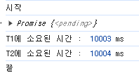
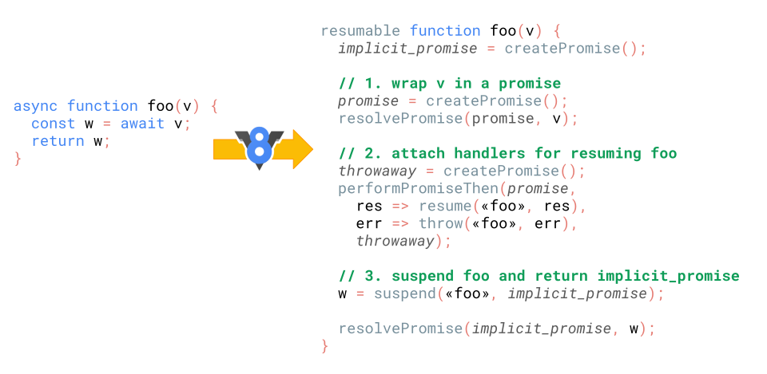
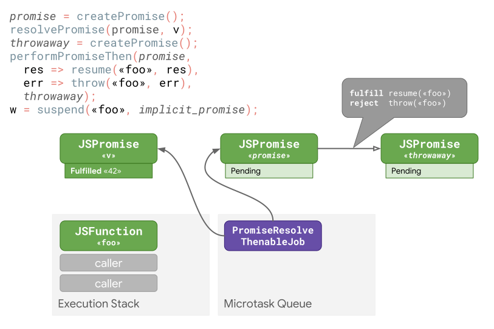
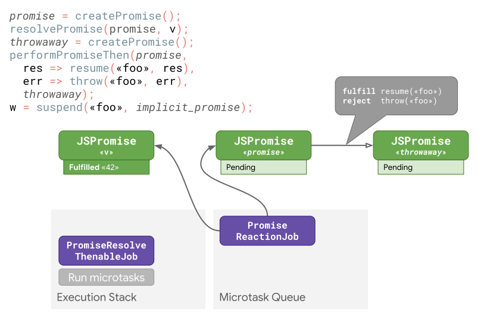

# `async function` - `await`는 어떻게 동작할까?
## `async/await`란?
`async function`이란, 여러 `Promise`간의 흐름을 순서대로 처리할 수 있는, 즉 여러 비동기 함수들을 동기적인 순서로 진행할 수 있는 함수를 말합니다.  
`async function`은 0개 이상의 `await` 키워드를 포함할 수 있는데, 함수를 진행하다 `await`가 달린 `Promise`를 만나게 되면 해당 `Promise`가 *`이행`/`거부`될 때 까지* **함수 실행을 `일시 중단`** 하며 처리가 완료된 뒤 다시 진행됩니다.  
즉, `Promise`를 반환하는 함수를 동기식인 것처럼 동작하도록 해줍니다.  
- 이는 `await` 이후의 코드를 `Promise.then()` 콜백에서 수행하는 것과 거의 유사
```js
// 일반 Promise와 callback 예시
function getProcessedData(url) {
  return downloadData(url) // returns a promise
    .catch((e) => downloadFallbackData(url)) // returns a promise
    .then((v) => processDataInWorker(v)); // returns a promise
}

// 위 예시를 async function - await로 변환한 예시
async function getProcessedData(url) {
  let v;
  try {
    v = await downloadData(url);
  } catch (e) {
    v = await downloadFallbackData(url);
  }
  return processDataInWorker(v);
}
```

또한, `async function`은 항상 `Promise`를 `반환`하며, 만약 *Promise가 아닌 값*을 반환(`심지어 아무것도 return하지 않아도!`)하는 경우 *암시적으로* `Promise`로 래핑되어 반환됩니다.  
```js
// Promise가 아닌 값을 반환하는 경우
const abc = async () => 1;
abc(); // Promise {<fulfilled>: 1}

// 아무것도 반환하지 않는 경우
const none = async () => {};
none(); // Promise {<fulfilled>: undefined}
```
### `async/await`의 특징
#### 어떠한 값이든 `await` 할 수 있음
웬만한 경우, `Promise` 앞에 `await` 키워드를 붙여 비동기 작업의 결과를 기다리도록 합니다.   
하지만 실제로는 어떠한 `Javascript 값`이든 기다리게 할 수 있습니다.  
만약 `await` 키워드 뒤에 오는 `표현식`의 값이 `Promise`가 아닌 경우, 이를 `Promise`로 변환합니다.  
예를들어, `25`와 같은 아무런 숫자도 `await`를 붙일 수 있는 것입니다.  
```js
async function foo() {
  const v = await 25;
  return v;
}

const p = foo();
// → Promise

p.then(console.log);
// `25`를 출력한다.
```
#### `await` 은 어떠한 `thenable` 객체와도 정상 동작함
`await` 키워드는 어떤 객체든 `then` 메서드만 있다면 꼭 `Promise`가 아니어도 잘 동작하게 됩니다.  
```js
class Sleep {
  constructor(timeout) {
    this.timeout = timeout;
  }
  then(resolve, reject) {
    const startTime = Date.now();
    setTimeout(() => resolve(Date.now() - startTime),
               this.timeout);
  }
}

(async () => {
  const actualTime = await new Sleep(1000);
  console.log(actualTime);
})();
```

## `async function` 내부의 `await` 동작
`async function`은 일반 함수처럼 진행되다가, `await` 키워드가 달린 `Promise`를 만나게 될 경우, 해당 `Promise`가 `resolve(또는 reject)`될 때까지 `async function`의 실행을 일시 중단합니다.  
이때, Javascript의 `논-블로킹` 특성상, `await` 키워드로 인해 *함수 실행이 멈추더라도* `다른 연산`들은 `백그라운드에서 계속 진행`됩니다.  
이는 [콜백 vs async] 에서 언급한 것처럼, `Javascript`에서는 코드 실행을 수행하는 `메인 스레드` 뿐만 아니라, `타이머 기반 작업`, `네트워크 요청` 등의 `비동기 작업`을 처리하는 `Web API`를 사용하기 때문입니다.  
즉, 만약 상기한 `비동기 작업`을 마주한다 해도 `메인 스레드`는 이를 *직접 처리하지 않고* `Web API`에게 이를 `전달`합니다. 따라서 해당 작업이 완료되길 `기다리지 않고` 이어지는 코드들을 `계속 실행`하게 됩니다.  
### 그렇다면 `async/await`는 진짜 동기적으로 동작할까?
```js
let t1 = new Promise((resolve) => {  
	setTimeout(() => resolve('첫 번째 타이머'), 10000);  
});  
  
let t2 = new Promise((resolve) => {  
	setTimeout(() => resolve('두 번째 타이머'), 10000);  
});
```
> 코드 1

위처럼 각각 10초 이후 문자열을 `resolve`하는 타이머 `t1`, `t2`를 예로 들어보겠습니다.  
만약 이 둘을 `async function` 내부에서 `await`를 달아주면 어떻게 동작할까요?  
10초짜리 타이머 2개가 동기적으로 호출될 것이니, 20초가 소요될까요?  
```js
async function test() {
	console.log("시작");
	let t1 = new Promise((resolve) => {  
		setTimeout(() => resolve('첫 번째 타이머'), 10000);  
	});  
	  
	let t2 = new Promise((resolve) => {  
		setTimeout(() => resolve('두 번째 타이머'), 10000);  
	});
	let startTime = Date.now();
	
	let result1 = await t1;
	console.log("T1에 소요된 시간 : ", Date.now() - startTime, "ms");
	
	let result2 = await t2;
	console.log("T2에 소요된 시간 : ", Date.now() - startTime, "ms");
	
	console.log("끝");
}

test(); // ?
```
> 코드 2

  
하지만, 실제로는 두 타이머 작업을 수행하는데에 총 10초밖에 들지 않았습니다.  
그렇다면 작업이 동기적으로 수행되지 않은 걸까요?  
이를 이해하려면 Javascript Event Loop 내부 동작이 어떻게 수행되는지 알아야 합니다.  
### Event Loop 내부의 `async/await` 동작
간단하게 설명하면, `Event Loop`는 Javascript 코드를 한 줄 한 줄 실행하면서, 지속적으로 `메시지 큐`에 `보류(Pending)중인 메시지`(ex. `resolve`된 `Promise`)를 확인하며 하나 하나 처리합니다.  
즉, `t1`, `t2`를 초기화하는 `코드 1` 코드를 `메인 스레드`가 읽고 실행한 순간, 백그라운드에서 해당 타이머 작업은 `Web API`에게 전달되어 실행되고 있는 것입니다.  
- `Promise()`의 첫 번째 인자로 주어진 함수는 즉시 실행됩니다.  

따라서 `t1`, `t2`는 백그라운드에서 동시에 실행되고 있으며, `메인 스레드`는 이후 이어지는 코드(`코드 2`)들을 계속 실행해나갑니다.  
그리고 `test()` 내부의 `await t1`에 도달했을 때, `t1`이 `resolve`될 때 까지 기다렸다가 코드 진행을 계속 이어나갑니다.  
`t1`과 `t2` 모두 10초짜리 타이머이므로, `t1`이 완료됨과 거의 동시에 `t2`도 완료되게 됩니다. 따라서 `await t2`는 거의 기다리지 않고 이후 코드들이 즉시 실행되게 됩니다.  
```js
let t1 = new Promise((resolve) => {  
	setTimeout(() => resolve('첫 번째 타이머'), 10000);  
});  
  
let t2 = new Promise((resolve) => {  
	setTimeout(() => resolve('두 번째 타이머'), 5000);  
});
```
만약 `t2`를 5초로 줄이더라도, 백그라운드에서는 `t2`가 `t1`보다 먼저 완료되지만 `test()` 함수의 동작은 이전과 동일하게 작동합니다.  
### `async/await`을 사용하면, 비동기 병렬 처리가 불가능한가요?
그렇지 않습니다. `Promise`의 `all` 또는 `allSettled` 함수를 통해 `await` 키워드를 사용하면서 비동기 작업들을 병렬적으로 처리할 수 있습니다.  
```js
async function fetchData() {
	const userDataPromise = fetchUserData();
	const productDataPromise = fetchProductData();
	
	try {
		const [userData, productData] = await Promise.all([userDataPromise, productDataPromise]);
		console.log("User data:", userData);
		console.log("Product data:", productData);
	}catch (error) {
		console.error("Error fetching data:", error);
	}
}
```
위 코드처럼, 병렬로 실행할 `비동기 작업(Promise)`들을 `배열(또는 Iterable 객체)`에 담아 `all` 또는 `allSettled`에 넘겨주면 이들을 병렬적으로 수행하게 됩니다.  
이후 배열의 모든 `비동기 작업`이 완료되면 코드 진행을 이어나갑니다.  
## V8 엔진에서의 내부 await 동작 과정 [#](https://v8.dev/blog/fast-async)
```js
async function foo(v) {
  const w = await v;
  return w;
}
```
위와 같은 함수를 실행한다고 할 때, V8 엔진 내부에서는 아래와 같이 처리가 이뤄집니다.  



1. V8 엔진이 `async function`을 `resumable`(`await` 위치에서 함수 실행을 중단하고 재개할 수 있음을 뜻함)하다고 표시합니다.   
	- 그런 다음 `implicit_promise`(`async function`을 호출할 때 반환되며, 최종적으로 `async function`이 생성한 값을 `resolve`하는 `Promise`)를 생성합니다.  
2. `await`에 전달된 값(여기서는 `v`)을 `Promise`로 래핑합니다.  
3. 만약 `Promise`가 `이행(fulfilled)`되면 `async function`을 `재개`하도록 하는 `핸들러`를 래핑된 `Promise`에 연결합니다.  
4. `async function`의 실행을 `일시 중단(suspend)`한 뒤, 호출자에게 `implicit_promise`를 반환합니다.  
	- 이후 `Promise`가 이행된 경우, `Promise`의 값 `w`와 함께 `async function`이 재개되고 `implicit_promise`는 `w`를 `resolve`합니다.  
## 자세히 살펴보기
위 과정을 하나 하나 살펴보겠습니다.  
참고로 위 예시에서 `await`한 표현식이 *42라는 값으로 이행된* `Promise`라고 가정하겠습니다.  

엔진은 이 `await`된 값을 `promise`라는 `Promise`로 래핑합니다.  
이는 다음 차례에 `Promise`들의 `지연된 연쇄(deferred chaining)`를 수행합니다.  
- `ECMA 사양`에서는 이를 [`PromiseResolveThenableJob`](https://tc39.es/ecma262/#sec-promiseresolvethenablejob)이라고 부릅니다.
  
이후 엔진은 *아무것도 체인으로 연결 되어있지 않고, 완전히 `엔진 내부에 존재`하는* `throwaway`라는 `Promise`를 생성합니다.  
이 `throwaway`는 `async function`을 재개하기 위한 적절한 핸들러와 함께 `promise`와 체이닝됩니다.  
`performPromiseThen`은 `Promise.prototype.then()`이 뒤에서 실제로 수행하는 일이며, 마지막으로 `async function`의 실행이 일시 중단되고 제어권은 호출자에게 반환됩니다.  

호출자측에서 작업이 계속 이어지고, 끝내 `콜 스택`이 비워지게 됩니다.  
이후 `Javascript 엔진`은 `microtask`들을 실행하기 시작합니다.  
- `microtask`(또는 `job`): `I/O`, `타이머` 작업과 같이 한 번에 하나씩 실행되는 비동기 작업인 `task`들이 끝날 때 실행되며, `async/await` 및 `Promise`에 대한 `지연 실행(Task가 완전히 끝난 후에만 실행됨)`을 구현하는 작업. `ES6`에서 `Promise`가 등장함에 따라 함께 추가 됨.  

즉, 이전에 예약해두었던 `PromiseResolveThenableJob`을 실행하게 되는데 이는 `promise`와 `await`에 전달된 값(여기서는 `42`)을 체이닝하기 위한 `PromiseReactionJob`을 예약합니다.  

이어서 `await`한 `Promise`(`v`)의 값으로 `promise`를 이행하고, `throwaway`에 대한 `반응(reaction) 작업`(또다른 `PromiseReactionJob`)을 예약하는 `PromiseReactionJob`을 수행합니다.  


이어지는 두 번째 `PromiseReactionJob`(`throwaway`에 대한 `반응`)은 `resolve`된 값(`42`)을 `throwaway`에 전파하고, 일시 중지 되었던 `async function`의 실행 재개해, `await`에서 `42`라는 값을 반환합니다.  
### `async/await` 작업의 최적화
#### 원인


자세히 살펴본 위 작업 과정에 따르면, 각 `await`에 대해 JS 엔진은 두 개의 추가 `Promise`, 그리고 최소 3개의 `Microtask`가 필요하게 됩니다.  


이 중, 하나의 `Promise`와 2개의 `Microtask`는 위 코드의 맨 위의 두 줄의 코드에 의해 발생합니다.  
```js
promise = createPromise();
resolvePromise(promise, v);
```
이는 심지어 `v`가 이미 `Promise`여도 수행되기 때문에, **`v`가 `Promise`인 경우** 상당히 비싼 오버헤드를 발생시킬 수 있습니다.  
#### 해결
사실 `ECMA 사양`에는 이미 필요할 때만 `Promise`로의 래핑을 수행하는 [`promiseResolve`](https://tc39.es/ecma262/#sec-promise-resolve)라는 작업이 존재합니다.  


즉, 위 두 줄을 `promise = promiseResolve(v)` 단 한 줄로 변경하게 되면, `promise`에는 아무런 변화도 없으며 오직 필요할 경우에만 `Promise`로 래핑하게 됩니다.  
이렇게 하면 이전의 코드에서 `throwaway`를 생성하고, 이를 `v`와 체이닝하는 `PromiseReactionJob`을 예약하는 작업 정도만 남게 됩니다.   
또한, `throwaway`는 `performPromiseThen` 의 API 제약 조건을 충족하기 위해서 존재하는데, [ECMA 사양의 변경](https://github.com/tc39/ecma262/issues/694)으로 더 이상 웬만해서는 `await`을 위해 `throwaway`를 생성할 필요가 없어졌습니다.  

# 참고
- [Demystifying the background Scene of Async/Await in JavaScript | by Rehmat Sayany | Medium](https://rehmat-sayany.medium.com/demystifying-the-background-scene-of-async-await-in-javascript-5e6b8f4eca73)
- [async function - JavaScript | MDN](https://developer.mozilla.org/en-US/docs/Web/JavaScript/Reference/Statements/async_function)
- [How The Async-await Works In JavaScript? • Scientyfic World](https://scientyficworld.org/how-the-async-await-works-in-javascript/)
- [Faster async functions and promises · V8](https://v8.dev/blog/fast-async)
