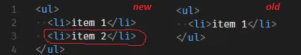
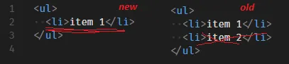
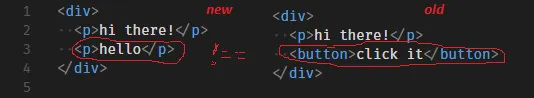
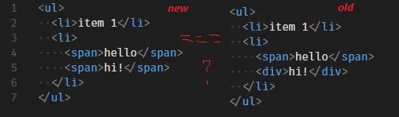

# 가상 DOM 구현해보기
[참고 글 - How to write your own Virtual DOM | by deathmood | Medium](https://medium.com/@deathmood/how-to-write-your-own-virtual-dom-ee74acc13060)
## DOM 트리 Node를 객체로 표현하기
- DOM을 이루는 HTML Element는 다음과 같은 구조의 객체로 표현할 수 있음
```javascript
{ 
	type: '...', 
	props: { '...': '...',	...},
	children: [{...}, ...]
}

// 예시
// <ul class="list"> 
//	 <li> item </li>
// </ul> 은 다음과 같이 표현 가능함
{ 
	type: 'ul',
	props: { 'class': 'list' },
	children: [{
		type: 'li',
		props: {},
		children: ['item']
	}]
}
```
- 그리고 이러한 구조의 JS 객체를 생성하기 위해, 다음과 같은 헬퍼 함수를 사용
```js
function createNode(type, props, ...children) {
	return {type, props, children};
}
```
- 이를 통해, DOM 트리를 다음과 같은 형태로 작성할 수 있음
```js
createNode('ul', {'class': 'list'}, 
	createNode('li', {}, 'item'),
);
```
- 위와 같은 형태는, 실제로 JSX 문법을 트랜스파일 해주는 `Babel`의 방식(v7 이전)과도 유사함
```jsx
// 변환 전 JSX
const profile = (  
	<div>  
		  
		<h3>{[user.firstName, user.lastName].join(" ")}</h3>  
	</div>  
);

// 변환 후
const profile = React.createElement(  
	"div",  
	null,  
	React.createElement("img", { src: "avatar.png", className: "profile" }),  
	React.createElement("h3", null, [user.firstName, user.lastName].join(" "))  
);
```
- 실제로, `/** @jsx createNode */` 라는 주석을 통해, `Babel`에게 우리가 작성한 함수(`node`)를 사용하게 할 수도 있음
```js
/** @jsx createNode */
const a = (
  <ul className="list">
    <li>item 1</li>
    <li>item 2</li>
  </ul>
);

// 위 코드를, babel이 아래와 같이 트랜스파일해줌
const a = (
  createNode(‘ul’, { className: ‘list’ },
    createNode(‘li’, {}, ‘item 1’),
    createNode(‘li’, {}, ‘item 2’),
  );
);
```
## 가상 DOM 표현을 실제 DOM에 적용하기
- 위에서 작성한 표현들을 실제 DOM에 반영하기 위해, 몇 가지 가정을 수립
	1. 실제 DOM Node를 가리키는 변수는 `$`로 시작함. 예를 들어 `$parent`와 같은 이름의 변수는 실제 DOM 엘리먼트 일것.
	2. 가상 DOM 표현은 `node` 라는 이름의 변수로 존재
	3. *React에서처럼*, 오직 하나의 루트 노드만 존재할 수 있음
- 위 가정을 바탕으로, 다음과 같은 가상 DOM 노드 -> 실제 DOM 노드 변환 함수를 작성할 수 있음
```js
function createElement(node) {
  if (typeof node === ‘string’) {
	// node 객체가 문자만 존재하는 경우, `Text` 노드를 생성
    return document.createTextNode(node);
  }
  // 이외의 경우, node 객체의 type 명을 바탕으로 DOM 노드 객체를 생성
  return document.createElement(node.type);
}
```
- 위 함수에서 자식들(`children`)을 고려하면, 이전에 작성한 `createNode` 함수처럼 재귀 형태로 구현할 수 있음
	- 다시 말해, 자식들 배열에 대해 `createElement` 함수를 호출하는 형태로 작성할 수 있음
```js
function createElement(node) {  
	if (typeof node === ‘string’) {  
		return document.createTextNode(node);  
	}  
	const $el = document.createElement(node.type);
	// node 객체의 children 배열에 포함된 자식 node 객체들에게 createElement 함수를 적용 한 뒤,
	// 각 결과물들을 부모($el)의 자식으로 추가
	node.children  
		.map(createElement)  
		.forEach($el.appendChild.bind($el));  
	return $el;  
}
```

## 가상 DOM 트리 비교하기(디핑 알고리즘)
- 가상 DOM을 구현하기 위해, 이전 트리와 새 트리의 차이를 비교하는 디핑 알고리즘을 구현해야 함
- 이때, 디핑 알고리즘에서 처리해야 할 케이스는 대략 다음과 같음
	1. 이전 트리에 없던 노드가 새롭게 생겨난 경우
		- `appendChild(...)`를 통해 추가해주어야 함
	2. 이전 트리에 있던 노드가 없어진 경우
		- `removeChild(...)`를 통해 삭제해주어야 함
	3. 이전 트리에 있던 노드가 다른 타입의 노드로 변경된 경우
		- `replaceChild(...)`를 통해 해당 노드를 대체해야 함
	4. 노드가 동일한 경우
		- 자식들에 대해 디핑 알고리즘을 진행
- 위 케이스들을 처리하기 위해, `$parent`, `oldNode`, `newNode` 세 가지 인자를 받는 `updateElement()` 함수를 구현해야 함
### updateElement(...) 구현하기
#### 이전에 없던 노드가 생겨난 경우

- 새롭게 생겨난 노드를 추가해야 하는 경우, 다음과 같이 구현 가능
```js
if (!oldNode) {  
	$parent.appendChild(  
		createElement(newNode)  
	);  
}
```
#### 이전에 있던 노드가 없어진 경우

- 이전 VDOM 트리에 존재하던 노드가 없어진 경우, 실제 DOM에서 노드를 제거해야 함
- 이를 위해서는, 인자로 주어진 `$parent`를 활용해 `$parent.removeChild(실제DOM참조)`를 호출해야 함
	- 이때, 인자로 넘겨줄 삭제될 노드에 대한 `실제 DOM 참조`를 구해야 함
- 이를 위해 부모 노드(`$parent`)에서 해당 노드가 몇 번째 index를 갖는지를 추가 인자로 받아야 함
- 따라서 함수의 형태는 다음과 같이 변경됨
```js
function updateElement($parent, newNode, oldNode, index = 0) { 
  if (!oldNode) {  
	// 1. 이전에 없던 노드가 생겨난 경우
    $parent.appendChild(  
      createElement(newNode)  
    );  
  } else if (!newNode) {  
	// 2. 이전에 있던 노드가 없어진 경우
    $parent.removeChild(  
      $parent.childNodes[index]  
    );  
  }  
}
```
#### 이전 트리에 있던 노드가 다른 타입의 노드로 변경된 경우

- 변경된 노드를 반영하기 위해서는, 먼저 두 Node 객체를 비교하고 다른지 여부를 알려주는 함수를 작성해야 함
```js
function isNodeChanged(node1, node2) {  
	// 1. 두 Node의 유형을 비교한다.
	// 2. 첫 Node가 문자열인 경우, 두 번째 Node의 값과 동일한지 비교한다.
	// 3. 두 노드의 type 프로퍼티를 비교한다.
	return typeof node1 !== typeof node2 ||  
	typeof node1 === ‘string’ && node1 !== node2 ||  
	node1.type !== node2.type;  
}
```
- 그리고 이를 이용해 두 Node를 비교한 뒤, 다른 경우 `$parent.replaceChild()`를 통해 새 Node로 교체해야 함
```js
else if (isNodeChanged(newNode, oldNode)) {
	// createElement(newNode)로 $parent.childNodes[index]를 대체한다.
    $parent.replaceChild(
      createElement(newNode),
      $parent.childNodes[index]
	);
}
```
#### 노드가 동일한 경우

- 이전 트리와 현재 트리에서 노드에 별다른 변경사항이 존재하지 않는 경우, 두 트리에서 자식들에 대해 비교를 수행해야 함
- 즉, 각 `newNode.children[i]`와 `oldNode.children[i]`에 대해 `updateElement()`를 재귀적으로 호출해야 함
- 이때, 다음과 같은 사항을 유의해야 함
	- 노드가 HTML 엘리먼트인 경우(즉, Node 객체의 type이 존재하는 경우)에만 자식들을 비교해야 함
		- 텍스트 노드는 자식을 가질 수 없기 때문
	- 모든 자식들을 하나 하나 비교해야 함
- 이를 코드로 작성하면, 다음과 같음
```js
else if (newNode.type) {
    const newLength = newNode.children.length;
    const oldLength = oldNode.children.length;
    for (let i = 0; i < newLength || i < oldLength; i++) {
	// 두 트리에서 각 노드(newNode, oldNode)의 자식은 모두 현재 노드($parent.childNodes[index])가 부모이므로
	// updateElement 함수의 $parent 인자로 현재 노드($parent.childNodes[index])를 전달
	// 또한, 두 노드 자식들의 길이가 다를 수 있으므로 
	// 이를 고려한 조건문(i < newLength || i < oldLength)을 사용
      updateElement(
        $parent.childNodes[index],
        newNode.children[i],
        oldNode.children[i],
        i
      );
}
```
## 결과물
- 위에서 작성한 코드들을 합치면 다음과 같이 됨
```js
function createNode(type, props, ...children) {
  return { type, props, children };
}

function createElement(node) {
  if (typeof node === 'string') {
	// node 객체가 문자만 존재하는 경우, `Text` 노드를 생성
    return document.createTextNode(node);
  }
  // 이외의 경우, node 객체의 type 명을 바탕으로 DOM 노드 객체를 생성
  const $el = document.createElement(node.type);
  // node 객체의 children 배열에 포함된 자식 node 객체들에게 createElement 함수를 적용 한 뒤,
  // 각 결과물들을 부모($el)의 자식으로 추가
  node.children
    .map(createElement)
    .forEach($el.appendChild.bind($el));
  return $el;
}

function isNodeChanged(node1, node2) {
  // 1. 두 Node의 유형을 비교한다.
  // 2. 첫 Node가 문자열인 경우, 두 번째 Node의 값과 동일한지 비교한다.
  // 3. 두 노드의 type 프로퍼티를 비교한다.
  return typeof node1 !== typeof node2 ||
         typeof node1 === 'string' && node1 !== node2 ||
         node1.type !== node2.type
}

function updateElement($parent, newNode, oldNode, index = 0) {
  if (!oldNode) {
	// 1. 이전에 없던 노드가 생겨난 경우
    $parent.appendChild(
      createElement(newNode)
    );
  } else if (!newNode) {
	// 2. 이전에 있던 노드가 없어진 경우
    $parent.removeChild(
      $parent.childNodes[index]
    );
  } else if (isNodeChanged(newNode, oldNode)) {
	// 3. 이전 트리에 있던 노드가 다른 타입의 노드로 변경된 경우
	// createElement(newNode)로 $parent.childNodes[index]를 대체한다.
    $parent.replaceChild(
      createElement(newNode),
      $parent.childNodes[index]
    );
  } else if (newNode.type) {
	// 4. 이전 트리와 현재 트리에서 노드의 타입이 동일한 경우
    const newLength = newNode.children.length;
    const oldLength = oldNode.children.length;
    for (let i = 0; i < newLength || i < oldLength; i++) {
	  // 두 트리에서 각 노드(newNode, oldNode)의 자식은 모두 현재 노드($parent.childNodes[index])가 부모이므로
	  // updateElement 함수의 $parent 인자로 현재 노드($parent.childNodes[index])를 전달
	  // 또한, 두 노드 자식들의 길이가 다를 수 있으므로 
	  // 이를 고려한 조건문(i < newLength || i < oldLength)을 사용
      updateElement(
        $parent.childNodes[index],
        newNode.children[i],
        oldNode.children[i],
        i
      );
    }
  }
}

```
- 이는 다음 사이트에서 테스트해볼 수 있음
	- [JSFiddle - Code Playground](https://jsfiddle.net/deathmood/0htedLra/)