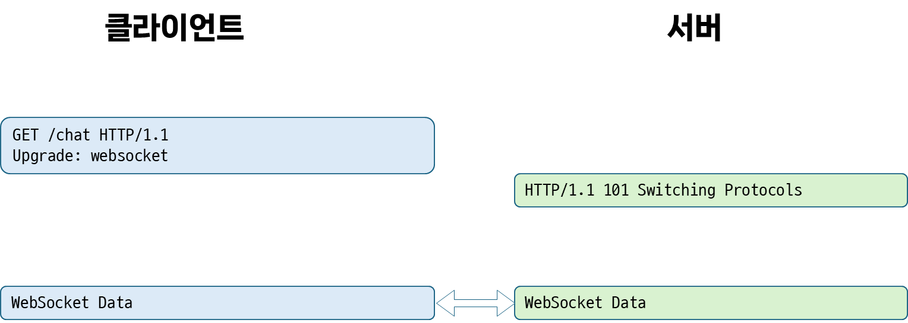
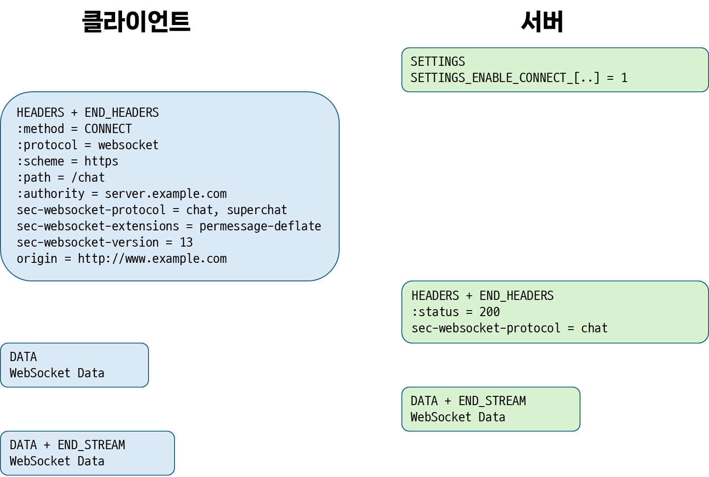
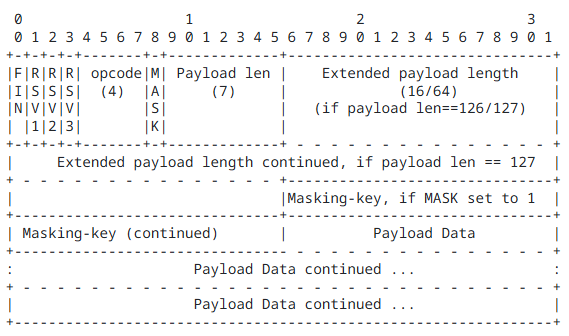

# 웹소켓(WebSocket)이란?
- [웹소켓(RFC 6455)](https://datatracker.ietf.org/doc/html/rfc6455)
	- 2011년 등장한 프로토콜
	- 통제된 환경에서 `신뢰할 수 없는 코드(untrusted code, 브라우저가 신뢰하지 않는 서드-파티나, 웹사이트로부터 읽어들인 코드)`를 실행하는 `클라이언트`와, 해당 코드의 통신을 허용한 `원격 호스트`간의 **`양방향 통신`** 을 가능케하는 프로토콜
		- 이를통해 궁극적으로 서버와 양방향 통신이 필요한 브라우저 기반 애플리케이션이 `XMLHttpRequest`, `<iframe>`과 같은 여러 HTTP 연결에 의존하지 않는 방법을 제공하는 것이 목표
	- 웹 브라우저에서 일반적으로 사용되는 `출처(Origin) 기반 보안 모델`을 사용
	- TCP 위에 계층화 되어 있으며, 오프닝 핸드셰이크와 메시지 프레이밍으로 구성됨
## 등장 배경
- 기존의 경우, 클라이언트 - 서버 양방향 통신이 필요한 경우 `업스트림 알림(클라이언트에서 서버로 전송하는 알림)`을 전송하는 동시에, 서버에 `새로운 값을 폴링`하는 요청을 보내야 했기 때문에, **`HTTP 통신이 남발`** 되었음
- 이는 다음과 같은 문제를 야기함
	1. 서버는 **각 클라이언트에 대해** `정보를 보내기 위한 연결`, `정보를 받기 위한 연결`을 포함하는 `여러 TCP 연결`을 설정해야 함
	2. 각 `클라이언트-서버 메시지`들은 `HTTP 헤더`를 가지므로 **`오버헤드가 발생`** 함
	3. `클라이언트 측 스크립트`는 `요청`과 `응답의 흐름을 추적`하기 위해, `발신 연결(outgoing connections)`에서 `수신 연결(incoming connections)`로의 **`매핑을 유지`** 해야 함
- 웹소켓은 양방향 트래픽을 위한 `단일 TCP 연결`을 사용해 이를 해결하고자 함
	- [웹소켓 API(WSAPI)](https://websockets.spec.whatwg.org/)와 결합해 `HTTP 폴링`의 대안을 제공
- 기존에 존재하는 `HTTP 환경`의 `맥락`은 살리되, 처음부터 양방향 통신을 위해 고안되지 않은 `HTTP를 대체`할 수 있도록 설계됨
	- 따라서 HTTP 포트인 `80` 및 `443`에서 `동작`하며 `HTTP 프록시`와 `중개자(intermediaries)`를 지원하도록 설계됨
## 구성
- `웹소켓`은 연결 수립을 위한 `핸드셰이크`와, 이후 이뤄지는 `데이터 전송` 두 가지로 이루어짐
- 주고받는 `메시지`는 하나 이상의 `프레임`으로 이루어짐
	- `프레임`에 포함될 수 있는 데이터는 여러 유형이 존재하며, `한 메시지`에 속하는 `각 프레임`은 `동일한 유형의 데이터`를 지님
	- `데이터 유형`으로는 `텍스트 데이터(UTF-8)`, `이진 데이터`
, `제어 프레임(연결 닫기와 같은 신호를 전달하기 위해 프로토콜 수준에서 사용 됨)` 등이 있음
### 핸드셰이크
#### 오프닝 핸드셰이크
- 연결을 수립하기 위한 `오프닝 핸드셰이크`는 `HTTP 기반 서버 SW, 중개자`와 호환되도록 설계됨
	- 즉, `HTTP 클라이언트가 사용하는 포트`와 `동일한 포트` 사용 
- 먼저 클라이언트 측에서 연결 수립을 위해 요청을 전송함
- 이때, HTTP 버전이 `1.1`인지, `2`인지에 따라 방식이 다름
	- `HTTP/1.1`
		- 먼저 클라이언트 측에서 `GET` 메서드로 `HTTP Upgrade 요청`을 전송
			```html
			<!-- 예시 요청 -->
			GET /chat HTTP/1.1
			Host: server.example.com
			Upgrade: websocket
			Connection: Upgrade
			Sec-WebSocket-Key: dGhlIHNhbXBsZSBub25jZQ==
			Origin: http://example.com
			Sec-WebSocket-Protocol: chat, superchat
			Sec-WebSocket-Version: 13
			```
			- 웹소켓이 나온 **2011년도**에는 아직 `HTTP/2(2015)`가 등장하지 않았기 때문에, `HTTP/1.1`에 사용되는 [`Upgrade`헤더](https://developer.mozilla.org/en-US/docs/Web/HTTP/Headers/Upgrade)를 사용
			- `Upgrade` 헤더는 `HTTP/1.1`에서 이미 설정된 `클라이언트/서버 연결`을 다른 프로토콜로 업그레이드 하기 위해 사용되며, 다음과 같은 형태로 작성됨
				```html
				Connection: upgrade
				Upgrade: protocol_name[/protocol_version]
				```
				- 연결이 더 지속될 지 알아야 하므로 `Connection` 헤더도 함께 사용됨
	- 서버는 핸드셰이크를 수신했음을 증명하기 위해, 두 가지 값을 가져와 합친 뒤 응답을 만들어 냄
		- 먼저 클라이언트 핸드셰이크 요청의 `Sec-WebSocket-Key` 헤더 값을 가져옴
		- 이후 문자열 형식의 `GUID(전역 고유 식별자)`인 `258EAFA5-E914-47DA-95CA-C5AB0DC85B11` 와 연결함
			-  해당 값은 웹소켓을 이해하지 못하는 서버에서도 사용될 가능성이 아주 낮은, 웬만해서는 고유한 값임
		- 이후 연결한 문자열 값을 SHA-1 해시한 값을 서버 측 핸드셰이크로 전달함
		- 예시
			- 위에서 사용된 `Sec-WebSocket-Key` 헤더 값인 `dGhlIHNhbXBsZSBub25jZQ==`에 `258EAFA5-E914-47DA-95CA-C5AB0DC85B11`을 연결해 `dGhlIHNhbXBsZSBub25jZQ==258EAFA5-E914-47DA-95CA- C5AB0DC85B11` 라는 문자열을 생성
			- 이후 이를 SHA-1 해싱해 `0xb3 0x7a 0x4f 0x2c 0xc0 0x62 0x4f 0x16 0x90 0xf6 0x46 0x06 0xcf 0x38 0x59 0x45 0xb2 0xbe 0xc4 0xea` 라는 값을 생성함
			- 이 값을 base64 인코딩하여 `s3pPLMBiTxaQ9kYGzzhZRbK+xOo=` 라는 값으로 변환한 뒤, `Sec-WebSocket-Accept` 필드로 전달
	- 그리고 서버에서 핸드셰이크가 완료된 경우에는 `101`을, 완료되지 않은 경우 이외의 값을 상태코드로 갖는 다음과 같은 형태의 응답을 반환함
		```html
		HTTP/1.1 101 Switching Protocols
		Upgrade: websocket
		Connection: Upgrade
		Sec-WebSocket-Accept: s3pPLMBiTxaQ9kYGzzhZRbK+xOo=
		```
	- `HTTP/2`
		- `HTTP/2`의 멀티플렉싱 특성에 의해, `Upgrade`, `Connection`과 같은 헤더나 `101 응답코드`와 같이 연결-전반적으로 사용되는 헤더 및 상태 코드를 허용하지 않음
		- 따라서 `HTTP/2` 환경에서 `웹소켓`을 사용하기 위한 `부트스트랩`이 만들어짐
			- 이는 `HTTP 메서드` 중 하나인 `CONNECT`를 `확장`해, 단일 `HTTP/2 스트림`에 `웹소켓용 데이터`를 전달할 수 있는 `터널`을 만듦
		- `확장된 CONNECT 메서드`
			- `CONNECT`를 통해 생성한 터널에서 어떤 프로토콜을 사용할 지 나타내는 새로운 `의사-헤더 필드`인 `:protocol`을 사용
				- 해당 필드에 포함될 수 있는 값은 [Hypertext Transfer Protocol (HTTP) Upgrade Token Registry](https://www.iana.org/assignments/http-upgrade-tokens/http-upgrade-tokens.xhtml)에 포함된 값
			- `:protocol`을 포함한 요청에는 대항 URI의 `:scheme`, `:path` `의사-헤더 필드`도 반드시 포함되어야 함
			- `:protocol`을 포함한 요청에서는 `:authority` 필드가 기존과 다르게 해석 됨
				- 연결한 호스트와 포트([RFC 7540 #8.3](https://datatracker.ietf.org/doc/html/rfc7540#section-8.3))가 아닌, 대상 URI의 권한([RFC 7540 #8.1.2.3](https://datatracker.ietf.org/doc/html/rfc7540#section-8.1.2.3))으로 해석됨
		- `HTTP/1.1`의 GET 기반 요청처럼, 클라이언트 측에서 `CONNECT` 메서드 요청을 통해 연결 수립을 요청
			- 해당 요청은 `:protocol` 필드를 반드시 포함해야 하며, `websocket` 값을 가져야 함
			- 목표 URI의 스키마의 맨 앞은 `wss(htttp)` 또는 `ws(http)`여야 하며, 나머지는 웹소켓 URI와 동일
			- `HTTP/1.1`과 달리 `Upgrade`, `Connection`, `Host` 헤더를 사용하지 않으며, `Host` 정보는 `:authority`의 일부로 전달됨
				- 또한, `Sec-WebSocket-Key` 및 `Sec-WebSocket- Accept` 헤더에 대한 처리가 `:protocol` 필드로 대체되어 이뤄지지 않음
				- 반면 `Origin`,  `Sec-WebSocket-Version`, `Sec-WebSocket-Protocol`, `Sec-WebSocket-Extensions` 필드는 사용되나 `HTTP/1.1`과 달리 `HTTP/2`에서는 소문자로 작성되어야 함

#### 클로징 핸드셰이크
- 연결을 종료하기 위해서는 클라이언트, 서버 두 피어 중 한 측(A)에서 `제어 시퀀스(control sequence)`가 포함된 `제어 프레임`을 전송해 `클로징 핸드셰이크`를 시작할 수 있음
- 이를 수신한 다른 피어(B)는 응답으로 `닫기 프레임(close frame)`을 전송함
- 응답을 수신한 피어(A)는 연결을 닫으며, 서로는 더 이상 데이터를 보내지도, 수신하지도 않음
- 이러한 별도의 `클로징 핸드셰이크`는, `TCP 클로징 핸드셰이크(FIN/ACK)`가 프록시 및 중개자에 의해 신뢰성이 낮아진다는 점을 보완하기 위해 사용됨
- `HTTP/2`에서도 이와 유사한 형태로 스트림 클로저가 이뤄지며, TCP 수준 클로저는 `HTTP/2` 데이터 프레임의 `END_STREAM` 플래그로 표현됨
### 기본 데이터 프레임 구조

- 웹소켓 프로토콜에서 `데이터 전달`을 목적으로 사용되는 `프레임`은 위와 같은 구조로 이루어져 있음
- 클라이언트에서 서버로 전송되는 모든 프레임은 `네트워크 중개자(ex. 프록시)`의 `가로채기`와 같은 행위를 차단하고, `보안 관련 이유`로 **`마스킹`** 이 필수적임
	- 이는 웹소켓이 TLS와 함께 이뤄지는지 여부와 상관 없이 항상 수행
	- 서버는 마스킹되지 않은 프레임을 수신할 경우 연결을 닫아야 함
- 주요 필드
	- `FIN`
		- 현재 프레임이 메시지의 `마지막 조각(Fragment)`임을 나타내는 플래그
	- `opcode`
		- 페이로드 데이터의 유형을 나타내는 값
			- `%x0`: 연속 프레임
			- `%x1`: 텍스트 프레임
			- `%x2`: 이진 프레임
			- `%x8`: 연결 종료
			- `%x9`: 핑 / `%xA`: 퐁
	- `masking key`
		- 클라이언트에서 서버로 전송되는 모든 프레임은 이 32비트 `마스킹 키`로 마스킹 됨
		- 클라이언트는 매 번 허용된 32비트 값 집합에서 새로운 마스킹 키를 선택해, 프레임을 마스킹해야 함
	- `payload data`
		- `애플리케이션 데이터`와, 그와 연결된 `확장 데이터`로 이뤄짐
			- `확장 데이터`: 오프닝 핸드셰이크때 사전 협의된 길이와 방법대로 사용되는 추가 데이터
			- `애플리케이션 데이터`: `확장 데이터` 다음 프레임의 나머지 공간을 차지하는 데이터
# Javascript의 WebSocket
 - Javascript에서는 `Web API` 중 `브라우저 API`에서 제공되는 `WebSocket API`를 활용해 브라우저와 서버간 양방향 통신을 열 수 있음
 - `WebSocket API`는 웹소켓 연결 및 통신을 위한 두 가지 메커니즘인 `WebSocket` 인터페이스와 `WebSocketStream` 인터페이스를 제공
	 - `WebSocket`
		 - 안정적이며, 대부분의 브라우저 및 서버에서 지원됨
		 - 다만, `배압(Backpressure)`을 지원하지 않기 때문에 *애플리케이션이 처리할 수 있는 속도보다 빠르게 메시지가 도착*할 경우 `메시지를 버퍼링`해 `메모리를 가득 채우거나`, `CPU 사용률이 100%`가 되어 애플리케이션이 정상 동작하지 않을 수 있음
	 - `WebSocketStream`
		 - `WebSocket`의 `Promise`기반 대안으로, [`Stream API`](https://developer.mozilla.org/en-US/docs/Web/API/Streams_API)를 사용해 메시지 수신 및 전송을 처리함
			 - 따라서 소켓 연결이 `Stream Backpressure` 자동으로 활용하여 읽기 및 쓰기 속도를 조절할 수 있고, 이를 통해 병목 현상을 방지할 수 있음
			 - 그러나, `WebSocketStream`은 비표준으로, `크로미움 기반 브라우저`(ex. Chrome, Edge, ...)을 제외한 나머지 브라우저들(Safari, Firefox)은 지원하지 않고 있음
## WebSocket API
### 연결 생성하기
- 웹소켓 연결을 생성하기 위해서는, `WebSocket` 생성자를 호출하면 됨
```js
// WebSocket 생성자는 url, 또는 url과 protocol을 인자로 받음
// 1. new WebSocket(url)
// url은 ws, wss, http, https 중 하나의 스키마를 사용해야 함
// 또한, Node.js나 Deno같은 JS 런타임에서는 http, https를 비롯해 상대 URL을 지원하지 않음
const socket = new WebSocket("ws://somewhere.net");

// 2. new WebSocket(url, protocols)
// protocols는 웹소켓의 서브 프로토콜을 나타내는 문자열(또는 문자열 배열)
// 연결당 하나의 서브 프로토콜만 선택할 수 있으며, 허용되는 값은 `Sec-WebSocket-Protocol HTTP`에서 지정할 수 있는 값임
const socket = new WebSocket("ws://somewhere.net", ["soap"]);
```
- 생성된 `WebSocket` 객체의 프로퍼티를 통해 어떤 호스트와 통신하는지, 서브 프로토콜은 무엇인지를 알 수 있음
	- 서브 프로토콜은 [IANA의 WebSocket Subprotocol Name Registry](https://www.iana.org/assignments/websocket/websocket.xml#subprotocol-name)에 포함된 것으로 사용 가능
```js
console.log(socket.url) // 'ws://somewhere.net'
console.log(socket.protocol) // ['soap']
```
### 이벤트 처리하기
- 생성된 웹소켓 연결에서 발생하는 이벤트를 처리하기 위해, `addEventListener`를 사용하거나, `WebSocket`의 `on이벤트이름` 프로퍼티에 이벤트 리스너를 할당해줄 수 있음
#### open(연결 생성)
- `onopen`: 웹소켓 연결이 열렸을 때, 발동되는 이벤트리스너
```js
socket.onopen = function(e) {
  alert("웹소켓 연결이 생성되었습니다. ");
  socket.send("Hello there!");
};
```
-  이벤트리스너에게 전달되는 `Event`는 일반 `Event`임
#### message(데이터 수신)
- `onmessage`: 웹소켓 연결을 통해 데이터가 수신될 때, 발동되는 이벤트리스너
```js
socket.onmessage = function(e) {
  alert("서버로부터 다음과 같은 메시지가 수신되었습니다.");
  alert(`메시지: ${e.data}`);
};
```
- `MessageEvent`:  `message` 이벤트리스너에게 전달되는 이벤트
	- `data`: `메시지 발신자(emitter)`가 보내온 데이터. `WebSocket.binaryType`에 따라 `data`의 유형이 달라짐
		- 메시지 유형이 `text`인 경우, `data`는 문자열 값
		- 메시지 유형이 `binary`인 경우, `data`의 유형은 `WebSocket.binaryType`에 따라 달라짐
			- `binaryType`이 `arraybuffer`인 경우, [`ArrayBuffer`](https://developer.mozilla.org/en-US/docs/Web/JavaScript/Reference/Global_Objects/ArrayBuffer)
			- `binaryType`이 `blob`인 경우, [`Blob`](https://developer.mozilla.org/en-US/docs/Web/API/Blob)
	- `origin`: 메시지 `발신자의 출처`를 나타내는 문자열
#### error(에러 발생)
- `onerror`: 데이터가 안보내진다거나 하는 오류로 웹소켓 연결이 닫힐 때, 발동되는 이벤트리스너
```js
socket.onerror = function(error) {
  alert(`다음과 같은 에러가 발생했습니다. ${error}`);
};
```
- 이벤트리스너에게 전달되는 `Event`는 일반 `Event`임
#### close(연결 종료)
- `onclose`: 웹소켓 연결이 닫힐 때, 발동되는 이벤트리스너
```js
socket.onclose = function(e) {
  if (e.wasClean) {
	// 연결이 정상적으로 종료된 경우
    alert(`연결이 정상적으로 종료되었습니다(code=${event.code} reason=${event.reason})`);
  } else {
	// 프로세스가 죽거나, 네트워크 장애와 같은 이유로 연결이 닫힌 경우
    alert('커넥션이 죽었습니다.');
  }
};
```
- `CloseEvent`: `close` 이벤트리스너에게 전달되는 이벤트
	- `code`: `1000~4999` 사이의 [웹소켓 연결 종료 코드](https://developer.mozilla.org/en-US/docs/Web/API/CloseEvent/code) 를 나타내는 `unsigned short` 값
	- `reason`: `서버가 연결을 종료한 이유`를 나타내는 문자열
	- `wasClean`: 연결이 정상적으로 닫혔는지 여부를 나타내는 부울 값
### 메시지 전송과 연결 닫기
- `WebSocket` 객체에는 데이터를 전송할 수 있는 `send()` 메서드와 연결을 종료할 수 있는 `close` 메서드가 존재
#### [메시지 전송](https://developer.mozilla.org/en-US/docs/Web/API/WebSocket/send)
- `WebSocket.send()` 메서드를 통해 사용자가 서버로 데이터를 전송할 수 있음
	- 정확히는, 전송할 데이터를 `대기열`에 넣고, `bufferedAmount` 값을 늘림
	- 만약 데이터를 전송할 수 없는 경우, 소켓은 자동으로 닫힘
	- 연결이 `CONNECTING` 상태라면 브라우저가 예외를 던지고, `CLOSING` 또는 `CLOSED` 상태라면 데이터를 자동으로 삭제함
- `send()`는 `data`라는 하나의 인자만 받으며, `data`의 타입은 다음 중 하나여야 함
	- `string`
		- UTF-8로 인코딩되어 버퍼에 추가되며, 이를 나타내는데 필요한 바이트 수만큼 `bufferedAmount`가 증가함
	- [`ArrayBuffer`](https://developer.mozilla.org/en-US/docs/Web/JavaScript/Reference/Global_Objects/ArrayBuffer)
		- `타입이 지정된 배열 객체(typed array object)`가 사용하는 `바이너리 데이터`를 전송할 수 있으며, 이는 버퍼에 추가되고 해당 바이너리 데이터 바이트 수 만큼 `bufferedAmount`가 증가함
			- `ArrayBuffer`는 다른 언어에서 `Byte Array`라고 일컫는, byte들의 배열임
				- 내용을 직접 조작할 순 없으나, 후술할 `typed Array` 객체나 `DataView` 객체를 통해 버퍼의 내용을 읽고 쓸 수 있음
	- [`Blob`](https://developer.mozilla.org/en-US/docs/Web/API/Blob)
		- `불변 로우 데이터`로 이뤄진, `파일`과 유사한 객체인 `Blob`의 `로우 데이터`가 버퍼에 추가되며(이때, `Blob.type`은 `무시`됨), `bufferedAmount`는 해당 로우 데이터의 바이트 크기만큼 증가함
	- `TypedArray`/`DataView`
		- `Javascript Typed Array(ex. Int8Array, Int16Array, ...)`가 가지고 있는 바이너리 데이터들이 버퍼에 추가되며, 필요한 바이트 수만큼 `bufferedAmount`가 증가함
		- 또는, `이진 ArrayBuffer`에서 여러 넘버 타입을 읽고 쓸 수 있게 해주는 저수준 인터페이스인 [`DataView`](https://developer.mozilla.org/en-US/docs/Web/JavaScript/Reference/Global_Objects/DataView)도 인자로 사용할 수 있음
#### 연결 닫기
- 연결 피어 중 한 측에서 연결을 닫고 싶을때, `WebSocket.close()` 메서드를 통해 연결을 종료할 수 있음
	- 만약 `클로징 핸드셰이크` 전에 메시지를 보내거나, 여전히 보내고 있다면 이러한 메시지들이 모두 전송된 뒤에 핸드셰이크가 시작됨
- `close()`는 옵셔널 인자인 `code`와 `reason` 인자를 받음
	- `code`
		- 종료 이유를 나타내는 `웹소켓 연결 종료 코드` 정수값
		- 값을 지정하지 않으면, 일반 종료의 경우 `1000`, 이외 연결 종료 사유가 있는 경우 그에 해당하는 `1001 ~ 1015` 범위의 코드 값으로 설정됨
		- `code` 값이 설정되면, `reason` 값도 설정되어야 함
	- `reason`
		- `사용자 지정 웹소켓 연결 종료 이유`를 제공하는 문자열로, UTF-8로 인코딩되어야 하고 123바이트를 넘지 않아야 함
## 예시
- [WebSockets Example - JSFiddle - Code Playground](https://jsfiddle.net/bmknight/RqbYB)
	- 해당 예제에서 주소를 `ws`에서 `wss`로 바꿔주면 정상 동작함