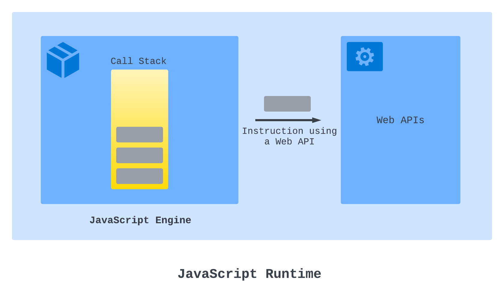
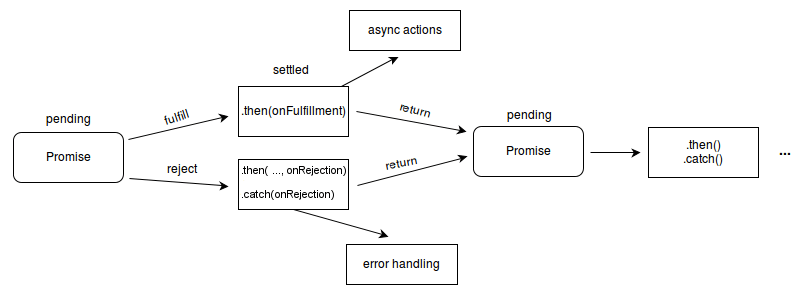

## Javascript에서의 비동기 작업
기본적으로 Javascript는 싱글-스레드 언어이기 때문에, 오래 걸리는 동기식 코드를 작성하면 해당 코드가 실행되는 동안은 다른 작업을 수행할 수 없습니다.  
즉, 해당 코드가 나머지 코드를 블락하게 됩니다.  
이를 해소하고자, Javascript에서는 보통 실행엔진이나 브라우저에서 제공되는 `Web API`를 사용해 `타이머 기반 작업`, `타 사이트 요청` 등의 비동기 작업을 처리합니다.  
`Web API`에는 `fetch`, `setInterval`, `setTimeout`, `Promise` 등이 포함됩니다.  



`Web API`는 비동기 작업이 끝난 뒤, *작업 결과를 바탕으로 실행되는* 콜백 함수를 JS 엔진의 Callback Queue에 전달하게 됩니다.  
이후 Event Loop가 Call Stack에서 처리할 작업이 없을 때, Callback Qeue의 작업들을 등록해 처리합니다. [#](https://dev.to/bipinrajbhar/how-javascript-works-web-apis-callback-queue-and-event-loop-2p3e)  
- 과거에는 [XMLHttpRequest ](https://developer.mozilla.org/en-US/docs/Web/API/XMLHttpRequest)와 같은 객체를 이용해 웹 비동기 통신을 진행하기도 했으나, 네트워크 상태나 응답속도에 따른 중단 이슈 때문에 deprecated되어 사용하지 않습니다. [#](https://developer.mozilla.org/en-US/docs/Web/API/XMLHttpRequest_API/Synchronous_and_Asynchronous_Requests)  
### 콜백 함수
최신 Javascript 비동기 작업은 대부분 **`Promise`** 객체를 반환하거나, `setTimeout`과 같이 인자로 작업이 끝난 뒤 실행할 행동이 정의된 `콜백 함수`를 인자로 받게됩니다.  
타이머 기반 작업의 경우, 콜백 함수에 별다른 인자가 주어지지 않지만, `Promise`에 사용되는 콜백 함수의 경우 작업의 결과(또는 에러)가 인자로 주어지게 됩니다.  
### `Promise`
`Promise`란, 작업이 완료되지 않은 비동기 작업에 의해 반환된 객체로, 작업의 최종 완료/실패를 나타내는 프록시 역할을 하는 객체입니다.  
기존의 함수들이 콜백 함수를 인자로 받던것과 달리, Promise는 `then` 또는 `catch`를 통해 `콜백 함수를 붙이는 방식`으로 코드를 전개할 수 있습니다. 즉, `Promise Chaining`이 가능합니다.  
#### `Promise`의 구조
```javascript
const myPromise = new Promise((resolve, reject) => {
	...
	if(error) reject("error");
	else resolve("abc");
});
```
`Promise`는 생성시 `executor`라고 불리는 실행 함수를 인자로 받습니다.  
이러한 생성 방식 때문에, Promise를 지원하지 않는 함수가 있다면 생성자로 감싸 지원하도록 만들 수 있습니다.
##### 실행 함수
이는 `reslove` 및 `reject` 함수를 인자로 받는 함수입니다.  
보통 실행 함수는, 비동기 작업을 모두 처리한 뒤 작업이 끝날 때 `resolve`를 호출해 `Promise`를 `이행(fulfilled)`하고, 에러가 발생한 경우 `reject`를 호출해 `Promise`를 `거부(rejected)`합니다.  
#### `Promise`의 상태

`Promise`는 `대기`, `이행`, `거부` 중 하나의 상태를 가집니다.  
추가로, Promise가 `fulfilled`되거나 `rejected`된 경우, `pending`이 아닌 `settled(또는 locked-in)` 상태라고 일컬어집니다.  
##### 대기(pending)
연산을 이행하지도, 거부하지도 않은 초기 상태입니다.
##### 이행(fulfilled)
연산이 성공적으로 완료됐음을 의미합니다.  
실행함수 내부에서 `resolve(value)`를 호출해 `.then()`의 인자로 전달될 콜백 함수에 값을 전달합니다.  
##### 거부(rejected)
연산이 실패했음을 의미합니다.  
실행함수 내부에서 `reject(value)`를 호출해 `.catch()`의 인자로 전달될 콜백 함수에 값을 전달합니다.  
#### `Promise` 연결(Chaining)
`settled`된, 즉 `fulfilled` 되거나 `rejected`된 Promise에 추가 작업을 연결하기 위해 `then()`, `catch()`, `finally()` 메서드를 사용할  수 있습니다.  
위 메서드들은 `Promise`를 다시 반환할 수 있기 때문에, 연쇄적으로 연결할 수 있습니다.  
##### `then(onFulfilled, onRejected)`
```javascript
promise.then(onFulfilled, onRejected);
```
두 개의 콜백 함수를 인수로 받고, `Promise`를 반환하는 함수입니다.  
처음 주어지는 함수는 `Promise`가 이행되었을 때, 두 번째 함수는 `Promise`가 거부되었을 때를 위한 콜백 함수입니다.  
`then()`의 매개변수 중 하나 이상을 생략하거나, 함수가 아닌 값을 전달한 경우 핸들러가 없는 것으로 인식해 `then()` 이전의 `Promise`의 마지막 상태를 그대로 이어받습니다.  
```javascript
const myPromises = new Promise((resolve, reject) => {
  resolve("abc");
}); 
myPromise.then("가나다라").then(r=>console.log(r)); // "abc"
```
인수로 주어진 핸들러 함수의 결과에 따라, 반환되는 `Promise`는 다음과 같은 규칙을 갖습니다.  
- 콜백 함수가 값을 반환한 경우: 반환되는 Promise(이행됨)는 그 반환값을 결과값으로 갖습니다.
- 콜백 함수가 값을 반환하지 않은 경우: 반환되는 Promise(이행됨)는 `undefined`를 결과값으로 갖습니다.
- 오류가 발생한 경우: 반환되는 Promise(거부됨)는 그 반환값을 결과값으로 갖습니다.
- 이행된/거부된 프로미스를 반환할 경우: 반환되는 Promise(이행/거부됨)는 그 프로미스의 반환값을 결과값으로 갖습니다.
- 대기중인 `Promise`를 반환할 경우: 반환되는 Promise(이행됨)는 그 프로미스의 이행 여부/결과값을 따릅니다.
##### `catch(onRejected)`
프로미스가 거부되었을 때, 호출될 콜백 함수를 지정하는 함수입니다.  
`catch(onRejected)`는 실제로는 `then(undefined, onRejected)`으로 동작합니다.  
`onRejected` 함수는 `Promise`에서 `reject(reason)` 호출 시 인자로 넘긴 `reason` 값을 인수로 받습니다.  
`onRejected` 함수 내부에서 반환되는 값에 따라, 반환될 `Promise`가 이행될지, 거부될지 결정됩니다.  
`Promise`가 거부되고, 이를 처리할 거부 핸들러가 없는 경우, [`unhandledrejection`](https://developer.mozilla.org/en-US/docs/Web/API/Window/unhandledrejection_event)이벤트가 발생하고, 처리할 거부 핸들러가 있는 경우 [`rejectionhandled`](https://developer.mozilla.org/en-US/docs/Web/API/Window/rejectionhandled_event) 이벤트가 발생합니다.  

##### `finally(onFinally)`
`Promise`를 처리(이행/거부)한 후, 호출할 콜백 함수를 지정합니다.  
`finally(onFinally)` 역시 동등한 `Promise`를 반환합니다.  
만약 `onFinally` 내부에서 예외가 발생하거나, 거부된 `Promise`를 반환하면 `finally()`가 반환하는`Promise`는 해당 값으로 거부되게 됩니다.  
- 이외의 반환값은 `finally()`가 반환하는 `Promise`의 상태에 영향을 주지 않습니다.
	- 예시로, `Promise.resolve(2).finally(() => 77)`는 2로 이행됩니다.
- 또한, `onFinally` 콜백은 인자를 받지 않습니다.
	- 이는 `finally()`가 *결과에 관계없이* `Promise` 처리 후 수행될 작업(무언가를 처리하거나 정리)을 수행하는데 사용되기 때문입니다.
##### 콜백함수의 생략
연결된 `.then()`에서 콜백 함수가 생략되어도, 다음 체인으로 계속 이어집니다.  
따라서 체인의 마지막 `.catch()`까지 `.then()`의 인자에 거부 콜백함수를 생략할 수 있습니다.  
그렇기 때문에 마지막에 `.catch()`로 연결 되어있을 때, 즉각적인 오류 처리가 필요하다면 콜백함수 내부에서 특정 타입의 에러를 던져 체인 아래까지 오류 상태를 유지해야 합니다.  
#### `Promise`의 동시성
`Promise`에서는 비동기 작업 동시성을 위해 4개의 정적 메서드를 제공합니다.  
4개 메서드 모두 `Promise`로 이뤄진 `iterable`한 객체(ex. `Array`)를 인수로 받고, 새로운 `Promise`를 반환합니다.  
##### `Promise.all(iterable)`
```javascript
Promise.all([promise1, promise2, promise3]).then((values) => {
  console.log(values);
});
```
인자로 주어진 모든 프로미스가 이행되면 이행되고, 프로미스 중 하나라도 거부되면 거부된 `Promise`를 반환합니다.  
- `iterable`이 비어있는 경우: 반환값이 없는, 이행된 Promise를 반환합니다.
- `iterable` 내부에 `Promise`가 없는 경우: iterable을 내부에 포함하는, 이행된 Promise를 반환합니다.
- 이외의 경우: 인자로 주어진 모든 `Promise`가 이행되거나, 한 `Promise`가 거부될 때 비동기적으로 이행/거부되는 `Promise`(이전까진 Pending 상태)를 반환합니다.
	- 반환되는 `Promise`의 이행 값의 순서는 인자로 주어진 `Promise`의 순서와 동일합니다.
	- 주어진 `Promise` 중 하나라도 거부될 경우, 다른 `Promise`의 이행여부와 관계 없이 첫 번째 거부 `reason`를 사용해 거부합니다.
##### `Promise.allSettled(iterable)`
모든 `Promise`를 이행/거부한 뒤, 각 `Promise`에 대한 결과를 나타내는 객체 배열을 반환합니다.  
정확히는 결과 배열을 `resolve()`의 입력으로 전달하는, pending된 Promise를 반환합니다.  
만약, 빈 `Iterable` 객체를 인자로 받은 경우, 빈 배열을 반환하는 이미 이행된 `Promise`를 반환합니다.  
반환된 배열의 각 객체는 Promise 처리 상태(`"fulfilled"`, `"rejected"`)를 나타내는`status`와 상태에 따른 값, 즉 `fulfilled` 상태라면 `value`, `rejected` 상태라면 `reason`을 갖습니다.  
##### `Promise.any(iterable)`
프로미스 중 하나라도 이행되면 이행하고, 모든 프로미스가 거부되면 거부합니다.  
즉, 하나라도 이행된다면 첫 번째 이행 값으로 이행되고, 모든 `Promise`가 거부되면, 거부 `reason` 배열이 담긴 [`AggregateError`](https://developer.mozilla.org/en-US/docs/Web/JavaScript/Reference/Global_Objects/AggregateError) 객체를 반환하는 `Promise`를 반환합니다.  
##### `Promise.race(iterable)`
프로미스 중 가장 먼저 처리된 것의 결과값을 토대로 이행/거부될 `Promise`를 반환합니다.  
즉, `Promise` 중 하나라도 먼저 이행되면 이행 예정인 `Promise`를, `Promise` 중 하나라도 먼저 거부되면 거부 예정인 `Promise`를 반환합니다.  
### `Promise`를 동기적으로 다루는 방법, `async function`
```javascript
async function (param0, param1, /* ... */ paramN) {
	statements
}
  // 또는 Arrow Function 형태로도 사용 가능합니다.
async (param1, param2, ...paramN) => {
  statements;
};
```
`async function`이란, 여러 `Promise`간의 흐름을 순서대로 처리할 수 있는, 즉 여러 비동기 함수들을 동기적인 순서로 진행시키는 함수를 말합니다. 항상 `Promise`를 반환할 수 있습니다.  
`async function`은 0개 이상의 `await` 키워드를 포함할 수 있는데, `await`가 달린 `Promise`를 만나게 되면 해당 `Promise`가 이행/거부될 때 까지 함수 실행을 일시 중단하며, 처리가 된 뒤 다시 진행됩니다.  
즉, `Promise`를  반환하는 함수를 동기식인것 처럼 동작하도록 해줍니다.  
# 참고 문서
- [Promise() 생성자 - JavaScript | MDN (mozilla.org)](https://developer.mozilla.org/ko/docs/Web/JavaScript/Reference/Global_Objects/Promise/Promise)
- [Promise.prototype.then() - JavaScript | MDN (mozilla.org)](https://developer.mozilla.org/ko/docs/Web/JavaScript/Reference/Global_Objects/Promise/then)
- [Promise.prototype.catch() - JavaScript | MDN (mozilla.org)](https://developer.mozilla.org/en-US/docs/Web/JavaScript/Reference/Global_Objects/Promise/catch)
- [Promise.prototype.finally() - JavaScript | MDN (mozilla.org)](https://developer.mozilla.org/ko/docs/Web/JavaScript/Reference/Global_Objects/Promise/finally)
- [async function - JavaScript | MDN (mozilla.org)](https://developer.mozilla.org/en-US/docs/Web/JavaScript/Reference/Statements/async_function)
