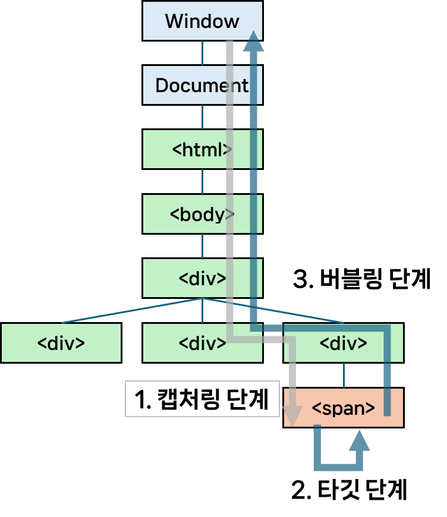

## 이벤트 버블링과 캡처링
HTML 태그에서 발생할 수 있는 이벤트는 [표준](https://www.w3.org/TR/uievents/)에 따르면 다음과 같은 순서로 전파됩니다.  
1. 캡처링 단계([`CAPTURING_PHASE`](https://dom.spec.whatwg.org/#dom-event-capturing_phase)) : 이벤트가 DOM 트리 상의 하위 요소로 전파되는 단계
2. 타깃 단계([`AT_TARGET`](https://dom.spec.whatwg.org/#dom-event-at_target)) : 이벤트가 실제 대상 요소에 전달되는 단계
3. 버블링 단계([`BUBBLING_PHASE`](https://dom.spec.whatwg.org/#dom-event-bubbling_phase)) : 이벤트가 DOM 트리 상의 상위 요소로 전파되는 단계



즉, 위와 같은 형태로 DOM 트리가 구성되어 있다면, `<span>`을 클릭하면 이벤트가 최상위 조상부터 시작해 아래로 전파되고, 타겟 요소에 도착해 이벤트가 실행된 후, 다시 위로 전파됩니다. 
- 참고로 이벤트 흐름 순서는 [`Event.eventPhase`](https://developer.mozilla.org/ko/docs/Web/API/Event/eventPhase) 프로퍼티를 통해 알 수 있습니다.
	- 이 값이 `1`일 경우 `캡처링 단계`, `2`일 경우 `타깃 단계`, `3`일 경우 `버블링 단계`, `0`일 경우 현재 이 이벤트가 처리중이지 않음을 의미합니다.
- 또한, 이벤트 캡처링 방식과 버블링 방식 모두 존재하는 이유는, 기존에 분리되어 있던 이벤트 전파 방식들을 W3C에서 표준화 하며 둘을 모두 포함하는 시스템을 만들었기 때문입니다.
	- 정확히는 `Netscape`에서는 이벤트 캡처링만, `IE`에서는 이벤트 버블링만 사용했기 때문에 상호 호환성을 위해 이들을 모두 포함하는 시스템이 표준으로 자리잡게 된 것입니다.
		- [Javascript - Event order (quirksmode.org)](https://www.quirksmode.org/js/events_order.html)
		- [Javascript - Event accessing (quirksmode.org)](https://www.quirksmode.org/js/events_access.html)
### 이벤트?
Web API에서의 [`이벤트`](https://developer.mozilla.org/en-US/docs/Web/Events)란, 마우스 클릭, 키보드 입력 등 DOM 상의 요소에서 발생할 수 있는 이벤트를 말합니다.  
`이벤트`는 *사용자의 행동 뿐만 아니라*, `HTMLElement.click()`과 같은 메서드를 직접 호출하거나, `EventTarget.dispatchEvent()`와 같은 메서드를 통해 타겟 객체로 이벤트를 보내는 등 프로그래밍적으로도 발생시킬 수 있습니다.  
이렇게 발생한 이벤트에 대응하고 싶다면, `<button>`, `<div>`와 같은 DOM 요소에 [`EventTarget.addEventListener()`](https://developer.mozilla.org/ko/docs/Web/API/EventTarget/addEventListener)를 통해 이벤트 처리기를 연결할 수 있습니다.  
하나의 `요소(Element)`는 하나 이상의 이벤트 처리기를 가질 수 있으며, 동일한 이벤트에 대해 여러 이벤트 처리기를 연결할 수도 있습니다.  
- 같은 요소 / 같은 이벤트 / 같은 단계로 설정한 이벤트 처리기들은 설정한 순서대로 동작합니다.
```js
element.addEventListener("click", e => alert(1)); // 먼저 트리거
element.addEventListener("click", e => alert(2));
```

발생한 이벤트는 상기한대로 캡처링 -> 타깃 -> 버블링의 흐름을 순서대로 거치게 됩니다.
### 캡처링 단계
`캡처링 단계`란, 이벤트가 하위 요소로 전파되는 이벤트 전파 단계를 말합니다.  
`on<event>` 프로퍼티, HTML 속성, `addEventListener(event, handler)`를 이용해 이벤트 처리기를 연결한 경우, 이들은 캡처링에 대해 알 수 없습니다.  
- 즉, `타깃`, `버블링` 단계에서만 동작합니다.

따라서 이들을 `캡처링 단계`에서 **이벤트를 인식**하게 하려면, `addEventListener()`의 `capture` 옵션을 `true`로 설정해주어야 합니다.
```javascript
element.addEventListener(..., { capture: true });
// 또는
element.addEventListener(..., true);
```
이렇게 `capture` 옵션을 `true`로 할당해주면 특정 요소에서 이벤트가 발생했을 때, 최상위 조상부터 차례대로 이벤트가 전파될 것입니다.  
`이벤트`는 `document`부터 DOM 트리를 따라 타깃(`event.target`)까지 전파되며, *해당 이벤트 유형을 처리하는* `addEventListener(... , { capture: true })`로 할당된 핸들러들을 동작시킵니다.  

이어서 나올 버블링과 달리 캡처링은 실제 코드에서 사용될 일이 흔치 않습니다.  
논리적으로 생각해보면, *더 세부적이고 특정적인 요소에 핸들러가 할당될수록* 그 요소에 대한 **세부 사항과 어떤 동작을 요하는지 더 잘 알 것**입니다.  
따라서 *이벤트가 발생한 타깃 위치부터 전파되는* `버블링 단계`에서 **이벤트를 처리하는 것이 더 적합**할 것입니다.  
### 타깃 단계
`타깃 단계`란, 이벤트가 실제 타깃 요소에 전달되는 이벤트 전파 단계를 말합니다.  
엄밀히 말하면, ***타깃 단계는 별도로 처리되지 않으며*** (즉, 이벤트를 더 전파시키지 않음) 캡처링 및 버블링 단계의 **핸들러**가 `타깃 단계에 트리거` 됩니다.  
#### `Event.target`
이벤트가 발생한 요소는 이벤트 핸들러 내부에서 `Event.target`을 통해 접근할 수 있습니다.
이와 관련해 주의해야 할 사항으로, `Event.target`를 `Event.currentTarget`과 헷갈리지 않아야 한다는 것입니다.  
`Event.target`은 실제로 이벤트가 시작된, 타깃 요소를 의미하며, 이는 이벤트가 버블링되어 전파되어도 변하지 않습니다.  
반면, `Event.currentTarget`(또는 핸들러 내부에서 호출한 `this`)은 현재 실행중인 이벤트 핸들러가 **할당된 요소**를 의미합니다.  
예를 들어, `div > p` 형태로 DOM 트리가 구성되었고 `p`에서 발생한 이벤트를 `div`의 이벤트 핸들러가 처리하는 상황이라 가정합시다.   
이때, `div`의 이벤트 핸들러에서 `event.target`을 호출한다면 이는 `p`를 가리키고, `event.currentTarget`을 호출한다면 이는 `div`를 가리킨다는 것입니다.  

### 버블링 단계
`버블링 단계`란, 이벤트가 타깃 요소부터 최상위 요소까지 전파되는 이벤트 전파 단계를 말합니다.  
이벤트는 상위 요소로 계속해서 전파되며, 해당 이벤트를 처리하는 핸들러를 동작시킵니다.  
다만 `focus`, `blur`, `load`/`unload` 등과 같이 버블링되지 않는 몇몇 이벤트들도 존재합니다.  
- 이벤트가 버블링 되는지 여부는 `Event`의 [`bubbles`](https://developer.mozilla.org/en-US/docs/Web/API/Event/bubbles)프로퍼티를 통해 알 수 있습니다. 이 값이 `true`라면 해당 이벤트는 버블링되어 위로 전파됩니다.  
#### 버블링 중단(`stopPropagation`)
버블링을 통해 이벤트가 전파되는 것이 유용할 수 있지만, 그렇지 않은 경우도 있을 수 있습니다.  
예를 들어, 이벤트가 계속 전파되어 원하지 않았던 **상위 요소의 이벤트 핸들러까지 동작**시켜 오동작을 일으킬 수도 있습니다.  
이럴 때, 이벤트 핸들러 내부에서 **`Event.stopPropagation()`** 메서드를 호출해 이벤트가 더 버블링 되는 것을 막을 수 있습니다.  
다만, **한 요소**에 특정 이벤트를 처리하는 ***핸들러가 여러 개일 경우***, 위로 이벤트가 버블링 되는 것은 막을 수 있지만 **다른 핸들러가 동작 하는 것은 막을 수 없습니다**.  
따라서 *버블링을 막고* **다른 핸들러의 동작까지 막으려면** **`Event.stopImmediatePropagation()`** 을 사용해야 합니다.  
이렇게 버블링을 막을 수 있긴 하지만, **대부분의 경우(특히 분석, 로깅등을 수행할 때) 버블링이 유용**하기 때문에 꼭 멈춰야 하는 상황이 아니라면 **막지 않는 것이 좋습니다**.  
### 이벤트 위임(Event Delegation)
버블링을 통해 이벤트가 위로 전파된다는 점을 활용해서, 모든 하위 요소에 이벤트 핸들러를 설정하는 대신 상위 요소에서 하위 요소에서 발생하는 이벤트들을 처리하는 핸들러를 설정하는 형태로 구현할 수도 있습니다.  
만약 하위 요소에서 이벤트가 발생할 때 비슷한 또는 똑같은 작업을 수행하는 경우, 번거롭게 이들에 모두 이벤트 핸들러를 설정하는 것 보다 위임하는 형태로 작성하면 **코드가 더욱 간결**해질 수 있습니다.  
#### 예시 - 16개의 타일 색 바꾸기
예시로 16개의 div 타일이 있고, 각 타일을 클릭하면 랜덤으로 타일의 색깔을 바꾼다고 합시다.
```js
<div id="container">
  <div class="tile"></div>
  <div class="tile"></div>
  <div class="tile"></div>
  <div class="tile"></div>
  <div class="tile"></div>
  <div class="tile"></div>
  <div class="tile"></div>
  <div class="tile"></div>
  <div class="tile"></div>
  <div class="tile"></div>
  <div class="tile"></div>
  <div class="tile"></div>
  <div class="tile"></div>
  <div class="tile"></div>
  <div class="tile"></div>
  <div class="tile"></div>
</div>
```
만약 전자처럼 모든 하위요소(`tile`)에 이벤트 핸들러를 단다면 코드는 다음과 같을 것입니다.
```js
function randomColor() {
   return `rgb(${Math.floor(Math.random() * 255)} ${Math.floor(Math.random() * 255)} ${Math.floor(Math.random() * 255)})`;
}
const children = document.getElementById("container").children;
for(e of children) {
    e.addEventListener("click", e => e.target.style.backgroundColor = randomColor();
}
```
반면, 이벤트를 상위 요소(`container`)로 위임하게 된다면 코드를 다음과 같이 바꿀 수 있습니다.
```javascript
const container = document.querySelector("#container");

container.addEventListener("click", (event) => {
  event.target.style.backgroundColor = randomColor();
});
```

# 참고
- [Introduction to events - Learn web development | MDN (mozilla.org)](https://developer.mozilla.org/en-US/docs/Learn/JavaScript/Building_blocks/Events)
- [Event reference | MDN (mozilla.org)](https://developer.mozilla.org/en-US/docs/Web/Events)
- [DOM Standard (whatwg.org)](https://dom.spec.whatwg.org/)
- [버블링과 캡처링 (javascript.info)](https://ko.javascript.info/bubbling-and-capturing)
- [이벤트 버블링, 이벤트 캡처 그리고 이벤트 위임까지 • 캡틴판교 블로그 (joshua1988.github.io)](https://joshua1988.github.io/web-development/javascript/event-propagation-delegation/)
- [Javascript - Event order (quirksmode.org)](https://www.quirksmode.org/js/events_order.html)