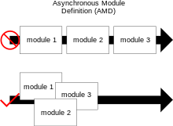

## Module in Javascript
Javascript에서 `모듈`이란, *다른 프로그래밍 언어의 모듈처럼*, 커진 자바스크립트 코드들을 여러 파일로 분리하는 것을 말합니다.  
초기에는 자바스크립트 코드들이 *크기도 작고 단순한 작업을 수행*했기 때문에 **코드의 분리를 필요로 하지 않았지만**, 자바스크립트가 **완전한 애플리케이션을 실행**할 수 있게 되고, 이에 따라 코드의 크기도 커지고 복잡해졌습니다.  
특히 기존의 경우, `<script>` 태그를 통해 여러 자바스크립트 파일을 불러올 수 밖에 없었는데, 이들은 전역 네임스페이스를 공유하기 때문에 이전 스크립트의 변수를 뒤집어쓰는 등 혼동을 초래하기 쉬웠습니다.  
따라서 이들을 보완하고자, 자바스크립트를 모듈화 하는 방법에 대해 여러 매커니즘이 등장하게 되었습니다.  
이러한 모듈 시스템으로는 주로 `AMD`, `CommonJS`, `UMD`, `ESM` 4개의 시스템이 주로 사용됩니다.  
상세하게는, `AMD`, `CommonJS`, `UMD`와 같은 비표준 시스템이 등장해 사용되다가, `ES2015(ES6)`에 `ESM(ES Modules)`가 등장하므로써 모듈 시스템이 표준으로 자리잡게 되었습니다.  
2018년 Firefox 60이 등장한 이후, **모든 주요 브라우저**들은 **`ES Module`을 지원**하게 되었으며 `CommonJS`를 기본적으로 지원하는 `Node.js` 역시 **12버전** 부터 `ESM`를 지원하기 시작했으며, 현재 `완전한 지원(fully-support)`을 제공하고 있습니다.  
> Node.js fully supports ECMAScript modules as they are currently specified and provides interoperability between them and its original module format, [CommonJS](https://nodejs.org/api/modules.html).
> - [Modules: ECMAScript modules | Node.js v22.3.0 Documentation (nodejs.org)](https://nodejs.org/api/esm.html)
> 
### `AMD`
`Asynchronous module definition(비동기 모듈 정의)`, 줄여서 `AMD`란 `비동기`적으로 모듈과 그 종속성을 불러올 수 있도록 모듈을 정의하는 메커니즘을 말합니다.  


위 그림처럼, AMD 방식은 불러올 파일들 간에 종속성이 존재하더라도 이들을 순서대로 로딩하지 않고 모두 개별적으로 로딩할 수 있습니다.  
`AMD`는 전역 변수(또는 `자유 변수`)로 사용할 수 있는 함수인 `define()`과, `CommonJS`와의 상호운용성을 제공하기 위해 유사한 형태의 `exports`와 `require()` 인터페이스를 제공합니다. (다만, 보통 `define()`을 사용하는 것이 더 선호됩니다.)  
- `자유 변수`: 함수에 사용되는 변수 중 **지역 변수** 또는 **해당 함수의 매개 변수**가 **아닌** 변수를 의미합니다.  
알려진 `AMD` 구현체로는 [Dojo Toolkit](https://dojotoolkit.org/), [RequireJS](https://requirejs.org/) 등이 있습니다.  

#### API 사양 [#](https://github.com/amdjs/amdjs-api/wiki/AMD)
##### `define()` 함수
전역변수로 사용할 수 있는 이 함수는 일종의 네임스페이스 역할을 해, 모듈에서 사용하는 변수와 전역 변수를 분리하는 역할을 해주는 함수입니다. 이를 통해 브라우저 환경의 Javascript에는 존재하지 않는 파일 스코프를 대신할 수 있습니다.  
`define()` 함수는 다음과 같은 함수 시그니처를 가지며, 각 인수들은 다음을 뜻합니다.  
```js
define(id?, dependencies?, factory);
```
- `id` 
	- 모듈을 식별하는데 사용되는 인수로, 문자열 리터럴입니다.
	- 선택 사항이며, 이 값이 주어지지 않으면 로더가 요청하는 \<script\> 태그의 src 값(id)를 기본 id로 설정합니다. 
		- 만약 명시할 경우, 모듈 id는 반드시 `최상위` 또는 `절대 id(절대 경로)` 여야 합니다.
	- `모듈 id`는 정의중인 모듈을 식별하는데 사용할 수 있고, 종속성 배열 인수에도 사용됩니다. `AMD`의 `모듈 id`는 [CommonJS 모듈 식별자에서 허용되는 것](https://wiki.commonjs.org/wiki/Modules/1.1.1#Module_Identifiers)의 상위 집합입니다.
		- 모듈 식별자는 `/(슬래쉬)`로 구분되는 `용어들(terms)`의 문자열입니다.
		- `용어`는 카멜 케이스 식별자, `.` 또는 `..` 여야 합니다.
		- 모듈 식별자는 `".js"`와 같은 파일이름 확장자를 가질 수 없습니다.
		- 모듈 식별자는 `상대적`이거나, `최상위` 일 수 있습니다. 만약 첫 번째 용어가 `.` 또는 `..` 인 경우 `상대적`입니다.
		- `최상위` 식별자는 개념적 모듈 네임스페이스루트에서 확인됩니다.
		- `상대적` 식별자는 `require` 코드가 작성 및 호출되는 모듈의 식별자를 기준으로 합니다.
			- 만약 `a/b/c` 모듈이 `../d` 모듈을 요청하면, 이는 `a/d`로 요청됩니다.
			- 만약 `a/b/c` 모듈이 `./e` 모듈을 요청하면, 이는 `a/b/e`로 요청됩니다.
- `dependencies` 
	- *현재 정의 중인 모듈에 필요한 의존성*인 `모듈 id`의 배열 리터럴입니다. 
	- 이는 모듈 팩토리 함수가 실행되기 전 요청되어야 하며, 요청된 값은 의존성 배열에서의 인덱스와 동일한 순서로 팩토리 함수의 인자로 전달되어야 합니다.
	- `종속성 모듈 id`는 `상대적 id`일 수 있으며, 정의되는 모듈을 기준으로 요청됩니다.
	- 만약 종속성 목록에 `require`, `exports`, `module` 이라는 값이 등장한다면 이는 `CommonJS` 모듈 사양에 정의된 해당 자유 변수로 해석되어야 합니다.
	- 만약 이를 생략하면, 기본 값은 `["require", "exports", "module"]`이 됩니다. 그러나 팩토리 함수의 `항수(매개변수의 개수)`가 3보다 작은 경우, 로더는 함수의 `항수(또는 길이)`에 해당하는 수의 인수만 사용해 팩토리 함수를 호출하도록 선택할 수 있습니다.
- `factory`
	- 모듈 또는 객체를 인스턴스화하기위해 실행해야 하는 함수입니다.
	- 만약 `factory`가 함수라면 `싱글톤`으로 한 번만 실행되며, 객체인 경우 해당 객체를 모듈의 `exports` 객체의 속성값으로 할당합니다.
		- 만약 `factory` 함수가 값(`객체`, `함수`, 또는 `true로 인식되는 모든 값`)을 반환할 경우, 이 역시 해당 값을 `exports` 객체의 속성값으로 할당합니다.

##### `define.amd` 프로퍼티
`<script> src` 브라우저 로딩에 필요한 전역 `define` 함수가 `AMD` API를 준수한다는 표시를 하기 위해, 모든 전역 `define` 함수는 값이 객체인 `amd` 라는 프로퍼티를 갖고 있어야 합니다.  
이는 `AMD` API를 준수하지 않는 `define` 함수를 정의하는 다른 코드와의 충돌을 막을 수 있습니다.  
`define.amd`객체 내부의 속성은 지정되어 있지 않기 때문에, `AMD` 로더 구현체에 따라 해당 객체 내부의 프로퍼티를 활용해 여러 기능들을 추가할 수 있습니다.  

#### 예시 코드
```js
define("alpha", ["require", "exports", "beta"], function (require, exports, beta) {  
	exports.verb = function() {

	// 의존성으로 설정된 다른 모듈을 사용하려면
	// 넘겨받는 인수를 사용하거나,
	return beta.verb();
	
	// 또는 require()를 이용해
	// 얻어 온 모듈을 사용해도 된다.
	return require("beta").verb();  
	}
});
```

#### 장점
##### 전역변수 문제가 없음
`define()` 함수를 이용해 모듈을 구현하므로, 즉, 클로저를 사용해 모듈 정의를 캡슐화 하므로 전역 네임스페이스 오염을 방지할 수 있습니다.
##### `CommonJS`와의 상호운용성을 제공함

### `CommonJS`
`CommonJS`란 [모질라의 Kevin Dangoor에 의해 2009년 시작된](https://www.blueskyonmars.com/2009/01/29/what-server-side-javascript-needs/)(당시 이름은 `ServerJS`), 웹 브라우저 외부(특히 웹 서버 등 서버사이드)에서의 Javascript용 모듈 생태계를 표준화하기 위한 명세를 포함한 프로젝트를 말합니다.  
웹 브라우저 외부(특히 서버사이드)에서의 사용을 목표로 했기 때문에, `Node.js`와 같은 런타임에서 [채택해 사용 중](https://nodejs.org/api/modules.html)입니다.  
#### 특징
- `CommonJS`는 동기식 모듈 시스템이기 때문에, 특정 모듈을 `import`한 경우 해당 모듈이 로드될 때 까지 코드 실행이 중단됩니다. 
- 모듈을 가져오기 위해 `require` 함수를, 모듈을 내보내기 위해 `module.exports` 객체를 사용합니다.  

#### API 명세 [#](https://wiki.commonjs.org/wiki/Modules/1.1.1)
앞서 설명한 것 처럼, CommonJS에서 모듈을 불러오고, 내보내기 위해 `require()`  함수와 `module.exports` 객체를 사용하는데, [API 명세](https://wiki.commonjs.org/wiki/Modules/1.1.1)에는 다음과 같은 계약이 명시되어 있으며, `CommonJS` 구현체들은 이를 지켜야 합니다.  
- `require`
	- `require()` 함수는 `모듈 식별자(id)`를 인자로 받으며, 해당 모듈이 `내보낸 API`를 반환합니다.  
	- 만약 `의존성 사이클`이 존재할 경우, 외부 모듈이 `전이적 의존성` 중 하나에 의해 `require` 될 때 실행이 완료되지 않았을 수 있습니다.  
		- `전이적 의존성`: A가 B를 의존하고, B가 C를 의존할 경우 C는 A의 전이적 의존성이다.  
		- 이 경우, `require`가 반환하는 객체에는 현재 모듈의 실행을 유도한 `require`의 실행 이전에 준비된 하나 이상의 `exports`를 포함해야 합니다.  
	- 요청된 모듈이 반환될 수 없으면, `require`는 에러를 던져야 합니다.  
	- `require` 함수는 `main` 프로퍼티를 가질 수 있으며, 이는 `undefined` 이거나 로드된 모듈의 `module` 객체와 동일해야 합니다.  
	- `require` 함수는 `paths` 속성을 가질 수 있으며, 이는 최상위 모듈 디렉토리 까지의 경로를 우선순위대로 배열한 문자열 배열입니다.  
- `module` 
	- `module` 컨텍스트 안에는 위 정의를 따르는 자유 변수인 `require`가 있습니다.  
	- `module` 컨텍스트 안에는 모듈이 실행될 때 API를 추가할 수 있는 객체인 자유 변수 `exports`가 있습니다.  
		- 모듈은 `exports`를 **유일한 내보내기 수단**으로 사용해야 합니다.  
	- `module` 안에는 `module`이라는 객체인 자유 변수가 존재해야 합니다.  
		- `module` 객체는 모듈의 최상위 식별자인 `id` 프로퍼티를 갖고 있어야 합니다.  
			- 또한 이 `id` 프로퍼티를 사용해 `require(module.id)`를 호출한 경우, `module.id`의 출처가 된 `exports` 객체를 반환해야 합니다.  
		- `module` 객체는 모듈이 생성된 리소스에 대한 정규화된 URI인 `uri` 문자열이 있을 수 있습니다.  

#### 예시 코드
```js
// customers.js
var customers = ["Rachel", "Galen", "Charles"]

// 해당 모듈에서 내보내고자 하는 것들을 `exports`에 담아줍니다. 
// exports에 포함되지 않은 지역 변수는 외부에서 접근할 수 없습니다.
module.exports = {   
  getCustomers: function () {     
    return users   
  },   
  sortCustomers: function () {     
    return users.sort()   
  },   
  firstCustomer: function () {     
    return users[0]   
  } 
}

// acounting.js  
const customers = require('./customers')  
customers.getCustomers() // ["Rachel", "Galen", "Charles"]  
customers.sortCustomers() // ["Charles", "Galen", "Rachel"]  
customers.firsCustomer() // ["Charles"]
```

#### 장점
##### 배우고 사용하기 쉬움
##### `Node.js`에서 널리 사용됨
##### 동기식이기 때문에, 모듈 실행 전 모든 종속성이 로드됨을 보장함

#### 단점
##### 동기식이기 때문에, 대규모 앱에서 성능 문제를 야기할 수 있음
모든 파일이 로컬 디스크에 있어 필요할 때 바로 불러올 수 있는 상황을 전제, 즉 *동기적으로 동작 가능한 Server-side JS 환경*을 전제로 하기 때문입니다.
##### tree-shaking이 없기 때문에 번들 크기가 커질 수 있음
##### 브라우저에서 지원하지 않기 때문에, 클라이언트 측 개발에 적합하지 않음
만약 브라우저측에서 사용하고 싶다면 트랜스컴파일이 필요합니다.

### `UMD`
`Universal Module Definition(범용 모듈 정의)`, 줄여서 `UMD`란 모듈 작성 방식이 **CommonJS**와 **AMD** 두 방식으로 나누어져서 호환 문제가 발생하자, 이를 해결하기 위해 나온 디자인 패턴입니다.  
`CommonJS` 방식과 `AMD` 방식 모두 사용할 수 있다는 장점이 있기 때문에 여러 모듈 로더에서 사용할 수 있습니다.  

#### 예시 코드 [#](https://github.com/umdjs/umd/blob/master/templates/commonjsStrict.js#L9)
```js
// 모듈을 생성하기 위해 CommonJS, AMD, 또는 이외의 브라우저 global을 사용합니다.
// 해당 예시는 `b` 라는 모듈을 의존하는 모듈을 불러옵니다.
// 만약 브라우저 전역 경로(global path)를 사용하고 싶지 않다면, 인수로 root 대신 `this`를 넘겨주어야 합니다.

// 모듈 로더를 확인하는 IIFE(즉시 실행 함수)
(function (root, factory) {
    if (typeof define === 'function' && define.amd) {
        // AMD 방식. 익명 모듈로 등록합니다.
        define(['exports', 'b'], factory);
    } else if (typeof exports === 'object' && typeof exports.nodeName !== 'string') {
        // CommonJS
        factory(exports, require('b'));
    } else {
        // Browser globals
        factory((root.commonJsStrict = {}), root.b);
    }
}(typeof self !== 'undefined' ? self : this, function (exports, b) {
    // Use b in some fashion.

	// `exports` 객체에 프로퍼티를 추가해 모듈로 내보낼 프로퍼티들을 정의합니다.
    exports.action = function () {};
}));
```

### `ESM`
`ECMAScript Module`, 줄여서 `ESM`(또는 `ES Module`)이란 `ECMAScript2015(ES6)`에 도입된 네이티브 모듈 시스템을 말합니다. 즉 Javascript 언어의 일부로 모듈 시스템이 자리잡은 것으로, 웹 브라우저는 물론 Node.js와 같은 런타임에서도 광범위하게 지원되고 있습니다.  
`ES Module`을 사용하기 위해서는 `<script type="module">` 로 스크립트를 불러오거나, *`Node.js`의 경우* `package.json` 파일에 `"type": "module"` 속성을 추가하거나 파일 확장자를 `.mjs`로 설정해야 합니다.  
- 추가로, 만약 파일 확장자가 `.cjs`라면 항상 `package` 설정에 상관 없이 `CommonJS` 모듈로 취급됩니다.  

#### 로드 과정
`ES Module`은 비동기적으로 모듈을 불러온다고 알려져 있는데, 이는 `ES Module` 을 불러오는 3단계 과정이 개별적으로 될 수 있기 때문입니다.  
[`ECMAScript` 명세](https://tc39.es/ecma262/#table-abstract-methods-of-module-records)에 따르면, 3단계 과정은 다음과 같습니다.  
- `LoadRequestedModules()`
	- 모든 종속성들을 재귀적으로 로드해 모듈을 `연결(Link)`할 준비를 하고, `Promise`를 반환합니다.
		- 모듈들을 비동기적으로 불러와, `모듈 레코드`로 저장합니다.  
- `Link()`
	- 모듈의 모든 종속성들을 전이적으로 불러오고, `모듈 환경 레코드(Module Environment Record)`를 생성해 모듈을 평가할 수 있도록 준비합니다.  
		- 모듈의 `exports`와 메모리 상의 `imports`를 연결합니다.
- `Evaluate()`
	- 모듈과 종속성의 평가에 대한 `Promise`를 반환합니다. 평가가 성공적으로 이뤄진 경우 `resolve`, 에러가 발생한 경우 `reject` 합니다. host는 `Promise`가 `reject`된 경우 평가 에러를 던져야 합니다.
		- 코드를 실행해 변수의 실제 값(모듈 레코드)으로 채웁니다.
#### 명세 [#](https://developer.mozilla.org/ko/docs/Web/JavaScript/Guide/Modules#importing_features_into_your_script)
`ES Module`은 `export` 문을 통해 내보내고, `import` 문을 통해 다른 모듈을 불러옵니다.
- `export`
	- 내보내고 싶은 항목 앞에 export를 배치하거나, 중괄호로 묶어 내보낼 수 있습니다.
	- 또는 `default`로 `export`할 수 있는데, 이는 `CommonJS`와 `AMD` 모듈 시스템과 함께 상호운용하는데 도움이 됩니다.
	- 또한, `as` 키워드를 활용해 새로운 이름으로 내보낼 수도 있습니다.
	- 추가로, 다른 모듈의 요소들을 불러와 함께 `export` 할 수도 있습니다.

```js
// 1. 내보내고 싶은 항목 앞에 export 배치
export const name = "square";

// 2. 내보내고 싶은 항목들을 중괄호로 묶기
export { name, draw, reportArea, reportPerimeter };

// 3. 내보내고 싶은 항목을 default로 내보내기
export default randomSquare;

// 4. as를 사용해 새로운 이름으로 내보내기
export { function1 as newFunctionName, function2 as anotherNewFunctionName };

// 5. 다른 모듈의 요소들 함께 export 하기
export { name } from "x.js";
```

- `import`
	- 불러오고 싶은 모듈의 항목들을 쉼표로 구분해 나열한 뒤 중괄호로 묶어 불러올 수 있습니다.
	- `from`을 통해 모듈 파일 경로를 작성해야 하는데, 전체 절대 경로를 작성하거나, 상대 경로를 사용할 수 있습니다.
	- 이 역시 `export`와 마찬가지로, `as` 키워드를 활용해 새로운 이름으로 불러올 수 있습니다.
	- 추가로, `import()` 함수를 통해 모듈을 동적으로 불러올 수 있습니다.

```js
// 1. 불러오고 싶은 항목들을 지정해 묶어 불러오기
import { name, draw, reportArea, reportPerimeter } from "./modules/square.js";

// 2. 모듈 객체로 묶어 불러오기
import * as Module from "./modules/module.js";

// 3. default로 내보낸 모듈 불러오기
import randomSquare from "./modules/square.js";
// 위는 아래 코드를 단축한 형태와 같습니다.
import { default as randomSquare } from "./modules/square.js";

// 4. as를 사용해 새로운 이름으로 불러오기
import {
  function1 as newFunctionName,
  function2 as anotherNewFunctionName,
} from "./modules/module.js";

// 5. 동적으로 모듈 불러오기
import("/modules/myModule.js").then((module) => {
  // Do something with the module.
});
```

#### 장점
##### 자바스크립트 언어에 내장된 표준화된 모듈 시스템임
##### 비동기 방식으로 모듈을 로딩해 성능 향상
##### Tree-shaking을 통해 번들 크기 줄일 수 있음

#### 단점
##### 비교적 최근에 등장했기 때문에, 구형 브라우저에서는 완전히 지원되지 않음
##### 모듈을 import 하고 export 하는 구문이 복잡할 수 있음
##### 모듈을 캐시하지 않아 추가적인 네트워크 요청 발생 가능
모듈이 로드되면 메모리에 캐시하는 `CommonJS`와 달리, 기본적으로 모듈을 캐시하지 않습니다.

# 참고
- [AMD · amdjs/amdjs-api Wiki (github.com)](https://github.com/amdjs/amdjs-api/wiki/AMD)
- [Asynchronous module definition - Wikipedia](https://en.wikipedia.org/wiki/Asynchronous_module_definition)
- [Why AMD? (requirejs.org)](https://requirejs.org/docs/whyamd.html)
- [JavaScript 표준을 위한 움직임: CommonJS와 AMD (naver.com)](https://d2.naver.com/helloworld/12864)
- [Modules/1.1.1 - CommonJS Spec Wiki](https://wiki.commonjs.org/wiki/Modules/1.1.1)
- [umdjs/umd: UMD (Universal Module Definition) patterns for JavaScript modules that work everywhere. (github.com)](https://github.com/umdjs/umd?tab=readme-ov-file)
- [CommonJS and the History of Javascript Modularity | by Lisa Berteau Smith | Medium](https://medium.com/@lisa.berteau.smith/commonjs-and-the-history-of-javascript-modularity-63d8518f103e)
- [Understanding CommonJS vs. ES Modules in JavaScript (syncfusion.com)](https://www.syncfusion.com/blogs/post/js-commonjs-vs-es-modules)
- [ES modules: A cartoon deep-dive - Mozilla Hacks - the Web developer blog](https://hacks.mozilla.org/2018/03/es-modules-a-cartoon-deep-dive/)
- [ECMAScript® 2025 Language Specification (tc39.es)](https://tc39.es/ecma262/#table-abstract-methods-of-module-records)
- [Modules in JavaScript – CommonJS and ESmodules Explained (freecodecamp.org)](https://www.freecodecamp.org/news/modules-in-javascript/#commonjsmodules)
- [JavaScript Modules – A Beginner's Guide (freecodecamp.org)](https://www.freecodecamp.org/news/javascript-modules-beginners-guide/)