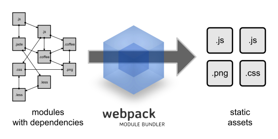
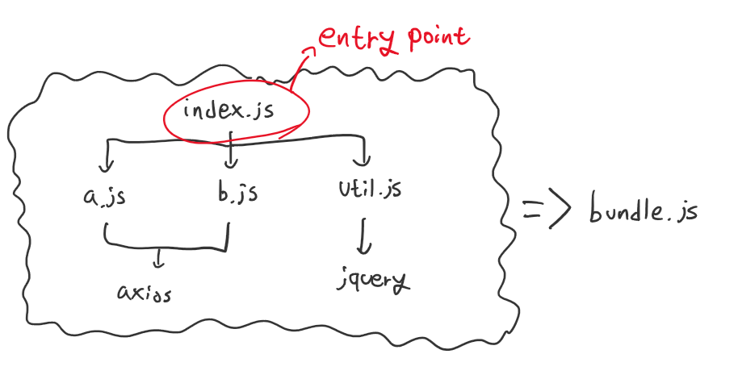
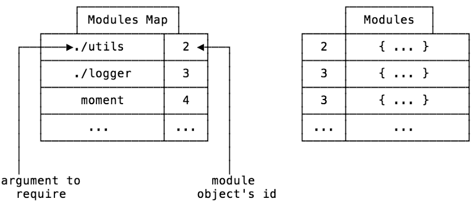

## 번들러란?
자바스크립트의 `모듈 번들러`란, 자바스크립트 코드 조각들과 그들의 종속성을 **`하나(또는 여러 개)의 파일로 묶어주는 도구`** 를 말합니다.  
뿐만 아니라 `번들러`는 `CommonJS`, `ES Module`(최신 브라우저는 이를 지원한다)로 작성된 코드와 같이 브라우저 환경에서 실행할 수 없는 코드들을 분석하고 새로운 코드로 가공해 브라우저 환경에서도 원활하게 실행될 수 있도록 도와줍니다.  
### 등장 배경 및 역사
> 원문: [A brief and incomplete history of JavaScript bundlers | Read the Tea Leaves (nolanlawson.com)](https://nolanlawson.com/2017/05/22/a-brief-and-incomplete-history-of-javascript-bundlers/)
#### 모듈의 문제점
```html
<html>
    <head></head>
    <body>
        <script src="https://cdnjs.cloudflare.com/ajax/libs/jquery/3.7.0/jquery.min.js" integrity="sha512-3gJwYpMe3QewGELv8k/BX9vcqhryRdzRMxVfq6ngyWXwo03GFEzjsUm8Q7RZcHPHksttq7/GFoxjCVUjkjvPdw==" crossorigin="anonymous" referrerpolicy="no-referrer"></script>
        <script type="text/javascript" src="./components/a.js"></script>
        <script type="text/javascript" src="./components/b.js"></script>
        <script type="text/javascript" src="./main.js"></script>

    </body>
</html>
```
과거 자바스크립트 개발 방식에서는 관심사별로 자바스크립트 파일을 분리하고 위처럼 `<script>` 태그를 통해 불러왔습니다.  
이러한 방식은 다음과 같은 문제점들을 가지고 있습니다.  
- 모듈간 의존성이 존재할 경우 순서를 보장하기 힘듭니다.  
- 모듈과 그들의 의존성 js 파일 하나하나를 불러오기 위해 수십~수백 번의 네트워크 요청이 발생할 수도 있습니다.  
	- 심지어 사용한 기능들의 코드만 불러오는게 아닌, 사용하지 않는 기능들을 포함한 파일 전체를 불러오게 됩니다.  
- 파일 중 일부분의 문제로 전체 스크립트를 실행하지 못할 수 있습니다.  
- 네이밍 충돌이 발생할 수 있습니다.  

#### 원시적인 해결책: 연결(Concatenation)
이를 방지하고자 흩어진 자바스크립트 파일을 하나로 만드는 번들링이 등장하기 시작했습니다.  
처음에는 단순히 여러 자바스크립트 파일 코드들을 하나의 파일에 집어넣는 `연결(Concatenation)` 방식을 사용했습니다.  
이러한 방식은 일반적으로 사용되었으며 [usemin](https://github.com/yeoman/grunt-usemin)과 같은 경량화 툴에서도 사용되었습니다. 

#### `Browserify`의 등장
그러다 2013년 [Browserify](http://browserify.org/)가 등장하면서 `비연결(non-Concatenation)` 번들러들이 주류로 자리잡기 시작합니다.  
`Node.js` 코드를 브라우저에서 재사용하기 위한 용도로 설계된 `Browserify`는 당시 npm 상에 존재하는 수 만개의 모듈들을 재사용할 수 있도록 두가지 문제를 해결했습니다.  
- 첫째, *의존성 트리를 크롤링하고, 파일을 읽어들이고, 하나의 번들 파일을 구축해* `CommonJS` 방식의 모듈을 브라우저에서 동작시키는 것.
- 둘째, `Node.js` 내장 객체(`process`, `Buffer`, `crypto` 등)들을 `폴리필`과 `심`을 구현해 브라우저상에서 동작시키는 것.
	- `폴리필(Polyfill)`: 기존 브라우저에서 지원되지 않는 새로운 API를 구현하는 것.
	- `심(Shim)` : 문제를 해결하는 새 API를 추가하여, 이미 존재하는 코드의 동작을 바로잡는 데 사용되는 코드 모음.

특히 저 두번째 문제를  [events](https://www.npmjs.com/package/events), [process](https://github.com/defunctzombie/node-process), [buffer](https://github.com/feross/buffer)와 같이 브라우저에서 사용 가능하도록 구현한 라이브러리들을 만들어내 해결하므로써, 브라우저상에서 실행될 것을 상정하지 않는 라이브러리들도 브라우저에서 사용할 수 있게 되었습니다.  
- 이들은 `Browserify` 뿐만 아니라 `Webpack`, `Rollup`과 같은 번들러들에서도 사용되고 있습니다.

#### `Webpack`의 등장
이후 2015년 `React`의 인기와 함께 [Webpack](https://webpack.github.io/)이 눈에띄게 성장하기 시작했습니다.  


`Node.js` 모듈을 브라우저에서 실행하는 것이 목표인 `Browserify`와 달리, `Webpack`은 JS, CSS, 이미지 등 웹사이트의 모든 `정적 자산(static asset)`들에 대한 `종속성 그래프`를 만드는 것이 목표였습니다.  
`정적 자산`에 대한 `종속성 그래프`를 만드는 것은 다음과 같은 이점이 있었습니다.  
- 첫째, HTML, CSS, JS 등의 집합을 독립 모듈인 `컴포넌트`로 정의하기 쉬워지며, 이를 재사용하거나 npm에 등록하기 쉬워집니다.  
- 둘째, JS-기반 모듈 시스템을 사용하므로써 [HMR(Hot Module Replacement)](https://webpack.js.org/concepts/hot-module-replacement/)이 쉬워집니다.
	- `HMR` : 애플리케이션이 실행 중일 때, 모듈 전체를 다시 불러오지 않아도 모듈을 교체/추가/제거할 수 있는 기능
- 셋째, [loaders](https://webpack.js.org/concepts/loaders/)를 통해 모듈 코드에 대한 사전 작업을 진행할 수 있습니다. 
### 동작방식


대부분의 번들러들은 크게 `종속성 해결(Dependency Resolution)`, `패킹(Packing)` 두가지 과정을 거칩니다.  
먼저 위 그림의 `index.js`와 같은 `진입점(Entry Point)`을 시작해 모듈/파일 간의 모든 종속성(*코드가 작동하기 위해 필요한 다른 코드 조각들*)을 찾아 `종속성 그래프`를 구성합니다. (`종속성 해결`)  
이후 `종속성 그래프`를 브라우저에서 실행 가능한 단일 파일로 패킹합니다. (`패킹`)
- 참고로 이렇게 합쳐진 번들 코드는 `소스 맵`을 통해 코드 구조를 원래 구조처럼 디버깅할 수 있습니다.  

#### 종속성 해결(Dependency Resolution)
`모듈 번들러`는 먼저 모든 파일의 관계 그래프를 생성하는 `종속성 해결` 과정을 시작합니다.  
`진입점`에서 시작해 구문들을 분석하며 종속성을 파악하고, 그들의 종속성을 계속 탐색해나가며 진행됩니다.  


이때 각 모듈들의 파일 이름, 코드, 종속성 등의 데이터 집합을 `객체`형태로 표현하며, 변환을 거친 모듈은 다음과 같은 구조의 객체로 표현할 수 있습니다.  


그리고 이 과정에서 각 모듈의 id와 해당 모듈이 필요로 하는 모듈들을 저장하는 `모듈 맵`을 생성해 사용하게 됩니다. 이를 통해 *상대 주소를 통한*  모듈 `import`와 같이 패키징시 정상 동작하지 않을 수 있는 코드들을 해결해 줍니다.  
위 과정을 통해 모듈은 브라우저에서 함수 요청시 함수를 검색하는데 사용되는 `종속성 순서`를 구성할 수 있으며, 이름 충돌을 방지하고, 사용하지 않는 파일을 감지해 불필요한 파일을 제거할 수 있게됩니다.  

#### 패킹(Packing)
브라우저에서는 모듈과 같은 개념이 없어, `require` 함수나 `module.exports`가 존재하지 않습니다.  
따라서 종속성들을 사용할 수 없으므로 이들을 적절히 처리하고, 코드를 혼합해 브라우저가 문제없이 처리할 수 있는 `에셋`으로 변환하는 과정인 `패킹`이 필요합니다.  


먼저 `종속성 해결`과정에서 생성했던 모듈 객체들을 소스코드 문자열로 변환합니다.  
이때 `module`, `require`를 인자로 받는 `팩토리 함수` 형태로 구현해, 추후 `require` 함수와 `module` 객체를 주입받도록 합니다.  
이후 이렇게 생성된 코드들을 결합하고, 엔트리 파일을 가리키는 id 0인 모듈을 불러오도록(`require(0)`) 합니다.  

## 번들러 종류
자바스크립트 생태계에는 다양한 모듈 번들러들이 존재하며, 이들을 각각 고유한 번들링 방식을 갖고 있습니다. 하지만 대부분 "종속성 그래프를 만들고 이를 기반으로 코드들을 번들로 결합한다"라는 동작방식의 결은 비슷합니다.  
주로 사용되는 번들러로는  `webpack`, `Browserify`, `parcel`, `rollup` 등이 존재합니다.  

### Webpack
`Webpack`은 js 파일 뿐만 아니라 모든 유형의 에셋 변환, 최적화를 수행할 수 있으며 풍부한 플러그인, 로더 생태계를 갖추고 있는 모듈 번들리입니다.  
`Webpack`은 번들링을 수행하는데 있어 6가지 핵심 콘셉트를 갖고 있으며, 이는 다음과 같습니다.  
- `Entry`: 종속성 그래프가 시작할 위치를 지정하며, 애플리케이션 구조에 따라 하나 이상의 엔트 포인트를 가질 수 있습니다. `webpack.config.js` 파일의 속성을 설정해 여러 엔트리 포인트를 지정할 수 있습니다.
```js
module.exports = {
  entry: './path/to/my/entry/file.js',
};
```
- `Output`: 웹팩이 `패킹` 과정 완료 후, 결과물을 저장할 위치를 지정합니다.
```javascript
module.exports = {
  output: {
    path: path.resolve(__dirname, 'dist'),
    filename: 'my-first-webpack.bundle.js',
  },
};
```
- `Loaders`: 비 JS파일을 변환해 애플리케이션에서 사용 가능한 모듈로 변환합니다.
- `Plugins`: 번들 최적화, 에셋 관리 등 광범위한 작업을 수행하는데 사용되는 기능들입니다.
- `Mode`: 개발, 프로덕션 등의 모드를 설정해 각 환경에 맞는 `Webpack`의 빌트인 최적화를 활성화할 수 있습니다.
- `Browser Compatibility`: ES5와 호환되는 브라우저들을 지원하기 위해 `폴리필`을 적용해 번들을 빌드합니다.

#### 장/단점
Webpack은 `풍부한 플러그인 생태계`를 갖추고 있기 때문에 이들을 활용해 JS뿐만 아니라 `다른 형태의 파일도 번들로` 만들 수 있으며, `HMR 등 에셋을 최적화`할 수 있는 기능을 갖추고 있습니다.  
다만 `복잡`하기 때문에 `러닝 커브가 가파르며`, 필요보다 과도한 기능을 사용해 번들링 할 수 있고 여러 플러그인에 의존하면 `번들러 속도가 느려질 수` 있습니다.  

### Browserify
`Browserify`는 `Node.js` 모듈을 브라우저에서 실행할 수 있도록 해주는 모듈 번들러입니다.  
이를 사용하면 `require()`를 통해 브라우저상에서 npm 모듈들을 불러올 수 있습니다.  
이를 위해 `Browserify`는 `require()` 호출을 재귀적으로 탐색하며 종속성 그래프를 생성하고 이를 바탕으로 번들을 생성합니다.  

#### 장/단점
`단순`해서 사용하기 편하고, 브라우저단에서 `npm 생태계를 활용할 수 있게 해준다`는 장점이 있지만, 웹팩과 달리 `다른 타입의 에셋을 지원하지 않으며`, 동적 로딩 등 `모듈 최적화에 도움이 되는 에셋 관리 도구가 부족하다`는 단점이 존재합니다.  

### Parcel
`Parcel`은 JS 뿐만 아니라 CSS, HTML 등 `멀티 에셋` 모듈을 빠르게 구성할 수 있는 `설정이 없는(zero-configuration)` 번들러입니다.  
`Parcel`은 `엔트리 포인트 에셋`을 불러와 파일을 탐색하며 *`종속성 그래프`와 유사한* `에셋 트리`를 생성하고, 각 에셋과 그들의 종속성을 결합해 번들 트리를 형성합니다. 그리고 번들 트리의 각 번들을 그에 맞는 패키저 파일 유형과 연결하고, 최종 컴파일된 파일로 변환합니다.  

#### 장/단점
상기한대로 `설정이 필요없어`  `Webpack`, `Browserify`에서 겪는 고질적인 설정 문제를 해결하고, `HMR` 및 지연 로딩 등의 `최적화 기능을 제공`해 `빠른 번들링 속도`를 갖고 있습니다.  
하지만 복잡한 애플리케이션처럼 상황에 맞게 설정을 수정해야하는 경우 `Parcel`의 `커스터마이징 기능의 한계`에 부딪힐 수 있습니다.  

### Rollup
`Rollup`은 비교적 최근인 2018년에 등장한 번들러로, 트리-셰이킹을 통해 사용하지 않는 자원들을 걸러 작은 모듈들을 큰 모듈로 묶을 수 있는 기능을 제공합니다.  
`Rollup.config.js` 파일의 설정을 기반으로, 엔트리 포인트 파일을 분석해 종속성 순서를 생성합니다. 이 과정에서 트리-셰이킹 과정을 동반하며, 이후 이들을 단일 파일로 통합합니다.  

#### 장/단점
상기한대로 트리-셰이킹과 같이 `에셋 최적화 기능`을 제공하며, `ES6 모듈 시스템을 지원`한다는 장점이 존재하지만, 상대적으로 등장이 늦어 `플러그인 생태계가 부족하다`는 단점이 있습니다.  

# 참고
- [A brief and incomplete history of JavaScript bundlers | Read the Tea Leaves (nolanlawson.com)](https://nolanlawson.com/2017/05/22/a-brief-and-incomplete-history-of-javascript-bundlers/)
- [Brief Explanation of Javascript Module Bundler - DEV Community](https://dev.to/mustafamilyas/brief-explanation-of-javascript-module-bundler-b1k)
- [Let’s learn how module bundlers work and then write one ourselves (freecodecamp.org)](https://www.freecodecamp.org/news/lets-learn-how-module-bundlers-work-and-then-write-one-ourselves-b2e3fe6c88ae/)
- [The What, Why and How of JavaScript bundlers - DEV Community](https://dev.to/sayanide/the-what-why-and-how-of-javascript-bundlers-4po9)