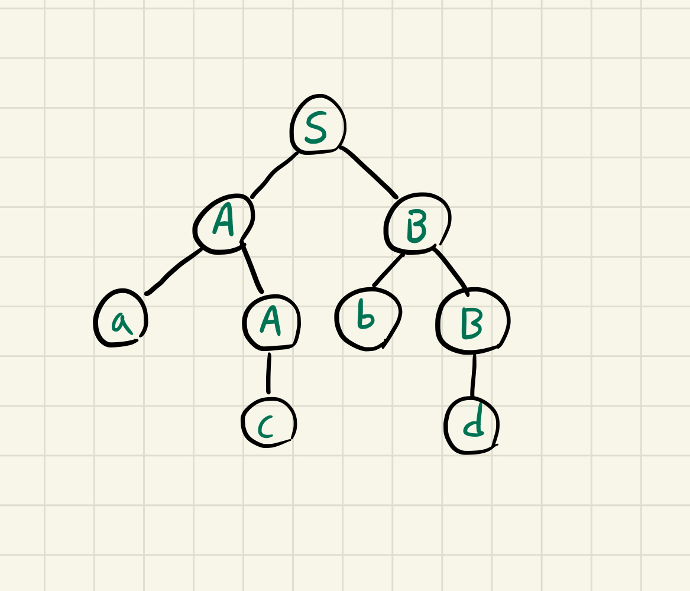
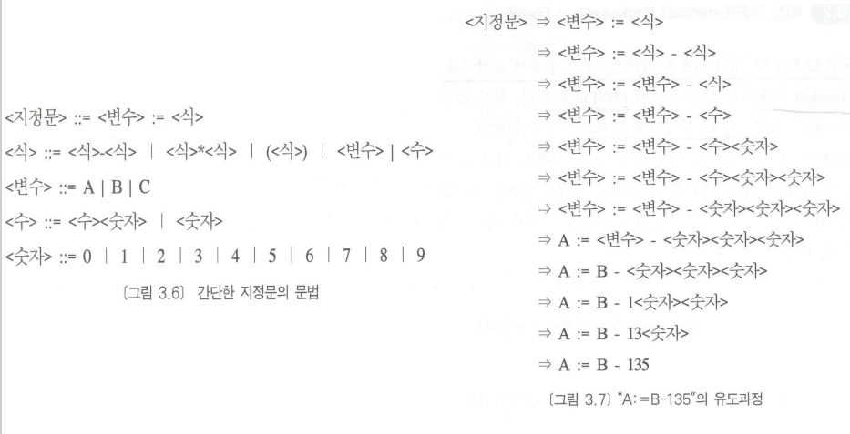
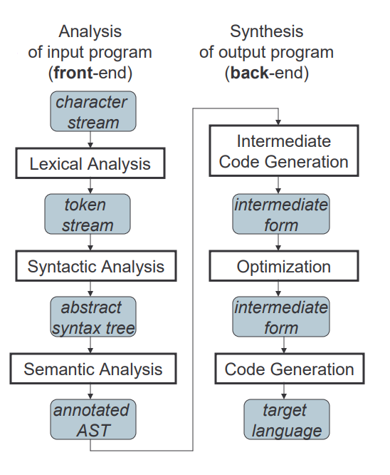
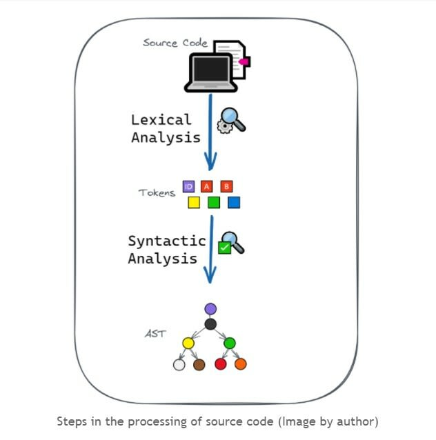
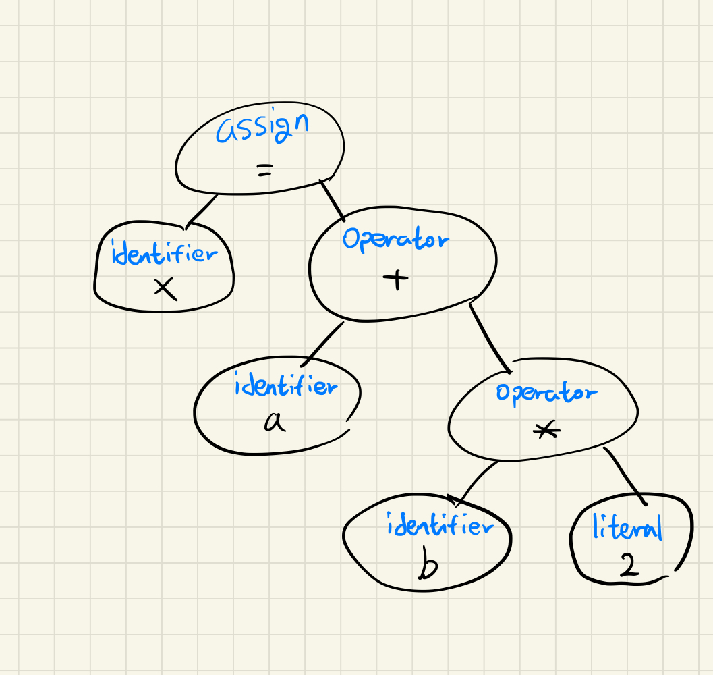
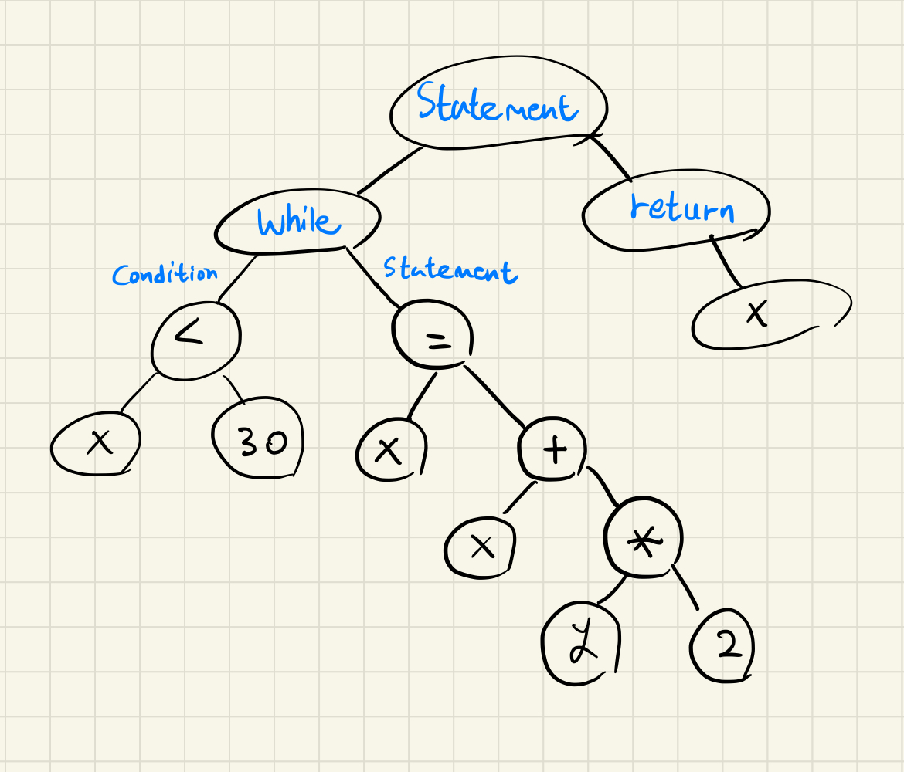

## AST?
`추상 구문 트리(Abstract Syntax Tree, AST)`란, 프로그램 또는 코드 조각의 구조를 표현하기 위해 사용되는 `자료구조`를 말합니다. 이때 트리를 이루는 각 노드들은 코드에서 발생되는 구문을 나타냅니다.  
구문이 `추상적이다(Abstract)` 라는 말의 뜻은, 이 트리가 실제 구문의 모든 세부 사항들을 나타내지는 않고 구조나 내용과 관련된 세부 사항들만 나타낸다는 뜻입니다.  
이러한 특징은 `구문 트리(또는 파스 트리)`라고 불리는 개념과 `추상 구문 트리`를 구분되게 합니다.  
### 구문 트리(파스 트리)
`구문 트리(파스 트리)`란, `문맥 자유 문법(Context-Free Grammar, CFG)`을 따르는 문자열의 구문 구조를 나타내는 트리로, 유도과정 또는 구문 구조를 보여줍니다.   
만약 주어진 표현을 `구문 트리`로 나타낼 수 있을 경우, 해당 표현은 주어진 `BNF`에 의해 작성되었다고 할 수 있습니다.  
파스 트리는 아래 설명할 `추상 구문 트리`처럼 `어휘 분석`과 `구문 분석` 과정을 통해 생성되며, 이는 `생성 규칙`을 바탕으로 시작 기호부터 점점 반복적으로 `비-터미널 기호`들을 치환해나가 궁극적으로 문자열을 유도하는 `유도 과정`을 그래픽으로 표현한 것으로도 볼 수 있습니다. (그래서 `구문 트리`를 `유도`의 `역`이라고 일컫기도 합니다.)  
#### 파스 트리 규칙
1. 모든 리프 노드는 `터미널`이어야 한다.  
2. 모든 내부 노드는 `터미널이 아니어야(Non-Terminal)` 한다.  
3. 트리를 `중위순회` 할 경우, 주어진 문자열을 완성해야 한다.  

여기서 `터미널`이란, `터미널 기호(Terminal Symbol)`를 뜻하며 `형식 문법(Formal Grammar)` 의 일부로 정의된 언어의 `기본 기호`를 말합니다.  
`비-터미널 기호(Non-terminal Symbol)`의 경우, `생성 규칙(Production Rule)`에 따라 `터미널 기호`로 대체되는 기호들을 말합니다.  
#### 예시
다음과 같은 `생성 규칙`을 갖는 문법이 있다고 가정하겠습니다.  
- `생성 규칙`: 규칙의 왼쪽에 정의될 대상이, 오른쪽에 그 대상에 대한 정의가 나타나는 구문 규율  
```
S -> AB
A -> c/aA
B -> d/bB
```
이때 주어진 입력 문자열이 "acbd"라고 할 경우, 파스 트리는 다음과 같습니다.

#### 문맥 자유 문법(Context-Free Grammar, CFG)
`문맥 자유 문법(CFG)`이란, 문맥과 관계 없이 `비-터미널 기호`에 `생성 규칙`을 적용할 수 있는 형식 문법을 말합니다.  
다르게 말하면, 문법 $G$가 다음과 같다고 할 때,
$$G = (V, T, S, P)$$
> V: 변수라고 부르는 객체들의 유한 집합  
> T : 터미널 기호라 불리는 객체들의 유한 집합  
> S : 시작 변수(V 중 시작할 때 사용하는 것)  
> P : 생성 규칙들의 유한집합  

모든 생성 규칙이 다음을 만족할 경우 G를 `문맥 자유 문법` 이라고 합니다.  
$$ A \rightarrow x $$
- $A$는 `비-터미널 기호`, $x$는 `터미널` 및(또는) `비-터미널` 문자열(또는 비어있을 수 있음)입니다.  
#### 배커스-나우르 표기법(Backus-Naur Form, BNF)
```
<기호> ::= <표현식>
```
`배커스-나우르 표기법(BNF)`이란, `문맥 자유 문법`을 나타내기 위해 만들어진 표기법(메타 언어)을 말합니다. 다르게 말하면 한 언어의 구문에 대한 `생성 규칙들의 집합`이라고 할 수 있습니다.  
`BNF`는 위와 같은 문법을 사용하는데, 여기서 `<기호>`는 `터미널 기호`가 될 수 없고 꺾쇠쌍으로 감싸져있으며, `표현식`은 `터미널` 또는 `비-터미널 기호`로 이뤄진 하나 이상의 시퀀스들로 구성되고 각 시퀀스들은 `|`로 구분됩니다.  
구문적으로 올바른 시퀀스들은 `시작 심볼`이 하나만 포함되도록 시퀀스를 초기화하고, 이 `시작 심볼`과 이어지는 심볼 시퀀스들에 파생 규칙들을 적용해야 합니다.  
##### 예시

### 추상 구문 트리

> 출처: [CSE401: Introduction to Compiler Construction - Syntactic Analysis](https://courses.cs.washington.edu/courses/cse401/06sp/syn.pdf)

`추상 구문 트리`는 `컴파일러`를 구성하는 `프론트엔드(소스 코드를 스캔하고 파싱함)` 및 `백엔드(아웃풋을 생성함)` 중 프론트엔드의 결과물로 만들어지게 됩니다.  
또한 앞서 말했듯, `추상 구문 트리`는 실제 구문의 모든 세부 사항을 나타내지는 않습니다.  
- 예시로 그룹화 괄호는 "`트리 구조`"라는 *형태로 이미 내포*되어 있으므로 **별도의 노드로 나타내지 않습니다**.  
	- 마찬가지로, `if-condition-then` 문과 같은 구문 구조는 3개의 가지를 갖는 단일 노드로 표현됩니다.  

그리고 AST는 포함된 요소들의 속성, 애너테이션과 같은 정보를 사용해 소스 코드의 변경 없이 수정 및 개선이 가능하고, 소스 코드의 불필요한 기호(중괄호, 세미콜론 등)들이 포함되지 않는 등의 특징을 지닙니다.  
이 때문에 주로 컴파일러가 `의미 분석(Semantic Analysis, 선언과 구문이 의미론적으로 정확한지 확인하는 작업으로 각 연산자가 일치하는 피연산자를 갖고 있는지 확인하는 "타입 검사"와 같은 작업을 포함함)`을 수행할 때 유용하게 사용됩니다.  
#### 생성 과정

> 출처: [Abstract Syntax Tree (AST) - Explained in Plain English - DEV Community](https://dev.to/balapriya/abstract-syntax-tree-ast-explained-in-plain-english-1h38)

소스 코드로부터 `추상 구문 트리`를 생성해내기 위해서는 위 그림과 같이 `어휘 분석(Lexical Analysis, 또는 스캐너)`과 `구문 분석(Syntactic Analysis)` 과정을 거쳐야합니다.  
- 그리고 컴파일러에서 이들을 수행하는 부분을 `Parser`라고 일컫습니다.  
##### 어휘 분석(Lexical Analysis)
`어휘 분석기(Lexer 또는 Scanner)`가 소스 코드를 한 글자씩 읽으며 문자열을 (의미론 또는 구문론적으로)의미있는 `어휘 토큰(코드의 가장 작은 단위)`으로 그룹화하게 됩니다.  
이러한 토큰은 상수, 연산자, 구두점(중괄호, 세미콜론 등), 키워드(if, while 등)와 같은 범주 중 하나에 속하게 됩니다.  
대부분의 어휘 분석은 다음과 같은 단계를 따릅니다.  
1. **토큰 식별하기(토큰화)**
	- 입력 텍스트들을 일련의 토큰으로 분할해, 입력 기호들의 고정된 집합을 결정합니다. 이는 `문자(letter)`, `숫자(digit)`, `연산자(operator)` 등을 포함합니다.
2. **문자열을 토큰에 할당하기**
	- `어휘 분석기(Lexer)`에 설정된 분류 체계대로 입력 문자들을 인식하고 분류합니다.
3. **토큰의 어휘 반환하기**
	- **어휘**는 기본적으로 토큰을 구성하는 하위 문자열 집합에서 가장 작은 단위를 말합니다. `어휘 분석기`는 이 어휘를 반환하게 됩니다.
###### 예시
```
x = a + b * 2;
```
만약 다음과 같은 표현식을 `어휘 분석`할 경우, 다음과 같은 `토큰 시퀀스`를 얻을 수 있습니다.  
```
[(identifier, x), (operator, =), (identifier, a), (operator, +), (identifier, b), (operator, *), (literal, 2), (separator, ;)]
```
##### 구문 분석(Syntactic Analysis)
`파싱(Parsing)`이라고도 불리는 이 작업은, `어휘 분석기`로부터 전달받은 `토큰 스트림`을 이것의 문법적 구조를 나타내는 `트리 형태의 표현`을 생성하게 됩니다.  
그리고 위 과정에서 주어진 프로그램이 구문론적으로 정확한지 판단하며, 만약 에러를 찾은 경우 `구문 분석기`는 진단 메세지를 생성하고 오류를 복구해야 합니다.  
`구문 분석기`, 즉 `파서(Parser)`는 `파스 트리`를 구축하는 방향에 따라 크게 `탑-다운 파서`와 `바텀-업 파서`로 나뉩니다.  
###### 예시
어휘 분석 예시에서 나왔던 표현식을 `구문 분석`할 경우, 다음과 같은 `추상 구문 트리`를 얻을 수 있습니다.  

#### 종합 예시
```
while (x < 30) {
	x = x + y * 2;
}
return x;
```
위와 같은 코드가 있다고 할 때, 이를 기반으로 `추상 구문 트리`를 만들어보겠습니다.  
먼저, `어휘 분석`을 통해 소스 코드를 `어휘 토큰`들로 변환합니다.  

| 어휘소(Lexeme) | 토큰 구분                   |
| ----------- | ----------------------- |
| while       | WHILE                   |
| x           | variable Identifier     |
| <           | comparison Operator     |
| 30          | integer Literal         |
| x           | variable Identifier     |
| =           | assignment Operator     |
| x           | variable Identifier     |
| +           | addition Operator       |
| y           | variable Identifier     |
| *           | multiplication Operator |
| 2           | integer Literal         |
| ;           | Semicolon               |
| return      | RETURN                  |
| x           | variable Identifier     |
| ;           | Semicolon               |
이후, 이들을 기반으로 `추상 구문 트리`를 만들면, 다음과 같습니다.  

> 트리의 간략화를 위해 토큰 구분은 생략했습니다.

이를 자바스크립트 코드로 생성한 `AST`(*편의를 위해 JSON 형태로 변환함*)로 표현한다면 다음과 같습니다.  
```json
{
  "type": "Program",
  "start": 0,
  "end": 71,
  "body": [
    {
      "type": "FunctionDeclaration",
      "start": 0,
      "end": 70,
      "id": {
        "type": "Identifier",
        "start": 9,
        "end": 13,
        "name": "func"
      },
      "expression": false,
      "generator": false,
      "async": false,
      "params": [],
      "body": {
        "type": "BlockStatement",
        "start": 16,
        "end": 70,
        "body": [
          {
            "type": "WhileStatement",
            "start": 21,
            "end": 57,
            "test": {
              "type": "BinaryExpression",
              "start": 28,
              "end": 34,
              "left": {
                "type": "Identifier",
                "start": 28,
                "end": 29,
                "name": "x"
              },
              "operator": "<",
              "right": {
                "type": "Literal",
                "start": 32,
                "end": 34,
                "value": 30,
                "raw": "30"
              }
            },
            "body": {
              "type": "BlockStatement",
              "start": 36,
              "end": 57,
              "body": [
                {
                  "type": "ExpressionStatement",
                  "start": 40,
                  "end": 54,
                  "expression": {
                    "type": "AssignmentExpression",
                    "start": 40,
                    "end": 53,
                    "operator": "=",
                    "left": {
                      "type": "Identifier",
                      "start": 40,
                      "end": 41,
                      "name": "x"
                    },
                    "right": {
                      "type": "BinaryExpression",
                      "start": 44,
                      "end": 53,
                      "left": {
                        "type": "Identifier",
                        "start": 44,
                        "end": 45,
                        "name": "x"
                      },
                      "operator": "+",
                      "right": {
                        "type": "BinaryExpression",
                        "start": 48,
                        "end": 53,
                        "left": {
                          "type": "Identifier",
                          "start": 48,
                          "end": 49,
                          "name": "y"
                        },
                        "operator": "*",
                        "right": {
                          "type": "Literal",
                          "start": 52,
                          "end": 53,
                          "value": 2,
                          "raw": "2"
                        }
                      }
                    }
                  }
                }
              ]
            }
          },
          {
            "type": "ReturnStatement",
            "start": 59,
            "end": 68,
            "argument": {
              "type": "Identifier",
              "start": 66,
              "end": 67,
              "name": "x"
            }
          }
        ]
      }
    }
  ],
  "sourceType": "module"
}
```
## AST의 활용 예시
AST는 [Java 소스 코드를 분석해 Eclipse IDE의 도구들을 사용하거나](https://www.eclipse.org/articles/Article-JavaCodeManipulation_AST/index.html), `Annotation Processor`가 AST를 조작해 애너테이션의 동작을 수행하거나, [C/C++ 소스 코드의 내부 표현을 제공하거나(CAST)](https://www-old.cs.utah.edu/flux/flick/current/doc/guts/gutsch6.html), [Python 코드를 정적 분석하는](https://docs.python.org/3/library/ast.html) 등 언어를 가리지 않고 다양한 곳에서 사용되고 있습니다.  
특히, Javascript에서는 다음과 같은 도구들에서 AST를 사용하고 있습니다.  
- [Babel](https://babeljs.io/)
	- 최신 자바스크립트 문법을 이전 자바스크립트 버전과 호환시키는 작업인 `트랜스파일링`을 수행하는데 [`AST 파서(구 Babylon 현 @babel/parser)`](https://babeljs.io/docs/babel-parser) 및 [`생성기(@babel/generator)`](https://babeljs.io/docs/babel-generator)를 사용합니다.
- [Typescript](https://www.typescriptlang.org/)
	- 타입스크립트에서 `타입을 체크`하고, `에러를 검출`한 뒤 자바스크립트 코드로 변환하는데 있어 AST 표현을 사용합니다.
- [ESLint](https://eslint.org/)
	- `정적 분석 도구`인 `ESLint`는 `AST`([ESTree](https://github.com/estree/estree) 포맷을 따르는)를 사용해 코드를 검사하며, 코딩 표준을 지키지 않았거나 에러가 발생할 수 있는 곳을 발견합니다.
- [Jest](https://jestjs.io/)
	- 자바스크립트 코드의 단위 테스트, 통합 테스트 등을 수행하는데 사용되는 테스트 프레임워크인 `Jest`에서 역시 `AST`를 사용해 `코드를 표현`하고 `테스트를 수행`합니다.

# 참고
- [Context-free grammar - Wikipedia](https://en.wikipedia.org/wiki/Context-free_grammar)
- [Abstract syntax tree - Wikipedia](https://en.wikipedia.org/wiki/Abstract_syntax_tree)
- [Terminal and nonterminal symbols - Wikipedia](https://en.wikipedia.org/wiki/Terminal_and_nonterminal_symbols)
- 구문 트리
	- [Parsing - Wikipedia](https://en.wikipedia.org/wiki/Parsing)
	- [Parse Tree in Compiler Design - GeeksforGeeks](https://www.geeksforgeeks.org/parse-tree-in-compiler-design/)
	- [Reading 18: Parser Generators (mit.edu)](https://web.mit.edu/6.005/www/fa15/classes/18-parser-generators/)
	- [Reading 18: Parsers (mit.edu)](https://web.mit.edu/6.031/www/sp17/classes/18-parsers/#handling_errors)
	- [프로그래밍 언어의 구문 BNF, EBNF, 파.. : 네이버블로그 (naver.com)](https://blog.naver.com/kelly9509/222330672820)
	- [오토마타 이론 공부 (11) - 파스 트리(P.. : 네이버블로그 (naver.com)](https://blog.naver.com/bestowing/221769416451)
	- [BNF : Backus Naur Form (aistudy.com)](http://www.aistudy.com/linguistics/BNF.htm)
	- [문맥 자유 문법 : Context Free Grammar (aistudy.com)](http://www.aistudy.com/linguistics/context_free_grammar.htm)
	- [컴파일러 - 제4장 구문 (donga.ac.kr)](https://web.donga.ac.kr/jwjo/Lectures/PL/chap4.pdf)
	- [PowerPoint Template (kocw.or.kr)](http://contents.kocw.or.kr/KOCW/document/2014/deagucatholic/kimhangkon/3.pdf)
	- [1장 기본적인 사항 (kocw.or.kr)](http://contents2.kocw.or.kr/KOCW/document/2016/keimyung/jangduksung/4.pdf)
- 어휘 분석 및 구문 분석
	- [Programming Language Concepts - 4. LEXICAL AND SYNTAX ANALYSIS (gsu.edu)](https://tinman.cs.gsu.edu/~raj/4330/slides/c04.pdf)
	- [ECS 142: Compilers - Syntactic Analysis (ucdavis.edu)](https://web.cs.ucdavis.edu/~pandey/Teaching/ECS142/Lects/syntax.pdf)
	- [Introduction to Syntax Analysis - CSCI4160: Compiler Design and Software Development (mtsu.edu)](https://www.cs.mtsu.edu/~zdong/3210/OldSlides/SyntaxAnalyzerIntroduction.pdf)
	- [CSE401: Introduction to Compiler Construction - Syntactic Analysis (washington.edu)](https://courses.cs.washington.edu/courses/cse401/06sp/syn.pdf)
	- [Compiler Design - Syntax Analysis (tutorialspoint.com)](https://www.tutorialspoint.com/compiler_design/compiler_design_syntax_analysis.htm)
	- [What Is Lexical Analysis? | Coursera](https://www.coursera.org/articles/lexical-analysis)
	- [Lexical analysis - Wikipedia](https://en.wikipedia.org/wiki/Lexical_analysis)
	- [Introduction of Lexical Analysis - GeeksforGeeks](https://www.geeksforgeeks.org/introduction-of-lexical-analysis/)
- 추상 구문 트리(AST)
	- [What is an Abstract Syntax Tree in Programming? - DEV Community](https://dev.to/shreyvijayvargiya/what-is-an-abstract-syntax-tree-in-programming-1nae)
	- [Abstract Syntax Tree (AST) - Explained in Plain English - DEV Community](https://dev.to/balapriya/abstract-syntax-tree-ast-explained-in-plain-english-1h38)
	- [AST for JavaScript developers. TL;DR This article is my talk for… | by Bohdan Liashenko | ITNEXT](https://itnext.io/ast-for-javascript-developers-3e79aeb08343)
	- [AST explorer](https://astexplorer.net/)
- AST를 이해하는데 유용한 영상
	- [What Is An Abstract Syntax Tree, With WealthFront Engineer Spencer Miskoviak (youtube.com)](https://www.youtube.com/watch?v=wINY109MG10)